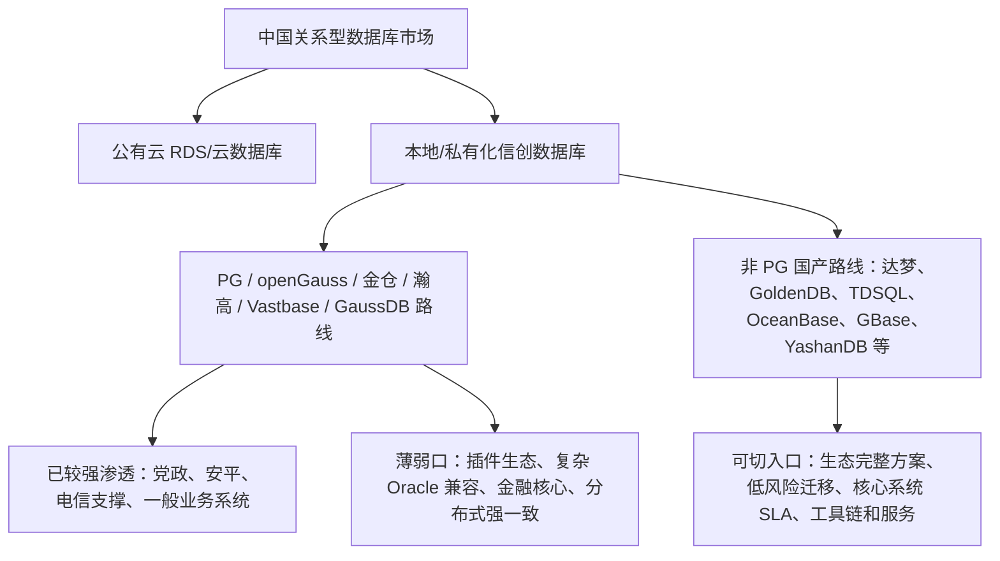

# 非 PostgreSQL 系国产数据库如何抢占 PostgreSQL 信创市场

日期：2026-06-06

这份调研我先把边界说清楚：公开市场报告里几乎没有一个标准口径叫“PostgreSQL 信创市场”。能被核实的数据，通常是“中国数据库市场”“中国关系型数据库市场”“本地部署关系型数据库市场”“线下集中式关系型数据库新增装机量”“金融行业分布式事务数据库市场”。所以我不会把一个看似精确的数字硬编出来，而是用这些可追溯口径做区间估算。

我的核心判断是：如果只看 2025 年中国本地/私有化关系型数据库里由 PostgreSQL、openGauss、Kingbase、瀚高、海量 Vastbase、GaussDB/openGauss 商业发行版等共同构成的“PostgreSQL 技术路线信创盘子”，年度软件授权加专业服务收入大致在 **35 亿到 60 亿元人民币**。如果把 2025-2027 年仍未释放的迁移、扩容、维保、灾备、核心系统改造和工具链替换算进去，可争夺的滚动机会大约在 **100 亿到 180 亿元人民币**。这个数字不是官方统计，而是我基于 IDC、信通院、沙利文和招采样本做的规划口径。

真正值得非 PostgreSQL 系国产数据库关注的，不是“把 PG 用户全部迁走”，而是去抢 PG 系产品没有充分吃透的四类市场：插件依赖型业务、Oracle/Db2 深水区、分布式核心交易、以及西部和下沉地区缺 DBA、缺迁移能力的项目。

## 我会先看总盘子，而不是被“PG”两个字带偏

站在产业研究角度，我先把总盘子钉住。

IDC 数据显示，2024 年中国关系型数据库软件市场规模为 42.15 亿美元，约合 302.47 亿元人民币；其中公有云关系型数据库市场约 27.42 亿美元，是本地部署模式的约 1.8 倍。[太平洋科技转载 IDC 数据](https://g.pconline.com.cn/x/1941/19410135.html) 同时提到，2025 年中国关系型数据库增速预计接近 25%。另一份 IDC 2025 上半年追踪显示，2025 年上半年中国关系型数据库市场规模为 22.1 亿美元，公有云占 67.9%，本地部署占 32.1%，预计 2025 全年达到 49.4 亿美元。[IDC 2025 上半年摘要](https://www.fxbaogao.com/detail/5229631)

信通院口径更宽。中国信通院《数据库发展研究报告（2025 年）》显示，2024 年中国数据库市场规模为 596.16 亿元，公有云和本地部署分别占 64.4% 和 35.6%，预计 2027 年达到 837.42 亿元。[中国信通院报告摘要](https://www.fxbaogao.com/detail/4954376)

第一新声的口径又不同，它给出的 2024 年中国数据库市场规模为 512 亿元，关系型数据库占 76%，集中式数据库占 69%，分布式数据库占 31%；同时判断信创从“试点实践期”进入“规模化推广期”。[第一新声 2025 数据库市场研究报告](https://www.fxbaogao.com/detail/4898843)

这三个口径并不完全一致，但方向一致：关系型数据库仍是主战场，本地/私有化虽然占比低于公有云，却是信创采购、核心系统替代和专业服务最集中的地方。

我的估算逻辑是这样的：2025 年中国关系型数据库软件市场约 49.4 亿美元，按 7.1 到 7.3 的汇率，大约 350 亿到 360 亿元人民币；其中本地部署约三分之一，对应 110 亿到 120 亿元人民币。沙利文披露，2024-2025 年线下集中式关系型数据库新增装机量从 11.10 万套提升到 12.04 万套，其中 openGauss 及 DBV 伙伴版占 35.02%，在线下集中式场景排名第一。[沙利文 2025 中国数据库产业研究报告](https://www.frostchina.com/zh/content/insight/detail/698f31ed5971ce70d9c74159)

所以，如果我只把 openGauss/DBV 伙伴版、金仓、瀚高、海量 Vastbase、GaussDB/openGauss 商业发行版、原生 PostgreSQL 商业服务和政务云 PostgreSQL 服务放进“PG 技术路线信创”篮子里，它占本地/私有化关系型信创市场的 30% 到 40% 是一个可解释的区间。用本地部署市场 110 亿到 120 亿元乘这个比例，再叠加迁移、适配、维保、培训、容灾和高可用服务，得到年度 35 亿到 60 亿元的规划口径。

这个区间的证伪条件很简单：如果 2026 年 IDC 或信通院发布了按内核路线拆分的本地部署收入，且 openGauss/PG 系低于 25% 或高于 45%，我的区间就要重算。

## 区域差异存在，但公开资料不足以精确到“华东 PG 渗透率”

站在渠道和交付角度，我不会假装知道每个省的 PostgreSQL 信创渗透率。公开资料能支持的结论是：区域差异一定存在，但它更多是由行业客户密度、财政和 IT 预算、云和集成商生态、厂商本地服务能力决定的，而不是由数据库内核本身决定的。

华东的渗透率和竞争强度大概率更高。原因很现实：上海、浙江、江苏、福建、山东等地集中了金融、证券、城商农信、互联网、制造、政务云和大量系统集成商；兴业数金 2025 年 openGauss 信创商业版征集公告要求采购 15 个生产环境永久许可、迁移工具订阅许可、60 人天原厂专家现场服务，现场服务地点包括福州、上海或成都，这类需求本身就说明华东金融科技和异地中心是 PG/openGauss 商业版的重要落点。[兴业数金 openGauss 征集公告](https://cg.cib.com.cn/cms/default/webfile/gyszj/20250911/1150822813104340992.html)

西部不是没有需求，而是更像“预算驱动 + 平台统采 + 服务短板”的市场。西部政务、教育、医疗、交通、能源类项目多，但 DBA 人才和复杂迁移经验相对稀缺，客户更容易买“整包交付”而不是买一个单点数据库产品。对非 PG 系厂商来说，这反而是机会：如果能把迁移评估、自动改造、运行监控、备份恢复、信创适配报告做成一个低门槛包，西部和下沉市场比华东更容易被“服务确定性”打动。

行业结构比区域结构更重要。IDC 在 2023H2 关系型数据库概览里提到，传统部署模式下，金融、政府、电信、制造、流通五大行业占市场份额 79.4%；金融国产替代和分布式改造进入规模化阶段，政府 IT 花费偏紧，制造向精细管理发展。[IDC 2023H2 关系型数据库概览](https://www.fxbaogao.com/detail/4532203)

所以我会把区域问题转成行业问题：华东竞争更充分，适合做标杆替换；西部和下沉市场服务缺口更大，适合做快速复制；真正的“深水区”不按省份划分，而按系统重要性划分。

## 哪些行业已经是 PG 技术路线的深水区

如果说“深水区”指的是 PG 技术路线渗透率高、替代难度大，我会排出三层。

第一层是党政、安平、公共服务和部分政务云。第一新声数据显示，党政关键应用场景数据库国产替换率约 85%，已经接近尾声；这类市场不是没有项目，而是新增替换空间变小，更多是扩容、维保、灾备、适配和升级。[第一新声报告](https://www.fxbaogao.com/detail/4898843) 对非 PG 系厂商来说，除非项目明确对现有 PG/openGauss 不满意，否则硬切进去的成本很高。

第二层是电信、能源、医疗、制造中的非核心和次核心系统。沙利文判断国产数据库已在多行业非核心业务系统实现较高渗透，并逐步向政务、电信、医疗、制造等关键行业核心系统拓展。[沙利文报告](https://www.frostchina.com/zh/content/insight/detail/698f31ed5971ce70d9c74159) 这类行业对国产化有明确要求，但对“必须是 PG”未必有信仰。谁能降低迁移风险、减少适配人天、提供本地服务，谁就能拿到替换机会。

第三层是金融。金融不是 PG 系渗透最高的地方，而是数据库国产替代最难的地方。第一新声金融业报告显示，2024 年中国金融业数据库市场规模约 115 亿元，其中银行占比超过 6 成；超过三成金融机构核心系统国产数据库应用占比在 20% 以下，Oracle 仍是金融机构核心系统应用最多的国外数据库。[第一新声金融业数据库替代报告](https://www.fxbaogao.com/detail/5072917) 这意味着金融核心系统不是 PG 系的舒适区，而是所有国产数据库都在攻的“硬骨头”。非 PG 系厂商如果有强 Oracle 兼容、共享存储、分布式事务、核心交易成功案例，金融反而比党政更值得打。

## 替代进程：不是刚试点，也远没有结束

站在产品规划角度，我会把当前阶段定义成：**办公和一般系统已规模化，核心系统刚进入攻坚，行业之间差异极大。**

党政办公、电子公文、OA、门户、报表、一般政务业务，已经不是主要增量。第一新声给出党政约 85% 的替代率，这意味着剩余项目大多是边角系统、扩容升级和老系统重构。

金融、电信、能源的非核心和次核心系统已经有规模化替代，但核心系统仍有大量空间。金融报告里，A 类核心系统数量占比小，但替代难度最高、投入最大；B/C 类系统数量多，规模化替代更快。报告还提到，2025 年金融机构数据库产品及服务采购金额在 1000-2000 万元、2000 万元以上的数量均有所增长，500-1000 万元区间提升 22%，100-500 万元区间虽减少 15% 但仍占 39%。[第一新声金融业报告](https://www.fxbaogao.com/detail/5072917)

这对产品规划很关键：非 PG 系厂商不应把全部资源投向“替掉已经落地的 PG”。更现实的打法是抓住两类尚未释放的需求。

一类是核心系统还没敢动的客户。它们不缺信创意愿，缺的是零停机迁移、强一致、多活容灾、性能压测、回退方案和事故责任边界。另一类是已经上了 PG/openGauss，但发现插件、运维、性能、灾备、生态工具不满足业务的人。前者卖“确定性”，后者卖“补短板”。

## 头部厂商和份额：PG 系不是一个厂商，而是一组路线

国内 PostgreSQL 信创市场不是一个单一厂商主导，而是几条路线叠在一起。

openGauss/GaussDB 路线是新增装机最强的一支。沙利文给出的 2025 年线下集中式新增装机 openGauss 及 DBV 伙伴版 35.02% 是目前最清晰的路线级数据。[沙利文报告](https://www.frostchina.com/zh/content/insight/detail/698f31ed5971ce70d9c74159) 它背后包括华为 GaussDB、openGauss 社区和大量 DBV 商业发行版伙伴。

金仓、瀚高、海量 Vastbase 是 PG/openGauss 商业化里的重要玩家。第一新声把金融业国产数据库厂商第一梯队列为金篆信科与奥星贝斯，能源行业提到瀚高与达梦，制造行业提到海量。[第一新声报告](https://www.fxbaogao.com/detail/4898843) 这个表述不是 PG 份额表，但能说明各厂商在行业中的相对位置。

从整体关系型数据库市场看，IDC 2024H2 显示本地部署关系型数据库前五厂商为华为、Oracle、达梦、微软、SAP，前五份额合计 52.1%；公有云前五为阿里云、腾讯、AWS、华为、中国电信天翼云，前五份额 84.7%。[墨天轮转载 IDC 2024H2](https://www.modb.pro/db/1937432735124041728) 这说明本地部署仍是多厂商竞争，PG 系内部也远未形成单一垄断。

这些厂商确实做了深度改造。最典型的是 openGauss。openGauss 社区文章说明，openGauss 2.0.0 起支持国密 SM3 用户认证和 SM4 加解密函数，以满足银行客户对数据库安全能力的要求。[openGauss 国密说明](https://opengauss.org/zh/blogs/douxin/sm3_for_openGauss.html) 这类能力对信创合规有价值，但也意味着内核、协议、工具链和插件 ABI 都可能与原生 PostgreSQL 拉开距离。

所以我不会把“兼容 PostgreSQL”简单理解成“等于 PostgreSQL”。在信创场景里，很多产品更像“PG 语法兼容 + 国产安全增强 + 自主运维体系 + 商业发行版生命周期”。

## 生态割裂是非 PG 系厂商的机会，不只是 PG 系的问题

站在数据库架构角度，我最看重这个问题。PostgreSQL 的强，不只强在 SQL，也强在扩展机制。PGXN 显示 PostgreSQL Extension Network 有 476 个扩展、454 个发行包、3005 个发布版本；它把 PostGIS、hstore、pgTAP、PL/R 等扩展作为 PostgreSQL 吸引开发者的重要原因。[PGXN About](https://www.pgxn.org/about/) PostgreSQL 官方文档也把扩展定义成一组 SQL 对象、控制文件、脚本和可选共享库的封装，`CREATE EXTENSION` 能把这些对象装进数据库，并被 `pg_dump` 等工具识别。[PostgreSQL 扩展文档](https://www.postgresql.org/docs/current/extend-extensions.html)

一旦国产 PG 兼容库对内核做深度改造，插件生态就会被切开。openGauss 社区的一篇技术对比文章提到，openGauss 基于 PostgreSQL 9.2 并包含部分 9.4 功能，后续 PostgreSQL 新版本能力大量没有直接纳入；文章还指出 openGauss 对插件支持不好，`CREATE EXTENSION` 在当时仍偏内部支持，能勉强支持 PostGIS。[openGauss 与 PostgreSQL 差异对比](https://opengauss.org/zh/blogs/July/openGauss%E6%95%B0%E6%8D%AE%E4%B8%8EPostgreSQL%E7%9A%84%E5%B7%AE%E5%BC%82%E5%AF%B9%E6%AF%94.html) 这不是说 openGauss 没有价值，而是说明“改造越深，原生 PG 扩展越难无缝复用”。

这个生态割裂会在特定场景形成迁移壁垒：

- GIS：业务依赖 PostGIS 的复杂空间函数、索引、栅格和生态工具时，兼容程度不只是“能建空间字段”，还包括函数覆盖、执行计划、依赖库版本、QGIS/GeoServer/ArcGIS 周边适配。
- 时序：业务依赖 TimescaleDB、压缩、连续聚合、保留策略、超表模型时，迁移到一个“PG 兼容但不支持该扩展”的数据库，等于重写时序层。
- 向量：pgvector、pgvectorscale、pgai、混合检索正在成为 AI 应用的默认路径之一。PG 系国产库如果不能跟上原生 PG 扩展速度，AI 应用会在选型时犹豫。
- 图、HLL、化学分子、DuckDB/FDW：这些都是典型的“数据库即平台”场景。客户买的不是一个 SQL 引擎，而是一堆扩展组合出来的业务能力。

这里就是非 PG 系厂商的机会：不要只喊“我也兼容 PG 协议”，而要把这些插件场景做成原生能力或一体化方案。例如，做原生时空引擎、原生向量混合检索、原生时序压缩、内置 HLL/bitmap、内置湖仓查询、内置图查询，再提供从 PostgreSQL 扩展到本产品能力的迁移评估器。客户真正买的是“迁完以后业务不用重写太多”，不是买口号。

## 客单价：小项目几十万，大项目千万级，金融核心会继续上探

公开招采样本能看出价格带。

福建省农村信用社联合社 2023 年信创数据库（人大金仓）许可采购项目，预算 110 万元，数量 22 套，折合约 5 万元/套。[中国政府采购网公告](https://www.ccgp.gov.cn/cggg/dfgg/gkzb/202309/t20230911_20681791.htm)

北京市公安局 2025 年服务器、操作系统、数据库、工作站采购项目中，数据库产品 201 套，采购金额 1936.7199 万元；其中 GaussDB 116 套约 1426.7199 万元，金仓 85 套约 510 万元。明细里金仓多项单价为 6 万元，GaussDB 集中式/分布式多项单价在 8.5 万元、17 万元，也有单项 83.7199 万元。[墨天轮整理北京市公安局中标公告](https://www.modb.pro/db/1910550701042839552)

兴业数金 2025 年 openGauss 商业版项目没有披露预算，但需求包括 15 个生产环境永久许可、迁移工具订阅、开发测试许可、一年维保、紧急抢修、60 人天专家现场服务、2 小时响应和 24 小时就位。[兴业数金公告](https://cg.cib.com.cn/cms/default/webfile/gyszj/20250911/1150822813104340992.html) 这说明金融客户采购的不是单纯 license，而是一整套连续服务能力。

中国农业发展银行 2026 年信创数据库供应商征集，预算 5400 万元，采购包包括 TiDB、达梦、华为高斯、人大金仓。[新浪财经转载公告](https://finance.sina.com.cn/wm/2026-03-12/doc-inhqtcur8641271.shtml) 这类项目说明大型金融机构的年度数据库资源池和多技术路线采购已经进入千万级。

所以我会把客单价分为四档：

- 一般政务、教育、医疗、区县级项目：几十万到 200 万元，常见形态是若干套 license 加少量实施。
- 省市级政务云、公安、交通、能源、运营商支撑系统：300 万到 2000 万元，常见形态是批量授权、适配、迁移、维保、灾备。
- 银行、保险、证券非核心和次核心：500 万到 3000 万元，工具、服务、压测、双中心灾备占比明显提高。
- 大行、省农信、核心交易、统一支付、账务类系统：千万到数千万元，甚至按资源池多年框架采购。

替换需求现在仍以集中式单机、主备、高可用、共享存储和少量资源池化为主。第一新声给出的 2024 年中国数据库市场结构里，集中式数据库占 69%，分布式占 31%。[第一新声报告](https://www.fxbaogao.com/detail/4898843) 这说明大多数客户仍在用更可控的架构完成替代。

但分布式诉求正在金融核心里变得明确。IDC 数据显示，2024 年中国金融行业分布式事务型数据库整体市场规模达到 20.37 亿元，其中银行子市场 13.44 亿元，保险/证券子市场 6.93 亿元；相关摘要还提到中小金融机构会在 2028 年前大量启动数据库选型。[腾讯云转载 IDC 金融分布式事务数据库报告](https://cloud.tencent.com/document/product/1293/129574) 这不是说所有核心交易都会上分布式，而是说“高并发、强一致、横向扩展、两地三中心、多活”的需求已经从技术验证变成真实预算。

## 如果我是非 PG 系国产数据库，我会这样抢

我不会从“我们比 PostgreSQL 更国产”这个角度切入，因为 PG 系厂商已经把信创资质、国密、安全可靠测评、国产软硬件适配做了很多。更有效的切法是四个。

第一，打插件割裂。把 PostGIS、TimescaleDB、pgvector、HLL、FDW、DuckDB、图、化学分子这些场景做成迁移评估清单。对每个客户告诉他：你现在用了哪些扩展、哪些函数、哪些索引、哪些周边工具；迁到 openGauss/金仓/瀚高/Vastbase 会缺什么；迁到我们这里怎么补。这个打法适合 GIS、自然资源、交通、公安、能源物联网、AI 知识库、工业时序。

第二，打 Oracle/Db2 深水区，不和 PG 系抢浅水区。金融核心、账务、清算、支付、证券交易、保险核心，不是靠“PG 兼容”就能拿下。第一新声金融报告已经说明，Oracle 仍是金融核心系统最多的国外数据库，Db2 也大量在核心系统里。[第一新声金融报告](https://www.fxbaogao.com/detail/5072917) 非 PG 系厂商如果有更强的 Oracle 语法、存储过程、RAC 替代、共享存储、分布式事务、压测和回退能力，应该把火力放在这里。

第三，打低运维门槛。很多地市、西部、医疗、教育客户不是不想换，而是不敢换、不会管。产品要把巡检、备份、恢复演练、容量预测、慢 SQL、参数建议、国密配置、信创适配证明、漏洞修复 SLA 做成默认能力。数据库本体的差异客户未必看得懂，事故责任和可运维性客户一定懂。

第四，打“集分一体”。不要把集中式和分布式做成两个割裂产品。当前主流替代仍以集中式主备为主，但金融核心和高并发行业会逐渐走向分布式。如果一个厂商能让客户从单机、主备、共享存储、资源池化逐步演进到分布式，而 SQL、工具、运维、迁移链路不重来，它就能吃掉更长生命周期的钱。

## 接下来 3-6 个月我会盯这些信号

我会用下面这些信号验证这份判断有没有跑偏：

- 看 IDC/信通院/沙利文是否披露 2026 年本地部署关系型数据库里 openGauss/PG 系的收入或新增装机占比。如果低于 25%，说明 PG 系信创盘子被高估；如果高于 45%，非 PG 系切入难度要上调。
- 看金融行业分布式事务数据库是否继续保持 20% 以上增速。如果增速放缓，说明核心系统改造仍受预算和风险约束；如果继续高增，非 PG 系应加码金融核心。
- 看政府和公安项目中，数据库采购是否仍以 5 万到 20 万元/套的授权为主。如果单套价格继续下降，单纯 license 模式会更难赚钱，服务和工具必须产品化。
- 看招标文件里是否越来越多要求“openGauss 开源社区版迁移能力”“国测公告”“国密”“原厂专家现场服务”。如果这些条款增加，说明信创采购正在从买产品变成买可控生命周期。
- 看客户对 PostGIS、pgvector、TimescaleDB、DuckDB/FDW、HLL、图扩展的迁移问题是否频繁出现在招标和咨询里。如果出现，生态割裂会成为非 PG 系的强切入口。

我的最终建议很直接：非 PostgreSQL 系国产数据库不要把资源浪费在已经被 PG/openGauss 系充分渗透的党政浅水区。真正值得抢的是“PG 系因为生态割裂吃不下的场景”和“PG 系本来就不是最强的核心交易场景”。产品上要做迁移评估器、插件替代矩阵、Oracle/Db2 深水区兼容、主备到分布式的连续演进、以及高确定性的交付服务包。市场上先打华东标杆和金融/能源/交通样板，再用低运维门槛去复制西部和下沉市场。

## 主要来源

- [IDC 2024H2 中国关系型数据库市场摘要，墨天轮转载](https://www.modb.pro/db/1937432735124041728)
- [IDC 2025H1 中国关系型数据库软件市场追踪摘要](https://www.fxbaogao.com/detail/5229631)
- [太平洋科技转载 IDC 2024 年中国关系型数据库市场数据](https://g.pconline.com.cn/x/1941/19410135.html)
- [中国信通院《数据库发展研究报告（2025 年）》摘要](https://www.fxbaogao.com/detail/4954376)
- [沙利文《2025 年中国数据库产业研究报告》发布页](https://www.frostchina.com/zh/content/insight/detail/698f31ed5971ce70d9c74159)
- [第一新声《2025 年中国数据库市场研究报告》摘要](https://www.fxbaogao.com/detail/4898843)
- [第一新声《2025 年中国金融业数据库国产替代能力评估报告》摘要](https://www.fxbaogao.com/detail/5072917)
- [PGXN PostgreSQL Extension Network](https://www.pgxn.org/about/)
- [PostgreSQL 官方扩展机制文档](https://www.postgresql.org/docs/current/extend-extensions.html)
- [openGauss 支持国密 SM3/SM4 说明](https://opengauss.org/zh/blogs/douxin/sm3_for_openGauss.html)
- [openGauss 与 PostgreSQL 差异对比](https://opengauss.org/zh/blogs/July/openGauss%E6%95%B0%E6%8D%AE%E4%B8%8EPostgreSQL%E7%9A%84%E5%B7%AE%E5%BC%82%E5%AF%B9%E6%AF%94.html)
- [福建省农村信用社联合社 2023 年人大金仓许可采购公告](https://www.ccgp.gov.cn/cggg/dfgg/gkzb/202309/t20230911_20681791.htm)
- [北京市公安局数据库采购中标公告整理](https://www.modb.pro/db/1910550701042839552)
- [兴业数金 2025 年 openGauss 信创商业版供应商征集公告](https://cg.cib.com.cn/cms/default/webfile/gyszj/20250911/1150822813104340992.html)
- [中国农业发展银行 2026 年信创数据库 5400 万预算公告转载](https://finance.sina.com.cn/wm/2026-03-12/doc-inhqtcur8641271.shtml)
- [腾讯云转载 IDC 中国金融行业分布式事务型数据库市场份额 2024](https://cloud.tencent.com/document/product/1293/129574)
