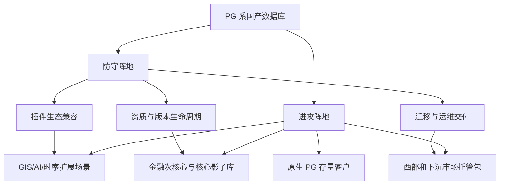

# PostgreSQL 系国产数据库攻防手册


我先把结论放在前面：PostgreSQL 系国产数据库要防守，不能再只守“信创资质 + PG 兼容”这两张牌；要进攻，也不要幻想把所有 Oracle、Db2、MySQL、非 PG 国产库客户一口吃掉。真正有效的打法，是把 PostgreSQL 的开源生态优势、国产合规能力、迁移工具链、行业案例和区域交付能力，做成一套客户能采购、能验收、能追责的产品包。

上一份调研已经说明，非 PG 系国产数据库最容易攻击 PG 系的地方有三处：第一，深度改造后可能割裂 PostgreSQL 插件生态；第二，金融核心和分布式强一致场景里，PG 系不一定天然最强；第三，下沉区域客户缺 DBA、缺迁移经验，容易被“整包交付”打动。

我会反过来用这三处做手册。能补起来的，就是防守；能产品化的，就是进攻。



## 我不会把 PG 系当成一个单一厂商

国内所谓 PostgreSQL 系，不是一家公司，也不是一个完全同质的产品。里面至少有几类：原生 PostgreSQL 商业服务，openGauss/GaussDB 路线，基于 PostgreSQL 或 openGauss 做国产发行版的金仓、瀚高、海量 Vastbase 等，还有云厂商提供的 PostgreSQL 兼容服务。

这带来一个麻烦：客户听到“PG 兼容”时，可能以为这些产品都能无缝使用 PostgreSQL 的驱动、插件、迁移工具和运维经验。但真实项目里，版本差异、内核改造、扩展支持、国密改造、高可用架构都会影响迁移结果。

所以我的第一条防守规则是：不要再笼统说“兼容 PostgreSQL”，要把兼容拆成可验证的四张清单。

- SQL 和应用兼容清单：SQL 语法、函数、存储过程、事务隔离、序列、触发器、分区、JSON、窗口函数、驱动和连接池。
- 扩展兼容清单：PostGIS、pgvector、TimescaleDB、FDW、pg_stat_statements、审计、备份、监控、HLL、图、全文检索等。
- 运维兼容清单：备份恢复、主备切换、逻辑复制、升级、监控、审计、故障诊断、漏洞修复。
- 信创合规清单：安全可靠测评、国密、国产 CPU/OS/中间件适配、等保、审计材料、原厂服务承诺。

这些清单不是售前 PPT，而应该是工具跑出来的报告。客户给我一个 PostgreSQL、Oracle 或 Db2 系统，我要能在几天内告诉他：哪些能直接迁，哪些要改造，哪些不能承诺，哪些需要替代方案。非 PG 系如果攻击“PG 系生态割裂”，我就用这张报告防守。

## 防守第一层：守住已经很难被替代的浅水区

党政、公安、政务云、公共服务、运营商支撑系统、一般央国企业务系统，是 PG 系已经比较有存在感的阵地。这里的防守重点不是继续讲国产化意义，因为客户早就知道；也不是继续降 license，因为价格战只会把利润打没。我要守的是升级、扩容、维保、灾备、版本迁移和二期建设。

上一份调研引用的数据里，中国信通院《数据库发展研究报告（2025 年）》显示，2024 年中国数据库市场规模约 596.16 亿元，预计 2027 年达到 837.42 亿元；IDC 2025 上半年关系型数据库追踪显示，中国关系型数据库软件市场 2025 年上半年为 22.1 亿美元，预计 2025 年全年达到 49.4 亿美元；沙利文发布信息显示，openGauss 及 DBV 伙伴版在 2025 年中国线下集中式关系型数据库新增装机份额为 35.02%。这些数字不等于“PG 系收入份额”，但足够说明：本地部署、信创、集中式关系型数据库仍然有可守的盘子。

我会把防守动作做成三类产品。

第一类是“存量健康包”。把巡检、慢 SQL 分析、备份恢复演练、参数建议、容量预测、漏洞修复、国密配置检查做成年度服务。客户已经上了 PG 系，最怕的是没人管、出事没人背。我不只卖维保，而是卖“数据库不掉链子”。

第二类是“版本升级包”。PostgreSQL 官方版本策略是大约每年一个大版本，每个大版本支持 5 年。PG 系国产发行版如果长期停在老版本，客户会被新功能、新安全补丁和新插件吸引回原生 PG 或其他路线。我会明确告诉客户：当前版本支持到什么时候，下一版什么时候适配，扩展什么时候更新，升级回退怎么做。

第三类是“信创二期包”。很多党政和国企项目不是没有空间，而是从第一次替换变成二期治理：灾备、双中心、统一监控、数据脱敏、审计、资源池、开发测试环境、容灾演练。这个钱不一定比首次 license 少，而且粘性更高。

## 防守第二层：把插件生态从短板变成护城河

站在内核生态角度，我最不愿意看到的是，PG 系国产数据库自己把 PostgreSQL 最大优势弄丢了。PostgreSQL 强，不只是 SQL 强，而是扩展机制强。官方文档说明，`CREATE EXTENSION` 会根据控制文件、脚本和可选共享库加载扩展对象，并记录这些对象以便管理。PGXN 是 PostgreSQL 开源扩展的中央分发系统。PostGIS、pgvector、Apache AGE、FDW、DuckDB postgres 扩展这些项目，让 PostgreSQL 从一个关系型数据库变成了 GIS、AI、图、时序、联邦查询和轻量分析的底座。

非 PG 系厂商会怎么打？它会问客户：你现在用了 PostGIS 吗？用了 pgvector 吗？用了 TimescaleDB、FDW、HLL、图扩展吗？迁到某个 PG 兼容国产库以后还能用吗？如果不能用，我这里有内置 GIS、内置向量、内置时序、内置分布式分析。

我的防守方法不是嘴硬说“都支持”，而是建立“扩展分级制度”。

- S 级扩展：必须原厂承诺，覆盖 PostGIS、pgvector、pg_stat_statements、核心审计、备份、监控、主流 FDW。它们要有版本、测试报告、已知限制和安全修复 SLA。
- A 级扩展：重点行业需要，比如 TimescaleDB 类时序能力、HLL、全文检索、图查询、地理编码、DuckDB/湖仓联邦能力。可以原样兼容，也可以提供国产适配版或内置替代。
- B 级扩展：少数客户使用，售前评估时按项目适配，不在通用承诺里夸大。
- 禁承诺扩展：当前不能稳定支持的，明确告诉客户替代路径，避免项目后期爆雷。

这套分级一旦做出来，进攻机会也来了。自然资源、交通、公安、城市治理、能源管线这些 GIS 项目，我用 PostGIS 生态和国产适配打；AI 知识库、RAG、智能客服、文档检索，我用 pgvector 或兼容向量能力打；工业物联网、设备监控、能源数据，我用时序能力打；轻量湖仓和数据科学，我用 FDW、DuckDB 连接和外部表能力打。

客户买的不是“我支持 300 个插件”，而是“我现在业务依赖的 6 个插件迁完不断”。这句话要写进产品手册。

## 防守第三层：金融核心不能硬冲，要从影子库和次核心推进

金融是最容易被误判的市场。很多人一听金融市场大，就想直接打核心账务、清算、支付、总账。我的看法更谨慎：PG 系可以进攻金融深水区，但不能把“进攻核心”理解成一上来替换核心主库。

第一新声金融业数据库报告摘要显示，2024 年中国金融业数据库市场规模约 115 亿元，银行占比超过 6 成；超过三成金融机构核心系统国产数据库应用占比在 20% 以下。IDC 金融分布式事务型数据库报告摘要显示，2024 年中国金融行业分布式事务型数据库市场规模为 20.37 亿元，其中银行子市场 13.44 亿元。这说明金融仍有空间，但也说明竞争极硬。

我会把金融进攻分成五步。

第一步，守住金融非核心和 B/C 类系统。渠道、营销、报表、客户画像、监管报送、风险数据集市，这些系统迁移风险低，能积累金融交付证据。

第二步，做次核心双跑。授信、风控、支付网关、客户中心、账户查询等系统，可以先做双跑、影子库、只读副本和数据校验，让客户看到 PG 系不是只会跑 demo。

第三步，做核心影子库。核心交易、账务、清算系统不急着替换主库，可以先做实时同步、对账、灾备演练和压测，让数据库进入核心链路的观察位。

第四步，争取新建核心模块。新建业务比改造老核心更适合 PG 系，例如新渠道、新支付产品、新风控引擎、新客户平台。

第五步，只有在工具、压测、回退、容灾、同业案例都成熟后，再争取核心局部替换。

这里的产品清单很具体：Oracle/Db2 兼容评估器、SQL 改写器、存储过程改造工具、数据迁移和校验工具、双跑平台、压测模板、切换剧本、回退剧本、两地三中心参考架构、金融应急服务 SLA。没有这些东西，只说“我们是国产 PG 系”，进不了核心。

## 进攻第一块：原生 PostgreSQL 存量客户

很多 PostgreSQL 用户不一定在信创统计里被看见：互联网、制造、数据平台、SaaS 私有化、科研、GIS、创业公司、外企在华系统、开源技术团队。它们用的是原生 PostgreSQL、云 RDS PostgreSQL，或者自建 PG。信创推进时，这些客户会遇到一个现实问题：原生 PG 好用，但国产合规、国密、国产软硬件适配、原厂服务和审计材料不一定齐。

这就是 PG 系最自然的进攻市场。相比非 PG 系，PG 系迁移成本低，应用改造少，开发者心理阻力小。

我会给这类客户一个“原生 PG 到信创 PG”的迁移包：

- 版本差异扫描：当前 PG 版本、插件、参数、系统表依赖、逻辑复制、备份方式。
- 信创适配报告：国产 CPU、操作系统、中间件、备份软件、监控平台、国密和审计。
- 最小改造路径：保留 PostgreSQL 应用开发习惯，只替换必须替换的内核、驱动、扩展和运维组件。
- 回退路径：迁移失败时如何回到原生 PG 或保留双写窗口。

这个市场不一定每单很大，但数量多，适合快速复制，也最能体现 PG 系路线优势。

## 进攻第二块：AI 数据底座

2026 年以后，私有化 AI 应用会越来越多。很多客户不想为一个知识库单独买一套复杂向量数据库，也不想把文档、权限、业务数据、向量、审计分散到多个系统。PostgreSQL 的优势是可以把关系数据、JSON、全文检索和向量放在一个熟悉的数据库里。

pgvector 官方仓库说明，它支持 Postgres 中的向量相似搜索，包括精确和近似最近邻、多种向量类型和距离度量。对很多企业 RAG 场景来说，这不是“全球最大向量库”的打法，而是“我能在一套数据库里把权限、文档、元数据、向量和审计串起来”的打法。

PG 系国产数据库应该做一个“信创 AI 数据底座包”：

- 向量能力：支持 pgvector 或兼容向量类型、HNSW/IVF 等索引、混合检索。
- 文档能力：全文检索、JSON、权限过滤、元数据管理。
- 审计能力：谁查了什么文档、调用了什么知识、返回了什么结果。
- 运维能力：向量索引重建、容量评估、召回质量评估、冷热数据分层。
- 生态能力：接入主流国产大模型、Embedding 模型、RAG 框架和知识库应用。

非 PG 系也能做向量，但 PG 系有一个天然优势：许多 AI 应用本来就需要关系数据和权限数据。把向量作为 PostgreSQL 扩展或内置能力，不是为了追逐概念，而是减少系统数量。

## 进攻第三块：GIS、时序和行业扩展场景

PostGIS 官网说明，它给 PostgreSQL 增加空间数据存储、索引、查询、栅格、地理编码，并能与 QGIS、GeoServer、MapServer、ArcGIS、Tableau 等工具集成。这意味着 GIS 客户买的不是一个空间字段，而是一整套行业工具链。

我会把 GIS 作为 PG 系进攻非 PG 系的重点行业之一。自然资源、住建、交通、公安、应急、能源、电力、管网，这些场景的迁移难点不是 SQL，而是空间函数、空间索引、坐标转换、栅格、拓扑、桌面工具和地图服务。

同理，工业时序、设备监控、能源采集、物联网平台，也适合 PG 系用时序扩展或内置时序能力进攻。客户不一定要一个单独时序数据库，如果他的业务同时有设备台账、工单、权限、地理位置、历史指标和报表，PG 系的一体化能力很有吸引力。

这里的手册动作是：把“行业扩展迁移评估器”做出来。客户给我一个库，我告诉他用了哪些 PostGIS 函数、哪些索引、哪些栅格能力、哪些 QGIS/GeoServer 连接；迁到我这里哪些保持不变，哪些要改，哪些用内置能力替代。这个报告比任何“我们支持 GIS”都更有杀伤力。

## 进攻第四块：西部和下沉市场，不卖复杂概念，卖低运维门槛

华东、华南、北京、深圳这些市场，客户密度高，竞争也强。西部、地市、区县、医疗、教育、交通项目，未必缺需求，缺的是 DBA、迁移经验和长期运维能力。

站在区域交付角度，我会把 PG 系产品打成“低运维信创数据库包”。它不应该让客户自己理解所有数据库概念，而应该默认包含：

- 一键巡检和风险评分。
- 备份恢复演练。
- 慢 SQL 和容量预警。
- 主备切换演练。
- 国密和安全配置检查。
- 适配报告、迁移报告、测试报告、验收材料模板。
- 7x24 远程支持和关键项目现场响应。
- 伙伴认证、交付手册和标准报价。

福建省农村信用社 2023 年人大金仓许可采购预算 110 万元、22 套，说明很多项目单套 license 价格并不高。北京市公安局 2025 年数据库采购 201 套、约 1936.7199 万元，说明批量项目里产品、服务和适配会混在一起。对 PG 系来说，下沉市场不是靠单套高价赚钱，而是靠标准化交付、低服务成本、续费和扩容赚钱。

## 我会怎么安排产品路线

如果我是 PG 系国产数据库厂商，我会把未来 12 个月产品路线压成 8 个优先级，不做太多花活。

第一，做迁移评估器。覆盖 PostgreSQL、Oracle、Db2、MySQL 到 PG 系的对象、SQL、插件、性能和风险评估。

第二，做扩展兼容矩阵。S 级扩展必须有测试报告、版本、限制、修复 SLA；不能支持的明确替代方案。

第三，做金融迁移工具链。SQL 改写、数据校验、双跑、压测、切换、回退、审计证据都要产品化。

第四，做 AI 数据底座。向量、全文、JSON、权限过滤、审计、国产大模型适配必须形成样板。

第五，做 GIS 行业包。PostGIS 兼容、空间索引、坐标转换、GeoServer/QGIS 适配、自然资源和交通样板。

第六，做低运维平台。巡检、备份、恢复、监控、容量、故障诊断和工单系统打通。

第七，做版本生命周期承诺。明确上游 PostgreSQL 或 openGauss 版本跟进节奏、EOL 时间、安全补丁节奏。

第八，做伙伴交付包。培训、认证、报价、验收模板、升级路径和原厂兜底机制。

## 我会怎么安排市场打法

防守市场，我会分三层守。

党政、公安、政务云和公共服务，我守二期、灾备、升级、运维和扩容，不把主力放在抢首次替换。

运营商、能源、交通、制造，我守关键业务周边系统，同时用 GIS、时序、数据治理、AI 数据底座进攻新场景。

金融，我守非核心和次核心，用影子库、双跑和新建模块逐步靠近核心，不急着喊“替核心主库”。

进攻市场，我也分三层打。

第一层打原生 PostgreSQL 存量客户，理由是迁移成本最低，客户最容易理解 PG 系价值。

第二层打扩展依赖客户，尤其是 GIS、AI、时序、FDW、图和 HLL 场景。这里是 PG 系最有生态差异的地方。

第三层打 Oracle/Db2 还没替的深水区，但只从次核心、影子库、新建模块和可回退系统开始。

## 我会盯的看盘清单

接下来 3-6 个月，我不会只看签了多少单。我会盯这些更能说明方向的数据：

- 2026 年市场报告里，openGauss/PG 系在本地部署或线下集中式关系型数据库中的份额是否维持在 30% 左右或更高。如果明显低于 25%，说明防守压力加大。
- 招标文件里是否越来越多出现迁移工具、双跑、回退、原厂专家现场服务、国密、扩展兼容、AI 向量、GIS 适配这些条款。如果出现，说明 PG 系的工具化和生态化打法有机会。
- 金融客户是否把 PG 系放进次核心、影子库、新建核心模块的候选池。如果只停留在外围系统，核心进攻还不能加速。
- GIS、AI、时序客户是否开始要求 PostGIS、pgvector、FDW、DuckDB 连接、HLL、图扩展等迁移评估。如果开始频繁出现，生态就是 PG 系进攻窗口。
- 区域项目中，服务、运维、巡检、备份恢复演练和验收材料是否能单独计价。如果不能，区域打法会被压成低价 license 战。
- 主要集成商是否愿意主动推 PG 系。如果伙伴觉得培训难、利润低、原厂不兜底，区域市场会被非 PG 系整包方案抢走。

我的最终判断很简单：PG 系国产数据库的最大风险，不是非 PG 系说自己也国产，而是 PG 系自己没有把 PostgreSQL 生态优势兑现成信创客户能买的确定性。只要我能把扩展兼容、迁移评估、版本生命周期、金融工程能力和区域交付包做扎实，防守阵地就不只是守得住，还能变成进攻入口。

## 主要来源

- [IDC 2025 上半年中国关系型数据库软件市场追踪摘要](https://www.fxbaogao.com/detail/5229631)
- [中国信通院《数据库发展研究报告（2025 年）》摘要](https://www.fxbaogao.com/detail/4954376)
- [弗若斯特沙利文 2025 年中国数据库产业研究报告发布信息](https://www.frostchina.com/zh/content/insight/detail/698f31ed5971ce70d9c74159)
- [PGXN PostgreSQL Extension Network](https://pgxn.org/about/)
- [PostgreSQL 官方扩展机制文档](https://www.postgresql.org/docs/current/extend-extensions.html)
- [PostgreSQL Versioning Policy](https://www.postgresql.org/support/versioning/)
- [PostGIS 官网](https://www.postgis.net/)
- [pgvector GitHub](https://github.com/pgvector/pgvector)
- [Apache AGE 官网](https://age.apache.org/overview/)
- [DuckDB PostgreSQL Extension 文档](https://duckdb.org/docs/stable/core_extensions/postgres)
- [第一新声《2025 年中国数据库市场研究报告》摘要](https://www.fxbaogao.com/detail/4898843)
- [第一新声《2025 年中国金融业数据库国产替代能力评估报告》摘要](https://www.fxbaogao.com/detail/5072917)
- [IDC 中国金融行业分布式事务型数据库市场份额报告摘要，腾讯云转载](https://cloud.tencent.com/document/product/1293/129574)
- [福建省农村信用社联合社 2023 年人大金仓许可采购公告](https://www.ccgp.gov.cn/cggg/dfgg/gkzb/202309/t20230911_20681791.htm)
- [北京市公安局数据库采购中标公告整理](https://www.modb.pro/db/1910550701042839552)
- [兴业数金 2025 年 openGauss 信创商业版供应商征集公告](https://cg.cib.com.cn/cms/default/webfile/gyszj/20250911/1150822813104340992.html)

-----

Prompt: 
````
“非 PostgreSQL 系”国产数据库做了如下市场调研, 作为产品规划决策的重要参考, 目的是抢占未被“PostgreSQL 系国产信创数据库”充分渗透的 PostgreSQL 信创市场. 
```
1. 当前国内 PostgreSQL 技术路线(包括国产 PostgreSQL 系以及 PostgreSQL 原生开源版本)的信创市场的整体规模约为多少？
在区域分布（如华东地区 versus 西部地区的渗透率）及行业应用（如政务 versus 金融）层面，是否存在显著的结构性差异？
具体而言，哪些行业已成为 PostgreSQL 技术路线渗透率最高、被替代难度最大的‘深水区’？
2. 目前国内 PostgreSQL 的信创替代进程处于何种阶段？
存量市场中是否已完成大规模的替换工作，还是说目前仅完成了部分试点，仍有巨大的潜在替换空间尚未释放？
3. 当前国内 PostgreSQL 信创市场主要由哪些核心厂商主导？
这些头部厂商在 PostgreSQL 信创替换市场中的份额占比大致如何？
为满足信创合规及业务连续性要求，这些厂商是否在原生 PostgreSQL 内核基础上进行了深度的改造，比如要实现新的国密算法等。
4. 国内多数 PostgreSQL 兼容数据库因进行了深度的内核级改造，导致难以兼容 PostgreSQL 丰富的开源插件生态。这种‘生态割裂’现象对 PostgreSQL 信创替代进程产生了何种具体影响？
是否会在特定场景（如依赖 GIS、时序、向量、图、DuckDB、HLL、化学分子的业务）中形成迁移壁垒，进而限制其市场渗透率？
5. 目前 PostgreSQL 信创项目的平均客单价（包含 License 授权与专业服务）处于什么水平？
当前的替换需求是否仍以单机或主备架构为主？
面对核心交易系统，市场是否已涌现出对分布式 PostgreSQL 信创方案的明确诉求？
```
调研文档已输出到 markdown/1.md 
“PostgreSQL 系”国产数据库如何防守? 还有什么市场可以进攻? 制定防守和进攻手册.  
````


    
