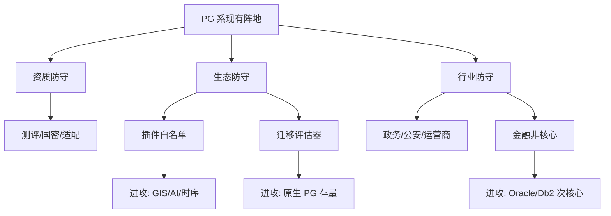

# PostgreSQL 系国产数据库攻防手册 - 专家1 - 信创产品战略负责人

## 专家档案

- **领域**: 国产数据库产品战略与信创商业化
- **人设**: 我做过政务、金融和运营商数据库产品线规划，经历过从“只要国产资质”到“必须可迁移、可运维、可审计”的采购变化。我的立场是，PostgreSQL 系国产数据库不能只守“PG 兼容”这个标签，必须把开源生态、信创合规和行业方案打包成可采购的确定性。
- **关键盲点**: 我容易高估产品组合的可控性，低估一线销售和集成商在真实项目里的折扣、回款和交付压力。

## 1. 复述并分析问题

用户已经拿到一份“非 PostgreSQL 系国产数据库如何抢占 PostgreSQL 信创市场”的调研，现在要反过来问：作为 PostgreSQL 系国产数据库，应该怎么守住已经形成优势的信创阵地，又应该进攻哪些没有被非 PG 系或传统 Oracle/Db2 替代方案吃透的市场。

我理解的问题本质是产品规划：PG 系不缺信创市场入口，缺的是把“开源生态优势”变成客户可感知的迁移优势，把“国产合规能力”变成可审计的交付优势，把“单机主备优势”延展到核心和分布式需求。

## 2. 第一性原理拆解

### 2.1 5 Whys 找根因

```text
问题: PostgreSQL 系国产数据库如何防守和进攻
  -> 为什么 1: 因为非 PG 系会攻击 PG 系的插件割裂、核心交易能力和交付不确定性
    -> 为什么 2: 因为信创采购从办公系统替换进入关键业务和核心系统攻坚
      -> 为什么 3: 因为客户现在买的不是数据库软件，而是迁移风险下降和持续运行能力
        -> 为什么 4: 因为数据库替换一旦失败，会影响业务连续性、审计责任和组织声誉
          -> 为什么 5: 所以产品战略必须围绕“低风险迁移 + 长周期运维 + 行业场景闭环”组织
```

### 2.2 硬约束 vs 软变量

**硬约束**:
- 信创合规、安全可靠测评、国密、国产软硬件适配是短中期内绕不开的准入条件。
- 核心系统替换的决策周期长，客户更看重案例、压测、回退方案和责任边界。
- PostgreSQL 原生生态快速演进，国产发行版如果长期滞后，就会失去“PG 路线”的最大资产。

**软变量**:
- 行业预算会随财政、金融监管、央国企数字化周期波动。
- 客户对集中式、主备、共享存储、分布式架构的偏好会随项目风险和厂商案例变化。
- 非 PG 系厂商的价格、集成商激励和行业样板会改变竞争节奏。

### 2.3 显式前置条件

我的结论“PG 系国产数据库应该从资质防守转向生态和行业方案攻防一体”建立在以下条件同时成立的基础上：第一，2026-2028 年国内信创数据库替换仍会持续从一般系统向关键业务系统推进，而不是突然停止。第二，客户仍愿意接受 PostgreSQL/openGauss/兼容 PG 的技术路线作为国产化替代选项。第三，PG 系厂商能在插件、工具链、迁移服务和核心案例上投入真实研发与交付资源，而不是只用销售话术包装。只要其中任一条件被打破，PG 系的战略就要收缩到存量维保和低风险系统替换。

## 3. 逻辑推演与图示

### 3.1 因果链 / 决策树

防守的第一层是准入：资质、国密、国产软硬件适配、版本生命周期。第二层是留存：迁移工具、兼容评估、插件支持、运维服务。第三层是升级：从一般业务到关键业务，从主备到分布式，从单产品到行业方案。

进攻的第一层不是抢所有非 PG 市场，而是选 PG 有天然优势的地方：存量 PostgreSQL 原生客户、GIS/向量/时序等扩展生态客户、希望从 Oracle 迁到开源路线但不敢一次上分布式的客户、需要低成本私有化 AI 数据底座的客户。

### 3.2 图示



### 3.3 图的解读

这张图想说明：PG 系的防守和进攻不是两套动作。把插件、工具、资质和案例补齐，本身就是防守；这些能力标准化后，又能变成进攻新市场的销售武器。

## 4. 数据与案例支撑

### 4.1 关键数据

| 数据 | 数值 | 时间 | 来源 |
|---|---:|---|---|
| 中国关系型数据库软件市场规模 | 22.1 亿美元，上半年同比增长 14.5% | 2025H1 | IDC《中国关系型数据库软件市场追踪 2025 上半年》，发现报告摘要 |
| 中国关系型数据库软件市场全年预测 | 49.4 亿美元，同比增长 17.3% | 2025 | IDC《中国关系型数据库软件市场追踪 2025 上半年》，发现报告摘要 |
| 中国数据库市场规模 | 596.16 亿元，预计 2027 年 837.42 亿元 | 2024/2027 | 中国信通院《数据库发展研究报告（2025 年）》 |
| openGauss 线下集中式关系型数据库新增装机份额 | 35.02% | 2025 | 弗若斯特沙利文《2025 年中国数据库产业研究报告》发布信息 |
| PostgreSQL 版本节奏 | 每年约 1 个大版本，每个大版本支持 5 年 | 2026 当前政策 | PostgreSQL 官方 Versioning Policy |

### 4.2 典型案例

- **兴业数金 openGauss 商业版征集**: 2025 年公告要求生产环境永久许可、迁移工具订阅、开发测试许可、一年维保、紧急抢修、原厂专家现场服务，说明金融客户购买的是完整生命周期能力，不是单纯 license。
- **北京市公安局数据库采购**: 2025 年数据库产品 201 套，金额约 1936.7199 万元，涉及 GaussDB 和金仓，说明政务公安仍是 PG/openGauss 系重要阵地。
- **PostgreSQL 官方版本策略**: 每年大版本和 5 年支持周期，说明 PG 系厂商如果能紧跟上游版本，就能把长期可维护性变成竞争优势。

## 5. 适用边界

### 5.1 结论在什么条件下成立

- 时间窗口: 2026-2028 年信创数据库继续从一般系统进入关键业务系统的阶段。
- 地域范围: 中国大陆政务、央国企、金融、运营商、能源、交通、医疗、制造等信创项目。
- 市场环境: 国产数据库采购仍以合规和业务连续性为核心约束，客户预算有压力但替换任务没有消失。
- 人群: 适用于 PostgreSQL、openGauss、金仓、瀚高、海量 Vastbase、GaussDB/openGauss 商业发行版等 PG 技术路线厂商。

### 5.2 不适用的情形

- 如果客户系统完全依赖 Oracle RAC、复杂 PL/SQL、超大主机或专有中间件，且短期不能改造，PG 系只能做周边系统或渐进替换。
- 如果厂商没有真实内核能力和交付队伍，只靠兼容声明，很难执行这份手册。
- 如果项目目标只是低价中标，不重视后续服务，这份以长期产品力为核心的打法会被短期价格战稀释。

## 6. 证伪与证明方法

### 6.1 证伪条件

- [ ] 2026 年公开市场报告显示 openGauss/PG 系在本地部署或线下集中式关系型数据库新增装机占比低于 25%，说明 PG 系路线优势被高估。
- [ ] 2026 年下半年以后，PG 系主流厂商在金融、能源、运营商关键业务招标中连续被排除，说明客户对核心能力信任不足。
- [ ] 2026 年出现大量招标明确排除 PostgreSQL/openGauss 兼容路线，转向非 PG 分布式或 Oracle 兼容路线，说明防守窗口收窄。

### 6.2 验证信号

| 指标 | 当前值 | 目标/阈值 | 观察频率 |
|---|---|---|---|
| openGauss/PG 系新增装机份额 | 2025 年沙利文口径 openGauss 及 DBV 伙伴版 35.02% | 2026 年维持 30% 以上 | 半年 |
| 招标文件中的迁移工具/原厂服务条款 | 2025 年已有金融公告样本 | 明确要求迁移评估、回退、专家现场服务的项目增多 | 月度 |
| 插件场景客户线索 | 公开口径不足 | GIS、向量、时序、FDW 等场景进入正式 PoC 或招标 | 月度 |

### 6.3 关键时间节点

- 2026 年各机构发布 2025 全年数据库市场追踪报告时，重新校验 PG 系收入和装机区间。
- 2026 年下半年金融核心与资源池类数据库框架采购集中出现时，重新判断 PG 系是否能进入核心候选池。
- 2027 年 PostgreSQL 新版本和国产发行版跟进节奏拉开时，重新评估“原生生态优势”是否仍成立。

## 内部备注 (不进入综合稿)

- 这个专家和内核生态专家的分歧点: 我更重视产品包和采购打法，内核生态专家会要求更高的上游兼容和插件 ABI 稳定性。
- 最容易误读的地方: 防守不是保守，防守动作产品化以后就是进攻武器。
- 综合阶段可用“站在产品战略角度”引入。

## 7. 自我验证记录 (不进入综合稿, 仅供迭代使用)

### 7.1 验证轮次

- **轮次 1**:
  - 数据: 检查所有数字是否带时间和来源。IDC、信通院、沙利文、PostgreSQL 版本策略均已标注年份和机构。
  - 逻辑: 从市场阶段到产品攻防的链条成立，但份额口径不是 PG 系完整份额，已明确为 openGauss 及 DBV 伙伴版新增装机份额。
  - 结构: 1-6 节、图示、证伪和验证信号齐全。
- **最终状态**: [x] 通过

### 7.2 已知未消解的疑点

- 国内没有官方口径直接统计“PostgreSQL 系信创市场份额”，综合稿必须保留区间估算和待观察表述。

### 7.3 验证手段

- [x] 通读自查
- [x] 用 Web 搜索交叉验证 IDC、信通院、沙利文、PostgreSQL 官方版本策略等关键数据点
- [x] 用“非 PG 进攻方会攻击什么”反向挑刺
