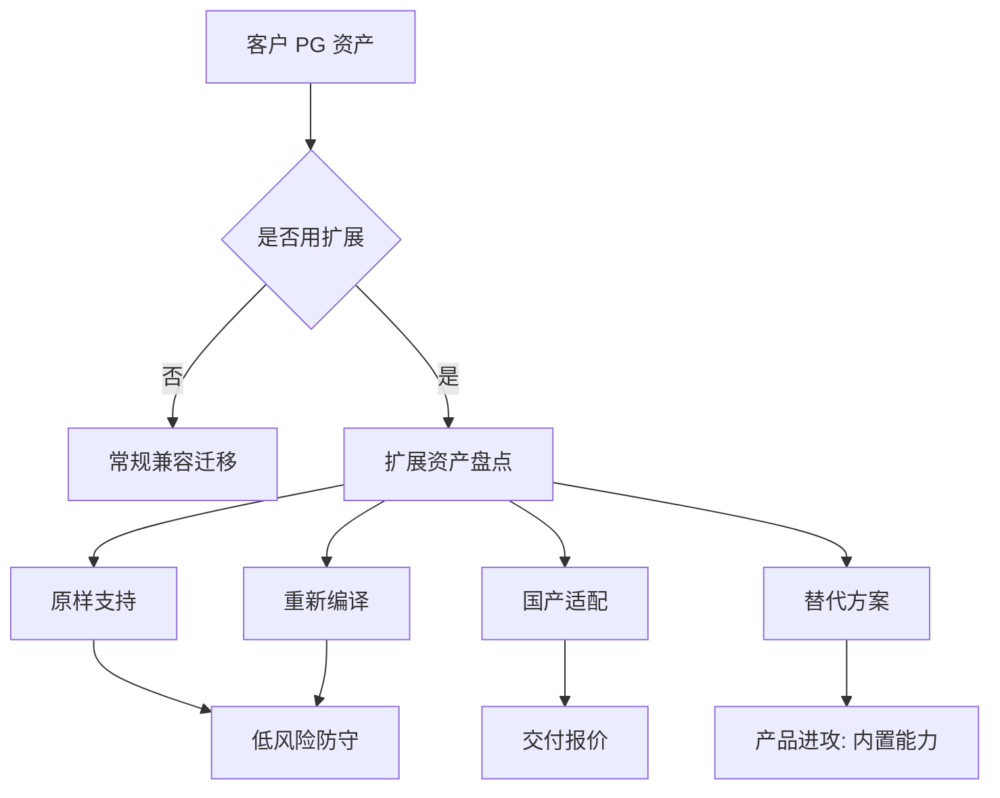

# PostgreSQL 系国产数据库攻防手册 - 专家2 - PG 内核扩展生态负责人

## 专家档案

- **领域**: PostgreSQL 内核、扩展机制、数据库生态兼容
- **人设**: 我长期维护 PostgreSQL 扩展、FDW、索引和运维工具链，见过很多“语法兼容 PG”但无法安装关键扩展的失败迁移。我的立场是，PG 系国产数据库最大的护城河不是 SQL 兼容，而是能不能把 PostGIS、pgvector、TimescaleDB、FDW、审计、监控、备份和开发者工具生态稳住。
- **关键盲点**: 我容易把技术生态看得过重，低估客户在信创采购中对资质、国产厂商背书和现场服务的权重。

## 1. 复述并分析问题

非 PG 系国产数据库会抓住一个痛点：许多国产 PG 兼容数据库做了深度内核改造，导致原生 PostgreSQL 扩展生态不能直接复用。现在问题变成：PG 系如何防守这个短板，并把“真正兼容生态”变成进攻其他数据库路线的武器。

我作为内核生态视角看到的问题本质是：客户不是为了使用 PostgreSQL 这个名字而选择 PG，而是为了用一整套围绕 PostgreSQL 形成的能力。如果国产 PG 系切断了扩展、驱动、工具、版本升级和社区节奏，它就会失去最关键的差异化。

## 2. 第一性原理拆解

### 2.1 5 Whys 找根因

```text
问题: PG 系如何防守插件生态被攻击
  -> 为什么 1: 因为许多业务依赖 PostGIS、pgvector、FDW、时序、图等扩展
    -> 为什么 2: 因为 PostgreSQL 的设计允许通过扩展把数据库变成多场景平台
      -> 为什么 3: 因为扩展依赖内核 API、版本、编译环境、系统表和执行器行为
        -> 为什么 4: 因为国产改造越深，扩展适配成本越高
          -> 为什么 5: 所以防守的根本不是宣传兼容，而是建立可测试、可发布、可维护的扩展供应链
```

### 2.2 硬约束 vs 软变量

**硬约束**:
- PostgreSQL 扩展不是简单 SQL 脚本，很多扩展包含 C 语言共享库、索引访问方法、类型、操作符和后台进程。
- PostgreSQL 官方文档要求扩展通过控制文件、脚本和可选共享库注册对象，`CREATE EXTENSION` 会记录这些对象以便管理。
- PostGIS、pgvector、Apache AGE、DuckDB postgres 扩展等生态项目持续演进，国产分支必须有版本跟踪能力。

**软变量**:
- 客户是否真的使用复杂扩展，取决于行业场景。政务 OA 可能不需要，GIS、AI、工业时序和风控模型会高度依赖。
- 厂商可以选择三种路径：原样兼容扩展、维护国产适配版、把扩展能力做成内置功能。
- 生态差距是否被客户感知，取决于迁移评估工具能否把差异量化。

### 2.3 显式前置条件

我的结论“PG 系必须建立扩展兼容矩阵和插件供应链，否则会被非 PG 系抓住生态割裂反攻”建立在以下条件同时成立的基础上：第一，客户在 2026-2028 年会继续把 GIS、AI、时序、湖仓联邦、图查询等场景放进信创替代范围。第二，PostgreSQL 原生生态仍保持活跃，客户会把原生 PG 上的可用能力作为国产替代的参照。第三，PG 系厂商有能力维护扩展测试、编译、发布和安全修复流程。只要这些条件不成立，插件生态就只是少数客户的局部诉求，不足以成为主战场。

## 3. 逻辑推演与图示

### 3.1 因果链 / 决策树

如果客户不用扩展，PG 系只要解决语法、性能和运维即可。如果客户依赖扩展，就要先做资产盘点：用了哪些扩展、函数、类型、索引、FDW、触发器、后台任务、客户端工具。然后分成四类：可原样支持、需重新编译、需国产适配、不可支持但可替代。真正的防守手册必须把这四类变成售前评估报告和迁移报价。

### 3.2 图示



### 3.3 图的解读

客户真正关心的不是“支持多少插件”的总数，而是自己用的插件迁移后会不会断。扩展资产盘点是 PG 系防守生态攻击的第一动作。

## 4. 数据与案例支撑

### 4.1 关键数据

| 数据 | 数值 | 时间 | 来源 |
|---|---:|---|---|
| PGXN 扩展生态规模 | PGXN 是开源 PostgreSQL 扩展库的中央分发系统；公开页面显示数百个扩展与发行包 | 2026-06 抓取 | PGXN About |
| PostgreSQL 扩展机制 | `CREATE EXTENSION` 通过控制文件、脚本和可选共享库加载扩展对象 | PostgreSQL 18 当前文档 | PostgreSQL 官方文档 |
| PostgreSQL 大版本节奏 | 约每年一个大版本，每个大版本支持 5 年 | 2026 当前政策 | PostgreSQL Versioning Policy |
| PostGIS 能力 | 支持空间数据存储、索引、查询、栅格、地理编码，并与 QGIS、GeoServer、ArcGIS 等工具集成 | 2026 当前官网 | PostGIS 官网 |
| pgvector 能力 | 支持 Postgres 向量相似搜索，包含精确/近似搜索、多种距离和向量类型 | 2026 当前 GitHub | pgvector GitHub |
| Apache AGE 能力 | PostgreSQL 图数据库扩展，支持在关系模型上使用图查询 | 2026 当前官网 | Apache AGE 官网 |

### 4.2 典型案例

- **PostGIS**: 自然资源、交通、公安、城市治理和能源管线类项目通常不仅要空间字段，还要函数覆盖、索引、桌面 GIS 和服务端 GIS 工具链。
- **pgvector**: AI 知识库、RAG、智能客服、文档检索会把向量搜索和关系过滤放在同一数据库中，PG 系如果支持主流向量扩展，会比非 PG 系更容易承接存量应用。
- **DuckDB postgres 扩展**: DuckDB 文档显示其 PostgreSQL 扩展可连接并读取 PostgreSQL 数据，说明 PG 正在成为事务数据与轻量分析之间的桥。国产 PG 系若切断这类生态，会失去新型分析场景入口。
- **openGauss PostGIS 文档**: openGauss 最新文档中已有 PostGIS 扩展说明，说明国产 PG/openGauss 路线不是没有补生态，而是必须把版本、覆盖度和兼容边界讲清楚。

## 5. 适用边界

### 5.1 结论在什么条件下成立

- 时间窗口: 2026-2028 年，AI 应用、GIS 数字化、工业时序和湖仓联邦查询继续增长。
- 地域范围: 国内需要私有化和信创替代的行业客户。
- 市场环境: 客户希望在信创约束下保留开源生态带来的开发效率。
- 人群: 适用于有内核研发、扩展适配、版本发布和安全修复能力的 PG 系厂商。

### 5.2 不适用的情形

- 客户业务只是简单 CRUD、报表、OA、门户，不依赖扩展生态时，插件能力不是主要竞争点。
- 客户完全禁止第三方开源组件，且只接受厂商内置能力时，应转成“内置功能替代”而非“扩展兼容”。
- 国产发行版和上游 PostgreSQL 版本差距过大、内核 API 改动过深时，短期内承诺大量原生扩展兼容会带来交付风险。

## 6. 证伪与证明方法

### 6.1 证伪条件

- [ ] 未来 6 个月招标和咨询中几乎没有客户提到 PostGIS、pgvector、TimescaleDB、FDW、图、HLL、DuckDB 等扩展迁移，说明插件生态不是近期主矛盾。
- [ ] 非 PG 系厂商把 GIS、向量、时序和图能力做成成熟内置功能，并在信创项目中形成连续样板，说明 PG 系生态优势被削弱。
- [ ] 主流 PG 系国产厂商无法给出扩展兼容矩阵、测试报告和安全修复 SLA，说明防守动作不可执行。

### 6.2 验证信号

| 指标 | 当前值 | 目标/阈值 | 观察频率 |
|---|---|---|---|
| 扩展兼容矩阵 | 公开资料分散 | 核心厂商发布覆盖 PostGIS/pgvector/FDW/审计/备份的矩阵 | 月度 |
| 插件迁移 PoC | 公开口径不足 | GIS、AI、时序客户 PoC 明确以扩展兼容为评分项 | 月度 |
| 上游版本跟进 | PostgreSQL 官方每年大版本 | 国产 PG 系给出明确大版本跟进和扩展支持周期 | 季度 |

### 6.3 关键时间节点

- PostgreSQL 新大版本发布后 3-6 个月，观察国产 PG 系是否给出版本路线图和扩展适配清单。
- 2026 年下半年 AI 应用私有化项目招标增多时，观察 pgvector 或替代向量能力是否成为标配。
- 2026 年自然资源、交通、公安 GIS 项目采购季，观察 PostGIS 兼容度是否进入评分项。

## 内部备注 (不进入综合稿)

- 这个专家和产品战略专家的分歧点: 我会坚持上游兼容和扩展供应链的重要性，产品战略可能更愿意用“内置替代”快速商业化。
- 最容易误读的地方: 扩展生态不是越多越好，而是要覆盖客户实际使用的高价值扩展。
- 综合阶段可用“站在内核生态角度”引入。

## 7. 自我验证记录 (不进入综合稿, 仅供迭代使用)

### 7.1 验证轮次

- **轮次 1**:
  - 数据: PGXN、PostgreSQL 官方文档、PostGIS、pgvector、Apache AGE、DuckDB 均有来源；PGXN 数量随页面变化，综合稿应避免过度依赖精确总数。
  - 逻辑: 从扩展机制到迁移风险再到产品动作，因果链完整。
  - 结构: 1-6 节、图示、边界和证伪条件齐全。
- **最终状态**: [x] 通过

### 7.2 已知未消解的疑点

- 不同国产 PG 系产品的扩展兼容度差异很大，公开资料不足以逐一评估。综合稿应把建议写成厂商自查清单，而不是笼统断言。

### 7.3 验证手段

- [x] 通读自查
- [x] 用 Web 搜索交叉验证 PostgreSQL 扩展机制、PostGIS、pgvector、Apache AGE、DuckDB postgres 扩展等资料
- [x] 用“客户实际用到的扩展才有商业价值”进行反向挑刺
