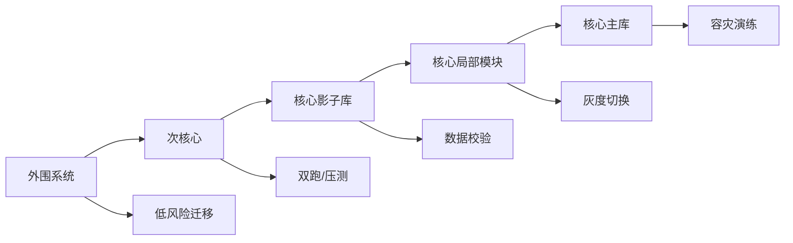

# PostgreSQL 系国产数据库攻防手册 - 专家3 - 金融核心迁移总架构师

## 专家档案

- **领域**: 金融核心系统数据库替代、迁移压测、业务连续性
- **人设**: 我参与过银行、证券和支付系统从 Oracle/Db2 向国产数据库迁移的评估和压测，最怕的不是 SQL 改不完，而是切换窗口、回退路径和生产事故责任说不清。我的立场是，PG 系国产数据库要进攻金融和核心交易，必须从“兼容 PG”升级为“能承担核心系统替换责任”。
- **关键盲点**: 我容易用金融核心的高标准要求所有行业，可能高估普通政务和企业客户对两地三中心、多活和强一致的需求。

## 1. 复述并分析问题

上一份调研判断，非 PG 系国产数据库可以进攻 Oracle/Db2 深水区和分布式核心交易。现在站在 PG 系角度，要回答的是：面对这些进攻，PG 系能不能守住金融非核心、次核心和新增核心机会；如果要进攻，还应该从哪些系统开始，而不是一上来就挑战最硬的总账和清算。

我理解的问题本质是风险定价：金融客户不是不愿意用 PG 系，而是不愿意把不可回退、不可解释、不可压测的方案放到核心链路。PG 系要把技术路线从“开源可靠”证明到“生产事故可控”。

## 2. 第一性原理拆解

### 2.1 5 Whys 找根因

```text
问题: PG 系如何进入金融核心和关键业务
  -> 为什么 1: 因为金融核心仍有大量 Oracle/Db2 存量，国产替代空间未完全释放
    -> 为什么 2: 因为核心系统替换失败的代价远高于 license 成本
      -> 为什么 3: 因为核心系统涉及账户、交易、清算、风控、对账和监管报送
        -> 为什么 4: 因为每个环节都要求可审计、可回退、可压测、可追责
          -> 为什么 5: 所以 PG 系必须先卖“迁移工程能力”，再卖数据库产品
```

### 2.2 硬约束 vs 软变量

**硬约束**:
- 金融核心数据库替代必须满足业务连续性、审计、监管、容灾和应急演练要求。
- 存量系统大量使用 Oracle/Db2 的 SQL、存储过程、包、游标、序列、事务隔离和应用连接池行为。
- 生产切换必须有灰度、双跑、回退、数据校验和性能基线。

**软变量**:
- 金融机构对分布式的接受度取决于业务类型。账务和清算更谨慎，互联网支付、渠道、营销和风控更容易试。
- PG 系可以从 B/C 类系统切入，再逐步向 A 类核心靠近。
- 是否选择 PG 系还取决于同业案例、原厂现场能力、集成商经验和采购框架。

### 2.3 显式前置条件

我的结论“PG 系要进攻金融深水区，必须走从非核心到次核心再到核心影子系统的渐进路线”建立在以下条件同时成立的基础上：第一，金融机构在 2026-2028 年仍有国产数据库替代预算，并且核心系统国产占比仍有提升空间。第二，PG 系厂商可以提供 Oracle/Db2 兼容评估、SQL 改写、存储过程改造、数据迁移、压测、双跑和回退工具。第三，厂商能拿出可复用的金融参考架构，而不是每个项目都靠人肉交付。只要这些条件被打破，PG 系进入金融核心就只能停留在试点。

## 3. 逻辑推演与图示

### 3.1 因果链 / 决策树

金融系统可以按风险拆成四层：渠道、营销、报表等外围系统；风控、客户、授信、支付网关等次核心系统；账户、交易、清算、总账等核心系统；跨机房、跨地域、多活的韧性架构。PG 系应该先用外围和次核心证明迁移工具，再在核心影子库和只读副本中证明数据一致性，最后争取核心局部模块或新建系统。

### 3.2 图示



### 3.3 图的解读

这张图要表达的是：金融核心进攻不是一次性替换，而是沿着“风险逐层抬升、证据逐层积累”的路径推进。

## 4. 数据与案例支撑

### 4.1 关键数据

| 数据 | 数值 | 时间 | 来源 |
|---|---:|---|---|
| 中国金融业数据库市场规模 | 约 115 亿元，银行占比超过 6 成 | 2024 | 第一新声《2025 年中国金融业数据库国产替代能力评估报告》摘要 |
| 金融机构核心系统国产数据库占比 | 超过三成金融机构核心系统国产数据库应用占比在 20% 以下 | 2025 报告 | 第一新声金融业数据库报告摘要 |
| 金融行业分布式事务型数据库市场规模 | 20.37 亿元，其中银行 13.44 亿元 | 2024 | IDC 中国金融行业分布式事务型数据库市场份额报告摘要，腾讯云转载 |
| 金融数据库采购价格带 | 1000-2000 万元、2000 万元以上采购数量增长；500-1000 万元区间提升 22% | 2025 报告 | 第一新声金融业数据库报告摘要 |
| 中国农业发展银行信创数据库供应商征集预算 | 5400 万元 | 2026 | 新浪财经转载采购公告 |

### 4.2 典型案例

- **兴业数金 openGauss 商业版征集**: 2025 年公告要求 15 个生产环境永久许可、迁移工具订阅、60 人天原厂专家现场服务、紧急抢修和 2 小时响应，说明金融项目会把服务能力写进采购条件。
- **中国农业发展银行信创数据库框架**: 2026 年预算 5400 万元，采购包覆盖 TiDB、达梦、华为高斯、人大金仓，说明大型金融机构倾向多路线入池，而不是单一路线押注。
- **IDC 金融分布式事务型数据库报告摘要**: 2024 年金融分布式事务型数据库已有 20.37 亿元规模，说明分布式不是概念，但它也集中在高并发、强一致和资源池化需求明确的系统。

## 5. 适用边界

### 5.1 结论在什么条件下成立

- 时间窗口: 2026-2028 年金融信创从非核心、次核心继续向核心攻坚。
- 地域范围: 国内银行、保险、证券、支付、农信、城商行和金融科技子公司。
- 市场环境: 监管和业务连续性要求不放松，客户愿意为迁移工程、压测和现场服务付费。
- 人群: 适用于有金融案例、工具链、原厂服务和明确 SLA 的 PG 系厂商。

### 5.2 不适用的情形

- 对没有金融核心迁移经验的小厂商，不建议直接进攻核心系统，应先做工具、周边系统和联合交付。
- 对完全依赖 Oracle RAC、复杂 PL/SQL 包和极端低延迟交易的系统，PG 系应先做影子库、报表、风控或新建模块。
- 对预算极低但责任极高的客户，强行进入核心系统会把产品风险变成公司风险。

## 6. 证伪与证明方法

### 6.1 证伪条件

- [ ] 2026 年金融核心数据库采购明显收缩，公开招标主要停留在维保和外围系统，说明进攻窗口延后。
- [ ] PG 系厂商在金融 PoC 中反复败给非 PG 系，失败原因集中在 Oracle 兼容、分布式事务、压测或容灾，说明核心能力不足。
- [ ] 金融客户明确要求共享存储/RAC 替代或自研分布式内核，而 PG 系产品无法满足，说明应转向非核心和生态场景。

### 6.2 验证信号

| 指标 | 当前值 | 目标/阈值 | 观察频率 |
|---|---|---|---|
| 金融 PG/openGauss 生产案例 | 公开案例分散 | 新增次核心或核心影子库案例 | 季度 |
| 迁移工具采购条款 | 兴业数金样本已出现 | 更多金融招标明确工具订阅、双跑、回退 | 月度 |
| 分布式事务需求 | 2024 年金融市场 20.37 亿元 | 2026 年继续增长或进入更多中小金融机构 | 半年 |

### 6.3 关键时间节点

- 2026 年金融机构年度 IT 资源池招标后，重新判断 PG 系是否进入数据库框架采购主池。
- 2026 年下半年中小银行和农信核心改造项目释放时，观察 PG 系是否拿到影子库或次核心机会。
- 每次金融监管和安全检查季后，观察客户是否提高数据库容灾、审计和应急演练要求。

## 内部备注 (不进入综合稿)

- 这个专家和区域交付专家的分歧点: 我强调高标准金融迁移，区域交付会强调下沉市场可复制包。
- 最容易误读的地方: “进攻核心”不等于直接替换核心主库，应从影子库和局部模块开始。
- 综合阶段可用“站在金融核心迁移角度”引入。

## 7. 自我验证记录 (不进入综合稿, 仅供迭代使用)

### 7.1 验证轮次

- **轮次 1**:
  - 数据: 金融市场规模、核心国产占比、分布式事务市场、采购预算均已标注来源与年份。
  - 逻辑: 从金融风险约束到渐进式进攻路径，因果链成立。
  - 结构: 1-6 节、图示、证伪、验证信号齐全。
- **最终状态**: [x] 通过

### 7.2 已知未消解的疑点

- 公开资料不能精确区分 PG 系在金融核心中的真实收入份额，综合稿应把金融打法写成进入路径，不写成确定份额预测。

### 7.3 验证手段

- [x] 通读自查
- [x] 用 Web 搜索和 `markdown/1.md` 中的来源交叉验证金融市场、采购和服务条款
- [x] 用“核心系统事故责任”作为反向挑刺
