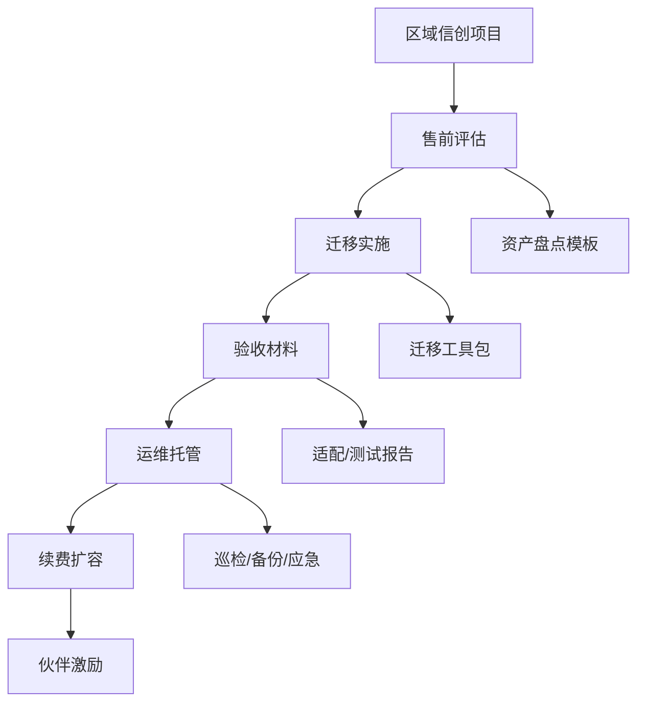

# PostgreSQL 系国产数据库攻防手册 - 专家4 - 区域渠道交付操盘手

## 专家档案

- **领域**: 政企信创渠道、区域交付、集成商生态
- **人设**: 我长期做省市政务、公安、医疗、教育、交通和央国企区域项目，见过很多数据库选型最后不是输在内核，而是输在本地服务、交付报价、集成商激励和验收材料。我的立场是，PG 系要防守下沉市场，必须把复杂能力做成“区域可复制交付包”。
- **关键盲点**: 我容易把渠道和服务看得过重，低估头部客户对内核性能、扩展生态和核心案例的真实要求。

## 1. 复述并分析问题

非 PG 系国产数据库如果要抢 PostgreSQL 信创市场，很可能会打“整包交付”和“低运维门槛”。现在 PG 系要防守，就不能只在华东、金融、运营商这些高密度市场拼头部资源，还要守住西部、地市、医疗、教育、交通、区县政务等下沉市场。

我理解的问题本质是交付可复制性：客户未必知道 PostgreSQL、openGauss、达梦、TDSQL、OceanBase 的内核差异，但一定知道项目能不能验收、出了问题谁到现场、数据库管理员不够时谁帮他管。

## 2. 第一性原理拆解

### 2.1 5 Whys 找根因

```text
问题: PG 系如何守住区域和下沉信创市场
  -> 为什么 1: 因为很多客户缺 DBA、缺迁移经验、缺数据库治理能力
    -> 为什么 2: 因为信创替换往往由平台统采、集成商实施和短周期验收驱动
      -> 为什么 3: 因为客户买的是“能过验收且后续不出事”的整包能力
        -> 为什么 4: 因为一线项目预算、人员和风险承受能力有限
          -> 为什么 5: 所以 PG 系必须把产品、工具、文档、服务和伙伴激励打成一个包
```

### 2.2 硬约束 vs 软变量

**硬约束**:
- 区域项目需要本地响应、信创适配证明、迁移报告、测试报告、验收材料和售后承诺。
- 地市、区县、医疗、教育客户 DBA 能力有限，复杂参数调优和故障定位不能全靠客户。
- 集成商在项目中拥有很强影响力，厂商不能只面向最终用户。

**软变量**:
- 区域预算和财政节奏会影响项目大小和回款周期。
- 华东、华南等市场竞争强，西部和下沉市场更看重服务确定性。
- 本地伙伴是否愿意推 PG 系，取决于利润空间、培训成本和原厂兜底力度。

### 2.3 显式前置条件

我的结论“PG 系国产数据库必须用区域交付包防守下沉市场，并把运维托管能力作为进攻点”建立在以下条件同时成立的基础上：第一，地市、区县、医疗、教育、交通等客户仍有信创替换和扩容需求。第二，这些客户的数据库专业人员供给不足，愿意为低运维门槛和原厂兜底付费。第三，PG 系厂商能把工具、模板、培训和伙伴体系标准化。只要这些条件不成立，区域打法就会退化成价格战。

## 3. 逻辑推演与图示

### 3.1 因果链 / 决策树

区域项目的核心链条是：项目入口来自政策和平台统采，成交依赖集成商和本地服务，验收依赖材料和适配测试，续费依赖稳定运行和问题响应。PG 系要把每个环节变成标准动作：售前评估模板、迁移工单、适配报告、巡检脚本、备份演练、故障升级、伙伴认证、客户培训。

### 3.2 图示



### 3.3 图的解读

这张图说明，区域防守的关键不是一次卖出 license，而是把从售前到续费的链路做短、做稳、做得伙伴能复制。

## 4. 数据与案例支撑

### 4.1 关键数据

| 数据 | 数值 | 时间 | 来源 |
|---|---:|---|---|
| 传统部署关系型数据库行业集中度 | 金融、政府、电信、制造、流通五大行业占市场份额 79.4% | 2023H2 | IDC 中国关系型数据库概览摘要 |
| 中国数据库市场本地部署占比 | 35.6% | 2024 | 中国信通院《数据库发展研究报告（2025 年）》摘要 |
| 党政关键应用国产替换率 | 约 85% | 2025 报告 | 第一新声《2025 年中国数据库市场研究报告》摘要 |
| 福建省农村信用社人大金仓许可采购 | 预算 110 万元，22 套 | 2023 | 中国政府采购网公告 |
| 北京市公安局数据库采购 | 201 套，约 1936.7199 万元 | 2025 | 北京市公安局中标公告，墨天轮整理 |

### 4.2 典型案例

- **福建省农村信用社许可采购**: 2023 年 110 万元、22 套的采购说明，部分信创数据库项目仍是批量授权和基础服务，单套价格不高，必须靠交付效率和续费赚钱。
- **北京市公安局数据库采购**: 2025 年公安项目中 GaussDB 和金仓共同出现，说明区域和行业项目往往不是单一产品路线，而是多厂商、多系统并存。
- **中国移动多省数据库运维能力案例**: 中国信通院报告摘要中出现多个移动省公司数据库运维保障体系和信创数据库运维能力案例，说明运维能力已经成为行业关注点。

## 5. 适用边界

### 5.1 结论在什么条件下成立

- 时间窗口: 2026-2028 年，下沉信创从首次替换转向扩容、升级、运维、灾备和二期建设。
- 地域范围: 华东、华南、西部、东北、中部地市和区县项目，但打法重点不同。华东拼标杆和深场景，西部与下沉市场拼交付确定性。
- 市场环境: 客户预算承压，要求项目验收、稳定运行和本地响应。
- 人群: 适用于有渠道伙伴、区域服务、培训认证和远程运维能力的 PG 系厂商。

### 5.2 不适用的情形

- 对金融核心、运营商核心和超大央企核心系统，区域交付包只能作为外围支持，不能替代内核能力和核心架构证明。
- 对完全由总部统一架构和统一集采的客户，区域伙伴影响力有限，应改走总部解决方案和框架入围路线。
- 对纯价格战项目，如果没有续费和服务空间，不建议投入过多高级资源。

## 6. 证伪与证明方法

### 6.1 证伪条件

- [ ] 2026 年区域项目招标中数据库服务、迁移和运维条款明显减少，只剩低价授权，说明交付包价值难兑现。
- [ ] 主要集成商转向非 PG 系数据库，原因是利润更高、培训更简单或原厂响应更快，说明 PG 系伙伴体系失守。
- [ ] PG 系在下沉市场频繁出现交付延期、验收失败或生产故障，说明标准化交付包不足。

### 6.2 验证信号

| 指标 | 当前值 | 目标/阈值 | 观察频率 |
|---|---|---|---|
| 区域项目服务占比 | 公开口径不足 | 报价中迁移、运维、培训、应急服务占比提升 | 月度 |
| 伙伴认证数量 | 各厂商口径不一 | 核心区域形成稳定认证伙伴和交付案例 | 季度 |
| 验收材料复用率 | 公开口径不足 | 适配报告、迁移报告、巡检报告模板标准化 | 月度 |

### 6.3 关键时间节点

- 每年一季度和三季度地方信创预算释放时，观察 PG 系是否拿到批量授权与服务包项目。
- 2026 年区域政务云、公安、交通、医疗二期项目启动时，观察是否出现从单次采购到年度运维托管的转变。
- 每次重大安全漏洞或数据库故障事件后，观察客户是否提高原厂响应和应急演练要求。

## 内部备注 (不进入综合稿)

- 这个专家和内核生态专家的分歧点: 我更强调交付标准化，内核生态专家更强调扩展兼容和版本跟进。
- 最容易误读的地方: 区域打法不是低端市场打法，而是把复杂产品转成可复制服务。
- 综合阶段可用“站在区域交付角度”引入。

## 7. 自我验证记录 (不进入综合稿, 仅供迭代使用)

### 7.1 验证轮次

- **轮次 1**:
  - 数据: 行业份额、本地部署占比、党政替换率、福建和北京采购案例均已标注来源和年份。
  - 逻辑: 从客户能力不足到区域交付包的链条成立。
  - 结构: 1-6 节、图示、边界和证伪条件齐全。
- **最终状态**: [x] 通过

### 7.2 已知未消解的疑点

- 区域渗透率缺少公开可比数据，综合稿应避免写“华东多少、西部多少”的精确判断，只写结构性差异和打法。

### 7.3 验证手段

- [x] 通读自查
- [x] 用 `markdown/1.md` 的公开采购样本和市场报告来源交叉验证关键数据
- [x] 用“集成商是否愿意复制”反向挑刺
