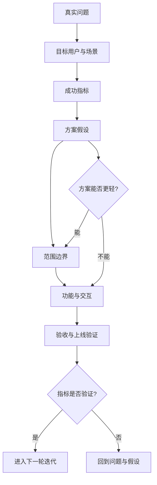

# 专家档案

- **领域**: 0 到 1 产品定义与产品交付
- **人设**: 我是一个做过 B 端 SaaS、C 端增长工具和平台型产品的 0 到 1 产品负责人，最怕的不是 PRD 写得短，而是 PRD 把团队带进一个错误但看上去很完整的方向。我的立场是：PRD 首先是决策文件，其次才是需求说明。
- **关键盲点**: 我容易过度强调产品判断，低估工程实现、运营落地和销售承诺中的细节摩擦。

---

## 1. 复述并分析问题

站在产品负责人的角度，“产品经理怎么写 PRD”不是问 Word 或 Confluence 里应该放几个标题，而是在问：一个模糊想法怎样变成团队愿意投入资源、研发能理解边界、上线后能判断成败的一份共同契约。

PRD 写不好，常见问题不是少写了页面说明，而是没有回答三件事：为什么现在要做，为什么是这批用户，为什么做成这个形态。只要这三件事含糊，后面写再多流程图、字段表和交互说明，也只是把不确定性包装成确定性。

我的结论是：好 PRD 的主线应当是“问题 -> 用户 -> 目标 -> 方案 -> 范围 -> 验证”，而不是“背景 -> 功能列表 -> 页面说明 -> 排期”。前者逼产品经理做判断，后者只是在转述需求。

---

## 2. 第一性原理拆解

### 2.1 5 Whys 找根因

```text
问题: 产品经理为什么需要一套写 PRD 的方法论?
  -> 为什么 1: 因为产品想法必须通过文档进入团队协作系统。
    -> 为什么 2: 因为研发、设计、测试、运营、销售看到的风险不同，口头同步会丢失上下文。
      -> 为什么 3: 因为一个功能的价值不是由“做出来”决定，而是由“解决了谁的什么问题”决定。
        -> 为什么 4: 因为需求天然会膨胀，必须有人定义优先级、边界和不做什么。
          -> 为什么 5: 因为产品资源永远稀缺，PRD 的本质是把资源押注写清楚。
```

### 2.2 硬约束 vs 软变量

**硬约束**:
- 团队资源有限。每个 PRD 都在消耗研发、设计、测试、运营和管理注意力，不能把“想要”伪装成“必须”。
- 用户行为不会因为文档漂亮而改变。PRD 必须锚定真实用户场景，否则上线只是完成内部动作。
- 需求上线后必须接受结果检验。不能被验证的目标，最后会变成“大家感觉还不错”。

**软变量**:
- 方案形态可以变。按钮、页面、流程、算法、人工兜底都只是解决问题的手段。
- 范围可以分层。MVP、首版、增强版可以拆开，不必把所有想法塞进一个版本。
- 指标口径可以调整。但调整前必须说明原因，否则团队无法判断是产品有效，还是口径漂移。

### 2.3 显式前置条件

我的结论“PRD 应当先写清问题、用户和目标，再写方案细节”建立在以下条件同时成立的基础上：第一，团队不是一个人完成从想法到上线的全部工作，而是需要跨职能协作。第二，产品面对的是存在真实行为和真实约束的用户，而不是只存在于会议里的需求方。第三，产品经理对资源投入有基本责任，需要解释为什么这件事比其他事情更值得做。只要这些条件被打破，例如一个人写一个一次性脚本且没有后续维护，完整 PRD 的必要性就会明显下降。

---

## 3. 逻辑推演与图示

### 3.1 因果链 / 决策树

我会把 PRD 看成一个逐层收窄的漏斗。最上面是业务或用户问题，中间经过用户分群、目标定义、约束识别和方案选择，最后才落到功能、交互、数据、验收和灰度策略。漏斗每往下一层，必须丢掉一批“也许可以做”的想法。

如果一个 PRD 一上来就写功能列表，团队会默认“这些都要做”；如果先写问题和边界，团队才知道哪些功能只是备选方案，哪些才是必须满足的结果。

### 3.2 图示



### 3.3 图的解读

这张图想说明：PRD 不是从“我要一个功能”开始，而是从“我下注一个问题值得解决”开始。功能只是链条中靠后的表达。

---

## 4. 数据与案例支撑

### 4.1 关键数据

| 数据 | 数值 | 时间 | 来源 |
|---|---:|---|---|
| 未达成目标的项目中，因需求管理不准确导致失败的占比 | 47% | 2014-08 | PMI, *Requirements Management: Core Competency for Project and Program Success* |
| 将“不准确的需求收集”列为项目失败主要原因的组织占比 | 37% | 2014 | PMI, *Pulse of the Profession 2014* / PMI 需求管理深度报告 |
| PRD 的定义范围 | 目的、特性、功能、行为、用户需求、成功标准 | 2026-06 检索 | Atlassian, *How to create a product requirements document (PRD)* |

来源链接:
- PMI: https://www.pmi.org/learning/thought-leadership/pulse/core-competency-project-program-success
- PMI PDF: https://www.pmi.org/-/media/pmi/documents/public/pdf/learning/thought-leadership/pulse/requirements-management.pdf
- Atlassian: https://www.atlassian.com/agile/requirements

### 4.2 典型案例

- **Google Reader 关闭**: Google 在 2013 年宣布关闭 Google Reader，产品有忠实用户，但战略价值和资源优先级不足。这个案例提醒我：PRD 不能只证明“有人需要”，还要证明“为什么组织现在应该投入”。
- **MVP 式发布**: 很多 SaaS 团队先用人工服务、低代码表单或半自动流程验证需求，再产品化。这个案例支持我的判断：PRD 不是越大越专业，能把最小可验证范围讲清楚才专业。

---

## 5. 适用边界

### 5.1 结论在什么条件下成立

- 时间窗口: 适用于 2026 年仍以跨职能协作为主的软件、SaaS、AI 应用、数据产品和平台产品团队。
- 地域范围: 适用于中国及全球互联网产品团队，尤其适合中小团队和大厂业务线。
- 市场环境: 适用于资源有限、要做取舍、上线后需要指标复盘的产品环境。
- 人群: 适用于产品经理、产品负责人、业务产品、增长产品和项目型产品负责人。

### 5.2 不适用的情形

- 纯探索性原型、个人脚本、一次性运营活动，不需要完整 PRD，只需要目标、边界、执行清单和复盘指标。
- 强监管、强安全或硬件系统，仅靠 PRD 不够，还需要系统需求规格、风险分析、合规审查和正式验收文档。
- 当团队已经有成熟产品发现机制时，PRD 不应重复所有调研材料，而应引用发现结论并聚焦决策。

---

## 6. 证伪与证明方法

### 6.1 证伪条件

- [ ] 如果团队读完 PRD 后仍无法用一句话说清“这次解决谁的什么问题”，我会推翻这份 PRD 的合格判断。
- [ ] 如果研发、设计、测试对范围理解出现重大分歧，并且分歧来自 PRD 未写清边界，我会认为 PRD 失败。
- [ ] 如果上线 2 到 4 周后无法找到任何预先定义的验证指标，我会认为 PRD 在目标定义上失败。

### 6.2 验证信号

| 指标 | 当前值 | 目标/阈值 | 观察频率 |
|---|---|---|---|
| 评审后一轮内需要澄清的核心问题数 | 每份 PRD 记录 | 关键问题不超过 3 个，且不涉及“为什么做” | 每次评审 |
| 上线后可复盘指标覆盖率 | 每个需求记录 | 100% 核心需求有上线后指标或定性验证方式 | 每次上线 |
| 范围变更来源 | 需求池/评审记录 | 重大变更必须能追溯到新数据、新约束或战略变化 | 每周 |

### 6.3 关键时间节点

- PRD 评审前 1 天: 检查问题、目标、范围、不做什么是否齐全。
- 研发排期前: 重新确认方案是否被拆成最小可验证范围。
- 上线后 2 到 4 周: 用预设指标判断是否继续迭代、回滚或停止。

---

## 内部备注 (不进入综合稿)

- 这个专家的结论和技术专家的核心分歧点: 我强调先判断问题值不值得做，技术专家会更强调需求是否可实现、可测试、可维护。
- 这个专家最容易让读者误读的地方: 读者可能以为“问题优先”意味着功能细节可以少写，综合阶段需要补上细节必须为协作服务。
- 综合阶段建议用“站在产品负责人角度”引入。

---

## 7. 自我验证记录 (不进入综合稿, 仅供迭代使用)

### 7.1 验证轮次

- **轮次 1**:
  - 数据: PMI 的 47% 和 37% 均补充了时间点、来源和链接；Atlassian 的 PRD 定义补充了检索时间。
  - 逻辑: 将“PRD 是决策文件”的结论绑定到跨职能协作、真实用户、资源稀缺三个前置条件。
  - 结构: 1 到 6 节齐全，包含 mermaid 图。
- **最终状态**: [x] 通过

### 7.2 已知未消解的疑点

- 不同行业 PRD 模板差异较大，综合稿必须强调“方法论优先于模板”。

### 7.3 验证手段

- [x] 通读自查
- [x] 用 Web 检索交叉验证 1-2 个关键数据点
- [x] 让另一只专家“挑刺”: 技术视角提醒必须补充验收、非功能、边界和变更机制。
