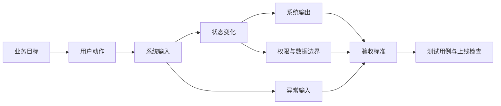

# 专家档案

- **领域**: 软件工程、平台架构与需求可交付性
- **人设**: 我是一个带过 100 人研发团队的平台技术负责人，见过太多 PRD 写得很漂亮，最后变成接口返工、测试补漏和线上事故。我的立场是：PRD 不需要替工程师设计系统，但必须让工程师知道怎样算做完、怎样算做错、怎样算不能做。
- **关键盲点**: 我容易把工程可控性看得太重，可能低估产品探索阶段的模糊性。

---

## 1. 复述并分析问题

站在技术负责人的角度，“产品经理写 PRD 的方法论”本质是在问：怎样把业务语言翻译成工程系统可以实现、可以测试、可以维护、可以追踪的需求语言。

技术团队怕的不是 PRD 简短，而是 PRD 隐含条件太多。比如“支持批量导入”这句话，如果不说明文件格式、数据规模、失败处理、权限边界、幂等策略和日志留存，研发只能猜。猜对了没人觉得厉害，猜错了就是返工。

我的结论是：PRD 的工程部分必须做到四件事：行为明确、边界明确、验收明确、变更明确。产品经理不必写技术方案，但不能把关键约束留给研发在实现时临场决定。

---

## 2. 第一性原理拆解

### 2.1 5 Whys 找根因

```text
问题: 为什么 PRD 必须关心工程可交付性?
  -> 为什么 1: 因为软件不是一句需求直接变成一个功能，中间要经过设计、编码、测试、部署和运维。
    -> 为什么 2: 因为每个环节都需要判断边界情况，而边界情况通常不在一句需求里。
      -> 为什么 3: 因为边界没有定义时，工程师会按自己的经验补齐。
        -> 为什么 4: 因为不同工程师的默认假设不同，补齐结果就会不一致。
          -> 为什么 5: 因为不一致会在联调、验收或线上暴露，代价远高于 PRD 阶段澄清。
```

### 2.2 硬约束 vs 软变量

**硬约束**:
- 计算系统必须处理输入、状态、输出和异常。PRD 只写“正常路径”是不完整的。
- 研发排期依赖范围稳定度。频繁改边界会直接破坏设计、测试和发布计划。
- 质量需要证据。没有验收条件，测试无法证明功能满足需求。

**软变量**:
- 技术实现路径可以变。同步、异步、人工兜底、配置化、脚本化都可能是方案。
- 非功能指标可以分阶段。性能、稳定性、可观测性、兼容性可以按首版范围设置合理阈值。
- 文档粒度可以随风险变化。低风险需求可以轻文档，高风险需求必须写细。

### 2.3 显式前置条件

我的结论“PRD 必须写清行为、边界、验收和变更”建立在以下条件同时成立的基础上：第一，这个需求会进入多人协作的软件交付流程。第二，这个需求上线后会影响真实用户、真实数据或真实业务流程。第三，团队希望降低返工、扯皮和线上风险。只要需求只是内部临时演示，且不会进入生产系统，这套工程化写法就可以大幅简化。

---

## 3. 逻辑推演与图示

### 3.1 因果链 / 决策树

我看 PRD 时，会先找“输入是什么、状态如何变化、输出是什么、失败怎么办、谁能操作、怎么验收”。这些内容决定研发能否拆任务，测试能否写用例，运维能否监控风险。

如果 PRD 只有用户故事，没有边界条件，研发会在设计阶段补需求；如果 PRD 只有页面说明，没有数据和异常，测试会在验收阶段补需求。补得越晚，成本越高。

### 3.2 图示



### 3.3 图的解读

这张图想让读者看到：工程视角里的 PRD 不是页面清单，而是“系统怎样响应用户动作”的完整链条。

---

## 4. 数据与案例支撑

### 4.1 关键数据

| 数据 | 数值 | 时间 | 来源 |
|---|---:|---|---|
| 未达成目标的项目中，因需求管理不准确导致失败的占比 | 47% | 2014-08 | PMI, *Requirements Management: Core Competency for Project and Program Success* |
| 高质量软件需求的常见特征 | 正确、一致、完整、准确、无歧义、可验证 | 2026-06 检索 | NASA SWE-050, *Software Requirements* |
| 需求工程标准的适用范围 | 系统与软件生命周期中的需求工程过程与信息项 | 2018-11，2024 确认现行 | ISO/IEC/IEEE 29148:2018 |

来源链接:
- PMI: https://www.pmi.org/learning/thought-leadership/pulse/core-competency-project-program-success
- NASA SWE-050: https://swehb.nasa.gov/pages/viewpage.action?pageId=146540037
- ISO: https://www.iso.org/standard/72089.html

### 4.2 典型案例

- **批量导入需求**: “支持 Excel 导入客户名单”如果不写最大行数、重复数据处理、失败提示、部分成功策略和权限控制，首版很容易上线后变成客服和研发共同救火。
- **支付退款需求**: “支持退款”如果不写全额/部分退款、退款时限、资金状态、失败重试、通知链路和审计日志，产品看似简单，工程风险却很高。

---

## 5. 适用边界

### 5.1 结论在什么条件下成立

- 时间窗口: 适用于 2026 年仍以软件系统交付为核心的互联网、企业软件、数据平台和 AI 应用团队。
- 地域范围: 不限地域，凡是涉及多人软件工程协作的团队都适用。
- 市场环境: 适用于需要持续迭代、线上稳定性和质量责任的产品环境。
- 人群: 适用于产品经理、技术负责人、研发、测试、项目经理和交付经理。

### 5.2 不适用的情形

- 早期探索访谈、纸面原型和纯概念验证，不应被工程化细节拖慢。
- 高度创新的算法研究任务，PRD 只能定义目标、数据、评估方式，不能提前锁死实现路径。
- 已有成熟配置平台承载的简单运营配置，不需要完整工程 PRD，但仍要有操作边界和回滚方案。

---

## 6. 证伪与证明方法

### 6.1 证伪条件

- [ ] 如果研发无法根据 PRD 拆出主要任务和依赖关系，我会认为 PRD 在工程可交付性上失败。
- [ ] 如果测试无法根据 PRD 写出正常路径、异常路径和权限路径用例，我会认为 PRD 的验收定义不足。
- [ ] 如果上线后出现的关键争议来自“PRD 没写，所以大家理解不同”，我会推翻该 PRD 合格的判断。

### 6.2 验证信号

| 指标 | 当前值 | 目标/阈值 | 观察频率 |
|---|---|---|---|
| 研发评审阻塞问题数 | 每次评审记录 | 不超过 3 个核心阻塞，且 24 小时内补齐 | 每次评审 |
| 测试用例可生成度 | 测试评审记录 | 核心流程、异常流程、权限流程都有用例 | 每次提测前 |
| 需求变更追溯率 | 变更记录 | 100% 重大变更说明原因、影响范围和确认人 | 每次变更 |

### 6.3 关键时间节点

- 技术评审前: 检查输入、状态、输出、异常、权限、数据、验收是否齐全。
- 提测前: 让测试反向从 PRD 生成用例，发现无法生成的地方立即补。
- 灰度前: 检查监控、日志、回滚、客服和运营预案。

---

## 内部备注 (不进入综合稿)

- 这个专家和产品负责人的核心分歧点: 产品负责人怕文档过度工程化压死探索，技术负责人怕模糊需求把风险后移。
- 这个专家最容易让读者误读的地方: 读者可能以为产品经理要写技术设计，综合稿必须说明产品经理写的是约束和验收，不是代码方案。
- 综合阶段建议用“站在技术负责人角度”引入。

---

## 7. 自我验证记录 (不进入综合稿, 仅供迭代使用)

### 7.1 验证轮次

- **轮次 1**:
  - 数据: PMI、NASA、ISO 三个来源补充了时间点和链接；NASA 特征来自 SWE-050 页面。
  - 逻辑: 将工程化写法限定在多人软件交付和生产影响场景，避免把所有 PRD 都写成重文档。
  - 结构: 1 到 6 节齐全，包含 mermaid 图。
- **最终状态**: [x] 通过

### 7.2 已知未消解的疑点

- 需求质量标准来自工程与系统领域，直接迁移到互联网 PRD 时需要降噪，综合稿要避免让小白以为必须按 NASA 标准写每个需求。

### 7.3 验证手段

- [x] 通读自查
- [x] 用 Web 检索交叉验证 1-2 个关键数据点
- [x] 让另一只专家“挑刺”: 产品视角提醒不能用工程完整性替代用户价值判断。
