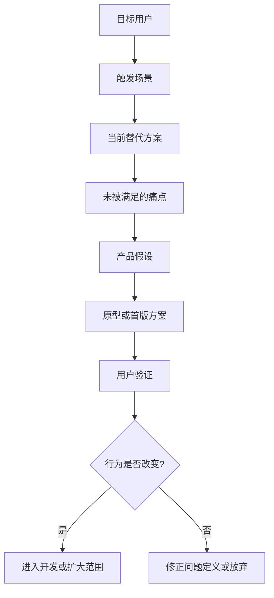

# 专家档案

- **领域**: 用户研究、体验设计与可用性验证
- **人设**: 我是一个在消费产品、工具软件和 B 端系统里做过十多年用户研究的负责人，最常见的失败不是产品经理不会写功能，而是把老板、销售、运营和自己的想象误当成用户。我的立场是：PRD 里最值钱的部分，是它怎样证明这个需求来自真实用户问题。
- **关键盲点**: 我容易要求更多用户证据，可能低估业务窗口期和团队速度压力。

---

## 1. 复述并分析问题

站在用户研究负责人角度，“产品经理写 PRD 的方法论”不是问怎么把需求写完整，而是问怎么避免写出一份逻辑自洽但用户不买账的文档。

很多 PRD 的问题是，它写了“用户需要一键生成报表”，但没有写用户现在为什么要报表、谁在什么场景下用、现有流程卡在哪里、用户是否真的愿意改变习惯。这样的 PRD 会把“解决方案”伪装成“用户需求”。

我的结论是：PRD 必须把用户证据写进主干，而不是放在附件里。至少要说清楚目标用户、触发场景、现有替代方案、痛点证据和可验证假设。没有这些内容，功能越完整，越可能偏离真实问题。

---

## 2. 第一性原理拆解

### 2.1 5 Whys 找根因

```text
问题: 为什么 PRD 要写用户证据?
  -> 为什么 1: 因为产品最终要改变用户行为，而不是让内部评审通过。
    -> 为什么 2: 因为用户行为由场景、动机、成本和习惯共同决定。
      -> 为什么 3: 因为产品经理只看内部需求时，很容易忽略用户改变习惯的成本。
        -> 为什么 4: 因为用户不采用时，团队才会发现原来的问题定义错了。
          -> 为什么 5: 因为问题定义越晚被纠正，沉没成本越高。
```

### 2.2 硬约束 vs 软变量

**硬约束**:
- 用户只为自己的问题行动，不为团队的功能完整性行动。
- 用户行为有切换成本。新功能必须比现有替代方案明显更好，才有机会被采用。
- 定性研究不能证明比例。访谈和可用性测试能发现问题，但不能直接代表全量用户占比。

**软变量**:
- 证据形式可以变。访谈、工单、客服录音、销售记录、埋点、可用性测试、竞品反馈都可以成为证据。
- 样本数量随问题变化。早期探索可以少量深访，规模判断需要数据分析或更大样本。
- 体验方案可以迭代。PRD 不必一次写出完美体验，但必须写清第一轮要验证什么。

### 2.3 显式前置条件

我的结论“PRD 必须写入用户证据和待验证假设”建立在以下条件同时成立的基础上：第一，产品的成败取决于真实用户是否理解、采用或持续使用。第二，团队尚未通过强证据证明这个需求一定成立。第三，产品经理希望用 PRD 降低做错方向的概率，而不只是完成内部立项。只要产品是客户明确付费定制且验收标准完全由合同规定，用户研究部分可以收缩，但仍不能忽略实际使用者。

---

## 3. 逻辑推演与图示

### 3.1 因果链 / 决策树

我会要求 PRD 先把“用户问题”拆成四层：谁遇到问题，在什么场景遇到，现在怎么解决，为什么现有方案不够好。然后再写产品假设：如果我们提供某个新能力，用户是否会用，用了以后哪个指标或行为会改变。

如果这条链条断了，PRD 就应该回到调研，而不是进入排期。因为此时团队不是在开发需求，而是在替一个未经验证的想法付费。

### 3.2 图示



### 3.3 图的解读

这张图想说明：用户研究不是 PRD 前面的装饰材料，而是决定需求是否值得进入开发的闸门。

---

## 4. 数据与案例支撑

### 4.1 关键数据

| 数据 | 数值 | 时间 | 来源 |
|---|---:|---|---|
| 5 名用户可发现的可用性问题比例 | 约 85% | 2000-03 原文，2026-06 检索 | Nielsen Norman Group, *Why You Only Need to Test with 5 Users* |
| 定性可用性测试的使用边界 | 适合发现问题，不适合统计全量比例 | 2026-06 检索 | Nielsen Norman Group 相关可用性测试文章与行业复述 |
| Agile PRD 的重点 | 共同理解、客户需求、灵活性，避免过度详细规格 | 2026-06 检索 | Atlassian, *How to create a product requirements document (PRD)* |

来源链接:
- Nielsen Norman Group: https://www.nngroup.com/articles/why-you-only-need-to-test-with-5-users/
- Atlassian: https://www.atlassian.com/agile/requirements

### 4.2 典型案例

- **“用户要导出 Excel”**: 很多 B 端用户说要导出，其实是因为系统内筛选、分析和协作不好用。PRD 如果只写导出功能，就会强化旧流程；如果写清场景，可能发现真正需求是报表共享、权限或自动提醒。
- **“一键生成”类 AI 功能**: 用户说想一键生成，真实使用时往往需要可控、可改、可追溯。PRD 如果不写用户对质量、编辑和责任归属的担心，首版会看起来炫，但留存差。

---

## 5. 适用边界

### 5.1 结论在什么条件下成立

- 时间窗口: 适用于 2026 年的软件、AI 应用、SaaS、工具、内容和交易类产品。
- 地域范围: 不限地域，但用户文化和使用场景差异较大的产品需要本地化研究。
- 市场环境: 适用于产品成败依赖采用率、转化率、留存率、满意度或效率提升的场景。
- 人群: 适用于产品经理、用户研究员、设计师、增长负责人和业务负责人。

### 5.2 不适用的情形

- 法规强制、内部合规或客户合同明确规定的需求，用户研究不能否定必须做，但可以帮助降低使用阻力。
- 小样本可用性测试不能用来证明“80% 用户都会喜欢”，只能用来发现问题和修正方案。
- 当问题是战略卡位或平台基础设施时，用户证据可能不充分，PRD 应补充战略假设和长期验证方式。

---

## 6. 证伪与证明方法

### 6.1 证伪条件

- [ ] 如果 PRD 无法指出真实用户是谁，只写“用户”或“客户”，我会认为问题定义不合格。
- [ ] 如果用户证据只来自单个强势内部角色，没有外部行为、工单、访谈或数据支撑，我会降低需求可信度。
- [ ] 如果原型测试中 5 名目标用户里有 3 名以上无法理解核心路径，我会推翻“方案可进入开发”的判断。

### 6.2 验证信号

| 指标 | 当前值 | 目标/阈值 | 观察频率 |
|---|---|---|---|
| 目标用户定义完整度 | PRD 自查 | 至少包含角色、场景、动机、现有替代方案 | 每份 PRD |
| 关键假设验证数 | 调研记录 | 首版前至少验证 1 个最高风险假设 | 立项前 |
| 原型核心路径理解率 | 可用性测试 | 5 名目标用户中至少 4 名能独立完成核心任务 | 原型评审前 |

### 6.3 关键时间节点

- 写 PRD 前: 先列出用户证据，不足时补访谈或补数据。
- 原型后: 用目标用户走一遍关键路径，不要只让内部同事评审。
- 上线后 2 到 6 周: 观察采用率、完成率、放弃点、客服反馈和用户复访。

---

## 内部备注 (不进入综合稿)

- 这个专家和商业化专家的核心分歧点: 用户研究视角强调真实问题，商业化视角会追问这件事能否转化为收入、留存或战略价值。
- 这个专家最容易让读者误读的地方: 读者可能以为每份 PRD 都必须正式招募用户访谈，综合稿应强调证据可以轻量，但不能没有。
- 综合阶段建议用“站在用户研究角度”引入。

---

## 7. 自我验证记录 (不进入综合稿, 仅供迭代使用)

### 7.1 验证轮次

- **轮次 1**:
  - 数据: Nielsen Norman Group 的 5 用户规则补充了时间、比例和边界；Atlassian 的 Agile PRD 重点补充来源。
  - 逻辑: 区分“发现问题”的定性研究和“证明比例”的定量研究，避免误用数据。
  - 结构: 1 到 6 节齐全，包含 mermaid 图。
- **最终状态**: [x] 通过

### 7.2 已知未消解的疑点

- 5 用户规则常被误读，综合稿必须明确它是低成本发现可用性问题的方法，不是市场规模证明。

### 7.3 验证手段

- [x] 通读自查
- [x] 用 Web 检索交叉验证 1-2 个关键数据点
- [x] 让另一只专家“挑刺”: 商业化视角提醒不能把用户喜欢直接等同于业务值得做。
