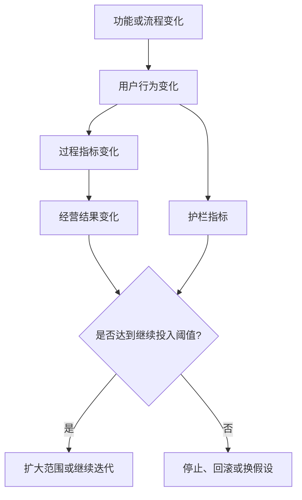

# 专家档案

- **领域**: 商业化、增长、定价与经营指标
- **人设**: 我是一个做过订阅 SaaS、交易平台和企业服务商业化的负责人，见过太多“用户说想要”的需求上线后没有收入、没有留存、没有战略价值。我的立场是：PRD 必须写清业务结果，否则就是一份功能采购单。
- **关键盲点**: 我容易过度追求短期指标，可能低估基础体验、品牌信任和长期平台能力。

---

## 1. 复述并分析问题

站在商业化负责人角度，“产品经理写 PRD 的方法论”本质是在问：如何把一个功能需求变成一笔说得清楚的业务投资。

产品团队经常会写“提升用户体验”“提高效率”“增强竞争力”，这些话都对，但不够用。经营侧真正关心的是：这个需求会影响哪个业务指标，影响路径是什么，多久能看到变化，如果没有变化要不要继续投。

我的结论是：PRD 必须写清“业务目标、指标口径、收益路径、成本约束和停止条件”。没有停止条件的 PRD 最危险，因为它会让团队在一个看不到回报的方向上继续追加投入。

---

## 2. 第一性原理拆解

### 2.1 5 Whys 找根因

```text
问题: 为什么 PRD 要写商业目标?
  -> 为什么 1: 因为产品开发消耗公司资源。
    -> 为什么 2: 因为资源投入必须服务收入、成本、风险、留存、增长或战略卡位。
      -> 为什么 3: 因为功能本身不等于业务结果，用户使用也不等于商业成功。
        -> 为什么 4: 因为没有指标路径时，团队无法区分有效迭代和惯性投入。
          -> 为什么 5: 因为公司最终不是按功能数量生存，而是按价值创造能力生存。
```

### 2.2 硬约束 vs 软变量

**硬约束**:
- 开发资源有机会成本。做这个需求就意味着暂时不做另一个需求。
- 业务指标需要口径。没有清晰口径，任何结果都可以被解释成成功。
- 收益有滞后。PRD 必须说明短期看什么、长期看什么。

**软变量**:
- 业务价值不只等于收入。它也可能是降低流失、提升转化、减少人工成本、降低合规风险或增强平台能力。
- 指标可以分层。北极星指标、过程指标、护栏指标可以一起使用。
- 首版目标可以保守。MVP 可以先验证方向，不必承诺完整商业回报。

### 2.3 显式前置条件

我的结论“PRD 必须写清业务结果和停止条件”建立在以下条件同时成立的基础上：第一，团队资源存在明确机会成本。第二，需求上线后的价值可以通过业务指标、成本变化、风险降低或战略能力来观察。第三，组织希望用事实决定继续投入还是停止投入。只要这个需求是合规强制或安全底线，商业回报不应成为是否做的前置条件，但仍要写清成本、风险和验收。

---

## 3. 逻辑推演与图示

### 3.1 因果链 / 决策树

我会把 PRD 的商业逻辑写成一条指标链：功能改变用户行为，用户行为改变过程指标，过程指标再影响经营结果。比如“自动续费提醒优化”不是为了多一个提醒页面，而是为了减少支付失败、提升续费成功率，并且不能显著增加投诉率。

如果 PRD 只写结果指标，不写中间行为，就会变成许愿；如果只写中间行为，不写经营结果，就会变成局部优化。

### 3.2 图示



### 3.3 图的解读

这张图想说明：商业化视角不是把 PRD 变成财务表，而是要求产品经理讲清“功能怎样一步步变成结果”。

---

## 4. 数据与案例支撑

### 4.1 关键数据

| 数据 | 数值 | 时间 | 来源 |
|---|---:|---|---|
| 未达成目标的项目中，因需求管理不准确导致失败的占比 | 47% | 2014-08 | PMI, *Requirements Management: Core Competency for Project and Program Success* |
| OKR 中 Key Results 的核心要求 | 可衡量，用于判断目标是否达成 | 2026-06 检索 | Google re:Work, *Set goals with OKRs*；公开 OKR 方法资料 |
| PRD 应包含成功标准 | 用户需求和成功标准 | 2026-06 检索 | Atlassian, *How to create a product requirements document (PRD)* |

来源链接:
- PMI: https://www.pmi.org/learning/thought-leadership/pulse/core-competency-project-program-success
- Google re:Work: https://rework.withgoogle.com/guides/set-goals-with-okrs/steps/introduction/
- Atlassian: https://www.atlassian.com/agile/requirements

### 4.2 典型案例

- **免费功能转付费**: 如果 PRD 只写“增加会员专属能力”，而不写转化路径、价格锚点、免费用户受损风险和投诉护栏，就容易让短期收入和长期口碑冲突。
- **客服工单自动化**: 这类需求的价值不一定是收入，而可能是降低人工处理时长、减少重复咨询和提升满意度。PRD 必须写成本节省口径，否则上线后很难证明价值。

---

## 5. 适用边界

### 5.1 结论在什么条件下成立

- 时间窗口: 适用于 2026 年以经营结果、增长效率或成本效率为导向的产品团队。
- 地域范围: 不限地域，但不同市场的支付习惯、定价敏感度和监管约束会影响商业指标。
- 市场环境: 适用于资源紧张、增长放缓、需要精细化经营的环境。
- 人群: 适用于产品经理、业务负责人、增长负责人、商业化负责人和创业团队。

### 5.2 不适用的情形

- 安全、隐私、合规、灾备等底线需求不能用短期 ROI 决定做不做。
- 品牌、信任和基础体验的收益可能滞后，不能只用 2 周转化率判断价值。
- 平台基础能力可能先服务未来多个场景，PRD 应写能力复用假设，而不是硬凑单点收入。

---

## 6. 证伪与证明方法

### 6.1 证伪条件

- [ ] 如果 PRD 只能说“提升体验”，却说不清影响哪个行为或指标，我会认为商业目标不合格。
- [ ] 如果上线后 4 到 8 周内核心过程指标没有变化，且没有合理滞后解释，我会要求停止追加投入。
- [ ] 如果收入指标提升但护栏指标恶化，例如投诉率、退款率或流失率显著上升，我会推翻“成功”的判断。

### 6.2 验证信号

| 指标 | 当前值 | 目标/阈值 | 观察频率 |
|---|---|---|---|
| 指标链完整度 | PRD 自查 | 功能、行为、过程指标、经营结果、护栏指标全部存在 | 每份 PRD |
| 上线后指标复盘 | 看板/实验报告 | 4 到 8 周内至少完成一次复盘 | 每次上线 |
| 停止条件执行率 | 项目复盘 | 未达阈值的需求必须有停止、回滚或换假设结论 | 每月 |

### 6.3 关键时间节点

- 立项前: 写清业务目标和不做的机会成本。
- 上线前: 确认指标埋点、口径和护栏指标。
- 上线后 4 到 8 周: 复盘是否继续投、缩小投、停止投或换方向。

---

## 内部备注 (不进入综合稿)

- 这个专家和用户研究专家的核心分歧点: 用户研究强调真实问题，商业化强调真实问题能否形成经营结果。
- 这个专家最容易让读者误读的地方: 读者可能把所有 PRD 都写成短期 ROI，综合稿必须强调底线需求和长期能力的例外。
- 综合阶段建议用“站在经营角度”引入。

---

## 7. 自我验证记录 (不进入综合稿, 仅供迭代使用)

### 7.1 验证轮次

- **轮次 1**:
  - 数据: PMI、Google re:Work、Atlassian 均补充时间点和链接；OKR 只提取“可衡量结果”的稳定原则。
  - 逻辑: 将商业结果限定为收入、成本、风险、留存、增长或战略能力，避免只讲收入。
  - 结构: 1 到 6 节齐全，包含 mermaid 图。
- **最终状态**: [x] 通过

### 7.2 已知未消解的疑点

- Google re:Work 页面在 2026 年检索时可用，但不同组织 OKR 实践差异大，综合稿只引用“结果可衡量”这一通用原则。

### 7.3 验证手段

- [x] 通读自查
- [x] 用 Web 检索交叉验证 1-2 个关键数据点
- [x] 让另一只专家“挑刺”: 用户研究视角提醒不能把短期指标替代真实用户价值。
