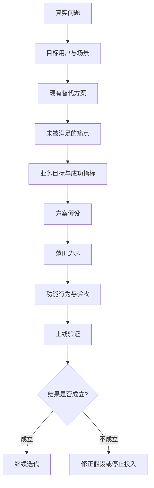

# 产品经理写 PRD 的方法论

很多产品经理写 PRD 的第一个动作，是打开模板。

这一步通常就错了。

模板当然有用，但模板解决的是“有没有漏项”，不是“这件事该不该做”。真正好的 PRD，不是把背景、目标、功能、流程、页面、字段、埋点一栏栏填满，而是让团队在动手之前先达成一个清楚判断：我们要为谁，在什么场景下，解决什么问题，为什么现在值得投入，做到什么程度算成功，什么情况应该停下来。

我更愿意把 PRD 看成一张下注单。产品经理不是在写作文，而是在替团队下注。下注错了，研发写得再快，设计画得再美，测试测得再细，最后也只是把错误更有效率地送到用户面前。

站在产品负责人的角度，PRD 的第一句话不应该是“本需求要实现某某功能”，而应该先把问题讲清楚。比如“支持批量导入客户”听上去像需求，但它其实只是一个方案。真正的问题可能是销售每天要录入 200 条线索，手工录入耗时 2 小时；也可能是客户成功团队要迁移老系统数据，不能接受一条条新建；还可能是老板看到竞品有导入按钮，于是希望我们也有。三种情况会写出完全不同的 PRD。

所以我写 PRD 时，第一层只问六件事：谁遇到了问题，在哪个场景遇到，现在怎么解决，现有方案哪里不够好，这个问题为什么现在要解决，如果不解决会损失什么。

这六件事答不出来，后面不要急着写功能。

这张图就是我心里的 PRD 骨架。它不是从功能开始，而是从问题开始；不是以“写完文档”为结束，而是以上线后的验证为结束。

站在用户研究角度，PRD 最容易犯的错，是把“有人提了需求”当成“用户真的需要”。销售说客户想要报表，老板说用户需要 AI 总结，运营说大家都在问导出功能，这些都只能算线索，不能直接算需求。产品经理要往下追一层：用户为什么要报表？他拿报表去做什么决策？现在不用我们的功能时，他怎么完成这件事？他愿意为了新方案改变哪些习惯，又不愿意改变哪些习惯？

一个简单判断是：如果 PRD 里没有“现有替代方案”，这份 PRD 大概率还没想透。用户现在一定在用某种方式解决问题，哪怕那个方式很笨，比如截图、Excel、人工群消息、找客服、线下表格。新产品不是和空气竞争，而是和这些旧办法竞争。你不写旧办法，就不知道新方案到底要比它好多少。

这里有个很实用的低成本办法：在进入研发前，让 5 个目标用户走一遍原型或关键流程。Nielsen Norman Group 那篇经典文章说，5 名用户通常能发现约 85% 的可用性问题。这个数字不能被误读成“5 个人能代表所有用户”，它的意思更朴素：早期别躲在会议室里猜，找几个真实用户，很快就能暴露大问题。

站在技术负责人角度，PRD 的第二个坑是只写正常路径。比如“用户上传 Excel 后系统生成客户名单”，这只写了最顺的一种情况。工程真正要处理的是：文件最大多大，支持哪些格式，重复数据怎么办，手机号格式错怎么办，部分成功还是全部失败，谁有权限导入，导入后能不能撤销，失败日志给谁看，接口超时怎么提示。

产品经理不需要替研发写技术方案，但必须写清行为和边界。你不用决定系统是同步处理还是异步队列，但你要说明用户提交后预期看到什么；你不用决定数据库怎么建表，但你要说明重复客户按什么规则判断；你不用写测试代码，但你要让测试能从 PRD 里推导出验收用例。

我会把功能说明写成四层。

第一层是主路径，也就是用户最正常、最常见的操作流程。第二层是异常路径，包括失败、空数据、重复、权限不足、网络中断、超时、撤销。第三层是边界条件，包括数量、格式、时间、角色、平台、兼容性。第四层是验收标准，也就是怎样算做完，怎样算不能上线。

NASA 的软件工程手册里讲高质量需求时，会强调正确、一致、完整、无歧义、可验证这些特征。我们写互联网产品 PRD 不需要把每个需求都写成航天级规格，但这个精神值得借鉴：需求不能只让人“感觉懂了”，还要让人能验证。

站在经营角度，PRD 还有第三个坑：写了很多功能价值，却没有业务结果。比如“提升用户体验”“增强竞争力”“提高效率”，这些话不是错，而是太松。真正要写的是：这个需求会改变哪个用户行为，行为改变后影响哪个过程指标，过程指标再怎样影响收入、留存、转化、成本、风险或战略能力。

“提升体验”要继续往下写，可能是把新用户首次创建项目的完成率从 40% 提到 55%；“提高效率”要继续往下写，可能是把客服单均处理时长从 8 分钟降到 5 分钟；“增强竞争力”要继续往下写，可能是补齐企业客户采购清单里的 SSO 能力，从而进入 3 个正在推进的大客户合同。

PRD 里最好有三类指标。第一类是结果指标，比如转化率、续费率、收入、成本、流失率。第二类是过程指标，比如点击率、完成率、导入成功率、生成后编辑率。第三类是护栏指标，比如投诉率、退款率、页面耗时、错误率、客服压力。只盯结果指标容易太慢，只盯过程指标容易自嗨，没有护栏指标则容易用伤害长期价值的方式换短期增长。

PMI 在 2014 年的需求管理研究里提到，未达成目标的项目中，接近一半和不准确的需求管理有关。这个数字对产品经理的提醒很直接：PRD 不是流程负担，它是在项目最便宜的时候，把最贵的误解提前暴露出来。

如果让我给一个产品经理一套可执行写法，我会让他按这个顺序写。

先写一句话结论：我们要为哪类用户，在什么场景下，解决什么问题，并用什么指标判断成败。写不成一句话，就说明需求还没收敛。

再写问题背景，但背景不要写行业作文，只写和决策有关的事实。用户是谁，现有流程是什么，痛点证据来自哪里，是访谈、工单、数据、销售记录、竞品变化，还是客户合同。每个证据都要能追溯，不要写“很多用户反馈”这种没法负责的话。

然后写目标和不目标。目标说清楚这次要改变什么，不目标说清楚这次不解决什么。很多 PRD 失控，不是因为目标太少，而是因为没有“不做什么”。不做什么写出来，才有范围边界。

接着写方案假设。这里要承认自己是在下注，而不是宣布真理。比如“我们假设用户导入失败的主要原因是字段匹配成本高，因此首版提供字段自动识别和错误预览”。这句话比“实现智能导入功能”强得多，因为它留下了验证入口。如果上线后发现失败主要来自数据源脏，而不是字段匹配，那就应该改假设。

再往下才写功能说明。功能说明不要只写页面，要写用户动作、系统响应、数据状态、异常处理、权限规则、通知规则、埋点事件和验收标准。简单需求可以轻一点，高风险需求必须细一点。判断粒度的标准不是职位高低，而是风险大小。

最后写上线验证。什么时候灰度，先给谁用，看哪些数据，多久复盘，什么情况继续，什么情况回滚，什么情况停止投入。一个没有复盘方式的 PRD，其实还没写完。

我自己的 PRD 检查清单很短，但很管用：

1. 我能不能用一句话说清这次需求的用户、场景、问题和目标？
2. PRD 里有没有真实证据，而不是只有内部判断？
3. 现有替代方案写清楚了吗？新方案凭什么赢过它？
4. 成功指标、过程指标和护栏指标有没有定义口径？
5. 范围边界和“不做什么”有没有写出来？
6. 正常路径、异常路径、权限边界、数据边界有没有覆盖？
7. 测试能不能根据 PRD 写出验收用例？
8. 上线后 2 到 8 周，我看什么信号决定继续、调整或停止？

这套方法听起来比模板麻烦，但真正执行时会更省时间。因为它把争论前移了。该不该做，在立项时争；边界是什么，在评审时争；怎么验收，在开发前争；上线后看什么，在发布前争。最怕的是所有人评审时都点头，开发时都默认，验收时都惊讶，上线后都复盘不清。

接下来我会盯这几个信号，判断一份 PRD 到底有没有写好：

1. **评审会能不能少开第二遍**。如果第二遍还在争“为什么做”和“给谁做”，PRD 的问题定义失败。
2. **研发能不能拆任务**。如果研发只能说“先做着看”，说明行为、边界或依赖没写清。
3. **测试能不能写用例**。如果测试用例大量依赖口头补充，说明验收标准不合格。
4. **上线后能不能复盘**。如果发布两周后只能说“用户反馈还行”，说明指标定义失败。
5. **团队敢不敢停止**。如果指标不成立还继续加功能，说明 PRD 没有写停止条件。

我对 PRD 最后只看一句话：它有没有让团队更早、更便宜地发现误解。

能做到这一点，哪怕文档短一点，也是好 PRD。做不到这一点，哪怕写了 50 页，也只是把风险排版得更整齐。

---

## 参考资料

- PMI, *Requirements Management: Core Competency for Project and Program Success*: https://www.pmi.org/learning/thought-leadership/pulse/core-competency-project-program-success
- PMI, *Requirements Management* PDF: https://www.pmi.org/-/media/pmi/documents/public/pdf/learning/thought-leadership/pulse/requirements-management.pdf
- Atlassian, *How to create a product requirements document (PRD)*: https://www.atlassian.com/agile/requirements
- NASA SWE-050, *Software Requirements*: https://swehb.nasa.gov/pages/viewpage.action?pageId=146540037
- ISO/IEC/IEEE 29148:2018: https://www.iso.org/standard/72089.html
- Nielsen Norman Group, *Why You Only Need to Test with 5 Users*: https://www.nngroup.com/articles/why-you-only-need-to-test-with-5-users/
- Google re:Work, *Set goals with OKRs*: https://rework.withgoogle.com/guides/set-goals-with-okrs/steps/introduction/
