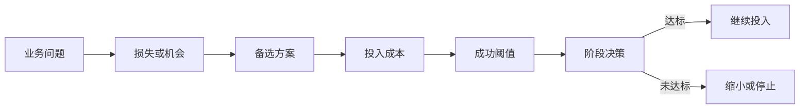

# 专家档案

- **领域**: 产品战略、预算评审、商业分析
- **人设**: 我做过 8 年 B2B SaaS 增长和产品组合管理，既写过被 CFO 当场打回的 BRD，也写过一次评审就拿到研发、法务、运营资源的 BRD。我的立场很明确：BRD 先是资源申请书，其次才是需求说明书。
- **关键盲点**: 我容易把所有问题都财务化，可能低估了用户体验、品牌信任和长期能力建设这类不容易短期量化的价值。

---

## 1. 复述并分析问题

产品经理问“怎么写 BRD”，表面是在问文档结构，实质是在问：我怎样把一个想法变成公司愿意下注的业务决策。BRD 的读者不是只想知道“要做什么功能”的研发同事，而是要判断“这件事值不值得占用预算、排期、组织注意力”的业务负责人。

站在预算评审角度，我关心的第一件事不是功能列表，而是机会成本。公司把 6 个研发、2 个设计、1 个运营给你做这个项目，就意味着这些人不能去做另一个项目。所以 BRD 必须回答一个残酷问题：如果不做这件事，公司会损失什么；如果做了，公司能得到什么；如果只做一半，最小可验证收益在哪里。

---

## 2. 第一性原理拆解

### 2.1 5 Whys 找根因

```
问题: 产品经理应该怎么写 BRD?
  → 为什么要写 BRD: 因为团队需要在投入资源前形成业务共识。
    → 为什么需要业务共识: 因为产品想法、销售诉求、客户承诺、技术能力之间天然冲突。
      → 为什么这些冲突会变成风险: 因为每个团队消耗的是同一批有限资源。
        → 为什么有限资源必须提前判断价值: 因为做错功能不仅浪费开发成本，还会增加维护、培训、客服和机会成本。
          → 为什么 BRD 能降低这种浪费: 因为它把“想做什么”翻译成“为什么值得做、做到什么程度算赢、什么情况应该停”。
```

### 2.2 硬约束 vs 软变量

**硬约束**:
- 组织资源有限，任何项目都有机会成本；不写清收益边界，评审会自然倾向于否决或拖延。
- 利益相关方的价值定义不同；销售看签单，运营看效率，财务看回报，研发看复杂度。
- 功能上线不等于价值实现；没人使用、没人付费、没人减少成本的功能，仍然是负债。

**软变量**:
- 当季 KPI、竞品新闻、老板偏好、销售承诺都会变化，不能作为 BRD 的唯一依据。
- 技术方案和交互形态可以变化，只要业务目标、约束和验收口径稳定。
- 预算松紧和排期优先级会变化，所以 BRD 要留下分阶段交付和停止条件。

### 2.3 显式前置条件

我的结论“BRD 必须先写业务结果，再写功能范围”建立在以下条件同时成立的基础上：第一，这个项目需要跨团队资源，不是产品经理一个人能独立完成的小改动。第二，项目的收益或风险足够大，需要在立项前让业务、产品、研发、运营对判断标准达成一致。第三，组织愿意用阶段性数据来校正项目，而不是把立项当成一次不可回头的承诺。只要其中任何一个条件被打破，例如只是一天内能完成的 UI 文案修正，BRD 就应该降级成轻量需求说明，而不是写成厚文档。

---

## 3. 逻辑推演与图示

### 3.1 因果链 / 决策树

一份能通过预算评审的 BRD，逻辑顺序应该是“业务问题 → 机会规模 → 备选方案 → 投入成本 → 成功阈值 → 停止条件”。如果跳过机会规模，BRD 会变成功能愿望清单；如果跳过停止条件，BRD 会变成无限追加投入的黑洞。

### 3.2 图示



### 3.3 图的解读

这张图想说明：BRD 不是从“我要做某个功能”开始，而是从“公司为什么要为这个问题付钱”开始，并且必须提前写清楚什么时候继续、什么时候停止。

---

## 4. 数据与案例支撑

### 4.1 关键数据

| 数据 | 数值 | 时间 | 来源 |
|---|---:|---|---|
| 平均软件产品中很少或从未使用的功能比例 | 80% | 2019-02 | Pendo, *The 2019 Feature Adoption Report* |
| 平均每日使用量中由少数功能贡献的比例 | 12% 的功能贡献 80% 使用量 | 2019-02，基于三个月匿名化使用数据 | Pendo, *The 2019 Feature Adoption Report* |
| 项目绩效平均水平 | 73.8% | 2024-02 | PMI, *Pulse of the Profession 2024: The Future of Project Work* |
| 高度重视沟通、协作、问题解决和战略思维的组织，其项目达成业务目标比例 | 72%，低重视组为 65% | 2023 报告，新闻稿发布日期 2022-11-29 | PMI, *Pulse of the Profession 2023* |

参考来源:
- Pendo: https://www.pendo.io/resources/the-2019-feature-adoption-report/
- PMI 2024: https://www.pmi.org/learning/thought-leadership/future-of-project-work
- PMI 2023: https://www.pmi.org/about/press-media/press-releases/pulse-of-the-profession-2023
- IIBA Core Standard: https://www.iiba.org/globalassets/standards-and-resources/core-standard/iiba-core-standard.pdf

### 4.2 典型案例

- **功能使用浪费**: Pendo 2019 年报告用匿名化产品使用数据说明，软件里相当多功能并没有形成日常价值。这支持我的判断：BRD 如果只写“功能可交付”，不写“价值如何被使用”，就会制造长期维护负债。
- **项目沟通能力差异**: PMI 2023 年报告显示，重视沟通、协作、问题解决、战略思维的组织，项目达成业务目标和控制范围蔓延的表现更好。这说明 BRD 不能只是产品自己的文字，而要成为多方共同理解的业务语言。

---

## 5. 适用边界

### 5.1 结论在什么条件下成立

- 时间窗口: 适用于 2026 年及以后大多数互联网、SaaS、企业数字化、数据产品、AI 产品的立项前阶段。
- 地域范围: 主要适用于中国及全球化企业中的产品研发组织，只要存在预算、排期、评审机制即可。
- 市场环境: 在资源紧张、业务增长放缓、组织需要提高投入产出比时尤其重要。
- 人群: 适用于需要推动跨部门资源的产品经理、产品负责人、业务分析师和项目发起人。

### 5.2 不适用的情形

- 一天内能完成、风险极低、无需跨团队协调的小修小补，不需要完整 BRD。
- 探索性极强、目标本来就是学习的早期实验，可以用实验计划替代厚 BRD，但仍要写清假设和停止条件。
- 已有合同、法规或安全事故强制要求必须做的事项，BRD 的重点不再是“值不值得做”，而是“如何合规、如何控风险、如何验收”。

---

## 6. 证伪与证明方法

### 6.1 证伪条件

- [ ] 如果在 BRD 评审前，业务负责人、产品负责人和研发负责人无法用同一句话复述项目要改善的核心指标，我会推翻“这份 BRD 已经可以立项”的判断。
- [ ] 如果在立项后 30 天内，团队仍无法拿出基线指标、目标阈值和数据口径，我会推翻“这份 BRD 有足够商业约束”的判断。
- [ ] 如果项目上线后 90 天内，核心指标没有达到 BRD 中约定的最低阈值，且团队无法解释偏差来自假设错误还是执行问题，我会推翻“这个业务判断成立”的判断。

### 6.2 验证信号

| 指标 | 当前值 | 目标/阈值 | 观察频率 |
|---|---|---|---|
| 评审人对业务目标的复述一致性 | 立项前现场确认 | 关键评审人能说出同一业务目标、目标用户和成功阈值 | 每次评审 |
| 基线指标完备度 | 立项前检查 | 至少包含当前值、目标值、时间窗口、数据来源、负责人 | 每个版本 |
| 阶段性资源释放机制 | 立项时检查 | 明确达标继续、未达标缩小或停止的条件 | 每个里程碑 |

### 6.3 关键时间节点

- BRD 评审前 3 天: 检查是否已有业务基线、用户证据、备选方案和停止条件。
- 立项后第 30 天: 检查业务假设是否仍成立，是否需要缩小范围。
- 上线后第 30 天和第 90 天: 对照 BRD 的成功阈值复盘，不用“功能已上线”替代“价值已发生”。

---

## 内部备注 (不进入综合稿)

- 这个专家和用户研究视角的分歧点在于：我会先要求商业指标，用户研究视角会先要求需求真实性。综合阶段应把二者写成同一条链：没有真实需求，商业指标是假的；没有商业指标，真实需求也不一定值得做。
- 容易被读者误读的地方：不是所有功能都必须计算短期 ROI，而是所有需要跨团队资源的事项都要有价值判断。
- 综合阶段适合用“站在预算角度”引入。

---

## 7. 自我验证记录 (不进入综合稿, 仅供迭代使用)

### 7.1 验证轮次

- **轮次 1**:
  - 数据: Pendo、PMI、IIBA 均标注时间、来源和口径；Pendo 的 80% 与 12% 均来自 2019 年报告，未与其他年份混用。复验通过。
  - 逻辑: 因果链从资源稀缺推到 BRD 的业务决策属性，没有把“写厚文档”等同于“好 BRD”。复验通过。
  - 结构: 1-6 节、图示、数据、边界、证伪条件均存在。复验通过。
- **最终状态**: [x] 通过

### 7.2 已知未消解的疑点

- Pendo 数据来自其客户匿名化产品使用数据，能说明软件功能使用分布的风险，但不能直接代表所有行业、所有产品。综合稿中应将其作为警示案例，而不是普遍定律。

### 7.3 验证手段

- [x] 通读自查
- [x] 用 Web 搜索核验 Pendo、PMI、IIBA 关键来源
- [x] 让交付架构负责人视角挑刺：已补充“不是所有功能都必须短期 ROI”的边界条件
