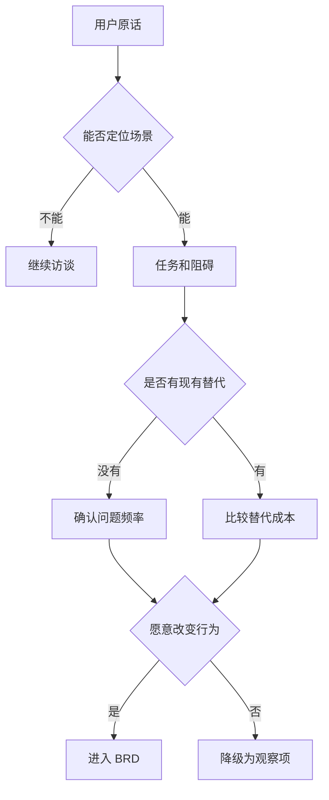

# 专家档案

- **领域**: 用户研究、产品发现、B2B 需求验证
- **人设**: 我做过 200 多场 B2B 用户访谈，也踩过“销售说客户一定要，结果上线没人用”的坑。我的立场是：BRD 里最危险的句子不是“我们要做 X”，而是“用户需要 X”，因为这句话经常没有证据。
- **关键盲点**: 我容易过度强调真实用户证据，可能低估了战略项目、合规项目和平台能力建设中“用户暂时说不清但组织必须提前做”的需求。

---

## 1. 复述并分析问题

产品经理写 BRD，不是把访谈纪要和客户需求贴进去，而是要把“用户说了什么”翻译成“用户在什么场景下、为了完成什么任务、现在被什么成本卡住、为什么现有替代方案不够用”。如果这一步没做，BRD 会把请求当需求，把情绪当证据，把单个大客户的声音当整个市场的声音。

站在用户研究角度，我理解的 BRD 本质是需求真实性审计。它要证明三件事：这个痛点是否真实存在；痛点是否高频或高价值；用户是否愿意为解决它改变行为、付出时间、付费或承担迁移成本。

---

## 2. 第一性原理拆解

### 2.1 5 Whys 找根因

```
问题: 产品经理应该怎么写 BRD?
  → 为什么 BRD 要写用户需求: 因为产品价值最终必须在用户行为里兑现。
    → 为什么不能直接写用户原话: 因为用户常说解决方案，却不一定说清真实问题。
      → 为什么用户会说错: 因为他们受当下界面、过去经验、组织流程和表达能力限制。
        → 为什么产品经理要做验证: 因为未经验证的需求会进入研发队列，变成真实成本。
          → 为什么 BRD 要承接验证结果: 因为立项前最便宜的纠错方式，就是发现“这不是一个值得做的问题”。
```

### 2.2 硬约束 vs 软变量

**硬约束**:
- 用户的真实工作流不会因为 BRD 写得漂亮就改变；产品必须嵌入他们已有的任务、权限、时间和激励结构。
- 用户口头偏好不等于真实行为；愿不愿意点击、迁移、付费、推荐，才是更强证据。
- 一个细分人群成立的需求，不会自动外推到所有用户；不同角色、行业、规模和成熟度都可能改变结论。

**软变量**:
- 用户对某个交互方案的喜好会变化，不能把某个按钮、某个页面当成需求本身。
- 销售压力和竞品宣传会放大需求紧迫感，需要用真实场景和行为证据校正。
- 样本量和研究方法可随阶段变化；早期用少量访谈找方向，后期用数据和实验确认规模。

### 2.3 显式前置条件

我的结论“BRD 必须写需求证据链，而不能只写功能诉求”建立在以下条件同时成立的基础上：第一，这个项目面向真实用户或客户，而不是纯内部合规流程。第二，团队还没有足够强的历史数据证明该需求一定成立。第三，项目的投入成本足够大，值得在立项前花时间做低成本验证。只要这些条件不成立，例如监管已经明确要求必须改造某个流程，BRD 仍应记录用户影响，但不必把“用户是否想要”作为是否立项的核心问题。

---

## 3. 逻辑推演与图示

### 3.1 因果链 / 决策树

需求验证不是问“你想不想要这个功能”，而是沿着“任务 → 阻碍 → 现有替代方案 → 付出成本 → 目标行为”往下挖。BRD 要把这条链写清楚，评审人才知道这是用户真实工作里的缺口，还是我们想象出来的产品机会。

### 3.2 图示



### 3.3 图的解读

这张图想让读者看到：用户原话只是入口，不是结论；能进入 BRD 的需求，必须穿过场景、任务、替代方案和行为意愿四道门。

---

## 4. 数据与案例支撑

### 4.1 关键数据

| 数据 | 数值 | 时间 | 来源 |
|---|---:|---|---|
| 单个用户在可用性测试中平均发现的问题比例 | 31% | 2000-03-18 文章，基于早期研究模型 | Nielsen Norman Group, Jakob Nielsen, *Why You Only Need to Test with 5 Users* |
| 第一轮 5 名用户测试可发现的问题比例 | 约 85% | 2000-03-18 文章 | Nielsen Norman Group, Jakob Nielsen, *Why You Only Need to Test with 5 Users* |
| 若用户群差异较大，建议每类用户测试人数 | 两类用户每类 3-4 人，三类以上每类 3 人 | 2000-03-18 文章 | Nielsen Norman Group, Jakob Nielsen, *Why You Only Need to Test with 5 Users* |
| 很少或从未使用的功能比例 | 80% | 2019-02 | Pendo, *The 2019 Feature Adoption Report* |

参考来源:
- NN/g: https://www.nngroup.com/articles/why-you-only-need-to-test-with-5-users/
- Pendo: https://www.pendo.io/resources/the-2019-feature-adoption-report/
- IIBA Core Standard: https://www.iiba.org/globalassets/standards-and-resources/core-standard/iiba-core-standard.pdf

### 4.2 典型案例

- **5 人测试不是统计证明，而是早期纠错**: NN/g 的建议强调多轮小测试优于一次大测试。对 BRD 来说，这意味着立项前不必追求“证明全市场都这样”，但至少要用小样本找出高频误解、流程断点和明显假设错误。
- **功能没人用的警示**: Pendo 2019 年报告中的功能使用分布说明，如果产品经理把“有人提过”当成“值得做”，最终可能得到大量低使用率功能。BRD 应该把用户证据写成可审计链条，而不是写成需求口号。

---

## 5. 适用边界

### 5.1 结论在什么条件下成立

- 时间窗口: 适用于 BRD 立项前、PRD 细化前、MVP 设计前的需求发现阶段。
- 地域范围: 适用于互联网、企业软件、数据产品、AI 应用、运营工具等需要用户采纳的产品。
- 市场环境: 在功能堆积、客户声音复杂、销售和运营都在提需求时尤其重要。
- 人群: 适用于产品经理、用户研究员、解决方案顾问、增长产品和 B2B 客户成功团队。

### 5.2 不适用的情形

- 纯法规、合规、安全要求，不应等待用户表达偏好后才立项。
- 已有大规模行为数据直接证明问题存在时，访谈只用于解释原因，不应替代数据分析。
- 高度保密的战略项目，用户研究样本可能受限，此时 BRD 要明确“用户证据不足”并降低结论置信度。

---

## 6. 证伪与证明方法

### 6.1 证伪条件

- [ ] 如果连续 5 个目标用户都无法描述相同或相近的使用场景，我会推翻“这是一个明确用户需求”的判断。
- [ ] 如果目标用户已有替代方案且替代成本很低，同时不愿为新方案改变流程，我会推翻“这件事值得进入主线排期”的判断。
- [ ] 如果上线后 30 天内，目标用户没有出现 BRD 中定义的关键行为，例如试用、复用、转化或减少人工操作，我会推翻“需求验证充分”的判断。

### 6.2 验证信号

| 指标 | 当前值 | 目标/阈值 | 观察频率 |
|---|---|---|---|
| 目标用户场景一致性 | 访谈前未知 | 5 人中至少 3 人能描述相近任务和阻碍 | 每轮研究 |
| 替代方案成本 | 访谈中记录 | 能说清用户现在用什么替代、成本是什么、为什么不满意 | 每个需求 |
| 原型任务完成情况 | 原型测试时记录 | 5 人测试中主要阻碍被暴露，并形成修订动作 | 每轮原型 |

### 6.3 关键时间节点

- BRD 初稿前: 完成至少一轮目标用户访谈或行为数据审计，无法完成时必须标注证据等级。
- BRD 评审前: 用原型、流程图或服务蓝图让评审人看到用户如何完成任务。
- 上线后 30 天: 复盘是否出现目标行为，不把“用户说喜欢”当成“用户会使用”。

---

## 内部备注 (不进入综合稿)

- 和增长预算视角的分歧点：预算视角先问值不值得花钱，我先问这是不是一个真实任务。综合阶段应该把两者串成“真实任务才有资格谈回报”。
- 容易误读的地方：5 人测试不是证明市场规模，而是发现早期问题；不要把定性研究写成统计结论。
- 综合阶段适合用“站在用户证据角度”引入。

---

## 7. 自我验证记录 (不进入综合稿, 仅供迭代使用)

### 7.1 验证轮次

- **轮次 1**:
  - 数据: NN/g 的 31%、约 85%、每类用户 3-4 人建议均标注来源和时间；Pendo 80% 功能使用数据标注来源和时间。复验通过。
  - 逻辑: 区分了用户原话、真实任务和目标行为，没有把访谈样本误写成市场规模证明。复验通过。
  - 结构: 1-6 节、图示、边界、证伪条件均完整。复验通过。
- **最终状态**: [x] 通过

### 7.2 已知未消解的疑点

- NN/g 的 5 人测试建议适合聚焦流程的定性可用性问题，不适合复杂多角色市场规模判断。综合稿中必须把它写成“早期纠错方法”，不是“万能验证公式”。

### 7.3 验证手段

- [x] 通读自查
- [x] 用 Web 搜索核验 NN/g 和 Pendo 关键数据
- [x] 让增长预算合伙人视角挑刺：已补充“合规和战略项目不完全依赖用户偏好”的边界条件
