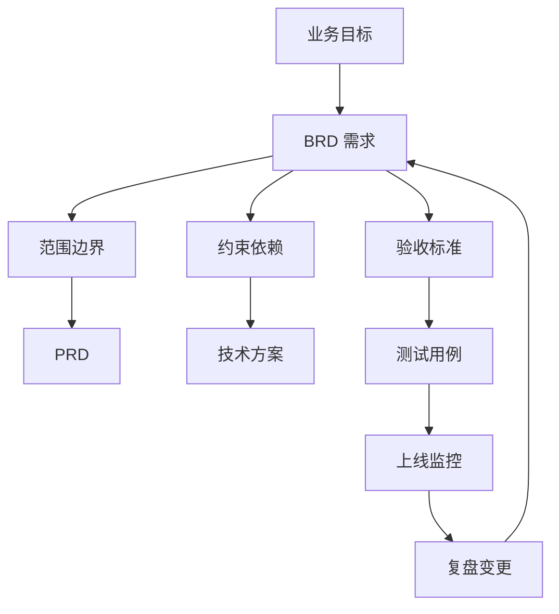

# 专家档案

- **领域**: 技术交付、需求工程、项目治理
- **人设**: 我带过三次大型平台项目，也亲手救过“BRD 写得宏大、研发完全无法估算”的烂摊子。我的立场是：BRD 写不好，问题不会消失，只会在排期、联调、验收和上线后以更贵的方式回来。
- **关键盲点**: 我容易把需求写作推向工程化和可验证，可能让早期探索项目显得过早收敛。

---

## 1. 复述并分析问题

产品经理写 BRD，不能只服务评审会，还要服务后面的交付链条。很多 BRD 在业务会上看起来很完整，到了研发评估时却暴露出三个问题：范围边界不清，依赖关系不清，验收标准不清。结果就是每个人都以为自己理解了，真正开工后才发现理解完全不同。

站在交付架构角度，我理解的 BRD 本质是“从业务承诺到可交付需求的第一道翻译”。它不需要替代 PRD 和技术方案，但必须把目标、边界、约束、依赖、验收、变更机制写到足以让后续文档承接。

---

## 2. 第一性原理拆解

### 2.1 5 Whys 找根因

```
问题: 产品经理应该怎么写 BRD?
  → 为什么 BRD 会影响交付: 因为它定义了团队最早承诺的目标和范围。
    → 为什么早期承诺重要: 因为后续排期、架构、资源和验收都会沿着这个承诺展开。
      → 为什么很多项目后期失控: 因为早期需求用模糊词掩盖了真实分歧。
        → 为什么模糊词会变成成本: 因为研发、测试、运营、法务会按各自理解实现和验收。
          → 为什么 BRD 要写到可验证: 因为只有可验证的需求，才能在开工前暴露分歧，而不是上线后争论责任。
```

### 2.2 硬约束 vs 软变量

**硬约束**:
- 软件交付需要明确边界；没写“不做什么”，范围会自然膨胀。
- 需求必须能被估算、拆解和验收；否则排期只是猜测，测试只能靠感觉。
- 跨系统、跨团队、跨权限的依赖不会因为文档忽略而消失；它们只会在联调和上线窗口爆雷。

**软变量**:
- 采用瀑布、敏捷、混合模式不是核心，核心是需求和变更是否可追踪。
- 技术实现方案可以在 PRD 和架构评审里变化，但 BRD 中的业务约束和验收口径不能随意漂移。
- 需求粒度可以随项目阶段调整，早期 BRD 不必写到接口级，但必须能支撑下一步分解。

### 2.3 显式前置条件

我的结论“BRD 必须写出可承接、可追踪、可验收的需求骨架”建立在以下条件同时成立的基础上：第一，项目需要研发、测试、设计、运营或外部供应商参与，存在交接成本。第二，项目上线后需要用客观标准判断是否完成，而不是靠口头满意度。第三，需求在执行过程中可能变化，因此需要在 BRD 中提前定义变更入口和影响评估方式。只要这些条件不成立，例如产品经理只是为自己记录一个探索想法，BRD 就不该被工程化成重流程。

---

## 3. 逻辑推演与图示

### 3.1 因果链 / 决策树

交付视角下，BRD 的关键链条是“业务目标 → 需求范围 → 约束与依赖 → 验收标准 → 变更机制”。每个需求都要能向上追溯到业务目标，向下承接到 PRD、技术方案、测试用例和上线监控。如果某条需求不能追溯，也不能验收，它就应该被删除、改写或降级为待探索项。

### 3.2 图示



### 3.3 图的解读

这张图想说明：BRD 不该孤立存在，它是后续 PRD、技术方案、测试和监控的源头；写不清的东西，会一路污染到交付末端。

---

## 4. 数据与案例支撑

### 4.1 关键数据

| 数据 | 数值 | 时间 | 来源 |
|---|---:|---|---|
| 高度重视沟通等能力的组织，项目发生范围蔓延比例 | 28%，低重视组为 40% | 2023 报告，新闻稿发布日期 2022-11-29 | PMI, *Pulse of the Profession 2023* |
| 高度重视沟通等能力的组织，项目失败时预算损失 | 17%，低重视组为 25% | 2023 报告，新闻稿发布日期 2022-11-29 | PMI, *Pulse of the Profession 2023* |
| 需求和设计验证的目的 | 确保其足够详细、内部一致、质量高、对特定利益相关方可用 | IIBA Core Standard，访问日期 2026-06-09 | IIBA, *The Business Analysis Core Standard* |
| 良好需求的常见特征 | 必要、无歧义、完整、可行、可验证、单一等 | INCOSE 需求工作组资料，2023 更新材料，访问日期 2026-06-09 | INCOSE, *Guide to Writing Requirements* 相关资料 |

参考来源:
- PMI 2023: https://www.pmi.org/about/press-media/press-releases/pulse-of-the-profession-2023
- IIBA Core Standard: https://www.iiba.org/globalassets/standards-and-resources/core-standard/iiba-core-standard.pdf
- INCOSE: https://www.incose.org/docs/default-source/working-groups/requirements-wg/shared_gtwr/gtwr_characteristics_section_4_050423.pdf

### 4.2 典型案例

- **范围蔓延**: PMI 2023 年报告显示，组织对沟通、协作和战略思维的重视程度会影响项目范围蔓延与失败损失。BRD 中的范围边界和变更机制，本质上就是用文档提前降低沟通失败。
- **模糊需求改写**: INCOSE 资料强调避免模糊词，并给出可测量表达方式。对产品经理来说，“页面要足够快”“客户能方便导出”都不是可交付需求；更好的写法是定义具体场景、动作、时间或成功率阈值。

---

## 5. 适用边界

### 5.1 结论在什么条件下成立

- 时间窗口: 适用于 BRD 到 PRD、项目计划、研发排期之间的承接阶段。
- 地域范围: 适用于需要工程交付的软件、数据、AI、平台、内部系统和企业服务项目。
- 市场环境: 在多团队协作、系统依赖复杂、需求变化频繁的环境中尤其重要。
- 人群: 适用于产品经理、项目经理、架构师、测试负责人、研发负责人和业务负责人。

### 5.2 不适用的情形

- 极早期探索、创意发散、概念验证阶段，不应把所有需求都提前写死。
- 不涉及研发交付的业务策略文档，不需要用技术验收标准衡量。
- 对外投标、合同附件、监管申报等文档有专门格式，BRD 只能作为内部输入，不应直接替代正式文件。

---

## 6. 证伪与证明方法

### 6.1 证伪条件

- [ ] 如果研发负责人无法根据 BRD 粗估工作量和关键依赖，我会推翻“这份 BRD 足以进入排期评估”的判断。
- [ ] 如果测试负责人无法基于 BRD 写出主要验收用例，我会推翻“这份 BRD 已经定义清楚完成标准”的判断。
- [ ] 如果上线前新增需求超过 BRD 原始核心范围的 30%，且没有变更评估记录，我会推翻“这份 BRD 有效控制范围”的判断。

### 6.2 验证信号

| 指标 | 当前值 | 目标/阈值 | 观察频率 |
|---|---|---|---|
| 需求可估算率 | BRD 评审时检查 | 核心需求 100% 能被研发粗估，不可估算项标注待澄清 | 每次评审 |
| 验收口径清晰度 | BRD 评审时检查 | 核心需求 100% 有验收方式、负责人和数据来源 | 每个版本 |
| 变更记录完整度 | 项目执行中检查 | 所有影响排期、成本、范围的变更都有影响评估 | 每周 |

### 6.3 关键时间节点

- BRD 评审当天: 让研发、测试、运营分别指出无法估算、无法验收、无法上线的点。
- PRD 评审前: 检查 BRD 的业务目标和范围是否被正确承接，没有被悄悄扩张。
- 上线前 1 周: 对照 BRD 验收口径确认监控、回滚、客服和运营准备是否到位。

---

## 内部备注 (不进入综合稿)

- 和增长预算视角的分歧点：预算视角强调“值不值得投”，我强调“能不能交付和验收”。综合阶段应该写成：BRD 先帮公司决定要不要投，再帮团队避免投错方式。
- 容易误读的地方：可验证不等于早期把所有细节锁死，而是把已承诺的部分写到足以承接。
- 综合阶段适合用“站在交付角度”引入。

---

## 7. 自我验证记录 (不进入综合稿, 仅供迭代使用)

### 7.1 验证轮次

- **轮次 1**:
  - 数据: PMI 2023 的 28%、40%、17%、25% 标注来源和时间；IIBA 和 INCOSE 作为规范性资料标注访问日期和用途，没有伪装成统计数据。复验通过。
  - 逻辑: 从模糊需求推到范围、依赖、验收和变更机制，因果链完整。复验通过。
  - 结构: 1-6 节、图示、边界、证伪条件均完整。复验通过。
- **最终状态**: [x] 通过

### 7.2 已知未消解的疑点

- INCOSE 的需求写作规范来自系统工程语境，套到互联网产品时要轻量化，不能把 BRD 写成军工级需求规格。综合稿中应保留“足够承接即可”的边界。

### 7.3 验证手段

- [x] 通读自查
- [x] 用 Web 搜索核验 PMI、IIBA、INCOSE 关键来源
- [x] 让用户研究负责人视角挑刺：已补充“早期探索不应过早工程化”的边界条件
