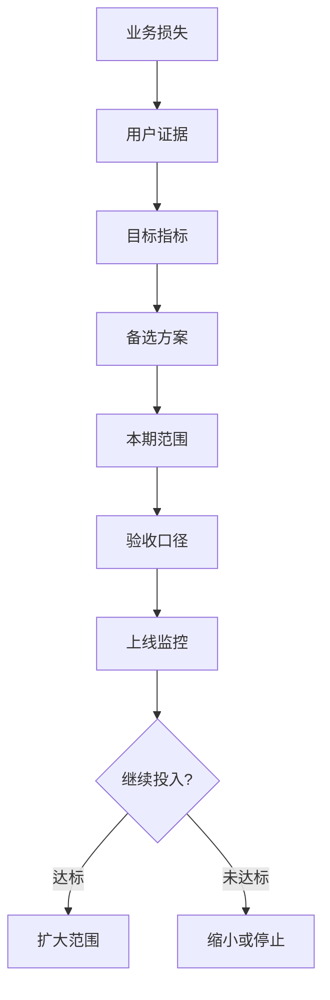

# 我现在写 BRD，先不写功能

很多产品经理写 BRD，一打开文档就开始填“背景、目标、范围、功能点”。看起来很专业，问题是顺序反了。真正难的不是把文档填满，而是让一群人相信：这件事值得花钱，用户真的需要，团队也交付得出来。

我现在写 BRD，第一句话通常不会写“我们要做某某功能”。我会先写一句更像生意账的话：如果公司什么都不做，会损失什么；如果做了，最小能换回什么；做到什么程度，我愿意承认这件事没必要继续投。

BRD 的全称是 Business Requirements Document，翻成中文叫商业需求文档。这个名字里最重要的不是“文档”，而是“商业需求”。它不是 PRD 的前传，也不是功能清单的加长版。它更像一张提前写好的下注单：我要拿公司多少资源，解决谁的什么问题，用什么指标证明这笔资源没有白花。

## 先把钱问清楚

站在预算角度，BRD 的核心问题很冷：为什么是这件事，为什么是现在，为什么不是别的项目？

公司资源永远不够。你让 5 个研发做一个月，就等于他们一个月不能做别的事。你让运营配合推广，就等于运营要少做另一个活动。你让销售去卖新能力，就等于销售要学习新话术、承担客户追问、背交付风险。所以一份 BRD 如果只写“这个功能很重要”，其实没有回答任何评审人真正关心的问题。

我会先写业务问题，而不是功能方案。比如不要写“我们要做一个自动报表模块”，而要写“目前客户每周花 4 小时手工整理经营数据，销售续费访谈里连续出现‘看不到效果’的质疑；如果这个问题不解决，续费沟通会继续依赖客户成功手工补材料”。这句话还不完美，但它已经把问题从“做报表”拉回到了“客户为什么愿意继续付钱”。

接着我会写当前基线和目标阈值。基线就是现在有多糟，阈值就是做到什么程度算值得继续。没有基线，目标就是口号；没有阈值，项目就会变成“上线了再说”。我宁愿写一个保守但可验证的目标，也不愿写“提升用户体验”“增强竞争力”这种谁都反驳不了、也没人能验收的话。

Pendo 在 2019 年的功能采用报告里提到，平均软件产品中有 80% 的功能很少或从未被使用；它还基于三个月匿名化使用数据指出，平均只有 12% 的功能贡献了 80% 的日常使用量。这个数字不能机械套到所有产品上，但它给 BRD 一个很现实的提醒：功能不是资产，没人用的功能是负债。

所以我会在 BRD 里放一个很朴素的判断：这个项目如果成功，应该改变哪个业务数字；如果没有改变，团队要不要缩小、暂停或者换方案。BRD 不是为了证明我想做的东西一定对，而是为了让公司在便宜的时候发现我可能错了。

## 别把用户原话当需求

站在用户证据角度，BRD 最容易出错的地方，是把“有人提过”写成“用户需要”。

用户当然重要，但用户经常说的是解决方案，不是问题本身。客户说“你们能不能加一个导出按钮”，他真正的困难可能是每周给老板做汇报；销售说“大客户点名要 AI 功能”，客户真正想要的可能是减少人工审核；运营说“后台要更灵活”，真实问题可能是权限流程太慢。

我写 BRD 时，会把用户证据拆成四层：谁，在什么场景里，完成什么任务，现在被什么卡住。只有这四层都说清楚，才轮到我们讨论功能。

这里有一个小技巧：不要问“你要不要这个功能”，要问“你现在怎么解决这个问题”。如果用户已经有替代方案，我会继续问替代方案哪里贵、哪里慢、哪里不可靠。如果他说不出来成本，我会降低这个需求的优先级。不是他说谎，而是很多“想要”只是表达偏好，不是强需求。

NN/g 的 Jakob Nielsen 在 2000 年那篇经典文章里强调，小规模可用性测试的价值在于快速发现问题，而不是一次性证明所有事情。它的模型里，单个用户平均能暴露约 31% 的可用性问题，第一轮 5 个用户大约能发现 85% 的问题；但它也提醒，如果用户群差异很大，就要按不同类别分别测试。对 BRD 来说，我不会把“5 人测试”当万能公式，但我会把它当早期纠错的最低动作。

一份靠谱的 BRD，应该让评审人看到用户证据的质量。它可以写：我们访谈了 5 个目标客户，其中 3 个都在同一个月结场景里遇到手工对账问题；他们现在用 Excel 和人工截图解决，平均每周耗时 2-4 小时；其中 2 个客户明确表示，如果系统能把对账时间压到 30 分钟以内，愿意进入试用。这样的描述比“客户强烈要求自动对账”值钱得多。

## 一句话需求，要能落到验收

站在交付角度，BRD 还要过另一道关：研发能不能估，测试能不能验，运营能不能接，出了变化能不能判断影响。

很多项目不是输在没有愿景，而是输在早期愿景太模糊。BRD 写“支持灵活配置”，研发不知道灵活到什么程度；写“页面响应要快”，测试不知道快是多少；写“提升转化”，运营不知道归因看哪里。每个人都觉得自己懂了，直到排期会、联调会、上线会才发现大家理解的不一样。

我会把 BRD 里的需求写成“场景 + 主体 + 动作 + 结果 + 验收方式”。比如不要写“支持客户查看报表”，而要写“当企业管理员进入续费评估页时，系统应展示过去 90 天的核心使用趋势；管理员能在 10 秒内看到活跃账号数、关键功能使用次数和异常下降提醒；数据口径来自埋点平台 A，每日 8 点前更新”。这还不是完整 PRD，但它已经足够让研发判断数据依赖，让测试写验收用例，让运营准备解释口径。

INCOSE 的需求写作资料里反复强调类似原则：需求要必要、无歧义、完整、可行、可验证。IIBA 的业务分析标准也把需求验证、需求确认、方案价值分析放在核心任务里。我们不需要把互联网产品 BRD 写成系统工程规格书，但要借它们的一条硬规则：写不清楚的承诺，不会因为进入排期就自动变清楚。

我通常会在 BRD 里明确三类边界。第一类是做什么，第二类是不做什么，第三类是暂时不确定什么。很多人只写第一类，结果项目自然膨胀。真正保护团队的是第二类和第三类：这次不做多语言，不接第三方 ERP，不支持历史数据回填；价格策略待业务确认，不进入本期交付承诺。边界写得越早，后面吵架越少。

## 一份能过会的 BRD 怎么长出来

我会按这条链写 BRD。

开头先写业务损失。不是“市场变化很快”，而是“如果不处理这个问题，哪个收入、成本、风险、效率指标会继续恶化”。接着写用户证据。不是“客户想要”，而是“目标用户在什么场景里被什么任务卡住，现在用什么替代，替代成本是什么”。

然后写目标指标。这里一定要有当前值、目标值、时间窗口、数据来源和负责人。比如“上线后 90 天，目标客户中至少 30% 使用自动对账能力完成一次月结；人工对账平均耗时从 4 小时降到 1 小时以内；数据来自后台任务日志和客户成功回访”。目标可以小，但不能虚。

再往后写备选方案。我至少会写三个：不做会怎样，人工流程优化能不能解决，做一个更小版本能不能验证。BRD 不是为某个方案辩护，而是证明我已经看过更便宜的路，最后才选择现在这条路。

范围部分要克制。我会写本期做什么，也会写本期不做什么。很多 BRD 最后变成烂项目，就是因为“不做什么”没人敢写。可是不写边界，就等于把边界交给后续会议临时决定。

验收口径要能被别人拿走使用。业务能用它判断值不值，研发能用它估工作量，测试能用它写用例，运营能用它准备上线，客服能用它回答客户问题。BRD 不需要替代 PRD，但它必须让 PRD 不至于从一团雾里开始。

最后一定要写上线后的观察办法。一个项目立项时最容易激动，上线后最容易失忆。我会提前写清楚：上线 30 天看什么，90 天看什么，什么情况扩大投入，什么情况缩小范围，什么情况承认假设错了。

## 我会直接套用的写法

如果我要给一个新产品经理一套最小可用写法，我会让他按下面这几段写，不要先追求格式漂亮。

第一段写业务判断：我们观察到什么问题，它正在造成什么损失，这个损失为什么现在值得处理。如果没有数据，就诚实写“目前只有定性证据”，不要把猜测写成事实。

第二段写目标用户：谁受影响，场景是什么，任务是什么，现有替代方案是什么，替代成本有多高。这里最怕抽象人群，比如“中小企业用户”。更好的写法是“每月需要给老板提交经营复盘、但没有数据分析同事的 20-200 人企业管理员”。

第三段写目标指标：当前是多少，目标是多少，多久看一次，用什么数据源，谁负责解释。指标不要太多，BRD 阶段抓住 1 个主指标、2-3 个护栏指标就够。主指标回答“值不值”，护栏指标回答“有没有副作用”。

第四段写方案选择：我们考虑过哪些方案，为什么不用更便宜的方案，为什么本期只做这个范围。这里最好写出“不做”的代价和“只做小版本”的可能性，因为它能让评审看到你不是只会要资源。

第五段写需求骨架：本期做什么，不做什么，依赖哪些系统或团队，有哪些已知风险，怎样验收。需求句子尽量避免“灵活、智能、高效、友好”这类词，除非后面跟着可观察的标准。

第六段写复盘机制：上线后 30 天看早期行为，90 天看业务结果；达标就进入下一阶段，不达标就缩小、调整或停止。BRD 最后一页不是“请领导批准”，而是“我们准备怎样证明自己对了，或者尽快发现自己错了”。

## 接下来我会盯这几件事

如果一份 BRD 已经写出来，我不会问“格式齐不齐”，我会看几个信号。

1. **评审前 3 天，业务、产品、研发能不能用同一句话说清目标。** 如果三个人说出来的是三件事，这份 BRD 还不能进会。

2. **至少 5 个目标用户或等价行为数据，能不能支撑同一个核心场景。** 如果证据只来自“某个客户说过”或“销售感觉很急”，我会把需求置信度降级。

3. **每个核心需求能不能被估算和验收。** 如果研发无法粗估，测试无法写用例，说明 BRD 还停在愿望层。

4. **上线后 30 天有没有目标行为。** 不是看功能有没有发布，而是看目标用户有没有开始完成 BRD 里定义的动作。

5. **上线后 90 天有没有碰到业务阈值。** 如果没碰到，就要判断是假设错了、执行错了，还是指标口径错了；不能用“还需要时间”把所有问题盖过去。

我对 BRD 的要求其实很简单：它要让公司敢下注，让团队少误解，让用户少被打扰，让项目在错误还便宜的时候暴露出来。写到这个程度，BRD 才不是文档，而是一套产品经理对业务负责的方法。

---

参考资料:
- IIBA, *The Business Analysis Core Standard*: https://www.iiba.org/globalassets/standards-and-resources/core-standard/iiba-core-standard.pdf
- Pendo, *The 2019 Feature Adoption Report*: https://www.pendo.io/resources/the-2019-feature-adoption-report/
- Nielsen Norman Group, *Why You Only Need to Test with 5 Users*: https://www.nngroup.com/articles/why-you-only-need-to-test-with-5-users/
- PMI, *Pulse of the Profession 2024: The Future of Project Work*: https://www.pmi.org/learning/thought-leadership/future-of-project-work
- PMI, *Pulse of the Profession 2023*: https://www.pmi.org/about/press-media/press-releases/pulse-of-the-profession-2023
- INCOSE Requirements Working Group, *Guide to Writing Requirements* related material: https://www.incose.org/docs/default-source/working-groups/requirements-wg/shared_gtwr/gtwr_characteristics_section_4_050423.pdf
