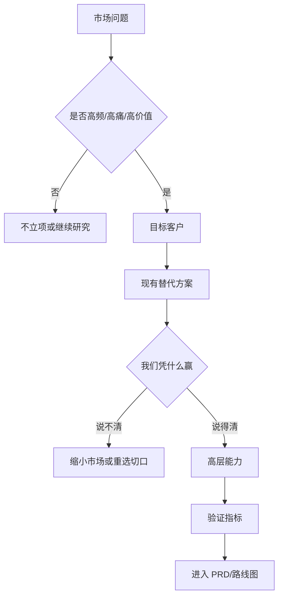

# 产品经理写 MRD 的方法论 - 专家 1 - 业务负责人

## 专家档案

- **领域**: B2B/B2C 新产品商业化与产品战略
- **人设**: 我是一个做过三次 0 到 1、也亲手砍掉过两个项目的业务负责人。我的立场很直接: MRD 不是写给研发看的功能说明书, 而是写给公司决策层看的投资判断书。我的口头禅是: "先证明这件事值得做, 再讨论怎么做。"
- **关键盲点**: 我容易高估商业结果的可预测性, 也容易把战略表达写得过于抽象。因此我必须强制自己把每个判断落到可证伪的市场信号上。

---

## 1. 复述并分析问题

产品经理问"MRD 怎么写", 表面是在问文档结构, 本质是在问: 我怎样把一个产品想法变成一个可以被组织判断、投入、取舍的市场论证?

站在业务负责人的角度, MRD 的第一职责不是让团队知道"要做哪些功能", 而是让团队先回答四个问题: 这个市场问题是否真实存在? 现在是不是合适的进入时机? 哪一类客户最值得先服务? 公司为什么有资格赢? 如果这四个问题讲不清, 后面的 PRD、原型、排期都只是把不确定性包装得更精致。

所以我理解的 MRD 方法论不是模板填空, 而是一套"从市场证据到投资决策"的推理链。好 MRD 应该让老板、销售、市场、研发、客服读完后都知道: 我们押的是哪一个市场假设, 不押哪些看似诱人的方向, 接下来用什么信号判断押对还是押错。

---

## 2. 第一性原理拆解

### 2.1 5 Whys 找根因

```text
问题: 产品经理为什么要写 MRD?
  → 为什么 1: 因为组织需要在投入研发前判断一个市场机会是否值得做。
    → 为什么 2: 因为研发、销售、市场、运营资源都是有限的, 不能每个想法都试。
      → 为什么 3: 因为产品机会的损失不只来自做错, 还来自做了一个小机会而错过大机会。
        → 为什么 4: 因为商业竞争的本质是用有限资源服务最有价值、最可触达、最愿意付费的客户群。
          → 为什么 5: 因为产品不是功能集合, 而是公司对一个市场需求、获客路径和变现方式的资本配置。
```

### 2.2 硬约束 vs 软变量

**硬约束**:
- 公司资源有限, 任何产品机会都必须和其他机会竞争预算、时间和注意力。
- 客户不会为"产品经理觉得有用"付费, 只会为自己已经感知到、愿意投入替代成本解决的问题付费。
- 市场进入有时间窗口, 太早会教育市场, 太晚会陷入红海。

**软变量**:
- 当前竞品价格、短期融资环境、热点概念和媒体声量都会变化, 不能单独作为 MRD 结论的根基。
- 某几位大客户的强烈需求可能只是局部样本, 需要判断它是否能代表更大市场。
- 短期增长指标会受渠道、促销和外部事件影响, 只能作为验证信号, 不能替代市场判断。

### 2.3 显式前置条件

我的结论"一份合格 MRD 应该先写市场机会, 再写高层能力, 最后写验证计划, 而不是直接写功能清单"建立在以下条件同时成立的基础上: 第一, 公司面对的是需要投入跨职能资源的新产品、新业务线或重大功能, 而不是一个已经确定要做的小改动。第二, 这个机会仍有市场、客户、竞争和商业化不确定性, 需要先判断是否值得下注。第三, 组织内存在多个利益相关方, 他们需要用同一套证据对齐取舍。只要机会已经被战略明确锁定、需求已经被客户合同写死, 或者只是很小的体验修补, MRD 就应该降级为轻量机会说明, 不必写成完整长文档。

---

## 3. 逻辑推演与图示

### 3.1 因果链 / 决策树

我会把 MRD 拆成一条商业判断链: 先定义市场问题, 再锁定目标客户, 然后判断替代方案和竞争格局, 接着给出本产品必须具备的高层能力, 最后设置验证指标和退出条件。每一段都必须为下一段服务: 如果市场问题不成立, 就没有必要讨论客户画像; 如果目标客户不清晰, 竞品对比就是泛泛而谈; 如果替代方案没有拆清楚, 差异化就是口号。

### 3.2 图示



### 3.3 图的解读

这张图说明 MRD 的核心不是"把功能写全", 而是逐层淘汰不值得做或还没想清楚的机会。只有通过市场问题、目标客户和差异化三道门, 才应该进入能力定义和 PRD。

---

## 4. 数据与案例支撑

### 4.1 关键数据

| 数据 | 数值 | 时间 | 来源 |
|---|---:|---|---|
| 未达目标项目中, 因需求管理不准确导致失败的比例 | 47% | 2014-08 | Project Management Institute, *Requirements Management: Core Competency for Project and Program Success* |
| MRD 常见关键内容 | 市场规模、目标客户、竞争格局、高层能力、指标策略 | 2026-06 抓取 | Aha!, *2 market requirements document templates for product teams* |
| MRD 的定位 | 产品经理或产品营销经理用于定义市场需求或市场对某产品需求的战略文档 | 2026-06 抓取 | ProductPlan, *Market Requirements Document (MRD) Glossary* |

### 4.2 典型案例

- **Aha! 的 MRD 模板**: Aha! 把 MRD 定位为组织市场、竞品、潜在客户、高层能力和成功衡量方式的轻量文档, 这说明 MRD 更靠近"市场判断"而不是"功能规格"。
- **PMI 的需求管理研究**: PMI 在 2014 年报告中指出, 需求管理不准确是未达目标项目的重要原因之一。这个案例提醒产品经理: 如果 MRD 阶段没有把市场假设讲清楚, 后面越努力执行, 偏差可能越昂贵。
- **PRD 与 MRD 的边界**: Atlassian 的 PRD 资料强调目标、假设、用户故事、设计、范围和协作, 这些对落地很有价值, 但它们更适合在 MRD 判断"为什么值得做"之后再展开。

---

## 5. 适用边界

### 5.1 结论在什么条件下成立

- 时间窗口: 适用于 2026 年仍以跨职能协作、有限研发资源和数据化增长为主的软件与互联网产品团队。
- 地域范围: 适用于中国及全球通用的软件、SaaS、平台型、AI 应用和数字化业务团队。
- 市场环境: 适用于新产品立项、重大版本、进入新客户群、商业模式切换等高不确定性场景。
- 人群: 适用于产品经理、产品负责人、产品营销经理、创业团队 CEO 和业务线负责人。

### 5.2 不适用的情形

- 已经由客户合同、监管要求或上级战略明确锁定的刚性需求, 不需要用完整 MRD 重新论证。
- 两周以内可完成、风险极低的小体验优化, 用机会卡片或一页纸说明即可。
- 纯技术底层改造、架构重构或性能治理, 如果市场侧不发生变化, 更适合写技术方案和业务影响说明。

---

## 6. 证伪与证明方法

### 6.1 证伪条件

- [ ] 如果在 2026 年 9 月 30 日前, 10 次目标客户访谈中少于 6 次能自发表达同一类强痛点, 我会推翻"这个市场问题足够集中"的判断。
- [ ] 如果在 2026 年 9 月 30 日前, 目标客户对现有替代方案的付费、迁移或人工成本无法被量化, 我会推翻"这是高价值问题"的判断。
- [ ] 如果在 2026 年 10 月 31 日前, 销售、市场、研发、设计四方仍无法用同一句话复述目标客户和差异化, 我会推翻"MRD 已经完成对齐"的判断。

### 6.2 验证信号

| 指标 | 当前值 | 目标/阈值 | 观察频率 |
|---|---|---|---|
| 目标客户访谈一致性 | 待采集 | 10 次访谈中至少 6 次指向同一核心场景 | 每轮研究后 |
| 问题付费证据 | 待采集 | 至少 3 个客户能说明预算来源、采购触发或替代成本 | 每两周 |
| 组织复述一致性 | 待采集 | 四个关键部门能一致复述客户、问题、差异化和不做什么 | MRD 评审后 |
| 进入 PRD 的需求比例 | 待采集 | PRD 中 80% 以上需求能追溯到 MRD 的市场假设 | PRD 初稿后 |

### 6.3 关键时间节点

- **2026-06-30**: 完成第一版 MRD 的市场问题、目标客户和替代方案部分, 判断是否值得继续研究。
- **2026-07-31**: 完成至少 10 次目标客户访谈或等价的一手证据采集, 重新评估痛点集中度。
- **2026-08-31**: 完成跨职能评审, 决定进入 PRD、继续验证, 还是终止机会。

---

## 内部备注 (不进入综合稿)

- 这个专家的核心观点是: MRD 是投资判断书, 不是功能说明书。
- 与产品交付负责人的分歧点: 我更关心市场机会是否值得下注, 交付视角更关心需求是否能被执行和追踪。
- 与用户研究负责人的分歧点: 我容易把客户需求商业化得太快, 用户研究视角会提醒我不要把销售线索误认为真实需求。
- 综合阶段适合用"站在业务负责人的角度"引入。

---

## 7. 自我验证记录 (不进入综合稿, 仅供迭代使用)

### 7.1 验证轮次

- **轮次 1**:
  - 数据: PMI 47% 数据已标注 2014-08 和报告名; Aha! MRD 组成标注 2026-06 抓取; ProductPlan 定义标注 2026-06 抓取。复验通过。
  - 逻辑: 初稿有把 MRD 和 PRD 混用的风险, 已增加边界说明: MRD 先判断市场机会, PRD 再展开功能与协作。复验通过。
  - 结构: 1-6 节齐全, 有 mermaid 图, 前置条件为完整句子。复验通过。
- **最终状态**: [x] 通过

### 7.2 已知未消解的疑点

- 不同行业对 MRD 命名不同, 有些团队把 MRD 和 PRD 合并为一份机会文档。综合稿中需要保留"不要迷信名字, 要看决策用途"这一边界。

### 7.3 验证手段

- [x] 通读自查
- [x] 通过 Web 搜索交叉验证 1-2 个关键数据点
- [x] 让另一种专家视角挑刺: 产品交付负责人会质疑商业判断是否能追溯到执行需求

## 参考来源

- Project Management Institute: [Requirements Management: Core Competency for Project and Program Success](https://www.pmi.org/learning/thought-leadership/pulse/core-competency-project-program-success)
- Aha!: [2 market requirements document templates for product teams](https://www.aha.io/roadmapping/guide/templates/market-requirements-document)
- ProductPlan: [Market Requirements Document (MRD)](https://www.productplan.com/glossary/market-requirements-document/)
- Atlassian: [How to create a product requirements document (PRD)](https://www.atlassian.com/agile/requirements)
