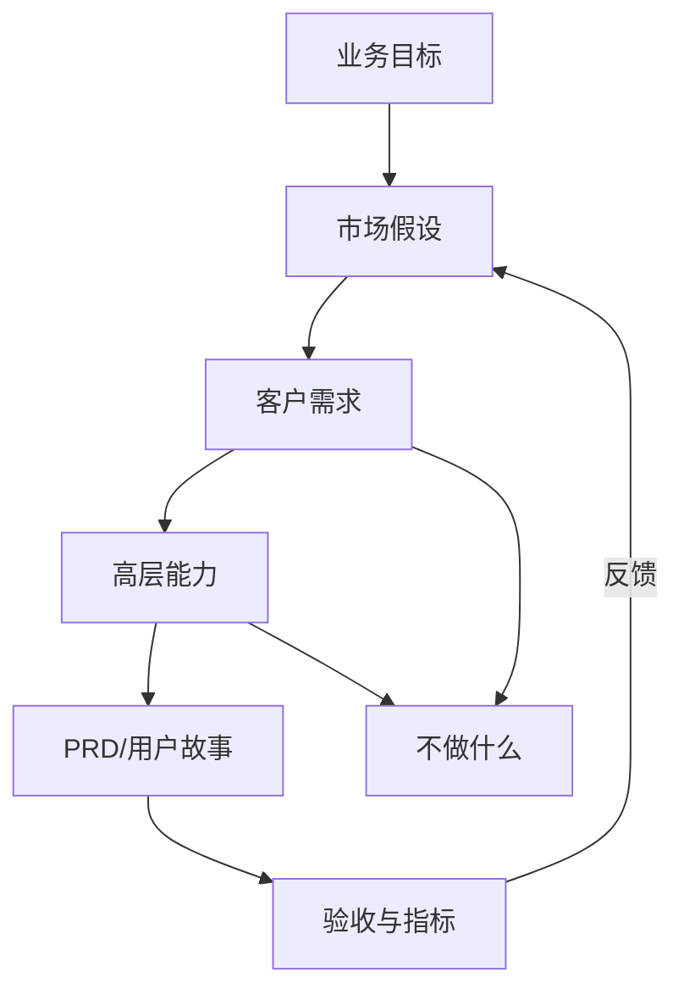

# 产品经理写 MRD 的方法论 - 专家 2 - 产品交付负责人

## 专家档案

- **领域**: 产品交付、需求工程、跨职能协作
- **人设**: 我带过 50 人以上的产品研发团队, 也被几份漂亮但不可执行的需求文档拖垮过排期。我的立场是: MRD 可以战略化, 但不能空泛; 它必须能向下追溯到 PRD、用户故事、里程碑和验收标准。我的口头禅是: "不能追踪的共识, 最后都会变成会议里的争吵。"
- **关键盲点**: 我容易过早要求确定性, 从而压制探索期该有的开放性。因此我必须区分 MRD 阶段的"市场假设"和 PRD 阶段的"产品承诺"。

---

## 1. 复述并分析问题

产品经理写 MRD, 经常会掉进两个坑: 一个坑是写成市场分析报告, 看起来很宏大, 但研发和设计不知道接下来要干什么; 另一个坑是写成 PRD, 一上来就列功能、页面和流程, 但没有说明为什么这些功能值得做。

站在产品交付负责人的角度, MRD 的本质是一个"上接战略、下接交付"的中间层。它不需要把每个按钮写清楚, 但必须让团队知道需求从哪里来、优先级为什么这样排、哪些假设还没验证、哪些内容明确不做。MRD 一旦写不清, 后面的 PRD 会带着市场假设漏洞进入研发, 最后表现为需求变更、范围蔓延、返工和互相甩锅。

因此我的方法论是: MRD 必须有清晰的需求层级。业务需求说明为什么变, 干系人需求说明谁需要什么, 高层解决方案能力说明产品大概必须具备什么能力, 但不要跳到具体实现。这样它既不会虚, 也不会越权。

---

## 2. 第一性原理拆解

### 2.1 5 Whys 找根因

```text
问题: 为什么 MRD 写不好会影响交付?
  → 为什么 1: 因为研发执行的是需求, 但需求背后常常藏着未验证的市场假设。
    → 为什么 2: 因为产品经理如果没有把假设、证据、边界写清, 团队只能按字面理解功能。
      → 为什么 3: 因为功能字面一致, 不代表每个人对目标客户、成功标准和取舍原则一致。
        → 为什么 4: 因为交付过程一定会遇到冲突, 冲突只能靠上游决策原则解决。
          → 为什么 5: 因为产品协作的底层约束不是文档完整度, 而是跨职能团队能否围绕同一目标做取舍。
```

### 2.2 硬约束 vs 软变量

**硬约束**:
- 需求一旦进入研发, 变更成本会随时间上升, 所以上游必须暴露关键假设和边界。
- 跨职能团队不会天然共享同一套语境, 必须通过可追溯文档建立共同理解。
- 产品开发一定存在资源、范围、时间和质量的取舍, MRD 必须给出取舍原则。

**软变量**:
- 团队使用 Jira、Confluence、飞书、Notion 还是其他工具并不关键, 关键是需求关系是否可追踪。
- 文档长短不是质量标准, 2 页可能足够, 20 页也可能没有结论。
- 评审会次数不是对齐质量标准, 如果会后需求仍不可追溯, 开再多会也没有用。

### 2.3 显式前置条件

我的结论"MRD 应该用需求层级和追溯关系组织, 而不是按模板栏目机械填空"建立在以下条件同时成立的基础上: 第一, 这个产品机会会进入跨职能协作, 需要销售、市场、设计、研发、测试、运营共同理解。第二, 需求从市场判断到产品能力再到交付条目之间存在多次翻译, 每次翻译都可能失真。第三, 团队需要在后续变更时回到同一份上游依据, 判断某个改动是必要校正还是范围蔓延。只要团队规模很小、沟通半径极短、需求风险极低, 完整的追溯体系就可以简化为一页机会说明和一组任务卡。

---

## 3. 逻辑推演与图示

### 3.1 因果链 / 决策树

我会把 MRD 写成四层: 业务需求、客户/干系人需求、高层能力、验证计划。业务需求回答为什么现在要变; 客户/干系人需求回答谁的什么问题必须被满足; 高层能力回答产品至少要具备哪些能力, 但不规定具体 UI 和技术实现; 验证计划回答我们如何知道这些需求没有写错。

### 3.2 图示



### 3.3 图的解读

这张图想说明两件事: 第一, MRD 不是 PRD 的替代品, 而是 PRD 的上游依据; 第二, "不做什么"不是附录, 它必须和客户需求、高层能力同时出现, 否则范围会失控。

---

## 4. 数据与案例支撑

### 4.1 关键数据

| 数据 | 数值 | 时间 | 来源 |
|---|---:|---|---|
| 未达目标项目中, 因需求管理不准确导致失败的比例 | 47% | 2014-08 | Project Management Institute, *Requirements Management: Core Competency for Project and Program Success* |
| 需求分类 | 业务需求、干系人需求、解决方案需求、过渡需求 | 2026-06 抓取 | IIBA, *Business Analysis Standard / BABOK requirement classification* |
| 良好需求工程标准 | 定义良好需求构造, 讨论需求过程在生命周期中的迭代递归应用 | 2018 | IEEE/ISO/IEC 29148-2018 官方标准摘要 |

### 4.2 典型案例

- **IIBA 的需求分类**: IIBA 把需求分为业务、干系人、解决方案和过渡需求。MRD 最应该覆盖前两类和一部分高层解决方案能力, 不应该直接沉到详细功能规格。
- **ISO/IEC/IEEE 29148:2018**: 该标准强调良好需求的构造和生命周期中的迭代管理。对 MRD 来说, 这意味着市场需求也要能被验证、追踪和维护, 不是写完签字就结束。
- **Atlassian 的 PRD 协作反模式**: Atlassian 提醒团队警惕需求一次性签死、团队不知道需求更新、产品负责人独自写需求等现象。MRD 阶段如果没有协作机制, PRD 阶段这些反模式会放大。

---

## 5. 适用边界

### 5.1 结论在什么条件下成立

- 时间窗口: 适用于 2026 年常见的敏捷、双周迭代、跨职能产品研发团队。
- 地域范围: 适用于软件产品、SaaS、数据产品、AI 产品、平台产品和企业内部系统。
- 市场环境: 适用于需求存在不确定性、干系人多、交付成本较高的场景。
- 人群: 适用于产品经理、项目负责人、业务分析师、研发负责人和设计负责人。

### 5.2 不适用的情形

- 单人独立开发或极小团队探索, 过重的追溯结构会拖慢试错。
- 纯研究型项目在早期没有清晰业务需求时, MRD 不应伪装成确定性文档。
- 已进入详细交付阶段的功能, 若再补 MRD, 应该把它当作需求追溯修复, 而不是重新立项。

---

## 6. 证伪与证明方法

### 6.1 证伪条件

- [ ] 如果在 MRD 评审后 2 周内, PRD 中超过 30% 的需求无法追溯到 MRD 的目标客户、市场假设或高层能力, 我会推翻"MRD 具备交付价值"的判断。
- [ ] 如果在 2026 年 8 月 31 日前, 研发和设计对同一条高层能力的理解出现三次以上方向性分歧, 我会推翻"需求表达足够清晰"的判断。
- [ ] 如果迭代启动后连续两个 sprint 出现由上游目标不清导致的范围变更, 我会推翻"MRD 边界足够明确"的判断。

### 6.2 验证信号

| 指标 | 当前值 | 目标/阈值 | 观察频率 |
|---|---|---|---|
| 需求追溯率 | 待采集 | PRD 需求 80% 以上可追溯到 MRD | PRD 初审 |
| 未决问题关闭率 | 待采集 | MRD 评审后的关键问题 2 周内关闭 70% 以上 | 每周 |
| 范围变更来源 | 待采集 | 上游目标不清导致的变更少于每 sprint 1 次 | 每个 sprint |
| 跨职能复述一致性 | 待采集 | 产品、设计、研发、测试能一致复述目标和不做事项 | 评审后 |

### 6.3 关键时间节点

- **MRD 初稿当天**: 标注每个关键结论的证据来源和不确定性等级。
- **MRD 评审后一周**: 关闭高风险未决问题, 或明确进入继续研究而非 PRD。
- **PRD 初稿完成时**: 做一次从 PRD 到 MRD 的反向追溯检查。
- **首个 sprint 结束时**: 复盘实际变更是否来自 MRD 漏洞。

---

## 内部备注 (不进入综合稿)

- 这个专家的核心观点是: MRD 要向下可追溯, 否则战略共识无法转化为交付共识。
- 与业务负责人分歧点: 业务负责人强调是否值得下注, 我强调下注后是否能少返工、少失真。
- 与用户研究负责人分歧点: 用户研究负责人更关心需求是否真实, 我更关心真实需求是否被组织稳定传递。
- 综合阶段适合用"站在交付负责人的角度"引入。

---

## 7. 自我验证记录 (不进入综合稿, 仅供迭代使用)

### 7.1 验证轮次

- **轮次 1**:
  - 数据: PMI 47% 数据与专家 1 保持一致; IIBA 需求分类来自 IIBA 页面; IEEE/ISO/IEC 29148:2018 来自 IEEE 官方标准摘要。复验通过。
  - 逻辑: 初稿有把 MRD 写成重型需求工程制度的倾向, 已增加"小团队/低风险场景可简化"边界。复验通过。
  - 结构: 1-6 节齐全, 有 mermaid 图, 前置条件为完整句子。复验通过。
- **最终状态**: [x] 通过

### 7.2 已知未消解的疑点

- 对早期创业团队来说, 严格追溯可能过重。综合稿中需要写成"追溯关系", 而不是"流程制度"。

### 7.3 验证手段

- [x] 通读自查
- [x] 通过 Web 搜索交叉验证 1-2 个关键数据点
- [x] 让另一种专家视角挑刺: 业务负责人会质疑交付结构是否过早压缩市场探索

## 参考来源

- Project Management Institute: [Requirements Management: Core Competency for Project and Program Success](https://www.pmi.org/learning/thought-leadership/pulse/core-competency-project-program-success)
- IIBA: [Understanding Requirements and Designs](https://www.iiba.org/knowledgehub/the-business-analysis-standard/4-implementing-business-analysis/4-4-understanding-requirements-and-designs/)
- IEEE: [IEEE/ISO/IEC 29148-2018](https://standards.ieee.org/content/ieee-standards/en/standard/29148-2018.html)
- Atlassian: [How to create a product requirements document (PRD)](https://www.atlassian.com/agile/requirements)
