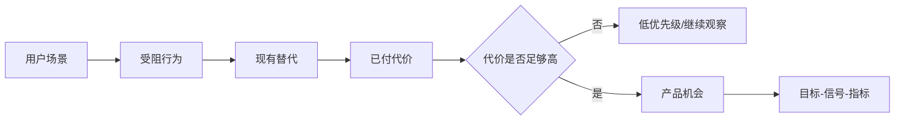

# 产品经理写 MRD 的方法论 - 专家 3 - 用户研究负责人

## 专家档案

- **领域**: 用户研究、产品发现、体验指标与增长验证
- **人设**: 我做过 800 次以上用户访谈, 也修过从注册到留存的转化漏斗。我的立场是: MRD 里最危险的句子不是"用户需要某功能", 而是"我们认为用户需要某功能"。我的口头禅是: "需求不是用户说出来的词, 而是用户反复付出代价的行为。"
- **关键盲点**: 我容易把研究严谨性放在速度前面, 在商业窗口很短时可能拖慢决策。因此我必须把研究设计成分层验证, 而不是无止境地追求完美证据。

---

## 1. 复述并分析问题

产品经理写 MRD, 很多人会先找行业报告、竞品截图和老板观点, 然后拼出一份看似完整的市场文档。但如果没有真实用户证据, MRD 很容易变成"公司内部愿望清单"。用户研究视角看这个问题, 本质是: 如何把市场机会翻译成可验证的用户需求, 并避免把噪音当成需求?

MRD 要回答的不是"用户说想要什么", 而是"哪类用户在什么场景下遇到什么阻力, 他们现在如何解决, 为此付出了什么成本, 我们能不能用更低代价或更高收益替代现有方案"。这里的成本不一定是钱, 也可能是时间、风险、学习成本、组织协调成本、心理压力。

所以我主张 MRD 必须写清三类证据: 用户说了什么, 用户做了什么, 用户为解决问题付出了什么代价。只有三者能互相印证, MRD 才能从"听起来合理"进入"值得验证"。

---

## 2. 第一性原理拆解

### 2.1 5 Whys 找根因

```text
问题: 为什么 MRD 必须建立在用户证据上?
  → 为什么 1: 因为市场需求最终来自具体用户在具体场景中的行为。
    → 为什么 2: 因为用户口头表达常常不稳定, 行为和付出成本更能说明真实优先级。
      → 为什么 3: 因为产品团队容易被强势客户、老板偏好、竞品动作和热点叙事带偏。
        → 为什么 4: 因为这些信号看起来像需求, 但不一定代表大规模、可重复、可商业化的问题。
          → 为什么 5: 因为产品价值的底层约束是用户愿意持续使用或付费, 而不是团队能否讲出漂亮故事。
```

### 2.2 硬约束 vs 软变量

**硬约束**:
- 用户注意力、时间和预算有限, 只有足够重要的问题才会触发迁移、学习和付费。
- 用户口头意愿和真实行为之间存在偏差, MRD 必须把访谈、行为数据和业务结果交叉验证。
- 用户需求总是嵌在场景里, 脱离场景的人群画像会变成空洞标签。

**软变量**:
- 某一次访谈中的高频词可能受访谈引导影响, 不能直接当需求结论。
- 某个渠道的点击或转化短期波动可能来自投放、人群或活动变化, 不能直接当产品机会。
- NPS、留存、转化率、任务成功率等指标要和具体目标绑定, 不能拿来机械套用。

### 2.3 显式前置条件

我的结论"MRD 必须把用户场景、现有替代行为和验证指标写成主线, 否则就不是需求文档而是观点文档"建立在以下条件同时成立的基础上: 第一, 目标产品的成败取决于用户是否主动采用、持续使用、付费或在组织内推动采购。第二, 团队目前对用户场景仍存在不确定性, 不能仅凭内部经验直接定需求。第三, 组织愿意在立项前投入一定时间做访谈、数据分析、原型测试或销售验证。只要需求来自明确法规、强制流程或单一客户定制合同, 用户研究仍有价值, 但 MRD 的核心会从"发现需求"转向"降低落地阻力"。

---

## 3. 逻辑推演与图示

### 3.1 因果链 / 决策树

我会让 MRD 先写"场景", 再写"问题", 再写"现有替代", 再写"代价", 最后写"指标"。用户画像不是年龄、城市、职位这种静态标签, 而是"谁在什么时候因为哪件事被卡住"。如果用户没有现有替代行为, 要么这个问题不重要, 要么用户还没意识到问题; 这两种情况的产品策略完全不同。

### 3.2 图示



### 3.3 图的解读

这张图强调 MRD 不能只写"用户痛点", 还要写用户现在怎么绕过去、绕过去付出了什么代价。代价越清晰, 需求越接近真实。

---

## 4. 数据与案例支撑

### 4.1 关键数据

| 数据 | 数值 | 时间 | 来源 |
|---|---|---|---|
| HEART 框架的五类用户体验指标 | Happiness、Engagement、Adoption、Retention、Task success | 2010 | Kerry Rodden, Hilary Hutchinson, Xin Fu, Google / CHI 2010 |
| HEART 的目标 | 把产品目标映射为可度量的用户中心指标, 支持产品决策 | 2010 | Google Research, *Measuring the User Experience on a Large Scale* |
| MRD 常见内容 | 目标市场、用户画像、竞争格局、高层能力、指标策略 | 2026-06 抓取 | Aha!, *2 market requirements document templates for product teams* |

### 4.2 典型案例

- **Google HEART 框架**: Google 研究团队提出用目标、信号、指标把模糊体验目标转成可度量指标。对 MRD 来说, 这提醒我们不要只写"提升体验", 而要说清用户行为会出现什么变化。
- **Aha! 的 MRD 结构**: Aha! 把 persona、目标市场和指标策略放进 MRD, 说明用户需求不是 PRD 阶段才补的材料, 它本来就是市场需求判断的一部分。
- **强客户误导案例**: 在 B2B 产品里, 一个大客户提出的功能可能很值钱, 但它不一定代表目标市场。如果 MRD 不记录客户类型、预算来源和可复制性, 团队容易把定制项目误判成平台机会。

---

## 5. 适用边界

### 5.1 结论在什么条件下成立

- 时间窗口: 适用于 2026 年常见的数据化产品发现、AI 产品探索、SaaS 增长和消费产品迭代。
- 地域范围: 适用于线上产品、企业软件、工具产品、平台产品和服务数字化。
- 市场环境: 适用于用户采用意愿、迁移成本、留存和付费不确定的场景。
- 人群: 适用于产品经理、用户研究员、增长负责人、产品营销经理和创业者。

### 5.2 不适用的情形

- 法规强制、内部合规或合同交付驱动的项目, 用户证据不是是否做的唯一依据。
- 极早期技术探索中, 用户还无法理解新范式时, 访谈证据要和原型实验结合, 不能只问用户想不想要。
- 已有成熟产品的微小体验优化, 不一定需要完整 MRD, 可以直接用数据假设和实验计划。

---

## 6. 证伪与证明方法

### 6.1 证伪条件

- [ ] 如果 2026 年 8 月 31 日前完成的 10 次访谈中, 用户只有口头兴趣, 但说不出现有替代行为或已付代价, 我会推翻"这是强需求"的判断。
- [ ] 如果原型测试中目标用户完成核心任务的成功率低于 60%, 且失败原因来自需求理解偏差而非界面细节, 我会推翻"场景定义清楚"的判断。
- [ ] 如果小规模投放或销售验证中, 目标客户点击、预约、试用或付费意向无法明显高于非目标客户, 我会推翻"目标人群切分有效"的判断。

### 6.2 验证信号

| 指标 | 当前值 | 目标/阈值 | 观察频率 |
|---|---|---|---|
| 访谈中替代行为出现率 | 待采集 | 10 人中至少 6 人描述明确替代行为 | 每轮访谈 |
| 已付代价清晰度 | 待采集 | 至少 5 人能说出时间、金钱、风险或协作成本 | 每轮访谈 |
| 原型核心任务成功率 | 待采集 | 首轮可用性测试达到 70% 以上 | 每次原型测试 |
| 目标人群信号差异 | 待采集 | 目标人群关键转化显著高于非目标人群 | 每次实验 |

### 6.3 关键时间节点

- **2026-06-30**: 完成第一版场景假设和访谈提纲。
- **2026-07-31**: 完成第一轮访谈、现有替代行为整理和机会判断。
- **2026-08-31**: 完成原型或落地页验证, 决定是否进入详细 PRD。

---

## 内部备注 (不进入综合稿)

- 这个专家的核心观点是: MRD 不能只写观点, 必须写用户行为证据和代价证据。
- 与业务负责人分歧点: 业务负责人更看重市场机会和商业化, 我强调别把销售愿望误读成用户需求。
- 与产品交付负责人分歧点: 交付负责人关心追溯关系, 我关心追溯链最上游的需求是否真实。
- 综合阶段适合用"站在用户研究的角度"引入。

---

## 7. 自我验证记录 (不进入综合稿, 仅供迭代使用)

### 7.1 验证轮次

- **轮次 1**:
  - 数据: HEART 来源已标注 Google Research / CHI 2010; Aha! MRD 组成标注 2026-06 抓取。复验通过。
  - 逻辑: 初稿有把用户研究写得过重的倾向, 已增加法规、合同、技术探索等边界。复验通过。
  - 结构: 1-6 节齐全, 有 mermaid 图, 前置条件为完整句子。复验通过。
- **最终状态**: [x] 通过

### 7.2 已知未消解的疑点

- 对革命性产品, 用户可能无法直接表达需求, 需要用原型和行为实验补足访谈。综合稿中不能把访谈写成唯一证据。

### 7.3 验证手段

- [x] 通读自查
- [x] 通过 Web 搜索交叉验证 1-2 个关键数据点
- [x] 让另一种专家视角挑刺: 业务负责人会质疑研究是否足够服务商业决策

## 参考来源

- Google Research: [Measuring the User Experience on a Large Scale](https://research.google.com/pubs/pub36299.html?frame=0)
- Google Research PDF: [User-Centered Metrics for Web Applications](https://research.google.com/pubs/archive/36299.pdf)
- Aha!: [2 market requirements document templates for product teams](https://www.aha.io/roadmapping/guide/templates/market-requirements-document)
