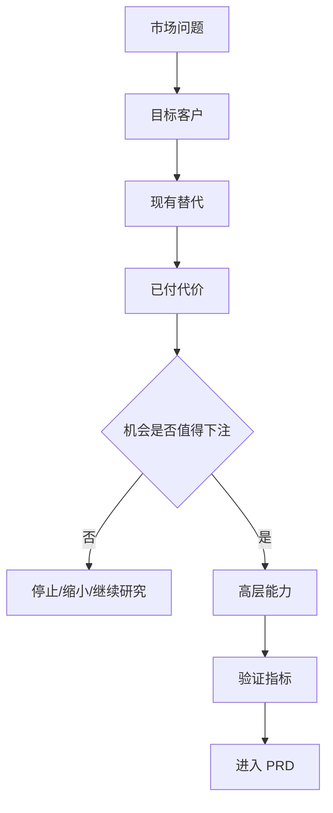

# 产品经理写 MRD, 真正难的不是模板, 而是证明这件事值得做

很多产品经理第一次写 MRD, 最容易犯的错是打开一个模板, 然后开始填: 背景、市场、用户、竞品、需求、排期。

这看起来很专业, 但经常没有用。因为模板只能提醒你别漏字段, 不能替你判断这件事到底值不值得做。更麻烦的是, 一份写得很完整但判断很虚的 MRD, 会给团队制造一种错觉: 我们已经想清楚了。等研发开工、设计出图、销售开始预热, 大家才发现最根本的问题没人回答: 目标客户是谁? 他们真的痛吗? 他们现在怎么解决? 我们凭什么赢? 如果做不成, 应该看哪个信号及时停下来?

我会把 MRD 理解成一句话: 它是产品经理写给组织的"市场下注说明书"。

注意, 不是功能说明书。功能说明书更接近 PRD。MRD 的任务在更前面: 它要证明一个市场机会值得公司投入资源, 并且把这个机会翻译成足够清楚的产品方向。写 MRD 时, 我真正要回答的不是"我们要做什么功能", 而是"我们为什么要在这个市场、为这群人、解决这个问题, 而且为什么是现在"。

这张图就是我写 MRD 的主线。不要从功能开始, 要从市场问题开始。功能只是最后的表达, 前面的判断错了, 后面写得越细, 错得越贵。

## 先把 MRD 和 PRD 分开

很多团队把 MRD 和 PRD 混在一起, 结果文档既想说市场, 又想说功能, 还想说交互、排期和验收。最后谁都不满意: 老板觉得没有商业判断, 研发觉得没有明确需求, 设计觉得缺少用户场景, 销售觉得没有卖点。

我的分法很简单。

MRD 回答"为什么值得做"。它关心市场机会、目标客户、场景痛点、现有替代、竞争格局、商业价值、高层能力和验证指标。

PRD 回答"具体怎么做"。它关心用户故事、功能范围、流程、交互、规则、边界条件、验收标准和版本计划。

这不是文字游戏。站在业务负责人的角度, MRD 本质上是投资判断。公司资源永远有限, 研发时间、市场预算、销售注意力、管理层耐心都是成本。如果一个产品经理还没有证明"这类客户的问题足够重要, 现在的替代方案足够糟, 我们有机会用差异化方式赢", 就急着写功能, 那其实是在让组织替自己承担没想清楚的风险。

Aha! 对 MRD 的说明也更接近这个定位: MRD 用来组织市场、竞争者、潜在客户、高层能力和成功衡量方式, 常见内容包括市场规模、目标用户、竞争格局、高层能力和指标策略。ProductPlan 也把 MRD 描述为产品经理或产品营销经理用来定义市场需求或市场对某产品需求的战略文档。换句话说, MRD 的重心是市场和需求, 不是页面和按钮。

## 第一页只写四件事

如果我是你, 我不会一上来写长篇行业背景。我会先逼自己在第一页写清四句话。

第一, 我们看到的市场问题是什么。不要写"提升效率"、"优化体验"这种宽词, 要写具体场景。比如不是"提升销售效率", 而是"中小 B2B 软件公司的销售经理每周要手工整理 20 个以上试用客户的跟进状态, 导致高意向线索在 48 小时内没有被及时触达"。

第二, 最先服务哪类客户。不要写"中小企业"、"年轻用户"、"高净值人群"这种大标签, 要写谁在什么场景下被卡住。客户越泛, MRD 越容易虚。一个好 MRD 往往不是把市场写大, 而是把切口写准。

第三, 他们现在用什么替代方案。没有替代方案, 不代表没有竞争, 只代表你还没找到真实竞争。Excel、微信群、人工外包、邮件、线下流程、"忍着不用", 都可能是替代方案。用户现在怎么绕过去, 比用户说想要什么更重要。

第四, 我们凭什么赢。这个"赢"不能只写"体验更好"。它要落到差异化能力上: 数据更全、流程更短、成本更低、迁移更容易、风险更小、渠道更强, 或者在某个细分场景里比通用竞品更懂用户。

如果这四句话写不出来, 不要急着扩展模板。先继续做研究。

## 用户需求不是用户说的话

站在用户研究的角度, MRD 里最危险的一句话是: "用户需要这个功能。"

用户说需要, 不等于真的需要。老板说客户需要, 不等于客户真的会买。销售说大客户需要, 也不等于这个需求能复制到更大的市场。需求不是一句话, 需求是用户已经在付出代价的行为。

所以我写 MRD 时, 会强制自己把用户证据拆成三层。

第一层是用户说了什么。访谈、客服记录、销售反馈、社群讨论都算。但这一层只能作为线索, 不能直接当结论。

第二层是用户做了什么。他们是否频繁绕路? 是否用 Excel 拼方案? 是否把多个工具串起来? 是否愿意拉同事一起解决? 是否已经为类似方案付费? 行为比表达更可靠。

第三层是用户付出了什么代价。这个代价可以是钱, 也可以是时间、风险、学习成本、协作成本和心理压力。一个需求如果没有代价, 通常就没有优先级。用户嘴上说"这个很好", 但既不愿意迁移, 也不愿意试用, 更不愿意付费, 那它对 MRD 来说只是弱信号。

Google 研究团队在 2010 年提出 HEART 框架时, 重点不是让团队多背五个指标, 而是把产品目标映射成可观察的用户信号和指标。这个思路放到 MRD 里特别有用。不要写"提升用户满意度", 要写用户会出现什么变化: 是否更多人采用, 是否更常回来, 是否更快完成任务, 是否更愿意推荐, 是否减少人工求助。

## MRD 要能向下追溯

如果换到产品交付负责人的角度看, 另一件事会变得非常刺眼: 很多 MRD 写得像战略文章, 但无法进入执行。

这类 MRD 读起来很顺, 里面有趋势、有竞品、有用户、有机会, 但到了 PRD 阶段, 研发会问: 哪些是必须做? 哪些只是探索? 哪些客户场景优先? 哪些不做? 指标怎么验收? 这时候如果 MRD 答不上来, 团队就会开始各自脑补。

我会用一条追溯链解决这个问题:

市场问题 → 目标客户 → 用户场景 → 现有替代 → 高层能力 → PRD 需求 → 验收指标。

这条链不要求你在 MRD 里写完所有 PRD 细节, 但要求你能解释每一个高层能力从哪里来。比如你在 MRD 里写"需要自动线索评分能力", 那它必须能追溯到前面的市场判断: 目标客户是谁, 他们现在如何识别高意向线索, 手工方式造成什么损失, 为什么现有 CRM 没解决, 这个能力上线后看什么指标。

IIBA 的业务分析框架把需求分成业务需求、干系人需求、解决方案需求和过渡需求。这个分类对产品经理很有启发: MRD 应该重点讲业务需求和干系人需求, 再给出高层解决方案能力; PRD 才进一步写详细功能和非功能要求。IEEE/ISO/IEC 29148:2018 也强调良好需求构造和需求过程在生命周期里的迭代应用。翻成白话就是: 需求不是写完签字就死了, 它要能被验证、维护、追踪和更新。

PMI 在 2014 年的需求管理报告中提到, 未达目标的项目里, 需求管理不准确是一个重要失败原因, 报告给出的比例是 47%。我不想把这个数字机械套到每家公司, 但它提醒我们一件朴素的事: 上游需求越含糊, 下游执行越容易把钱花在错误方向上。

## 我会这样组织一份 MRD

第一部分, 写一句话结论。不要让读者翻到最后才知道你想推进什么。第一页就写清: 我建议进入哪个市场切口, 服务哪类客户, 解决什么场景问题, 用什么差异化能力切入, 下一步要验证什么。

第二部分, 写市场问题。这里不要堆行业宏观数据, 除非它直接支持你的判断。市场问题要落到"谁在什么场景下被什么东西卡住"。如果你写的是 AI 客服产品, 不要只写客服行业数字化趋势, 要写具体问题: 哪类企业、哪类客服场景、哪类问题现在处理成本最高。

第三部分, 写目标客户和细分市场。这里要克制。不要试图证明全世界都是你的客户。MRD 的目标不是把市场写大, 而是找到最先可能赢的一小群人。你可以写更大的长期市场, 但一定要区分"现在切入的人群"和"未来扩展的人群"。

第四部分, 写现有替代方案和竞争格局。竞品不只是同类软件。用户现在的人工流程、表格、外包、线下服务、内部系统, 都是竞争。你要写清用户为什么还在忍受现有方案, 是因为便宜、习惯、数据迁移难、组织阻力大, 还是因为他们根本没觉得问题够痛。

第五部分, 写高层能力。这里不要写按钮和页面, 写能力。比如"自动识别高风险订单"是能力, "在列表右上角增加一个红色按钮"是实现。MRD 写能力, PRD 写实现。能力要和前面的场景、代价、替代方案一一对应。

第六部分, 写商业价值和成功指标。这里至少要有两组指标: 一组看业务, 比如试用转化、付费率、客单价、续费、销售周期、获客成本; 一组看用户, 比如采用率、留存、任务成功率、完成时间、错误率、满意度。指标不是越多越好, 能证明关键假设就够。

第七部分, 写不做什么和风险。很多 MRD 最大的价值不是告诉团队做什么, 而是阻止团队乱做什么。你要明确哪些客户暂时不服务, 哪些场景暂时不覆盖, 哪些功能看起来诱人但不是当前核心, 哪些假设如果失败就要停。

## 一个最小可用框架

如果团队不喜欢长文档, 我会用这个最小框架:

1. 一句话判断: 我们建议做什么, 为什么现在做。
2. 目标客户: 最先服务谁, 暂时不服务谁。
3. 场景问题: 他们在什么场景下遇到什么阻力。
4. 现有替代: 他们现在怎么解决, 付出了什么代价。
5. 市场机会: 这个问题的规模、紧迫性和商业价值。
6. 差异化: 我们为什么可能赢, 不是泛泛地"体验更好"。
7. 高层能力: 产品必须具备哪些能力, 不写具体实现。
8. 指标策略: 用什么信号证明做对了。
9. 不做事项: 当前明确排除什么。
10. 风险和证伪: 什么发生时, 我们承认判断错了。

这个框架不复杂, 但每一项都很难糊弄。尤其是第 4、8、10 项。用户现在怎么解决, 说明需求是否真实; 指标策略说明如何验证; 证伪条件说明你是不是在认真做判断, 还是只是在为一个已经决定的项目找理由。

## 别把 MRD 写成论文

MRD 不是为了展示产品经理懂行业。它要帮助组织做决定。

所以我会删掉三类内容。

第一类是和决策无关的宏观背景。比如行业规模很大, 但你的产品只能切一个小场景, 那大规模数字只能放在长期展望里, 不能拿来证明眼前机会。

第二类是无法验证的形容词。比如"极大提升效率"、"显著改善体验"、"打造闭环生态"。这种话读起来顺, 但没有任何人能据此做取舍。改成可观察信号: 完成时间从多少降到多少, 人工处理量减少多少, 转化率提升多少, 错误率降低多少。

第三类是过早的实现细节。MRD 阶段可以有概念图、能力图、关键流程, 但不要把它写成完整交互稿。太早写实现, 会让团队误以为解决方案已经确定, 反而降低探索质量。

## 接下来我会盯这 7 个信号

写完 MRD 不等于通过。MRD 真正的价值, 是让团队知道接下来该看什么。

如果我是这份 MRD 的负责人, 接下来 3 到 6 个月我会盯这 7 个信号:

1. **访谈一致性**: 10 次目标客户访谈里, 至少 6 次能自发指向同一个核心场景和同一类代价。低于这个数, 我会怀疑目标客户切得太宽或问题不够集中。
2. **替代行为**: 至少 6 个目标客户能说清现在怎么绕过去。说不出现有替代, 需求就可能只是口头兴趣。
3. **付费或预算线索**: 至少 3 个客户能说清预算来源、采购触发、人工成本或迁移成本。没有代价, 就很难证明高价值。
4. **跨职能复述一致性**: 产品、研发、设计、销售、市场能用同一句话说清目标客户、问题、差异化和不做什么。说不一致, MRD 就没有完成对齐。
5. **需求追溯率**: PRD 初稿里 80% 以上需求能追溯到 MRD 的市场假设、客户场景或高层能力。追溯不上, 就要警惕功能膨胀。
6. **原型任务成功率**: 第一轮核心任务测试最好达到 70% 以上。如果失败原因来自场景理解偏差, 就不是 UI 小修能解决的。
7. **证伪事件**: 如果到 2026 年 9 月 30 日前, 目标客户仍只有口头兴趣, 没有明确替代行为、付费代价或组织采购触发, 我会建议停止进入完整 PRD, 回到市场切口重选。

MRD 写到最后, 其实是在训练产品经理的一种能力: 不被模板牵着走, 而是把一个模糊机会变成可讨论、可投入、可追踪、可证伪的判断。

模板是皮, 判断是骨。没有骨, 文档越完整, 越容易把团队带偏。

## 参考来源

- Aha!: [2 market requirements document templates for product teams](https://www.aha.io/roadmapping/guide/templates/market-requirements-document)
- ProductPlan: [Market Requirements Document (MRD)](https://www.productplan.com/glossary/market-requirements-document/)
- Project Management Institute: [Requirements Management: Core Competency for Project and Program Success](https://www.pmi.org/learning/thought-leadership/pulse/core-competency-project-program-success)
- IIBA: [Understanding Requirements and Designs](https://www.iiba.org/knowledgehub/the-business-analysis-standard/4-implementing-business-analysis/4-4-understanding-requirements-and-designs/)
- IEEE: [IEEE/ISO/IEC 29148-2018](https://standards.ieee.org/content/ieee-standards/en/standard/29148-2018.html)
- Google Research: [Measuring the User Experience on a Large Scale](https://research.google.com/pubs/pub36299.html?frame=0)
