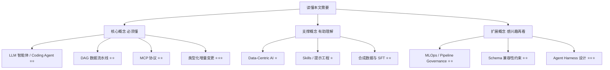
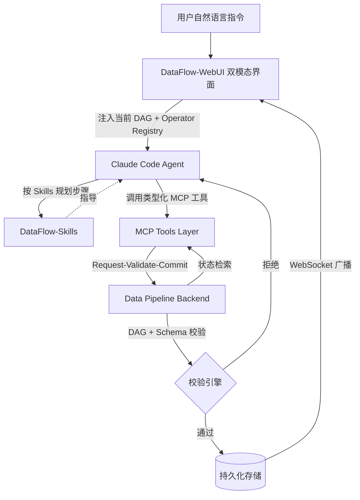

## AI论文解读 | DataFlow-Harness — 让 LLM 直接搭建可编辑的数据流水线

### 作者
digoal

### 日期
2026-07-25

### 标签
AI , LLM , Agent , 智能体 , 治理 , 流水线 , 说明书 , 蓝图 , 石山代码   

----

## 背景
> 原文信息：Runming He, Zhen Hao Wong, Hao Liang, Zimo Meng, Chengyu Shen, Xiaochen Ma, Wentao Zhang ｜ 2026 年 7 月 ｜ arXiv:2607.16617（北京大学 / 上海高研院 / 中关村学院，OpenDCAI 技术报告）
> 解读日期：2026-07-25

---

## 📍 论文定位

一句话：本文提出了 DataFlow-Harness，一个"接地"于数据平台状态的 LLM 智能体框架，让 Claude Code 不再写一次性脚本，而是通过类型化增量变更直接搭建平台原生的 DAG（可编辑、可视化、可治理的数据流水线），并以 72.5% 的成本降幅接近脚本生成的可靠性。

🎓 学术价值：
- 首次形式化提出 NL2Pipeline Gap（自然语言需求 ↔ 持久化平台工件之间的鸿沟），把"代码智能体"与"数据工程平台"统一到同一个交互模型中。
- 把 MCP（Model Context Protocol）+ Skills + 类型化 DAG 突变三种思路组合起来，给"如何在结构化工作流平台上约束 LLM 智能体"提供了一个具体可复制的范式。
- 通过 12 个工业数据任务 + 下游训练结果的双重实验，证明了"被约束的智能体"并不必然损失能力，反而可能更好。

🏭 工业价值：
- 直接可用于企业内部数据准备流水线（清洗、QA 生成、过滤、合成数据），让 LLM 智能体输出的不再是"用完即弃"的脚本，而是可审计、可重放、可交接的 DAG 工件。
- 解决"代码能用但平台管不住"的痛点：任何变更都必须通过 DAG 校验与 Schema 兼容性校验，所有手工编辑实时同步到智能体上下文。
- 让数据团队可以并行探索 prompt-driven 构造 + 人工微调，把数据工程师的"图形化拖拽"和"对话式迭代"无缝融合。

💡 直觉类比：想象你装修新房，传统 LLM 智能体像雇了一个只会贴小广告的临时工 —— 它给你写一段 Python 脚本，任务完成后人走了，墙上的钉子没人管、家具位置没法改动；而 DataFlow-Harness 像请了一个懂建筑图纸的电工 —— 他每拧一颗螺丝都要在图纸上登记、改线路时必须有合规校验、完工后图纸和现场永远保持同步。

---

## 🗺️ 知识地图



核心概念展开：

① LLM 智能体（LLM Agent）⭐⭐
- 是什么：让大语言模型在多轮推理中自主调用工具、修改环境并完成任务的范式（如 Claude Code、SWE-agent）。
- 为什么重要：它是当前"自动写代码 / 自动生成数据"的主力形态，但默认输出是不可治理的脚本。
- 现实类比：智能体像"能看懂需求的实习生"，只不过它没有公司邮箱和工号，你得给它一套"工作手册 + 工具箱 + 打卡系统"。

② DAG 数据流水线（Pipeline as DAG）⭐⭐
- 是什么：把数据处理流程表示成"节点=算子，边=数据依赖"的有向无环图。
- 为什么重要：DAG 让流水线可持久、可可视化、可并行调度，是 DataFlow 等工业平台的事实标准抽象。
- 现实类比：流水线像一张"工厂工艺路线图" —— 原材料沿固定顺序走完全部工位，每一步出错都会被自动拦截。

③ MCP 协议（Model Context Protocol）⭐⭐
- 是什么：Anthropic 推出的开放协议，让智能体以统一方式访问工具、状态和数据源。
- 为什么重要：MCP 让"工具描述 + 实时状态"成为智能体的"眼睛"，避免它引用过时或根本不存在的算子。
- 现实类比：MCP 像"USB-C 接口" —— 无论工具有多少种，都按同一个协议插拔，智能体不用为每个平台重学一套方言。

④ 类型化增量变更（Typed Incremental Mutations）⭐⭐⭐
- 是什么：智能体每一步操作都必须通过结构化、强类型的 API（如 `add_operator`、`connect_edges`）而不是写自由代码；每次变更都是一个可校验、可回放的"事务"。
- 为什么重要：这是"脚本 → 平台工件"转变的核心机制 —— 让智能体输出天然就是 DAG 状态，而不是文本代码。
- 现实类比：就像 Git 提交 —— 每次变更都有 hash、有 diff、有合法性检查，而不是一坨剪贴板上的脚本。

⑤ DataFlow-Skills（程序化蓝图 + 组合约束）⭐⭐⭐
- 是什么：把"如何选算子、如何组合、字段流约定"等隐性知识编码成可被智能体读取的 Skill 提示。
- 为什么重要：光给工具清单不够，智能体还需要"操作手册" —— Skill 就是这个手册。
- 现实类比：相当于操作手册中的"如果客户要求 PDF→QA，先调用 PDF parser、再调用 layout analysis、再做 QA 对齐"。

---

## 🔬 论文精读（5W1H）

### 2.1 Why — 为什么要做这个研究？

痛点直击：当前 LLM 智能体生成的"代码"在生产环境往往是一堆不可治理的一次性脚本 —— 没有版本、没有审计、没有可视化、容易调用过时或根本不存在的 API。作者把这种"自然语言 → 持久化工件"的落差命名为 NL2Pipeline Gap。

之前 vs 本文对比表：

| 维度 | 传统 Coding Agent（Vanilla/Context-Aware CC） | DataFlow-Harness（本文） |
|------|------|------|
| 工件类型 | 一次性 Python 脚本 | 平台原生 DAG（持久、可视、可编辑） |
| 平台耦合 | 弱（写完即脱离平台） | 强（每次变更即提交到后端） |
| 工具/算子发现 | 依赖参数化记忆，容易幻觉 | 实时 MCP 接入 Live Operator Registry |
| 操作约束 | 自由代码 | 类型化增量变更 + DAG/Schema 校验 |
| 人类干预 | 改不了或改了不同步 | GUI 实时双向同步 |
| 治理/审计 | 基本没有 | 每次变更都是已提交事务 |

Motivation 一句话：高准确率 ≠ 高可用。在生产环境，工件必须可被审计、可被编辑、可被复用，因此要把"AI 写代码"重塑为"AI 编辑 DAG"。

---

### 2.2 What — 提出了什么方法/系统？

DataFlow-Harness 围绕"单一事实源（Single Source of Truth）+ 三层协同"展开：



四个核心组件：

| 组件 | 角色 | 关键设计 |
|------|------|------|
| Data Pipeline Backend | 单一事实源 | 用 $P=(D,O,E,S,R)$ 形式化描述一个 DAG；只接受类型化突变 |
| MCP Tools Layer | 智能体与后端的"管道" | 暴露 `list_pipelines`、`get_pipeline`、`update_pipeline` 等结构化 API |
| DataFlow-Skills | 程序化蓝图 | 编码"应该怎么选算子、怎么排序"的领域知识 |
| DataFlow-WebUI | 双模态界面 | 对话式 LLM 与可视化 DAG 编辑器实时同步 |

对应论文 Figure 1 / Figure 2：图 1 展示了"用户 prompt → WebUI → Agent（带 Skills）→ MCP → Backend（带校验）→ WebSocket 同步"的闭环；图 2 进一步展示了对话流和图形 DAG 的双向同步效果。

---

### 2.3 How — 具体怎么实现的？

#### 2.3.1 Pipeline 形式化
$$P = (D, O, E, S, R)$$
- D：数据源 + URI
- O：已配置的算子实例
- E ⊆ O × O：数据依赖边
- S：每个算子的输入/输出字段 schema
- R：运行时状态（如模型服务 endpoint）

智能体对 $P$ 的操作必须是类型化增量变更，每次变更遵循：

```
State Retrieval → Mediated Mutation → Validation (DAG / Schema) → Validated Commitment
```

#### 2.3.2 Request-Validate-Commit 协议
任何变更（无论来自智能体还是人工）都走同一套三段式：
1. State Retrieval：开始新回合前，agent 拉取当前最新 DAG（含人工修改）。
2. Mediated Mutation：agent 通过 MCP 工具发起结构化变更。
3. Validation：必须满足两条硬约束——
   - 图保持有向无环（DAG check）
   - 上下游算子的字段 schema 兼容（schema check）
4. Validated Commitment：校验通过才落盘，WebSocket 推送给所有客户端。

> 白话解释：每次"加节点 / 改参数 / 接连线"都像一次 Git 提交 —— 有合法校验、有冲突检测、有广播通知，而不是直接堆砌代码。

#### 2.3.3 DataFlow-Skills 的两大类知识
1. Procedural Blueprints（程序化蓝图）：规定"应该按什么顺序搭建" —— 先 schema 推断、再选算子、再配参数、最后 serving 验证。
2. Compositional Constraints（组合约束）：规定"哪些算子能拼" —— modality 匹配、字段流约定、嵌套结构兼容等。

> 白话解释：Skills 不是"重新发明 prompt"，而是把"老数据工程师脑子里的隐性 SOP"显式写出来给智能体读。

#### 2.3.4 WebUI 双模态同步
- 对话式：用户说"我要把这一段摘要变长"，agent 通过 MCP 改 DAG。
- 图形化：用户直接在画布上拖动节点 / 改参数，所有改动实时进入后端。
- 任意一边的改动都会触发 WebSocket 推送，让另一边的视图自动刷新 —— 真正的"一份状态，多种视图"。

---

### 2.4 So What — 结果怎么样？

#### 2.4.1 主实验（Table 1，RQ1 + RQ2）

12 个数据任务 × 10 次重复 = 120 次运行，使用 Claude Opus 4.7 固定模型。

| Method | 工件类型 | E2E Pass (%) | Token (In/Out) | Cost ($) | Latency (s) |
|--------|----------|------|----------|------|------|
| Vanilla CC | 一次性脚本 | 91.7 | 153,584 / 2,474 | 0.950 | 190.7 |
| Context-Aware CC | 一次性脚本 | 94.2 | 185,626 / 1,140 | 0.456 | 115.9 |
| MCP-only | 原生 DAG | 83.3 | 100,607 / 1,273 | 0.321 | 105.5 |
| DataFlow-Harness | 原生 DAG | 93.3 | 74,958 / 891 | 0.261 | 95.5 |

关键观察：
- ✅ 可靠性几乎追平脚本生成：93.3% vs 94.2%（仅差 0.9 pp），但获得可治理的 DAG 工件。
- ✅ 成本直降 72.5%、延迟降 49.9%（相对 Vanilla CC）。
- ⚠️ MCP-only 的失败（83.3%）揭示了一个隐藏代价：光给工具描述、不给"操作手册"，智能体反而更迷茫 —— 结构化 ≠ 容易。

#### 2.4.2 教科书→VQA 案例（Table 2，RQ3 子实验）

| Method | Precision ↑ | Coverage ↑ |
|--------|------|------|
| Vanilla CC | 0.621 | 0.533 |
| Context-Aware CC | 0.893 | 0.801 |
| MCP-only | 0.784 | 0.621 |
| DataFlow-Harness | 0.972 | 0.873 |

在最难的"长文档 + 图文混排 + 跨页 QA"任务上，DataFlow-Harness 的 Precision 提升 7.9 pp、Coverage 提升 7.2 pp。

#### 2.4.3 消融（Table 3，RQ3）

把 12 个任务按"对程序化知识的依赖程度"分组：

| 任务类别 | 代表任务 | MCP-only 成功率 | Harness 成功率 |
|------|------|------|------|
| 强依赖程序化知识 | QA 基础、QA+过滤、Text-to-QA 链 | 18/30 | 29/30 |
| 路由简单 | 字段重命名、嵌套展开、长度过滤、LLM 语义过滤 | 40/40 | 40/40 |
| 瓶颈不在构造 | 多维评分、长文档摘要等 | 49/50 | 50/50 |

结论：Skills 在"如何搭流程"不显然时价值最大；在任务很机械时帮不上忙；在问题出在模型能力时也无能为力。

#### 2.4.4 下游训练效用（Table 4 & Table 5，RQ4）—— 最重磅的证据

Math Pipeline（Qwen2.5-32B-Instruct + LIMO 训练）：

| Epoch | 配置 | Avg 准确率 |
|------|------|------|
| 1 epoch | Vanilla CC | 49.9 |
| 1 epoch | DataFlow-Harness | 51.6 |
| 2 epoch | Vanilla CC | 54.5 |
| 2 epoch | DataFlow-Harness | 55.7 |

AIME24/25 这种"易污染"的高难度基准提升最显著（AIME25@32：21.6 → 34.5）。

General SFT Pipeline（Qwen2.5-7B-Base）：

| 配置 | MMLU | GSM8K | HumanEval | MBPP | 9 项 Avg |
|------|------|------|------|------|------|
| Vanilla CC | 74.4 | 82.9 | 78.0 | 64.6 | 61.5 |
| DataFlow-Harness | 74.2 | 79.5 | 80.5 | 75.4 | 63.8 |

最强信号：在代码任务上全面胜出（MBPP +10.8 pp），说明 grounding 的"批判-改写-打分"流程确实产生了更可执行、更结构化的代码回答。

---

### 2.5 Now What — 对我们意味着什么？

学术界：
- 开辟了 "Constrained Agent" 方向：与其让智能体更自由，不如让智能体被更好的"护栏"约束。
- 催生新研究问题：如何自动发现 Skills？如何验证 schema 语义正确性？如何审计 agent 编辑轨迹？
- 推动 NL2Workflow 评测标准化：未来工作可参考 12 任务基准 + 下游训练协议。

工业界：
- 把 AI 写脚本升级为"AI 写可治理 DAG"：让 MLOps / 数据治理团队可以真正把 LLM 智能体纳入生产。
- 落地三步走：① 选一个现有数据平台（DataFlow / Data-Juicer）；② 用 MCP 包装算子；③ 把团队 SOP 写成 Skills。
- 适合场景：合成数据生成、QA 对抽取、质量过滤、文档解析流水线。

---

## 📖 术语词典

### DataFlow-Harness
- 是什么：本文提出的"接地式"智能体平台，把 LLM 限制在"类型化编辑 DAG"这一动作空间内。
- 为什么重要：把"代码生成"问题转换为"DAG 状态编辑"问题，输出天然可治理。
- 现实类比：给实习生配一台只能按按钮的电梯，而不是让他自己造电梯。

### NL2Pipeline Gap
- 是什么：自然语言需求与持久化平台工件之间的鸿沟。
- 为什么重要：是论文的核心理论贡献，所有后续设计都服务于"填这个坑"。
- 现实类比：客户说"我家要个厨房"，但工地需要"水电图 + 采购清单 + 验收记录" —— 这就是 gap。

### MCP（Model Context Protocol）
- 是什么：Anthropic 推出的开放协议，让 LLM 智能体以统一方式访问外部工具与状态。
- 为什么重要：是"Live Platform Grounding"的基础设施，没有它就没法实时看到算子注册表。
- 现实类比：智能体的"USB-C 接口" —— 所有工具都按一套协议插拔。

### DataFlow-Skills
- 是什么：把"如何选择算子、如何组合"的程序化知识编码成可被智能体读取的提示。
- 为什么重要：光给工具不够，必须给操作手册。
- 现实类比：新员工的"入职培训手册 + 师傅带教录像"。

### Typed Incremental Mutations
- 是什么：智能体每一步变更必须通过强类型 API（增 / 删算子、改参数、连边）。
- 为什么重要：把"自由文本代码"换为"结构化事务"。
- 现实类比：Git commit 之于自由编辑 —— 每一步都可追溯、可回滚。

### Request-Validate-Commit Protocol
- 是什么：每次平台变更的固定三段式：状态检索 → 提交变更 → 校验通过才落盘。
- 为什么重要：保证平台的一致性与可审计性。
- 现实类比：银行业务系统的"读取账户 → 提交转账 → 风控校验 → 入账"。

### DAG（Directed Acyclic Graph）
- 是什么：有向无环图，是数据流水线的事实标准抽象。
- 为什么重要：天然支持并行调度、可视化、依赖检查。
- 现实类比：工厂工艺路线图 —— 每个工位（节点）只接收前一站（边）的输出。

### Live Operator Registry
- 是什么：平台当前的算子清单（含版本、参数、字段 schema）。
- 为什么重要：让智能体看到"现实里能用什么"，而不是凭记忆想象。
- 现实类比：菜单 —— 智能体点菜之前先看菜单，而不是凭想象点不存在的菜。

### End-to-End Pass Rate（E2E Pass）
- 是什么：流水线从输入到输出全部正确完成的比率，包含"搭对 + 跑通 + 输出合规"。
- 为什么重要：衡量"全链路可用性"，比单纯看代码生成准确率更贴近生产。
- 现实类比：不光看菜做出来没，还看客人吃完肚子没事。

### LIMO Recipe
- 是什么：Ye et al. 2025 提出的"少即是多"训练范式，用少量高质量推理样本做 SFT。
- 为什么重要：本文用 LIMO 训练 Qwen2.5-32B，使"数据质量差异"直接体现在下游模型表现上。
- 现实类比：精读 100 道好题，比泛读 10000 道烂题更提分。

### Downstream Training Utility
- 是什么：用合成数据训练出来的模型在下游基准上的真实表现。
- 为什么重要：直接衡量"管道产出的数据是否值得用"。
- 现实类比：不看食材好不好看，看端上桌的菜客人愿不愿意买单。

---

## ⚖️ 批判性评估

### 1. 假设前提的合理性
- 核心假设：把智能体限制在"类型化 DAG 编辑"中不会显著损失能力，反而能降低 token 消耗。
- 是否成立：在 12 任务上确实成立（93.3% vs 94.2%）。但任务都偏中短流程，对于超复杂的多分支流水线（如带循环、条件路由）尚未验证。
- 隐含假设：DataFlow 算子生态已经足够丰富（PDF 解析、OCR、layout 分析等都已就绪）。如果平台算子不成熟，Harness 也救不了"菜稀缺的厨房"。

### 2. 实验设计的可质疑之处
- 基线公平性：Context-Aware CC 拿到了完整 DataFlow 源码，但 Vanilla CC 完全没有平台信息 —— 这本身就放大了"grounding 价值"。如果给 Vanilla CC 也补上平台文档，差距可能缩小。
- 任务规模：12 个任务不算多，且作者自承"small, platform-specific benchmark"。每个任务重复 10 次也偏少。
- 统计严谨性：作者明确说"未做任务簇置信区间或预设非劣效检验" —— 结果应视为"观察性证据"，而非"统计显著结论"。
- 下游实验只两个 case study：一个是数学（用 Qwen2.5-32B），一个是通用 SFT（用 Qwen2.5-7B）。每个场景只有 1 条 pipeline、1 个 seed，因果性较弱。
- 缺失对比：未与 DSPy 自动编译流水线、AutoFlow 自动工作流生成做直接对照 —— 这恰是 RQ3 的关键参照系。

### 3. 方法的适用边界
- 强依赖平台算子成熟度：Harness 假设平台已经有 PDF parser、layout analyzer、scorer 等"积木"。如果平台是空白的，Harness 退化为普通 agent。
- 不擅长"零样本创新"：所有变更必须落到平台已有算子上；当任务需要"平台外的能力"（如调用新模型、自定义算法），能力受限。
- 多分支/循环结构：DAG 本身不含循环，超出 DAG 表达的任务（如反馈式 self-refine 流水线）需要另寻抽象。
- Skill 编写成本：Skill 本身要靠专家维护。如果 Skill 写得不好，反而会误导智能体。
- 校验 ≠ 正确：DAG 校验 + schema 校验只保证结构合法，不保证语义正确（如模型输出合规、数据分布合理） —— 作者也在文中坦承这一点。

### 4. 未来改进方向
作者自陈：
- 需要用更多模型 / 智能体家族验证。
- 需要独立审计 persistence、reuse、provenance、concurrent editing、recovery。
- 需要把"validation 的贡献"从 Skills 中单独剥离开做消融。
- 下游效用结果应做多 seed、多 pipeline 的重复实验。

读者可拓展的方向：
- 自动 Skill 发现：能否让 LLM 自己从历史 pipeline 中归纳出可复用 Skill？
- 跨平台 portability：把 Skills 抽象成平台无关的"操作语义"，让同一组 Skill 可在 DataFlow / Airflow / Metaflow 间迁移。
- 运行时反馈回路：当前校验只检查结构，能否引入运行时 telemetry（如下游模型表现）做闭环优化？
- 多智能体协作：让一个 agent 负责 planning、一个负责 mutation、一个负责 verification。
- 形式化校验：能否用类型论 / TLA+ 把 schema 兼容性和 DAG 无环性形式化证明，而不是只做运行时检查？

---

## 📚 参考资料

原文：
- arXiv: https://arxiv.org/abs/2607.16617
- PDF: https://arxiv.org/pdf/2607.16617
- 代码：https://github.com/OpenDCAI/DataFlow-WebUI
- 文档：https://opendcai.github.io/DataFlow-Doc/

关键相关论文（按本文引用顺序）：
- [1] Anthropic. *Claude Code: An agentic command-line coding assistant*, 2024.
- [2] Anthropic. *Model Context Protocol*, 2024.
- [3] Balis et al. *From research question to scientific workflow: Leveraging agentic AI for science automation*, arXiv:2604.21910, 2026.
- [11] Khattab et al. *DSPy: Compiling declarative language model calls into self-improving pipelines*, ICLR 2024.
- [13] Li et al. *AutoFlow: Automated workflow generation for large language model agents*, arXiv:2407.12821, 2024.
- [16] Liang et al. *DataFlow: An LLM-driven framework for unified data preparation and workflow automation*, arXiv:2512.16676, 2025.
- [23] Shinn et al. *Reflexion: Language agents with verbal reinforcement learning*, NeurIPS 2023.
- [24] Wong et al. *FlipVQA-Miner: Cross-page visual question-answer mining from textbooks*, arXiv:2511.16216, 2025.
- [26] Yang et al. *SWE-agent: Agent-computer interfaces enable automated software engineering*, arXiv:2405.15793, 2024.
- [27] Ye et al. *LIMO: Less is more for reasoning*, arXiv:2502.03387, 2025.
- [28] Zha et al. *Data-centric artificial intelligence: A survey*, arXiv:2303.10158, 2023.

---

> TL;DR：DataFlow-Harness 用 Skills + MCP + 类型化 DAG 编辑器三件套，把"AI 写脚本"重塑为"AI 维护平台工件"。在 12 个数据任务上以 72.5% 的成本降幅逼近脚本生成的可靠性，并通过下游训练实验证明产出的合成数据更值钱。它最有价值的启示是：与其让 LLM 更自由，不如让 LLM 被更好的护栏约束。
  
  
#### [PostgreSQL 解决方案集合](../201706/20170601_02.md "40cff096e9ed7122c512b35d8561d9c8")
  
  
#### [德哥 / digoal's Github - 公益是一辈子的事.](https://github.com/digoal/blog/blob/master/README.md "22709685feb7cab07d30f30387f0a9ae")
  
  
#### [About 德哥](https://github.com/digoal/blog/blob/master/me/readme.md "a37735981e7704886ffd590565582dd0")
  
  

  
