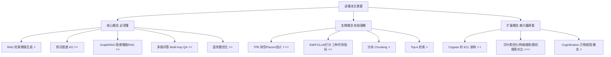
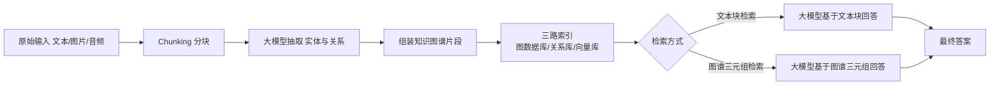

## AI论文解读 | Cognee , Optimizing the Interface Between Knowledge Graphs and LLMs for Complex Reasoning

### 作者
digoal

### 日期
2026-07-25

### 标签
AI , LLM , Agent , 智能体 , RAG , 记忆模块 , 属性图 , 召回 , 向量 , 混合找回 , K12-KGraph , 知其然 , 知其所以然   

----

## 背景

> **原文信息**：Vasilije Marković, Lazar Obradović, Laszlo Hajdu, Jovan Pavlović（Cognee Inc. / University of Primorska, FAMNIT）| arXiv 预印本，2025年5月30日提交（作者注明"这是初步版本，扩展修订版正在准备中"）| 领域：cs.AI / cs.CL
> **原文链接**：https://arxiv.org/abs/2505.24478
> **解读日期**：2026-07-26

---

## 📍 论文定位

**一句话**：本文提出了 Dreamify——一个专门给"知识图谱 + 大模型"这类 GraphRAG 系统做超参数自动调优的框架，在三个多跳问答基准上系统性验证了"认真调参"能带来多大的收益（部分指标提升超过10倍），同时也揭示了 EM/F1 这类传统指标在评价图结构化问答系统时的失真问题。

**🎓 学术价值**：经典 RAG（检索增强生成）的调参研究已经不少，但把知识图谱纳入 RAG 之后，系统的模块更多、参数更复杂（分块、图谱构建、检索方式、提示词都可以调），这类"图谱增强RAG"（GraphRAG）系统的系统性调参研究却几乎是空白。本文用一套完整的实验流程填补了这个空白，并且诚实地指出了"评测指标本身不可靠"这个更深层的问题。

**🏭 工业价值**：如果你的团队正在用 Cognee，或者任何"文本 → 知识图谱 → 检索 → 大模型回答"的架构，这篇论文相当于一份"调参说明书"：告诉你哪几个参数值得调（分块大小、检索策略、top-k、提示词模板）、用什么算法调（TPE 贝叶斯式搜索）、大概能调出多大的收益、以及调完之后该用什么心态看待"分数暴涨"这件事。

**💡 直觉类比**：这就像一辆配置复杂的赛车——发动机、悬挂、胎压、变速箱齿比全都可以调，但很多车队要么图省事直接用出厂设置，要么凭老师傅经验拍脑袋调。这篇论文相当于请了一位"自动调校工程师"（Dreamify + TPE 算法），把整台车拉到三条不同的赛道（三个问答基准）上跑了几百圈，用秒表（EM/F1/正确率）量化告诉你调好之后能快多少——同时也提醒你："秒表读数"和"车真的开得好不好"，有时候并不是一回事。

---

## 🗺️ 知识地图

读懂这篇论文，你需要按下面这张图逐层了解相关背景知识：

**核心概念说明**：

- **RAG（检索增强生成）** ：大模型回答问题前，先去外部资料库里"查一下"，把查到的内容当作参考资料塞进提示词里。就像开卷考试，先翻书再答题，能大幅减少"一本正经胡说八道"（幻觉）。
- **知识图谱（KG）** ：把文本里的实体和关系抽出来，变成"谁 - 什么关系 - 谁"这样的结构化网络。比如"张三-就职于-A公司"就是一条最简单的图谱边。
- **GraphRAG**：普通 RAG 只会查"相关的段落"，遇到需要"先查A，再根据A查B，再根据B查C"这种多步推理的问题就容易迷路。GraphRAG 把资料先组织成知识图谱，检索时可以沿着图上的关系走，天然适合处理这种链式推理问题。
- **多跳问答（Multi-hop QA）** ：需要综合多篇资料、走多步推理才能回答的问题，例如"这位导演上一部电影的主演现在效力于哪家经纪公司？"——你得先查导演的上一部电影，再查主演是谁，再查这个人现在的经纪公司。
- **超参数优化**：一个 AI 系统里有很多"旋钮"（比如分块大小、检索返回几条结果），本文不是靠人工试错调这些旋钮，而是用算法自动尝试不同组合、找出效果最好的一组。

---

## 🔬 论文精读

### Why — 研究动机

大模型虽然知识渊博，但存在两个老问题：知识存在参数里没法轻易更新，而且容易一本正经地说错话（幻觉）。RAG 通过"先检索再回答"缓解了这两个问题，但普通 RAG 在需要多步推理的问题上力不从心——只做"相关段落检索"，抓不住段落之间的逻辑链条。于是研究者们开始把知识图谱接入 RAG，形成 GraphRAG：既能做语义检索，又能沿着图谱的关系边做结构化推理。

问题是，无论是普通 RAG 还是 GraphRAG，都是"参数敏感型"系统——分块大小、检索器类型、返回条数（top-k）、提示词模板，随便一个没调好，效果就可能差一大截。普通 RAG 的调参已经有不少研究（贝叶斯优化、强化学习调参、多目标优化等），但当系统进一步叠加了知识图谱构建这一层，模块更多、参数间的相互影响更复杂，"到底该怎么系统性地调"这件事，此前几乎没人认真研究过。这就是本文要填的坑。

**之前 vs 本文的对比**：

| 维度 | 此前的 RAG 调参研究 | 本文 |
|---|---|---|
| 系统复杂度 | 检索器 + 生成器（两段式） | 分块 + 图谱构建 + 检索 + 生成（多段式） |
| 调优目标 | 主要针对检索准确率/延迟 | 端到端问答质量（EM/F1/LLM打分） |
| 参数空间 | 相对简单（如 top-k、检索器类型） | 混合类型（分块大小、检索策略、prompt模板、图谱构建方式等6个参数） |
| 评测视角 | 单一指标居多 | 同时用三种指标交叉验证，暴露指标本身的局限 |

### What — 核心方法

本文研究的对象是 **Cognee**——一个开源的、端到端知识图谱构建与检索框架。它的核心是一条 "Extract–Cognify–Load"（抽取-认知化-加载）流水线：

而本文真正的主角，是作者们在 Cognee 之上搭建的 **Dreamify**——一个超参数优化框架。它把"从原始语料到最终评分"的整条 Cognee 流水线，当成一个"黑箱函数"：给定一组参数配置，跑一遍完整流程（摄取→分块→抽取→索引→检索→回答→打分），输出一个 0~1 之间的分数。Dreamify 的任务就是不断尝试不同的参数组合，找到能让分数最高的那一组。

### How — 具体怎么实现的？

**六个可调参数**（论文 Table 1 汇总）：

| 参数 | 含义 |
|---|---|
| chunk_size 分块大小 | 图谱抽取前，每个文本片段包含多少 token（本文尝试范围 200–2000） |
| search_type 检索策略 | `cognee_completion`（检索文本块）还是 `cognee_graph_completion`（检索图谱节点与三元组） |
| top_k | 每次检索返回多少条内容喂给大模型（尝试范围 1–20） |
| qa_system_prompt QA提示词 | 生成答案时用的指令模板，3 种风格（简洁 vs 详细/要求解释） |
| graph_prompt 图谱提示词 | 抽取实体关系时用的指令模板，3 种风格（一步到位 vs 分步骤更结构化） |
| task_getter_type 任务预处理方式 | 图谱构建时是否额外生成文档摘要供检索器使用 |

**优化算法**：由于参数空间是"分类变量 + 有序整数变量"混合在一起，网格搜索（穷举所有组合）计算量太大不现实，作者在早期测试中发现随机搜索效果也不理想，最终选择了 **TPE（树形结构 Parzen 估计器）** —— 一种贝叶斯优化算法，核心思路是：根据历史试验的"好/坏"结果，逐步学出"哪一片参数区域更可能出好结果"，然后有侧重地在这些区域里继续采样，而不是盲目乱试。

**实验流程**：

1. 三个多跳问答基准——HotPotQA、TwoWikiMultiHop（2WikiMultiHopQA）、MuSiQue——各自随机抽样后经人工审核（剔除表述有问题、答案有歧义、或上下文不足以支撑答案的题目），最终每个数据集保留 24 道训练题 + 12 道测试题。
2. 三个数据集 × 三种评测指标（EM 精确匹配、F1、DeepEval 的大模型打分式"正确性"指标）= **9 组独立实验**。
3. 每组实验做 **50 次试验（trial）** ：每次试验由 TPE 采样出一组参数配置，跑一遍完整流水线（用训练集所有上下文构建一张合并知识图谱，再回答所有训练题），把选定指标的得分作为这次试验的目标值。
4. 试验是**串行**执行的，每次试验大约耗时 **30 分钟**（这意味着一组实验大约需要 25 小时，9 组实验总共约 225 小时/9.4 天的计算量——这是一笔不小的成本）。
5. 最终用训练集上表现最好的那组配置，去跑一遍留出的测试集，并用非参数 bootstrap 重采样计算置信区间。

### So What — 结果怎么样？

**训练集上的效果（论文 Table 2）** ：

| 数据集 | 指标 | 默认基线 | 调优后 | 相对提升 |
|---|---|---|---|---|
| MuSiQue | 正确性 | 0.414 | 0.674 | +62.8% |
| MuSiQue | EM | 0.000 | 0.500 | 从0到0.5 |
| MuSiQue | F1 | 0.145 | 0.654 | +351.0% |
| TwoWikiMultiHop | 正确性 | 0.348 | 0.582 | +67.2% |
| TwoWikiMultiHop | EM | 0.000 | 0.458 | 从0到0.458 |
| TwoWikiMultiHop | F1 | 0.148 | 0.625 | +321.6% |
| HotPotQA | 正确性 | 0.476 | 0.815 | +71.2% |
| HotPotQA | EM | 0.042 | 0.667 | +1496.0% |
| HotPotQA | F1 | 0.169 | 0.840 | +396.7% |

几乎所有组合都有明显提升，尤其是 EM 指标——三个数据集的基线 EM 都接近或等于 0。作者解释这背后其实是一个"文不对题"的问题：Cognee 的默认配置是按"对话式"回答风格调的（啰嗦、完整句子），而这些基准的标准答案往往是"简短、干巴巴"的几个词。EM 是极度严格的字符串精确匹配指标，哪怕答案在事实上完全正确，只要多说了几个字就得零分——这也是为什么调整提示词模板之后 EM 能从 0 跳到 0.5~0.67。

**留出测试集上的效果（论文 Table 3）** ：把训练集上选出的最佳配置，直接搬到没见过的测试题上跑，多数指标出现"中等程度的下降"（比如 HotPotQA 的 EM 从训练集 0.667 降到测试集 0.583），但整体收益仍然保留；有一个例外——TwoWikiMultiHop 的 F1 在测试集（0.704）反而略高于训练集（0.625）。作者认为这说明基础的调参流程确实能带来"可泛化"的收益，虽然没有做早停或正则化，样本量也小，波动在所难免。

### Now What — 对我们意味着什么？

- **对学术界**：这篇论文提醒我们，衡量 GraphRAG 系统好不好，不能只看 EM/F1 这类死板指标——它们对"答案风格是否匹配"极其敏感，跟"答案是否真的正确"是两回事。哪怕是号称更宽容的大模型打分指标，也会因为格式敏感、隐含假设等问题引入自己的噪声。这为"如何给图谱增强系统设计更合理的评测体系"打开了一个新方向；作者也呼吁建立类似排行榜的共享基准设施。
- **对工业界**：如果你在用 Cognee 或类似架构，这篇论文相当于给了你一个"性价比很高"的改进路径——不用改架构、不用换模型，仅仅是把分块大小、检索方式、top-k、提示词这几个参数按任务认真调一遍，就可能带来几十甚至几百个百分点的提升。但也要留意：本文发现"没有一组参数配置能在所有数据集上都最优"，也就是说调参这件事需要针对具体任务、具体数据分布去做，不能指望"一次调好，到处复用"。

---

## 📖 术语词典

### RAG（Retrieval-Augmented Generation，检索增强生成）
- **是什么**：大模型回答前先从外部资料库检索相关内容，再把检索结果和问题一起交给模型生成答案。
- **为什么重要**：能显著缓解大模型的知识过时和幻觉问题，是当前构建"能查资料"的AI应用的标准范式。
- **现实类比**：就像开卷考试，先翻书找相关章节，再动笔答题。

### 知识图谱（Knowledge Graph, KG）
- **是什么**：由"实体"和"实体之间的关系"组成的结构化网络，比如"作者-写了-论文""公司-位于-城市"。
- **为什么重要**：相比纯文本，图谱结构能显式表达实体间的多步关系，天然适合链式推理。
- **现实类比**：像一张关系网/人物关系图，一眼就能看出谁和谁有什么联系，而不用翻遍所有资料自己拼凑。

### GraphRAG（图谱增强检索生成）
- **是什么**：把知识图谱构建和检索融合进 RAG 流程的一类系统，检索时既能做语义相似度匹配，也能沿着图谱的边做结构化查询。
- **为什么重要**：能更好地应对需要"先查A、再查B"这种多跳推理的问题，是本文研究对象 Cognee 所代表的技术路线。
- **现实类比**：普通 RAG 像在图书馆按关键词翻书，GraphRAG 更像有一张标注好"谁认识谁""谁是谁的上级"的关系图，可以顺着线索一路查下去。

### 多跳问答（Multi-hop Question Answering）
- **是什么**：必须综合多篇材料、走多个推理步骤才能得出答案的问答任务，本文用的 HotPotQA、TwoWikiMultiHop、MuSiQue 都是这类基准。
- **为什么重要**：这是检验一个问答系统是否具备"链式推理"能力的试金石，单纯查一段相关文字往往不够用。
- **现实类比**：像破案——先从一条线索查到嫌疑人A，再从A的信息查到关键证据B，最后才能定案，而不是看一眼现场就知道凶手是谁。

### Cognee
- **是什么**：本文研究对象，一个开源的端到端知识图谱构建、检索与问答框架，核心是 Extract–Cognify–Load（抽取-认知化-加载）流水线。
- **为什么重要**：它的模块化设计（每个阶段可独立配置替换）使得系统性的参数调优实验成为可能。
- **现实类比**：像一条可以自由更换零件的生产线——分块方式、抽取模型、存储后端、检索策略都是可插拔的模块。

### Dreamify
- **是什么**：作者们为 Cognee 搭建的超参数优化框架，把整条流水线当作一个待优化的"黑箱目标函数"。
- **为什么重要**：它是本文实验能够系统性展开的工具基础，让"调参"这件事从人工试错变成算法驱动的搜索过程。
- **现实类比**：像给赛车配的自动调校系统，不断试不同的悬挂/胎压组合，用赛道成绩反过来指导下一次怎么调。

### TPE（Tree-structured Parzen Estimator，树形结构 Parzen 估计器）
- **是什么**：一种贝叶斯优化算法，通过对"好结果对应的参数分布"和"差结果对应的参数分布"分别建模，来判断下一步该往哪个方向采样。
- **为什么重要**：本文的参数空间是分类变量和整数变量的混合体，网格搜索太贵、随机搜索效果不佳，TPE 恰好适合这种场景。
- **现实类比**：像一个越来越懂行的侦探——试过的线索越多，就越清楚该往哪个方向重点排查，而不是每次都随机瞎猜。

### EM（Exact Match，精确匹配）
- **是什么**：判断模型答案是否与标准答案**逐字完全一致**的评测指标，一致得1分，不一致得0分。
- **为什么重要**：本文发现这个指标极度严格，哪怕答案事实正确但表述稍有出入也会被判0分，是三个数据集基线EM接近0的主因。
- **现实类比**：像老师改填空题，答案必须一字不差，写"1949年"和"1949"都可能因为格式不同被扣分。

### F1（词级别F1分数）
- **是什么**：衡量模型答案和标准答案在词汇层面重叠程度的指标，兼顾"答对了多少"和"有没有多说废话"。
- **为什么重要**：比 EM 宽容一些，但依然是基于字面重叠，无法完全反映语义正确性。
- **现实类比**：像批改简答题时按"踩中了几个采分点"来打分，而不是要求逐字一致。

### DeepEval 正确性指标（LLM-based Correctness）
- **是什么**：用大模型本身作为"阅卷老师"，对照标准答案判断模型输出是否语义正确的评测方式。
- **为什么重要**：相比 EM/F1 更能容忍表述差异，但论文也发现它会因为格式敏感、隐含假设等原因误判一些"看起来对但没给满分"的答案，引入了自己的噪声。
- **现实类比**：像请一位阅卷经验丰富的老师人工判卷，比机器逐字比对更灵活，但也可能带有自己的偏好和盲点。

### ECL 流水线（Extract–Cognify–Load）
- **是什么**：Cognee 的核心架构，分为"抽取原始输入""认知化（结构化理解）""加载进存储系统"三个阶段。
- **为什么重要**：这套分阶段、可插拔的设计是本文能够对各阶段参数分别调优的架构基础。
- **现实类比**：像"进货—加工—上架"三段式的仓库流水线，每个环节都能单独优化，不用推倒重来。

### Cognification（认知化 / 万物赋智）
- **是什么**：作者引用 Kevin Kelly 提出的概念，指"给已经数字化的系统赋予智能"的过程，Cognee 的名字即来源于此。
- **为什么重要**：作者用这个概念来说明——本文所做的调优工作，本身就是"认知化"这个大趋势的一部分，系统的智能不只来自架构设计，也来自持续的调优和适配。
- **现实类比**：像给一台已经联网的智能音箱不断升级算法，让它从"能听懂话"逐渐变成"能听懂意图"。

---

## ⚖️ 批判性评估

### 1. 假设前提的合理性

本文的结论建立在几个不算特别稳固的假设之上：其一，作者假定 TPE 在 50 次试验、这样一个混合参数空间里能找到"足够好"的配置，但并未与更充分预算（比如几百次试验）或更复杂的优化算法做对比，也没有报告 TPE 本身的搜索方差；其二，作者假定在仅 24 道训练题上找到的最佳配置具有代表性——但这是一个非常小的样本，很容易过拟合到这批具体题目的措辞习惯上；其三，人工筛选掉"有歧义/标注不佳"的题目虽然提高了数据质量，但也意味着最终评测的题目分布已经不完全等同于原始基准，跟其他论文的结果做横向比较时需要谨慎。

### 2. 实验设计的可质疑之处

最值得关注的一点是**样本量极小**——每个数据集只有 24 道训练题和 12 道测试题，这么小的样本上，几个百分点的波动都可能只是噪声，而本文报告的部分提升幅度极大（例如 EM 提升超过1000%），这类"从接近0到几十个百分点"的跃升，很大程度上是因为分母（基线）本身接近零，用相对提升百分比来呈现容易显得夸张，绝对分数的变化（如 EM 从 0.042 到 0.667）反而更有参考价值。另外，论文没有设置多次重复实验来评估"同一配置跑多次"的方差（虽然提到"图谱抽取有微小随机性，但不会实质影响整体得分"，这个结论本身也缺少定量支撑）；也没有拿经典的非图谱 RAG 基线做平行对比，无法确认这些收益中有多少来自"调参"本身、多少来自"知识图谱结构"这一设计选择。

### 3. 方法的适用边界

Dreamify 的调优过程代价不低——每次试验约30分钟、串行执行、9组实验累计接近10天算力，这意味着这套方法目前更适合资源充裕、愿意为"调参"投入大量计算预算的团队，对小团队或需要快速迭代的场景不太友好。同时，论文明确指出"没有一组配置能在所有数据集和指标上都表现最好"，也就是说调优结果是**任务特定**的，无法直接把 HotPotQA 上调出来的最佳参数原样搬到别的场景使用——每换一个新的数据/业务场景，可能都要重新跑一轮代价不小的调优流程。此外，本文的所有实验都基于 Cognee 这一个具体框架，结论是否能迁移到其他 GraphRAG 系统（比如微软的 GraphRAG、HippoRAG 等）尚未验证。

### 4. 未来改进方向

作者自己提出的后续方向包括：尝试其他搜索算法、扩大参数空间、引入多目标优化（同时权衡准确率、延迟、安全性）、在更大规模或垂直领域的自定义基准上验证泛化性，以及推动建立面向 GraphRAG 系统的共享排行榜/基准设施。从读者角度看，还可以补充几个方向：一是能否把在小训练集上调好的配置，通过跨数据集迁移学习的方式降低"每换场景都要重新调"的成本；二是能否在优化目标里显式加入"调优所需算力成本"这一维度，得到"性价比最优"而非"分数最优"的配置；三是能否针对不同问题类型（而非整个数据集）动态选择配置，而不是对一整个数据集用同一套"一刀切"的参数。

---

## 📚 参考资料

- 原文链接：https://arxiv.org/abs/2505.24478
- HTML 全文：https://arxiv.org/html/2505.24478v1
- Cognee 开源项目：https://github.com/cognee-ai/cognee
- 论文中提及的关键基准：HotPotQA、2WikiMultiHopQA、MuSiQue（均为多跳问答领域的经典基准数据集）  
  
  
#### [PostgreSQL 解决方案集合](../201706/20170601_02.md "40cff096e9ed7122c512b35d8561d9c8")
  
  
#### [德哥 / digoal's Github - 公益是一辈子的事.](https://github.com/digoal/blog/blob/master/README.md "22709685feb7cab07d30f30387f0a9ae")
  
  
#### [About 德哥](https://github.com/digoal/blog/blob/master/me/readme.md "a37735981e7704886ffd590565582dd0")
  
  

  
