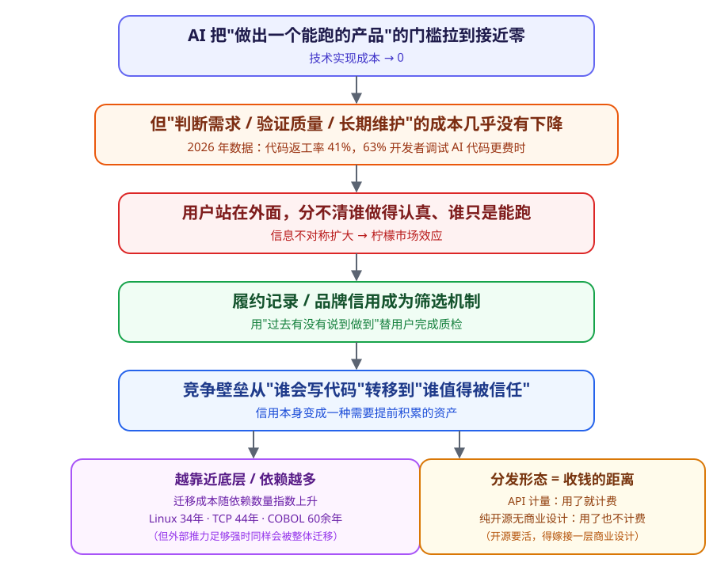

## 德说-第528期, 在 AI 时代做产品, 拼的到底是什么?  
  
### 作者  
digoal  
  
### 日期  
2026-07-27  
  
### 标签  
AI , Agent , 产品 , 门槛 , 商业 , 信用 , 递弱代偿 , Lindy 效应 , 替换成本  
  
----  
  
## 背景 

老友少聪开源 “Cortrix 探索 AI Agent 数据的新边界” 打破了数据库圈周一难得的平静, 一时间各个群都炸开了锅, Cortrix 到底是什么? 为什么一位数据库老兵会转行投大量精力进去做这个项目? 是不是给 DBA 探索出了一条新的出路?  
  
感兴趣的小伙伴赶紧去看看这个项目: https://github.com/cortrix/cortrix  
  
最近 DBA 频繁创业发产品, 围绕数据库作为 AI 持久化记忆层, 当然了这绝非偶然, 专业的人干专业的事. 再分享一个总监的开源项目: https://github.com/Haiwen-Yin/AI-Agent-Infra-with-PG-Community-Edition  
  
今天聊点产品相关的话题: 当做产品不再需要大公司, 当所有人都能用 AI 做出产品，你凭什么让我用你的?  
  
先讲个故事: 上个周末，有个独立开发者用 AI 工具从零搭了一个 SaaS 产品，没写一行代码，全靠对着 AI 描述需求。他在社交媒体上庆祝上线，用户也确实来了。几周后，账号里开始出现莫名其妙的数据、API key 被跑满、有人绕过付费直接在数据库里塞垃圾数据 —— 他不知道怎么修，因为这套代码根本不是他写的，AI 帮他改一个地方，另一个地方又坏了。最后，这个产品被永久关停。  
  
这不是孤例。2026 年的行业数据显示，AI 生成的代码已经占到全球新增代码的四成以上，九成以上的美国开发者每天都在用 AI 写代码，但同一批数据里也躺着另一组数字：代码"两周内被推翻重写"的比例比过去涨了四成多，重构 —— 也就是真正把代码改好而不是绕着问题打补丁 —— 这个动作的占比从四年前的四分之一跌到了不到一成。一边是门槛消失带来的产品爆炸式增长，一边是这些产品普遍脆弱到经不起真实世界的敲打。  
  
故事讲完, 引人深思, 但是事先声明我绝对不是来泼冷水的, 只是想借着个话题, 引申的聊一下: 在 AI 时代做产品, 拼的到底是什么?  
  
## 谁都能做，但谁都能做好吗  
  
这正是问题的关键 —— 技术门槛消失，从来不等于产品之间的差距消失，恰恰相反，差距可能被放大了，只是这个差距变得**看不见**了。以前，能不能做出一个像样的产品，本身就是一道筛选：能扛过这道筛选的人和团队，数量有限，用户挑起来相对轻松。现在这道筛选没了，市面上同时冒出一百个"看起来能用"的同类产品，用户站在外面，压根没法一眼分辨哪个是认真处理过边界情况、哪个只是凑巧跑起来了。  
  
经济学里有个经典模型专门讲这种情况：旧车市场上，卖家清楚自己车的毛病，买家不清楚，买家没法验证真实质量，就只能按照"市场平均水平"出价 —— 于是好车的卖家觉得自己被低估，干脆退出市场，市场上留下的越来越是次品。  
  
这套逻辑放到今天的 AI 产品市场上几乎是现成的比喻：当用户没法低成本验证一个产品到底靠不靠谱，他们的决策方式会自然滑向"看牌子、看口碑、看谁以前没坑过我"，而不是"看这个产品技术上到底做得多精细"。  
  
于是, 产品门槛越低，"信用"这种看不见摸不着的东西，反而越值钱。多份 2026 年的行业调研都指向同一个方向 —— 开发者对 AI 生成代码准确性的信任度，普遍从四成以上跌到了三成上下，跌幅出现在采用率还在猛涨的同一时间段里。用得越多、信得越少，这条剪刀差本身就是"信用变成稀缺资源"最直接的证据：当技术不再能证明谁更强，“过去有没有说到做到(即信用)”就成了用户唯一能依赖的筛选信号。  
  
不过我必须先说清楚, 这套逻辑也有适用的边界. 对着一个用完即扔、出错代价几乎为零的小工具 —— 比如一个临时的格式转换器 —— 用户根本不需要靠"信任"来降低决策风险，用一下就知道好不好用，坏了换下一个成本极低。  
  
信用资产真正值钱的地方，是那些牵扯数据安全、长期维护、复杂集成、出错代价大的场景，比如企业系统、支付、数据库运维 —— 这些地方，用户一旦选错，代价不是"重新找一个"这么简单。  
  
## 明明会做，为什么还要用别人的  
  
另一个更扎心的问题：既然 AI 把产品门槛打到底了, 那我自己也能做，为什么还要花钱用别人的？  
  
一百年前，经济学家科斯想的其实是同一个结构的问题 —— 既然市场上人人都可以按价格自由交易、自己组织生产，为什么还会出现"公司"这种把大量工作圈起来自己干、不去市场上一件件议价的组织形式？他给出的答案是：使用市场本身是有成本的 —— 找信息要花时间，谈价钱要花时间，防止对方毁约要花时间，出了问题追责更要花时间。这些隐性成本加起来，往往比"自己找个团队内部搞定"还贵，这才是公司存在的理由。  
  
同样的道理套在"自己做还是用别人的"这个问题上依然成立，只是主角从公司换成了个人.  
  
AI 确实把"写出能跑的代码"这一件事的成本削到了接近零，但"自己做一个产品"从来不只是写代码这一件事 —— 你还要自己判断需求边界在哪、自己扛长期维护的责任、自己承担出问题时没人兜底的风险。前面提到的那个独立开发者的遭遇不是运气差，是这套隐性成本活生生地兑现了：把 0 做到 90% 从来都不难，AI 早就能做到；难的是 90% 到 100% 之间那些边界情况、鉴权逻辑、部署细节 —— 这部分依然需要专业判断，而专业判断这件事，恰恰没有被 AI 拉到零成本。  
  
你把周末时间花在重新造一个别人已经造好、还在持续维护的轮子上，真正的代价不是技术上做不出来，而是这段时间原本可以花在你真正擅长、真正稀缺的事情上。  
  
同样, 上面这套解释也有它站不住的地方 —— 如果一件事真的简单到没有隐性成本、出错也无所谓，"自己动手"反而是更划算的选择。举个例子: 2026 年不少上市的成熟 SaaS 公司，业绩就受到了客户内部团队"自己周末用 AI 搭了个平替"的冲击，这提醒我们，这套逻辑解释的是"复杂、高风险场景里人们为什么还愿意为别人的产品付费"，而不是"任何场合自建都不划算"。  
  
## 越底层的产品，活得越久  
  
越底层、越古老不变的东西存在得越久，越上层、需求越易变、门槛越低的东西越难活。这个观点的背后是王东岳"递弱代偿"这套理论 —— 他认为万物演化中，越原始简单的东西存在度越高，越复杂精巧的东西反而越依赖外部环境、越脆弱。  
  
这套理论在哲学圈子里其实争议不小，批评者指出它从"存在不稳定"直接跳到"万物必然求存"这一步缺乏充分论证，更像是一套归纳类比式的演绎体系，不是能被严格检验的科学理论。所以我不打算把它当成放之四海而皆准的定律来用，但抛开这套理论本身的争议，软件世界里确实存在一个类似、而且有据可查的现象。  
  
这个现象有个名字，叫 Lindy 效应：一样东西存活的时间越长，它剩下的预期寿命反而越长，而不是像生物体那样越老越接近死亡。这不是隐喻，是能拿真实案例对上的：Linux 内核从 1991 年跑到现在已经三十四年，撑着几乎所有服务器和超级计算机；互联网最基础的 TCP 协议，规范可以一路追到 1981 年；写于 1959 年的 COBOL，今天依然承载着全球大部分银行的核心交易；SQL 从上世纪七十年代活到今天，还是数据库世界的通用语言。这些东西之所以活得久，不是因为它们"更古老所以更神圣"，而是因为一旦足够多的上层系统建立在它们之上，换掉它们的代价会随着依赖它们的系统数量一起往上涨 —— 迁移替换的成本，比继续凑合用的成本高太多了。反过来，直接面对用户善变口味的那一层 —— 一个个具体的 App、界面 —— 需求一变、审美一变，就得跟着改或者被淘汰，它没有"被无数底层系统死死焊住"这层保护。  
  
但咱们话也不能说得太满。历史上不是没有"依赖巨多、最后照样被换掉"的例子 —— Flash 曾经是网页多媒体的事实标准，靠着它的网站数以百万计，最后还是在几年内被 HTML5 基本取代；IE 也曾长期垄断浏览器市场，最后照样被挤出局。这说明"依赖越多越难换"提高的只是自发替换的门槛，不是给底层发了一张永久免死金牌 —— 一旦出现足够强的外部推力，比如安全危机集中爆发、平台方联合行动、监管强制切换，底层照样可能在不长的时间里被整体搬家。所以更准确的说法是：底层活得久是一种统计意义上的概率优势，不是必然规律。  
  
## 分发形态，决定了"被使用"和"赚钱"之间隔了多远  
  
最后来谈谈商业化：如果不是 API 调用的形态，很难收到钱；只搞开源没有商业设计，很难撑下去。  
  
这个判断在 2026 年的数据里基本站得住脚。API 经济已经是一个每年增速三成以上的大市场：  
- Stripe 最早的产品形态就是几行能直接粘进结账流程的代码，没有仪表盘，如今每年经手的支付流水超过一万九千亿美元；  
- Twilio 几乎全部收入来自按调用量计费的通信服务，从十年前一亿多美元收入涨到了四十多亿美元；  
- 谷歌地图光是 API 这一项，一年就带来超过三十亿美元收入。  
  
这些故事的共同点是：产品被拆成一次次可计量的调用，每被集成一次、每被调一次，账单就自动走一次，不需要销售一遍遍去谈判续约。  
  
开源这条路的另一面则相当扎心。据一份行业研究，被广泛使用的开源项目里，只有不到一成拥有明确的资金支持模式，但它们撑起的经济活动是万亿美元级别的.  
  
这正是 2026 年一连串"停摆"事件的根源：  
- Kubernetes 生态里的 Ingress NGINX 组件，因为长期无偿维护、维护者精疲力竭，宣布 2026 年 3 月起不再提供安全补丁；  
- 另一个被大量企业系统依赖的项目，即便已经拿到了企业赞助，还是因为四位维护者陆续 burnout 到只剩一人而被迫冻结更新 —— 这个案例尤其值得多想一层：给钱不等于有人干活，资金到位，维护者的精力照样会枯竭。  
  
反过来，活下来的开源项目也都有一个共同点：  
- Vue.js 的作者尤雨溪在个人赞助达到可持续水平后才辞职专心维护；  
- Django 干脆成立独立法人接受捐款、雇人干活；  
- Sentry 发起的行业倡议，要求参与的公司按每位全职开发者每年至少两千美元的标准直接付给上游维护者。  
  
这些例子都不是"纯开源"，而是在开源代码之上，另外叠了一层明确的商业设计。  
  
背后的道理其实很朴素：一种分发形态能不能让产品长期活下去，关键看它有没有把"被使用"和"赚钱"这两件事之间的因果链条做短、做自动。API 计量把这条链条做到了极致 —— 用一次算一次钱；纯开源如果什么都不加，这条链条压根不存在，用的人再多，维护者的账户也不会多一分钱，这不是谁的良心问题，是结构上根本没搭这条线。  
  
不过一次性买断、按月订阅的软件依然大量存在且活得不错，只是它们更依赖前面说的"信用"来撑住续费率，而不是靠计量本身.  
  
一款深度嵌入企业工作流、积累了多年数据和习惯的系统，即便既不是纯粹的底层基础设施，也不是按调用计费的 API，同样可以靠信任加迁移成本活得很久。  
  
所以更站得住脚的说法或许是：短命，或者被底层死死焊住，或者靠 API 计量把"使用"和"赚钱"焊在一起，这三种结局之外，还留着第四种 —— 靠长期积累的信用和难以替换的工作流嵌入，把自己活成用户不愿意换的那一个。  
  
## 总结  
  
聊了这么多, 说到底 AI 拉低的是"做出一个东西"的门槛，而不是"判断这个东西好不好、值不值得长期托付"的门槛。  
  
技术实现成本归零之后，用户没法再靠"能不能做出来"这道门槛筛人了，于是筛选压力全都转移到了别处 —— 要么转移到看不见摸不着的信用和履约记录上，要么转移到底层依赖形成的迁移成本上。  
  
最后回到开始的问题, 在 AI 时代做产品, 拼的到底是什么?  
  
我觉得是这 4 件事 —— 这个产品满足的需求在不在生产链的必经之路上、用户能不能在不亲自验证的情况下相信它、换掉它需要付出多大代价、有没有商业闭环。  
  
  

如果你也想做产品, 现在 AI 把门槛拉低了, 赶紧动起来啊. 做了就有 50% 成功机会, 不做等于零!  
  
你怎么看?  
  
  
#### [PostgreSQL 解决方案集合](../201706/20170601_02.md "40cff096e9ed7122c512b35d8561d9c8")
  
  
#### [德哥 / digoal's Github - 公益是一辈子的事.](https://github.com/digoal/blog/blob/master/README.md "22709685feb7cab07d30f30387f0a9ae")
  
  
#### [About 德哥](https://github.com/digoal/blog/blob/master/me/readme.md "a37735981e7704886ffd590565582dd0")
  
  

  
