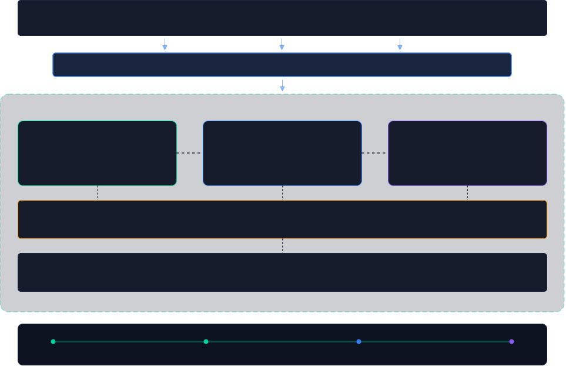

## Agent 语义存储开源项目: Cortrix 一手解说
  
### 作者  
digoal  
  
### 日期  
2026-07-27  
  
### 标签  
AI , Agent , 产品 , 记忆层 , 拆分 , 存储 , 遗忘 , 强化 , 召回 , 语义 , 关键词 , BM25 , RRF , SQLite , PostgreSQL , seekdb , Oceanbase
  
----  
  
## 背景
6.4 万行 C++ 只为一件事：让 Agent 用得稳、查得回、管得住

> 拆解 Cortrix：一个把 SQLite 用到极致、并且敢在 README 里自曝哪些功能是坏的开源项目

## 写在前面

这两年「AI 时代的数据库」这个说法被用得有点滥。很多项目打开一看，是在某个现成向量库外面包了一层 HTTP 接口，加个 embedding 调用，就宣称自己是 AI-native 的存储。

Cortrix 是我最近翻到的一个例外。它刚放出 v1.0.0-rc.1，给自己的定位是「为 Agent 而生的语义存储」。这句话本身也挺虚的，所以我把它 `src/` 目录下六万四千行 C++ 代码翻了一遍。

结论：它不是套壳。它在 C++ 里自研了一整套 RAG 基础设施，而且有几个设计取向相当鲜明。更少见的是，它在自己的 README 里明明白白列出了哪些能力现在是坏的。

这篇文章讲三件事：它的技术底座是怎么搭的、它真正的差异化在哪、以及你该不该现在就用。



## 一、先把定位说清楚

Cortrix 是一个本地优先（local-first）的语义存储服务，C++17 写的后端，AGPL-3.0 协议。

它对外开了**四条并列的接入路径**，不是主次关系：

| 路径 | 适合谁 |
|---|---|
| HTTP API / OpenAPI | 自建服务、直接由 Agent 调用 |
| MCP Server | IDE 里的 Agent、各类 MCP 客户端 |
| Python SDK | Python 应用与 RAG 流水线 |
| 内置 Agent | 本地固定流程的对话问答 |

概念模型很干净，只有六个东西： **Namespace** 是隔离边界，**Document** 是喂进去的原料，**Block** 是真正被检索的最小单元，**Query** 是检索请求，**Memory** 是长期记忆，最后一个叫 **Agent surface**，指的就是上面那四条程序化入口。

值得注意的是「Block」这个抽象——文档切出来的块和记忆抽出来的事实，落的是同一张表、同一种类型体系。这个决定后面会反复起作用。

## 二、把 SQLite 用到极致

这是我觉得最有意思的部分。

Cortrix 的底层**没有用 RocksDB，也没有挂外部搜索引擎**。文档、块、元数据全部压在 SQLite 上，而且是多库架构：

- 每个 namespace / unit 独立一份 `cortrix.db`
- 全局一份 `catalog.db` 管元数据
- 稀疏向量的倒排索引再单独一份库

PRAGMA 参数都是调过的：WAL 预写日志模式、`synchronous=NORMAL`、256MB 的 mmap、`auto_vacuum=INCREMENTAL`,还开了 FULLMUTEX 防并发打开的竞态。

### 自研 PHnsw：把内存图索引改成崩溃可恢复

向量索引这块，它封了一个叫 **PHnsw**（Persistent HNSW）的东西。内核直接把 hnswlib 的源码 vendor 进来了，但在外面套了一整套持久化机制：

```
AddPoint / MarkDelete
   ↓ 先写 hnsw.wal
   ↓ fdatasync 强制刷盘
   ↓ 再 apply 到内存图
   ↓ 后台线程按 entries/bytes 阈值触发 snapshot

Open() 时：最新 snapshot + replay WAL → 完成恢复
```

写入侧还有 group-commit 协调器（`group_commit_writer.cpp`）和独立的 pending log writer。

说白了，hnswlib 本身是个纯内存的图索引，它硬给改成了崩溃可恢复的。这个活儿不难想到，但做扎实很费功夫。

### catalog 层藏着的心思

`catalog.db` 里有六张核心表，几个细节能看出设计意图：

- **布隆过滤器预筛**：FNV-1a 双哈希，目标假阳性率默认 1%,用来对 file_hash 做去重预判，避免每次都查库
- **NS → Unit 路由器**：现在是 1 对 1,但接口留了 1 对 N。这是明摆着给多租户和数据分片铺路
- **`units` 表预留了 9 个字段**：`sealed_at`、`archived_at`、`vector_count`、`seal_idle_days`……冷热分层和归档的坑位已经挖好了
- **独立的目录级 GC 子模块**

稀疏向量这块反而没用 HNSW 或 IVF，走的是传统倒排（term_id → child_id + weight），单独一个 SQLite 库，按 namespace 缓存检索器实例并配了 LRU。

<!-- 配图建议：PHnsw 的 WAL → snapshot 流程图 -->

## 三、检索：RRF，以及一个很务实的改动

融合策略用的是 **RRF（Reciprocal Rank Fusion，倒数排名融合）** ，公式 `1/(k+rank)`,默认 k=60。

这里要强调一下： **不是加权分数融合**。区别很重要——RRF 只看排名不看分数，所以各路召回的分数量纲不需要可比。向量的余弦相似度和 BM25 的分数根本不在一个尺度上，用加权和就得先做归一化，而归一化本身又引入调参负担。RRF 绕过了这个问题。

主路径是两路：

- **向量检索**走 PHnsw，距离用 `1/(1+d)` 转成相似度
- **关键词检索**走 SQLite 自带的 **FTS5 做 BM25**

SQL 路由是第三路，但只在意图分类器判定为 `kSql` / `kHybrid` 时才触发。此外还有一套独立的五路融合（dense / contextualized / sparse / fts5 / hype_question）用于 SPLADE 稀疏分支。

### 那个务实的改动

FTS5 默认对多个查询词是**隐式 AND** 的。但真实用户的自然语言提问往往很长——「这个项目的向量索引是怎么做持久化的」切完词有七八个 token，要求全部命中，召回率会低到没法用。

所以 Cortrix 强行把它改成了 **OR 连接的词袋 BM25**,每个 token 用双引号包裹后 OR 连接。同时对 FTS5 的操作符做了注入清洗（`* ( ) ^ : AND OR NOT NEAR` 这些都得转义），防止用户输入把查询语法搞乱。

这是个不起眼但很实际的工程判断：教科书式的实现在真实查询分布下是不work的。

### 过采样与重排

检索完先取 3 倍候选（oversample），再做元数据后置过滤，最后截断到 top_k。这个顺序很关键——如果先过滤再检索，索引就用不上了。

重排用 **bge-reranker-v2-m3** 交叉编码器，跑 ONNX，输出 logits 过 sigmoid 归一到 0~1。外面包了一个 circuit breaker，防止模型抖动或超时引发雪崩。

值得一提的是它的输入编码是手工拼的：`<s> query </s> </s> passage </s>`,直接复用 vocab 里的 `</s>` token id。tokenizer 也是自己实现的（`hf_tokenizer.cpp`）,同时支持 BPE 和 Unigram/SentencePiece 两套算法，全局注册表按 key（`"bge-m3"`）复用，embedder 和 reranker 共享同一份 token 表。

### 推理后端

embedding 用 **BGE-M3**（1024 维），全部本地 ONNX 推理。执行后端支持 **CPU / CoreML（macOS）/ CUDA（Linux）** 三选一，也可以设 `auto` 自动协商，优先级 CUDA → CoreML → CPU。初始化失败会自动回落到 CPU 并打一个 `provider_fallback` 指标。

推理层做了单次重试 + 200ms 退避，失败抛的错误带 `retry_after_ms=200`——这个细节后面会呼应。

## 四、记忆会自我修正

这块的设计比很多同类项目想得深。

**数据模型是三层：**

```
memory_sessions      会话元信息
    └── interaction_log    每一轮 user/assistant 对话
            └── blocks         抽取出的事实（block_type = memory）
```

注意第三层——记忆事实落的就是普通的 `blocks` 表，只是类型标记不同。为了满足 blocks→documents 的外键，它造了一个合成的「记忆文档」`__cortrix_memory__`。这个设计的好处是： **memory 检索直接复用 QueryPipeline**,天然继承了向量 + BM25 的混合检索和 RRF 排序，不用另写一套召回。

每条记忆带完整溯源字段：`user_id` / `session_id` / `status` / `type` / `source_interaction_id` / `source_session_id`。

**抽取是 LLM 驱动的 few-shot JSON 抽取**：拼最近 N 轮对话窗口，调 LLM 要求 `response_format=json_object`,解析成 `{type, content, confidence}` 数组。中英文两套模板按 CJK 字符启发式自动选。解析有 fallback——如果 LLM 输出不是纯 JSON，会从里面找 `[...]` 子串再 parse 一次。

### 类型决定衰减

- `fact`（事实）和 `preference`（偏好） **永久免疫，不衰减**
- `event`（事件）按 `exp(-λ·age_days)` 指数衰减，**并且设了下限**,不会衰减到零

这个区分很合理：「用户是左手写字的」不该随时间变淡，「用户上周三开了个会」应该。

### 最妙的是矛盾判定

新事实写入前，会**再调一次 LLM** 判断它和已有事实有没有冲突。命中冲突就把旧事实标记成 `invalidated`,并记录 `invalidated_by_block_id`——是哪条新事实把它作废的，有据可查。

同时还留了手动作废接口和**撤销作废**（`RevokeInvalidation`）。

这意味着记忆不是只写不改的日志，而是一个**会自我修正的状态机**。再加上 `opt_out_manager`（用户可以要求不被记录）和 `memory_transparency`（记忆可见性视图），合规相关的钩子也都在。

<!-- 配图建议：记忆三层模型 + 矛盾判定流程 -->

## 五、护城河不在算法

前面讲的这些，说实话都是「做得扎实」的范畴，算法上没有惊喜。

但这个项目有两个模块，我认为是它真正的差异化所在。而且它们都不是数据库层的优化。

### agent_friendly：给 LLM 看的错误

`src/agent_friendly/` 目录下只有一个 `error.cpp`,但它的头文件被几乎所有模块引用——reranker、parser、tenant、enricher、cleaning，全都 include 它。

它定义了一个跨模块统一的错误结构，每个错误**必须**带上：

| 字段 | 作用 |
|---|---|
| `code` | `CX_ERR_*` 错误码 |
| `message` | 给人看的描述 |
| `retryable` | 布尔值，能不能重试 |
| `category` | `auth` / `quota` / `transient` / `permanent` / `timeout` |
| `retry_after_ms` | 可选，建议多久后再试 |
| `structured_data` | 可选，附加 JSON |

所有子模块的 `MakeXxxError(...)` 都得把内部状态塞进这个 struct，再由 API / SDK / MCP 边界统一 `ToJson()` 序列化出去。

**意图非常明确：让 LLM 拿到错误时，能自己判断该重试、该换参数、还是该认输。**

想想现在的实际情况——Agent 调一个 RAG 服务，拿回来一个 HTTP 500 和一坨堆栈信息。它能干什么？要么盲目重试，要么直接放弃，要么把堆栈原文塞进上下文污染后续推理。而如果错误里明确写着 `retryable: true, category: transient, retry_after_ms: 200`,Agent 的行为就是可预期的。

这不是数据库优化，是**为 LLM 消费而设计的 API ergonomics**。我觉得这是个被严重低估的方向。

### agent_trace：给 Agent 调试用的可观测性

`src/agent_trace/` 是一整套 tracing 体系，但它不是给运维看的常规 APM。

核心表 `agent_trace` 记的是：`session_id` / `trace_id` / `agent_id` / `method` / `params` / `result_summary` / `duration_ms` / `source` / `status` / `error_code` / `namespace_id`。

几个设计细节很能说明取向：

**1）能反查证据链。** `interactions_handler` 支持按 interaction_id 查「这条回复到底引用了哪些源 block」。返回的 snippet 做了**头 400 字节 + 尾 100 字节**的截断——既能看懂上下文，又不至于把全文吐出来。这是 Agent 调试时最刚需的能力：不是「哪里慢了」,而是「它为什么这么答」。

**2）权限做得很克制。** 跨用户读别人的 trace 直接返回 `kUnauthorized`,而且**不泄露那个 session 是否存在**——避免被枚举探测。管理员的越权访问会写进一条**独立的审计通道**（`ObservabilityAuditLog`）,不去污染常规的 operation_log,而且是结构化日志而非 metric。

**3）HTTP 和 MCP 一视同仁。** `source` 字段取值 `"http"` 或 `"mcp"`,同一个查询路径无论从 SDK 还是从 MCP client 进来，都落到同一张表，可以按维度聚合。同时对接了 W3C Trace Context 标准（`traceparent` / `tracestate` / `x-request-id`）。

**4）内建 retention。** 单独的 cleanup registrar + sweeper,还对 trace 行做大小估算（160B 骨架 + params + result），超过 1MB 软上限会提示分页。这是给 SaaS 化做成本和合规控制的准备。

## 六、最少见的是这份诚实

讲到这里，如果你觉得这项目挺不错想上生产，请先看这一节。

Cortrix 在文档里定义了**四级状态标签**,然后一条一条把自己的能力标出来：

- `Verified` — 有当前代码/规范证据支撑，且在最新验证范围内被实际跑过
- `Verification required` — 代码、规范或文档里有，但还没验到能对外声明的程度
- `Blocked` — 已知坏掉、被阻塞，或在当前运行时无法证明
- `Roadmap` — 计划中，还没做

**被标成 `Blocked` 的有这些：**

| 能力 | 项目自述的原因 |
|---|---|
| 登录鉴权 | 公开规范定义了 login，但最新验证发现契约漂移 |
| 租户 / 成员 / ACL / 配额 | 运行时行为和文档契约还在对齐 |
| MEM02 记忆抽取 | 最新验证观察到 LLM 传输超时路径 |
| RBAC 与租户隔离拒绝矩阵 | 在当前关闭鉴权的本地运行时中根本无法证明 |

**而唯一被标成 `Verified` 的硬指标**,是 BEIR 三个数据集（SciFact、FiQA、NFCorpus）的全量语料检索质量，有固定 commit 的基准包可查。

但它紧接着自己补了一句： **这不代表回答质量，也不代表生产环境的性能。**

README 里还有一整段：「不要假设鉴权、租户隔离、RBAC、配额执行或记忆抽取已经生产就绪。不要把已发布的检索质量测量泛化到回答质量、延迟、成本、安全或生产性能上。」

这种主动划边界、主动自曝的写法，在开源项目里真的不多见。大多数项目的 README 是营销材料，这个更像技术尽调报告。单就这一点，我对它的工程判断力就多了几分信任。

## 七、要不要用，怎么上手

### 值得学的

1. **把 SQLite 能力边界推到极致的思路。** 多库拆分 + FTS5 做 BM25 + PRAGMA 调优，在中小规模场景下省掉了一整套外部依赖。这个取舍思路值得借鉴
2. **HNSW + WAL 的持久化设计。** 如果你也在纠结内存索引怎么落盘，`src/store/phnsw/` 是份可读的参考实现
3. **为 Agent 消费而设计的错误与追踪契约。** 这是我认为最有启发的部分，而且跟你用什么技术栈无关，明天就能抄进自己的项目

### 该谨慎的

鉴权、多租户隔离、RBAC、配额、记忆抽取——这五块现在都不能当生产能力用。本地开发、技术预研、读源码学设计，都没问题；真要上线，这几块得自己补，而且补的工作量不小。

### 上手成本

不高。Docker Compose 一条命令：

```bash
git clone https://github.com/cortrix/cortrix.git
cd cortrix
CORTRIX_SOURCE_REVISION="$(git rev-parse HEAD)" \
  docker compose -f deploy/docker-compose.yml up --build --wait

curl -fsS http://127.0.0.1:8420/api/v1/system/health/ready
```

只需要 Git、Docker、Docker Compose。 **不需要 `.env` 文件、不需要 LLM 供应商密钥、不需要宿主机的模型工具链、不需要手动下载或转换模型。**

首次启动会拉大约 **1.17 GB** 的固定版本模型资产，可能要几分钟；之后复用缓存卷。默认只暴露 loopback 上的 `127.0.0.1:8420`,在 CPU 上跑 BGE-M3 嵌入和 bge-reranker-v2-m3 重排，外部 LLM 角色和内置 Agent 默认关闭。

## 最后

Cortrix 是个工程完成度相当高的预发布项目。它的技术底座没有炫技，但每一处取舍都有清楚的理由；它的差异化不在算法，而在「怎么让 LLM Agent 用得稳、查得回、被管得住」这件事上。

我觉得这个方向是对的。现在大家做 RAG，注意力都在召回率和重排模型上，但真正让 Agent 应用在生产里跑不稳的，往往是错误语义含糊、证据链查不回、以及权限边界模糊这些「工程性」问题。Cortrix 至少把这三件事当成一等公民来设计了。

如果你正在自己搭 RAG 基础设施，这个项目的源码值得翻一翻。

---

**项目地址**：https://github.com/cortrix/cortrix
**协议**：AGPL-3.0-only（第三方材料保留各自协议）
**版本**：v1.0.0-rc.1

> 本文基于对 `src/` 目录约 6.4 万行 C++ 源码的实际探查，以及项目 README、compatibility.md 的公开状态声明写成。文中标注为 `Blocked` 的能力状态引自项目自述，未做独立复现验证。
   
  
#### [PostgreSQL 解决方案集合](../201706/20170601_02.md "40cff096e9ed7122c512b35d8561d9c8")
  
  
#### [德哥 / digoal's Github - 公益是一辈子的事.](https://github.com/digoal/blog/blob/master/README.md "22709685feb7cab07d30f30387f0a9ae")
  
  
#### [About 德哥](https://github.com/digoal/blog/blob/master/me/readme.md "a37735981e7704886ffd590565582dd0")
  
  

  
