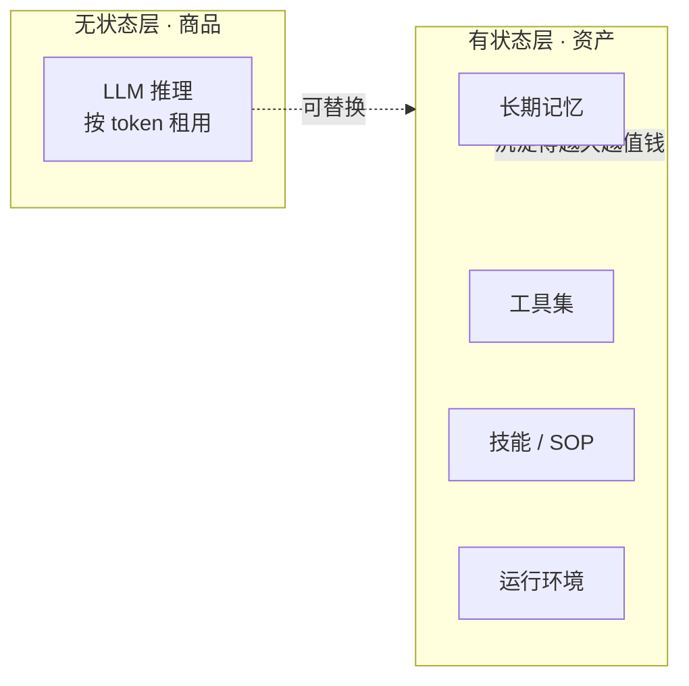
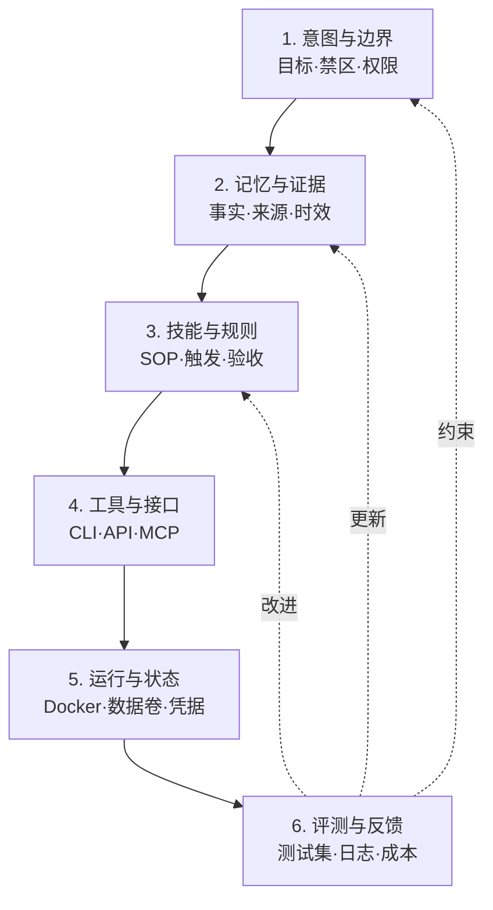

## 德说-第531期, 我的 AI “屠龙刀”来了  
  
### 作者  
digoal  
  
### 日期  
2026-08-01  
  
### 标签  
AI , Agent , 屠龙刀 , 生产力工具 , docker , image , 教学 
  
----  
  
## 背景 
  

  
前几天见了 2 位朋友之后, 他们 AI 用得很溜, 最关键的是已经进入悠闲状态, Token 被压榨的干干的, 他们的 Agent 被安排得明明白白, 进入了高质量、高频率的交付状态.  
  
我这不是赶紧回来打磨我的屠龙刀嘛.  
  
我的判断是, 未来每个人都要打磨自己的屠龙刀: 也就是自己用得顺手的 AI 工具, 现在看来应该就是 Agent, 所谓 Agent 产品包括 Hermes, Claude, Qoder 等.  
  
所谓顺手, 评判标准可能无法数字衡量, 但可以定性: 屠龙刀能发挥出你的最大潜能, 能把你的想象力变成执行力和交付物.  
  
那这把屠龙刀是什么样的产品形态?  
  
首先, 屠龙刀必须是适合自己的, 那就必须是与自己需求匹配的.  
  
我把 AI Agent 拆成 2 个部分来看, 一个是有状态的、一个是无状态的.  
  
1、无状态的是 LLM , 也就是大脑服务. 包括推理、多模态等模型供应商.  
  
你别唱反调, LLM 之所以对你来说是无状态的, 因为你可以随时换供应商.  
  
最关键的是, 每家供应商的 LLM 都在进化, 进化需要投入大量算力, 购买高质量训练素材, 你自己根本玩不起, 租用对你来说才是是最划算的.  
  
2、对你来说有状态的是什么?  
  
你的 Agent (也可以算作工具).  
  
你用 Agent 产生的长期记忆.  
  
你用 Agent 时调用的工具: 包括你用到过的所有程序(特别是高频率的), Agent 使用时可能调用到的任何工具. 包括但不限于垂直领域工具、Agent 编排工具等, 特别是常用的, 也包括被调用的外部服务.  
  
你的技能: 你常用的技能(包括 SOP + 依赖的工具等).  
  
我们要打磨的屠龙刀就是以上这些东西.  
  
而“Agent、工具、记忆、技能”这些东西需要一个运行环境.  
  
这个运行环境应该是稳定的、可随时随地拉起、可在多种平台或本地启动的.  
  
相信你已经想到了, 把运行环境封装成 Docker 镜像、ECS 镜像.  
  
把有状态的东西保存下来, 运行实体随便换, 可以是本地笔记本、也可以是云端虚拟主机.  
  
我已经把上面提到的这些运行环境封装成了 Docker 镜像, 好处有 2 点: 一是容器在隔离环境跑, 够安全, 它可以任意发挥, 不会因为权限问题束缚它的手脚; 二是它可以随时随地迁移到其他地方运行, 也容易交付.  
  
接下来要做的就是用起来, 压榨 token, 让屠龙刀把我的想象力变成执行力和交付物. 使用过程中让这些有状态内容(长期记忆、工具、技能等)不断的积累、沉淀、进化. 这是我目前打磨屠龙刀的方式.  
  
[《屠龙刀制作过程》](../202607/20260730_02.md)  
  
聪明的你一定想到了, 这些状态保存在一个共享的地方是不是更好? 没错.  
  
其实最好的形态应该是把有状态的这个部分放到一个可在任意地方访问到的地方. 目前最合适的似乎是 ECS + 云 NAS ?  现在云服务厂商已经在争夺这块市场, 例如 claudeflare 推出 computer 可让你在对象存储中存储 AI 持久化状态, 并开源了该项目: https://github.com/cloudflare/computer   
  
你怎么看?  
  
-----

# 屠龙刀没那么好拿：2026 年你的个人 AI 资产该怎么磨

两个朋友的下午茶。一个说他把 AI Agent "安排得明明白白"——周报、研报、代码 review、客户邮件，全跑完了，他只负责签字。另一个说他每天烧几块钱 token 跑 Agent，但反而比去年更忙。

为什么同样用 AI，过法差距这么大？因为两个人对"屠龙刀"的认知不一样：一个在搭自己的资产，一个只是在消费云上的算力。这背后是 2026 年最值得想清楚的一道个人选择题：你的屠龙刀，到底该不该磨？磨的话，磨成什么样？

## 先把屠龙刀拆开看一眼

用户提的"屠龙刀"由两层东西组成：

- **无状态的 LLM（大脑）** ：你按 token 付费调用的那个推理模型。
- **有状态的个人资产（你的私货）** ：记忆、工具、技能、运行环境。

这两层的经济学逻辑完全不同，所以分开对待是理性的：

**LLM 这一层是规模经济**。前沿模型训练成本动辄上亿美金、自家迭代周期约 6 个月，单价曲线每年下沉约一个数量级。 **任何个人都不该和这条曲线硬刚**。

**你的状态层是长尾经济**。你用得越久，Skill、记忆、工具组合越独特，切换成本反而越高——别人想抄都抄不走。

云经济学有句朴素的原则：凡是别人能做得比你好 10 倍还便宜的事，你都不要自己造。LLM 是这句话在 2026 年最典型的注解。

所以个人理性的打法： **把大脑外包，把状态留给自己**。这就是"屠龙刀"经济学的全部内核。

## "悠闲"到底是怎么来的

有个反直觉的事实： **单位时间劳动感知成本 ≠ 单位时间实际消耗**。

心流理论里有个老说法——当挑战和技能匹配时，主观时间会变慢，人觉得自己在做"顺手"的事。AI Agent 时代的"悠闲"是这个效应的放大版：

- 高效的 Token 利用，让每次交互都有密度——没有废话，也不用反复 prompt；
- 缓存和上下文工程，让反复执行同一个 SOP 几乎零成本，试探的心理门槛降低；
- 你不用盯着账单，注意力被释放出来想"我到底要什么"。

但这里有个常被忽略的前提： **那种"晒 Agent 悠闲"的人，通常任务本身已经被高度结构化**。你的 SOP 写不写得清楚，决定了 Agent 是替你省心还是替你烧钱。没有清晰的输入输出契约，再便宜的 token 也买不到悠闲。

- **成立条件**：工作能在 1–10 分钟内被拆成子任务，每个子任务有明确成功标准。
- **不成立**：写小说、哲学思辨这类需要"无目的探索"的场景——Token 压榨反而把节奏压死。
- **证伪信号**：Token 效率 η 在提升，但你仍然焦虑——问题不在工具，在任务定义本身不清楚。

## 个人状态层到底沉淀什么

这一块的分歧最大。我整合三份专家稿件后，建议以"控制面"为主轴，把"提效手段"作为可选模块挂上去——避免分类爆炸，也维护得起。

最容易被遗漏的是首尾两端——意图/边界和评测/反馈。前者回答"什么不做、谁能批准、最坏能做什么"，后者回答"做对了没有"。没有这两层，沉淀再多也只是在堆库存。

顺带提醒一下：六层不是"六件都要建齐"——前 6 个月你能稳定维护 3 层（记忆 + 技能 + 评测）已经是高手。绝大多数个人用户在"维护系统"这一步就先掉队了——Stack Overflow 2024 的调查显示，全球开发者里只有约 38% 在生产环境用过 Docker Compose，更别提六层那种维护强度。如果你对 Docker 七件套感到陌生，下面这段对你会更重要。

## Docker 镜像是壳，不是魂

"Docker + 私有状态 = 一键搬家"是个危险的简化。

Docker 能封装：操作系统层、依赖、CLI、Python/Node 环境、默认配置、隔离边界、启动脚本。这是它的强项。

它**不**天然封装：

- 云端 OAuth 授权、API key、短期 token；
- 外部 SaaS 的数据、限流、版本变化；
- GPU 驱动、浏览器显示、硬件密钥；
- 你的隐性判断、最新记忆、团队关系；
- 模型供应商的行为差异和缓存策略。

所以真正可迁移的单元不是"一个镜像"，而是： **镜像 + 配置声明 + 密钥引用（不进镜像） + 数据/记忆迁移包 + 工具注册表 + 评测集 + 恢复脚本**。可迁移性的检验标准是"在新机器恢复后能否通过端到端验收测试"，不是"镜像能不能起来"。

最常见的失败案例：用户把整套 Agent 环境打包成 50GB 镜像，迁移后启动要 30 秒以上，日常开发摩擦反而比价值大。这种过度封装通常意味着该拆分了。

## 租用 vs 自建：那条经济学曲线

LLM 价格走势的真相是"双轨"——

入门模型（能覆盖 80% 任务的那种）确实在 2022–2026 年暴跌。2022 年 11 月 GPT-3.5 输入价约 $20/M token，2024 年 8 月 Gemini-1.5-Flash 跌到 $0.23/M，**降幅约 87 倍**（不是某些文章里写的 266 倍——那是算错了）。到 2026 年中，普惠级模型已经能做到 $0.008–0.015/M，缓存命中价更低。

但旗舰模型反着走：近两年因为新分词器、新能力叠加，实际开销是**涨**的，俗称"LLMflation"。

所以个人最优策略是**模型路由**：95% 用便宜模型（DeepSeek / Gemini Flash / Claude Haiku），4.9% 用中端（GPT-5.x 中档 / Claude Sonnet 中档），0.1% 用旗舰——只在"高价值、低频、不可重试"的场景（比如合同审阅、关键决策分析）才上 Opus 级别。

盈亏平衡点粗算：月调用量 < $5000 永远租用划算；> $50000 才考虑自建推理。

不过这话也有边界——

- **强合规场景**（医疗病历、未公开财报、跨境数据）：自建的真实价值远高于盈亏算式所算，你买的不是算力而是合规保险；
- **持续涨价风险**：旗舰反涨的同时，开源模型能力差距在收窄（DeepSeek V4、Qwen3 与闭源旗舰的 benchmark 差距已 < 10%），自建的"保险价值"在上升；
- **极低延迟**（HFT、风控）：必须自建 + 边缘部署，租用不可行。

还有一条容易被忽略的事实：旗舰模型这一档价格曲线确实在涨，但入门模型 V3→V4 半年的降幅也明显趋缓（DeepSeek V3 的 $0.27/M 到 V4 的 $0.28/M，几乎没动）。这说明"年降 10 倍"的故事主要发生在 2022–2024，2026 年的入门模型已接近价格底板——别指望明年还能腰斩。

## 2 年到饱和，但不要过度乐观

一个常见的乐观估计是："个人 Agent 资产 18–36 个月达到 90% 饱和"。

背后是个简单模型：沉淀速度正比于已有资产（复利），减去折旧（Skill 过期、记忆遗忘、API 改版）。直觉上，前半段快、后半段慢，2 年后边际收益明显衰减。

不过这话也得有个边界——模型假设折旧率 δ 是常数，但实际它受三件事牵动：

- **模型代际周期约 6 个月**，一次大版本升级可能让原有 Skill 大面积失效；
- **工具 API 改版更频繁**（Slack、Notion API 平均每月 1.2 个小版本）；
- **你自己的 SOP 风格会随工作内容演化**。

把这三个变量算进去，δ 可能比隐含假设高，**饱和时间会缩短到 9–18 个月，饱和上限也更低**。所以"2 年到饱和"是乐观估计，不是承诺——尤其当你的工作领域本身就在快速演化时。

更要紧的是： **到了饱和点，并不意味着"自建"才是终点**。当你的核心工作流稳定下来、需要协作或合规兜底时，把部分任务切回 Cursor、Notion AI、Devin 这类 SaaS Agent 往往更省心。最优策略是**混合**：核心工作流自建，协作 / 合规 / 大用量场景切 SaaS。

## 屠龙刀不适合谁

必须正面回答这个问题——这是大多数"AI 资产"文章共同的盲点。

下面这些用户，自建屠龙刀很可能不划算，建议直接用现成 SaaS Agent：

- **任务高度标准化**：客服、初稿写作、SEO 文章、模板化代码。SaaS Agent 已经把这类任务做成一键功能，自建优势撑不过 6 个月；
- **没有技术背景**：Docker、七件套、模型路由——这些概念本身就需要一定的工程直觉。维护成本很可能超过节省的时间；
- **没有跨环境迁移需求**：你就在一台笔记本上工作，没有合规和审计要求，那"可迁移性"对你就是伪需求；
- **没有高频复用场景**：一次性翻译、数据清洗一次就完事——沉淀本身就不划算。

判断标准很简单： **连续 3 个月，你花在维护这套系统上的时间 > 节省的时间，就该考虑切回 SaaS**。技能、记忆、评测都不是越多越好，而是越锋利越好。

## 怎么打磨——一套可执行的路线

最后给一套能落地的路线图，6 个阶段：

**阶段 0：建立基线（0–1 个月）**
选 3–5 个真实高频任务，记录两周：频率、人工耗时、返工、失败损失。没有基线就证明不了系统有用。

**阶段 1：保留执行轨迹（1–2 个月）**
每次让 Agent 做事，保存任务说明、关键上下文、最终产物和你的修改。优先沉淀"你为什么改"——这是最稀缺的个人判断数据。

**阶段 2：从重复纠正中提取 Skill（2–4 个月）**
同一纠正出现第二次进入规则候选；同一流程稳定出现三次进入 Skill 候选。先写触发条件、反例、验收标准，再写详细步骤。

**阶段 3：确定性优先（4–6 个月）**
能用普通代码、模板、数据库约束解决的，不交给 LLM 猜；能用固定工作流解决的，不升级成自由 Agent。LLM 只承担语义模糊、需要判断的节点。

**阶段 4：按风险授予权限**
- R0 只读（搜索、读取）：可自动运行；
- R1 可逆写入（工作区草稿）：自动 + 日志；
- R2 外部影响（发邮件、发布）：执行前人工审批；
- R3 高价值/不可逆（删除、支付、法律承诺）：双重审批或禁止 Agent 直接执行。

**阶段 5：每月做三种"磨刀"**
删（弃用低触发、过期、重复 Skill）、测（跑回归集和恢复演练）、炼（把高频人工修改转成规则或评测样本）。

**阶段 6：季度做替换演练**
换一个模型或新环境，跑核心任务集。若通过率显著下降，记录耦合点；若无法恢复，说明资产仍被当前平台绑定。

## 收尾

回到开头的两位朋友。

悠闲的那位，不是因为他买的模型更贵，而是他**把任务拆得很清楚，把记忆和 SOP 留在了自己手里**；忙的那位，不是因为他不够努力，而是他一直在重新发明已经发明过的东西。

屠龙刀不是某个 Agent 产品，更不是越来越大的知识库。它是 **LLM 商品层 + 个人状态层** 的乘积——大脑外包给云，你自己的判断、流程、记忆和工具留给自己。

2026 年是个人 AI 资产沉淀性价比最高的一年。你不必自建，但你要想清楚该沉淀什么、不该沉淀什么。然后用一个季度的执行，建立你自己的基线。

*延伸阅读：Anthropic《Building Effective Agents》（2024-12）讲 Agent 设计原则，《Equipping Agents for the Real World with Agent Skills》（2025）讲 Skill 工程化，MCP 规范定工具协议，Forte 的《Building a Second Brain》定老牌知识沉淀框架，Docker 官方文档定容器化执行环境。这些是后面写代码、挑框架时真正会用到的一手资料。*  
  
  
#### [PostgreSQL 解决方案集合](../201706/20170601_02.md "40cff096e9ed7122c512b35d8561d9c8")
  
  
#### [德哥 / digoal's Github - 公益是一辈子的事.](https://github.com/digoal/blog/blob/master/README.md "22709685feb7cab07d30f30387f0a9ae")
  
  
#### [About 德哥](https://github.com/digoal/blog/blob/master/me/readme.md "a37735981e7704886ffd590565582dd0")
  
  

  
