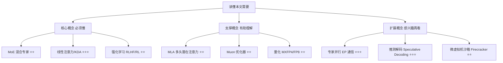
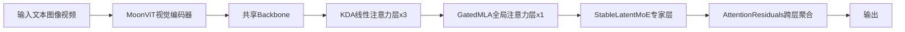

## AI论文解读 | Kimi K3: Open Frontier Intelligence 

### 作者
digoal

### 日期
2026-08-01

### 标签
AI , LLM , Kimi , K3 

----

## 背景
  
> **原文信息**：Kimi Team（月之暗面）| 2026 年 7 月 | arXiv 技术报告  
> **原文链接**：https://arxiv.org/abs/2607.24653  

---

## 📍 论文定位

**一句话**：Kimi K3 是一个 2.8 万亿参数（激活 1040 亿）的原生多模态混合专家（MoE）大模型，支持 100 万 token 上下文，通过全新的注意力机制、MoE 结构和训练基础设施，把开源模型的能力又往前顶了一大截，逼近 Claude Fable 5、GPT-5.6 Sol 这些顶级闭源模型。

**🎓 学术价值**：把"预训练规模"和"推理期强化学习规模"这两条此前分头发展的扩展曲线，第一次在 3 万亿参数级别上同时拉满，并且系统性验证了线性注意力（KDA）、跨层注意力（Attention Residuals）、超稀疏 MoE（896 选 16）在超大规模下能不能训得稳、训得动。

**🏭 工业价值**：论文里几乎一半篇幅在讲"怎么把这么大又这么怪的模型跑起来"——包括怎么让显存不爆、怎么让 100 万 token 的推理不卡死、怎么在生产环境里调度请求。这些工程方案（如 MoonEP、AgentENV 沙箱、KDA 前缀缓存）本身就是可以直接借鉴的数据库/系统工程经验。

**💡 直觉类比**：如果把模型当成一家超大公司来看，传统 Transformer 像是"每个人开会都要把之前所有会议记录再翻一遍"（KV Cache 随长度线性增长）；Kimi K3 的 KDA 更像是"每个人脑子里维护一份浓缩笔记，边听边更新，不用每次都翻旧账"；而 Attention Residuals 则像是给每一层配了一个"跨层的检索员"，可以直接问更早的楼层要资料，而不是只能问楼下一层传上来的二手消息。

---

## 🗺️ 知识地图

- **MoE（混合专家）** ：把一个巨大的前馈网络拆成很多"小专家"，每次只激活其中一小部分。就像医院不会让每个病人见遍所有科室医生，而是分诊到对应的专科。
- **线性注意力 / KDA**：传统注意力要记住所有历史 token（缓存随长度线性增长），线性注意力用一个"固定大小的状态"来压缩历史，类似只记笔记摘要而不是全程录音。
- **强化学习（RL）** ：让模型在"做题—给分—调整"的循环里自我改进，类似让实习生反复做项目、每次根据结果反馈调整下一次的做法。

---

## 🔬 论文精读

### Why — 研究动机

现有开源模型的困境：LLM 的能力提升有两条路——**预训练时把模型做大**，和**推理时让模型多想（reasoning/RL）** 。近两年开源社区在"多想"这条路上追得很猛，但"做大"这条路却停滞了，大多数开源模型还停留在 1 万亿参数级别左右，而顶级闭源模型（Claude、GPT 系列）继续在预训练规模上遥遥领先。如果只卷推理效率，不卷模型本体规模，开源和闭源的差距会越拉越大。

| 维度 | 之前的开源模型 | Kimi K3 |
|---|---|---|
| 参数规模 | 多在 1T 级或以下 | 2.8T（激活 104B） |
| 上下文长度 | 通常 128K | 1M token |
| 扩展策略 | 主要靠推理时增加思考量 | 预训练规模 + 推理规模同时拉满 |
| 视觉能力 | 大多后接式对齐 | 原生多模态，从头训练 |

### What — 核心方法

Kimi K3 的架构围绕"信息如何在序列长度、网络深度、模型宽度这三个维度流动"来设计：

每个 Block 包含 3 层 KDA（负责长序列高效混合）+ 1 层 Gated MLA（负责全局注意力），配合 Attention Residuals（让每层能有选择地读取更早层的输出，而不是只能顺序累加），再配上 Stable LatentMoE（896 个路由专家，每 token 激活 16 个）。这套组合拳带来了相对上一代 Kimi K2 约 2.5 倍的整体训练效率提升。

### How — 具体怎么实现的

**1）Kimi Delta Attention (KDA)** ：在 delta-rule 循环基础上加入按通道的遗忘门。核心更新公式：

$$S_t = (I - \beta_t k_t k_t^\top)\text{Diag}(\alpha_t) S_{t-1} + \beta_t k_t v_t^\top$$

白话解释： $S_t$ 是一个固定大小的"记忆状态"，每来一个新 token，就按 $\alpha_t$ （衰减因子）先淡化旧记忆，再按 $\beta_t$ 的强度把新信息写进去——类似一块可反复擦写的白板，而不是无限长的记录纸。

论文还把衰减的参数化方式从 Kimi Linear 用的"无下界负 Softplus"改成了"下界 Sigmoid"，把衰减值限制在一个有限区间内，这样在做分块并行计算时，所有的乘法都能用 GPU 的 Tensor Core 稠密算子来加速，不用再对角线特判，工程上更快。

**2）Attention Residuals (AttnRes)** ：常规的残差连接把所有历史信息压缩进一个状态往下传（有点像接力赛只能传给下一棒），AttnRes 则让每一层用一个可学习的"伪查询"去对之前所有层的输出做注意力检索，按需读取，而不是被动接收。为了控制计算和显存开销，实际用的是"分块版"（Block AttnRes）：把几十层分成 8~9 个块，块内顺序累加，块间做注意力，兼顾效果和效率。

**3）Stable LatentMoE**：把路由专家的宽度和整个模型的主宽度解耦——专家在一个更窄的"潜空间"里工作，这样即使把专家数扩到 896 个（每次激活 16 个），通信和计算开销也不会跟着爆炸。为了在这么极端的稀疏度下不训崩，论文引入了三个稳定手段：
- 在专家聚合后、上投影前插入 RMSNorm；
- 提出 SiTU-GLU 激活函数，用双曲正切给 SwiGLU 的两个分支都加"软上限"，防止数值爆炸；
- 提出 Quantile Balancing（分位数负载均衡），通过读取每个专家的打分分位数来直接算出负载均衡所需的偏置，比传统的"固定步长调整"收敛更快更稳。

**4）原生多模态**：视觉编码器 MoonViT-V2 完全从零训练（不像上一代借助预训练的 SigLIP 初始化），原因是发现联合优化时预训练视觉编码器会导致梯度范数持续偏高、频繁震荡，从零训练反而更稳定，且最终效果不输预训练初始化方案。

**5）后训练三段式**：SFT（监督微调打地基）→ RL（在通用、智能体、代码三大领域，各自训练 3 种"思考强度"共 9 个专家模型）→ **多教师同策略蒸馏（MOPD）** ，把 9 个专家模型的能力融合进一个统一模型。RL 阶段用"部分 rollout"机制缓解长尾延迟：不用等一批任务全部做完，做完一定比例就先去更新策略，未完成的任务留到下一轮继续。

### So What — 结果怎么样

| 能力维度 | Kimi K3 表现 |
|---|---|
| GPQA Diamond（研究生级推理） | 93.5%，接近顶级模型 |
| ProgramBench（编程） | 77.8%，排名第一 |
| SWE-Marathon（GPU 内核优化） | 42.0%，领先 Claude Fable 5 约 7 分 |
| BrowseComp（浏览类智能体任务） | 91.2%，排名第一 |
| DeepSearchQA / MCPMark-Verified | 均为第一 |
| GDPval-AA v2（知识工作 Elo） | 1686，排第三，落后 Claude Fable 5 |
| HLE-Full（研究级推理，无/有工具） | 43.5% / 56.0%，落后 Fable 5 和 GPT-5.6 Sol |

总体而言：Kimi K3 在编程、浏览类智能体任务上做到了业界第一梯队甚至第一名，但在最难的"研究级推理"（HLE-Full、CritPt）和"高端知识工作"（GDPval-AA v2）上，仍落后于 Claude Fable 5 和 GPT-5.6 Sol 这两个最强闭源模型。消融实验也表明：cosine 学习率衰减在同等最优超参下持续优于 WSD；从零训练视觉编码器不仅更稳，效果也不输预训练初始化。

### Now What — 对我们意味着什么

**学术界**：证明了线性注意力（KDA）+ 跨层注意力（AttnRes）+ 超稀疏 MoE 这套组合在 3 万亿参数级别依然可以稳定训练，为后续开源大模型架构设计提供了一条可复制的路径；同时 Quantile Balancing、SiTU-GLU 这类"专治超稀疏 MoE 数值不稳定"的技巧，对做 MoE 相关研究的人有直接参考价值。

**工业界**：论文里公开的系统工程方案（MoonEP 专家并行、KDA 前缀缓存、AgentENV 微虚拟机沙箱、budget-based 准入控制）都是可以直接学习借鉴的大规模分布式系统设计范式，尤其对做数据库/存储系统、需要处理"超长上下文缓存复用"和"负载极不均衡的调度"问题的工程师，有很强的参照意义。

---

## 📖 术语词典

### Mixture-of-Experts / MoE（混合专家）
- **是什么**：把一个大的前馈网络拆分成多个"专家"子网络，每个 token 只激活其中一小部分专家参与计算。
- **为什么重要**：能在总参数量很大的情况下，让实际计算量（激活参数）保持较小，做到"参数多但跑得动"。
- **现实类比**：医院分诊——病人（token）不需要看遍全院医生，只需要看被分配到的几位专科医生（激活的专家）。

### KDA（Kimi Delta Attention，线性注意力的一种）
- **是什么**：一种用固定大小的循环状态替代传统注意力"无限增长的 KV 缓存"的机制，并加入按通道的衰减门控。
- **为什么重要**：让处理超长序列（百万 token）的显存和计算开销不再随长度线性膨胀。
- **现实类比**：记读书笔记而不是录音——笔记大小基本固定，读得越多只是不断更新笔记内容，而不是无限堆积录音带。

### Attention Residuals / AttnRes（注意力残差）
- **是什么**：让模型每一层用注意力机制，有选择性地从之前所有层（而不只是紧邻的上一层）读取信息。
- **为什么重要**：突破了传统残差连接"信息只能逐层累加传递"的瓶颈，让深层网络更容易利用浅层的原始信息。
- **现实类比**：查资料库而不是传话游戏——每一层需要什么信息，可以直接去"档案室"（之前所有层的输出）里精准检索，而不是靠层层转述容易失真的口口相传。

### Stable LatentMoE
- **是什么**：把 MoE 的路由专家放到一个更窄的"潜空间"里计算，并配合归一化、特制激活函数、分位数负载均衡三项稳定手段。
- **为什么重要**：让专家数量可以扩展到 896 个（极端稀疏）而不至于训练崩溃或负载严重不均。
- **现实类比**：给会议室做隔音降噪改造——房间（专家）多了容易吵（数值爆炸/负载不均），加上隔音材料和调度员（归一化、SiTU-GLU、Quantile Balancing）之后，再多的房间也能有序运转。

### Quantile Balancing（分位数负载均衡）
- **是什么**：通过读取每个专家打分的分位数，直接计算出让专家负载均衡所需的路由偏置，而不是像传统方法那样按固定步长慢慢调整。
- **为什么重要**：在专家数量成百上千的规模下，传统方法收敛慢、容易震荡，这个方法一步到位。
- **现实类比**：按需分单而不是随机试错——外卖平台如果按每个骑手历史接单量的分位数直接算出该派多少单给谁，比"派错了再慢慢纠正"要快得多。

### MOPD（Multi-Teacher On-Policy Distillation，多教师同策略蒸馏）
- **是什么**：把多个针对不同领域、不同"思考强度"训练出来的专家模型，通过蒸馏融合进一个统一的模型。
- **为什么重要**：避免了"一个任务一个模型"的碎片化局面，让用户最终只需要面对一个统一、全能的模型。
- **现实类比**：把多位专科医生的诊断经验，教给一位全科医生，让病人不用再挂多个号。

### 推测解码 / Speculative Decoding
- **是什么**：用一个小的"草稿模型"先快速生成候选 token，再用大模型一次性验证，通过的部分直接采纳，从而加速推理。
- **为什么重要**：大幅降低生成延迟，尤其在长文本、长对话场景下效果明显。
- **现实类比**：先让助理起草文件，老板只需要审核签字，而不是从零口述每一个字。

### MXFP4 量化感知训练（QAT）
- **是什么**：在训练阶段就让模型适应"部署时会被压缩到极低精度（4 比特）"这件事，而不是训练完再压缩。
- **为什么重要**：能在大幅降低部署内存和成本的同时，尽量减少精度损失带来的效果下降。
- **现实类比**：提前用压缩版教材学习，考试也用压缩版考卷，这样正式"部署上考场"时不会因为格式变了而不适应。

### AgentENV（基于微虚拟机的沙箱系统）
- **是什么**：为智能体训练和评测设计的、基于 Firecracker 微虚拟机的隔离沙箱，支持增量快照、暂停恢复、分叉等操作。
- **为什么重要**：智能体训练需要极高的环境保真度和隔离安全性（防止越权操作破坏宿主机），同时又要能大规模、低成本地创建和恢复沙箱。
- **现实类比**：给每个实习生一台"一次性练习用虚拟电脑"，可以随便折腾、随时存档重来，出问题也不会影响真实生产环境。

---

## ⚖️ 批判性评估

### 1. 假设前提的合理性

论文默认"预训练规模扩大 + 推理期强化学习规模扩大"两条路同时推进就一定带来能力提升，但并未充分讨论这种"双轴同时扩展"是否存在收益递减的临界点——2.5 倍效率提升是相对 Kimi K2 的相对值，缺少与业界其他"双轴扩展"尝试的横向对比，实际收益边界仍不明确。此外，KDA 用"无显式位置编码 + 循环衰减"来隐式编码位置信息，这一设计能否在远超 1M token（比如未来 10M 级别）的场景下依然成立，论文没有给出实验验证，属于尚待检验的假设。

### 2. 实验设计的可质疑之处

- **基线对比的公平性**：论文明确指出"Claude Fable 5 的结果包含 fallback 行为"、"GPT-5.6 Sol 的结果包含潜在的 cyberguards"，但对这些机制具体如何影响分数、影响幅度多大缺乏细节说明，这让跨模型横向对比的严谨性打了折扣。
- **评测环境不一致**：论文提到 SWE-Marathon 是基于 H20（而非官方标准的 H100）重新校准的分支版本，PostTrainBench 也是在 H20 上跑的，硬件平台的差异可能给不同模型带来不等价的评测条件。
- **第三方数据来源较多**：不少关键指标（GDPval-AA v2、AA-Briefcase、CorpFin v2 等）直接引用自 Artificial Analysis、Vals AI 等第三方平台的截止到特定日期的快照，而非作者自行完整复现，数据的可追溯性和稳定性依赖外部机构。

### 3. 方法的适用边界

- 在最考验"研究级推理深度"的 HLE-Full、CritPt 两项基准上，Kimi K3 明显落后于 Claude Fable 5 和 GPT-5.6 Sol，说明当前架构和训练配方在"深度学术级推理"上仍有天花板，2.8T 参数的规模优势并未完全转化为顶级推理能力。
- 训练和推理都依赖大量定制化的系统工程（MoonEP、KDA 专用内核、AgentENV 沙箱等），这些基础设施的复杂度和迁移成本很高，中小团队难以直接复现整套体系，实际上抬高了"开源"模型的真实使用门槛。
- 100 万 token 上下文虽然理论上可用，但论文自己也提到 BrowseComp 等评测中默认在 30 万 token 时触发"上下文压缩"策略，说明真正把上下文用满到 100 万时，仍需要额外的工程手段来维持效果和效率，并非"开箱即用"的无损长上下文。

### 4. 未来改进方向

- 作者自己指出的方向：研究级推理（HLE-Full、CritPt）和顶级知识工作场景（GDPval-AA v2）仍是关键短板，需要进一步改进。
- 从读者角度看，还可以关注：(1) 能否给出更细粒度的"思考强度—效果—成本"三者之间的量化权衡曲线，帮助使用者按场景选择合适的 reasoning effort；(2) 论文中大量提到的"reward hacking 检测"（如 GPU 内核优化任务中的作弊检测）是否也适用于更广泛的开放式智能体任务，这部分的可推广性有待验证；(3) 原生多模态从零训练视觉编码器这一设计选择，在更小规模模型上是否同样成立，值得做进一步的规模消融实验。

---

## 📚 参考资料

- 原文链接：https://arxiv.org/abs/2607.24653
- PDF：https://arxiv.org/pdf/2607.24653
- 模型权重：https://huggingface.co/moonshotai/Kimi-K3
- 相关工作：Kimi Linear（KDA 来源）[63]、Attention Residuals [57]、Kimi K2 [58]、Kimi K2.5 [59]、DeepSeek-V2（MLA 来源）[28]、DeepSeekMoE [23]、Muon 优化器 [53]、EAGLE-3 [71]
- AgentENV 开源地址：https://github.com/kvcache-ai/AgentENV
- MoonEP 开源地址：https://github.com/MoonshotAI/MoonEP
  
  
#### [PostgreSQL 解决方案集合](../201706/20170601_02.md "40cff096e9ed7122c512b35d8561d9c8")
  
  
#### [德哥 / digoal's Github - 公益是一辈子的事.](https://github.com/digoal/blog/blob/master/README.md "22709685feb7cab07d30f30387f0a9ae")
  
  
#### [About 德哥](https://github.com/digoal/blog/blob/master/me/readme.md "a37735981e7704886ffd590565582dd0")
  
  

  
