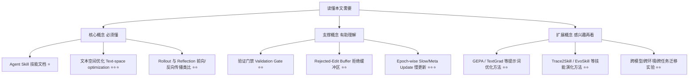
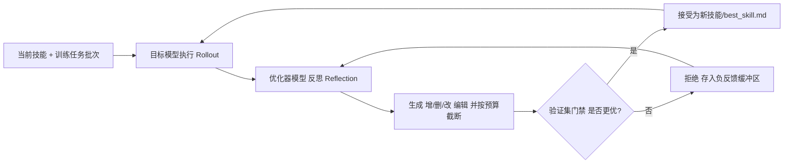

## AI论文解读 | SkillOpt: Executive Strategy for Self-Evolving Agent Skills

### 作者
digoal

### 日期
2026-08-01

### 标签
AI , LLM , Agent , Skill , 进化 , 训练 

----

## 背景
  
> **原文信息**：Yifan Yang 等（Microsoft、上海交大、同济大学、复旦大学）| 2026年5月 | arXiv 预印本  
  
  
---

## 📍 论文定位

**一句话**：这篇论文把"给 Agent 写技能（Skill）"这件事，从"人工写/一次性生成/随意自我修订"，变成了一套像深度学习训练一样有章法的**文本空间优化流程**——用一个独立的"优化器模型"根据执行结果不断给技能文档打补丁，只有在验证集上确实变好才接受这次修改。

**🎓 学术价值**：目前 Agent Skill（比如 Claude 的 SKILL.md、各种 Agent 的技能文件夹）大多靠人工撰写、LLM 一次性生成，或者松散的"自我反思式"迭代，没有人系统地把"训练一个权重模型"的那套纪律——批次、学习率、验证集门禁、动量——搬到"训练一份文本"上。本文首次做了这件事，并在 6 个基准、7 个目标模型、3 种执行环境（直接对话、Codex、Claude Code）共 52 个格子上做了系统对比，全部拿到最优或并列最优。

**🏭 工业价值**：对于像你（Digoal）这样在给 Anolis SkillHub 写 PostgreSQL 技能包、或者写各种通用型 AI Agent 技能的人来说，这篇论文提出的"技能优化器"思路直接可以拿来做**技能的自动打磨与验证**：不再是写完一版技能就上线，而是用一批真实任务的执行轨迹反复"训练"这份 SKILL.md，用留出的验证任务集把关，只保留确实提升准确率的修改，最终产出一份 300～2000 token 左右、可读、可审计的技能文件。

**💡 直觉类比**：可以把这篇论文想象成"给 Agent 的作业本请了一位家教"。Agent（模型权重）本身不变，但它随身携带的那份"操作手册"（技能文档）会被一个更聪明的"家教模型"根据一批批做题结果反复批注、增删——每次修改前先在小测验（验证集）上试一试，考得更好才留下，考差了就作为"以后别这么改"的教训记下来。几轮下来，这本手册就从粗糙的草稿变成了一份精炼、经过实战检验的操作指南。

---

## 🗺️ 知识地图

### 核心概念三件套

**Agent Skill（智能体技能）**
- **是什么**：一段插入到 Agent 上下文（系统提示词或持久化记忆）中的自然语言"操作指南"，打包了做事的流程、领域经验、工具调用规范、输出格式要求、常见失败模式的应对方法。
- **为什么重要**：在闭源前沿模型无法微调权重、开源模型微调又很贵的情况下，技能文档是让"冻结的模型"获得领域适应能力的最轻量接口。
- **现实类比**：就像给一位业务熟练但刚入职的新员工发一本"部门操作手册"——员工的能力（模型权重）没变，但手册教会了他怎么在这个具体岗位上把活干好。

**文本空间优化（Text-space Optimization）**
- **是什么**：不改模型权重，而是把"技能文档"本身当成可优化的对象，用一个独立的"优化器模型"根据执行反馈，对这份文档做有限、可控的增/删/改操作。
- **为什么重要**：这是本文和以往"一次性生成技能"或"随意自我修订"方法的根本区别——它引入了深度学习训练那套纪律（批次、学习率、验证门禁），让每一次修改都是"可控的"，而不是无限制的自由重写。
- **现实类比**：好比修改一份法律合同，不是每次都推倒重写整份合同，而是像修订法条一样，一次只改动有限的几条，改完还要经过审核（验证集）才能生效。

**Rollout（前向执行）与 Reflection（反向反思）**
- **是什么**：Rollout 是目标模型带着当前技能去做一批训练任务、产生执行轨迹和分数；Reflection 是优化器模型分析这批轨迹里的成功和失败案例，提炼出应该增删改的技能条目。
- **为什么重要**：这套"前向-反向"结构直接对应了深度学习里的前向传播（算 loss）和反向传播（算梯度），让整个技能训练过程有了清晰的阶段划分和可复现性。
- **现实类比**：就像老师批改一批学生的模拟考卷（rollout），然后总结出"大家哪里普遍丢分、哪里普遍做对了"（reflection），再决定下次课重点讲什么。

---

## 🔬 论文精读

### Why — 为什么要做这个研究？

现有的技能构建方式都有明显的短板：人工撰写的技能容易在换了新任务领域或新执行环境时"水土不服"；一次性用 LLM 生成的技能缺乏迭代打磨；而近年出现的一些"自我演化"技能系统（如 Trace2Skill、EvoSkill、SkillForge 等）虽然会根据执行经验迭代，但这种迭代大多是松散的自我修订，**没有严格的验证门禁**，也就没法保证"这一次修改真的让效果变好了"——换句话说，谁也无法保证技能是在"变好"而不是"随机游走"。

| 维度 | 之前的方法 | 本文（SkillOpt） |
|---|---|---|
| 生成方式 | 人工撰写 / LLM 一次性生成 / 松散自我修订 | 系统性、可控的批次化优化 |
| 是否有验证门禁 | 大多没有，或验证不严格 | 每次候选修改必须在留出验证集上超过当前最优才被接受 |
| 修改幅度控制 | 常常是无限制重写 | 引入"文本学习率"（edit budget），限制每步最多改动条数，并支持余弦衰减等调度 |
| 失败经验利用 | 通常被丢弃 | 保留"拒绝缓冲区"，把失败的修改尝试当作负反馈提供给后续优化 |
| 长程稳定性 | 缺乏机制 | 引入 epoch 级"慢更新/元更新"，类似动量项，跨轮次沉淀稳定规律 |

### What — 提出了什么方法/系统？

SkillOpt 的核心架构：一个**冻结的目标模型** M 带着当前技能 s 去执行任务，产生轨迹和分数；一个**独立的优化器模型**分析这些轨迹，提出结构化的增/删/改编辑；编辑经过合并、排序、按"编辑预算"截断后，形成候选技能；候选技能必须先在**留出的验证集**上跑一遍，只有分数超过当前最优才会被接受，成为新的 best_skill.md。

### How — 具体怎么实现的？

论文把整套流程拆成几个"训练组件"，每一个都能在深度学习里找到对应物：

1. **Rollout Evidence（前向证据）** ：每一步用当前技能跑一批训练任务，记录任务元数据、消息、工具调用、观察结果、最终答案、验证器反馈等。小批次更新快但噪声大，大批次能看到更多规律但更新慢——这正是深度学习里 batch size 的经典权衡。

2. **Minibatch Reflection（反向反思）** ：优化器模型把失败和成功的轨迹分开处理，分别切成反思小批次。失败小批次提炼出"缺失或需要纠正的规则"，成功小批次提炼出"应该保留的做法"。这么做是因为单条轨迹容易得到"头痛医头"的补丁，而一批轨迹能暴露真正反复出现的程序性错误（比如"总是搜错来源"、"输出格式总是不对"）。

3. **Bounded Text Updates（有界文本更新，即"文本学习率"）** ：每一步最多允许改动 $L_t$ 条（边际编辑预算），优化器把合并后的编辑池按预期收益排序，截取前 $L_t$ 条。这是和"随意提示词重写"最大的区别——不受控的重写可能删掉有用规则、引入互相矛盾的指令，或对单个失败案例过拟合。SkillOpt 支持常数、线性、余弦、自适应等多种预算调度策略，默认用余弦调度：一开始改动幅度大，逐渐衰减到小幅巩固。

4. **Validation Gate & Rejected-Edit Buffer（验证门禁与拒绝缓冲区）** ：每个候选技能都要在同一个冻结目标模型和执行环境下，跑一遍留出的验证集。分数提升才被接纳，同时超过历史最优才被导出为 best_skill.md；否则被拒绝，但拒绝的编辑连同造成的分数下降会被记入"本轮拒绝缓冲区"，提供给后续反思调用，避免重复犯错。

5. **Epoch-wise Slow/Meta Update（跨轮慢更新）** ：类似动量项，跨越多个训练轮次沉淀那些"长期稳定有效"的规律，同时不让部署的技能文件无限膨胀。

公式化地看，整个流程本质是在训练集 $D_{tr}$ 上生成候选技能集合 $\mathcal{C}(D_{tr})$ ，用验证集 $D_{sel}$ 选出最优技能 $s^\star_{sel}$ ，最后只在测试集 $D_{test}$ 上报告效果——这和标准机器学习的训练/验证/测试三分法完全对应。

### So What — 结果怎么样？

论文在 6 个基准（SearchQA、SpreadsheetBench、OfficeQA、DocVQA、LiveMathematicianBench、ALFWorld，覆盖问答、电子表格、文档理解、数学、具身决策）、7 个目标模型（从 GPT-5.5 到 Qwen 小模型）、3 种执行环境（直接对话、Codex、Claude Code）下，共 52 个（模型、基准、环境）组合中，**SkillOpt 在全部 52 个格子上都是最优或并列最优**，超过了人工技能、一次性 LLM 生成技能、Trace2Skill、TextGrad、GEPA、EvoSkill 等所有对比方法。

以 GPT-5.5 在直接对话模式下为例：

| 基准 | 无技能 | SkillOpt 提升后 | 提升幅度 |
|---|---|---|---|
| SearchQA | 77.7 | 87.3 | +9.6 |
| SpreadsheetBench | 41.8 | 80.7 | +38.9 |
| OfficeQA | 33.1 | 72.1 | +39.0 |
| DocVQA | 78.8 | 91.2 | +12.4 |
| LiveMathematicianBench | 37.6 | 66.9 | +29.3 |
| ALFWorld | 83.6 | 95.5 | +11.9 |

平均提升 **+23.5** 分（直接对话）；在 Codex 智能体循环中提升 **+24.8** 分；在 Claude Code 环境中提升 **+19.1** 分。同时，SkillOpt 相比"每个格子里表现最好的单一竞品"平均还要再高出 **+5.4** 分。值得一提的是，一些对比方法（如 TextGrad、部分人工/LLM 技能）在某些格子上反而是负收益（比如让某个基准分数下降），这说明**没有验证门禁的自由修改是有风险的**，而 SkillOpt 的门禁机制正是为了避免这种情况。

消融实验（论文正文有更详细的分析，此处摘要要点）表明：有界的文本学习率明显优于无限制重写；验证门禁能阻止有害修改累积；拒绝缓冲区把失败编辑转化为有效的负反馈；epoch 级慢更新能在不让技能文件膨胀的前提下改善长程效果。

### Now What — 对我们意味着什么？

**学术界**：这篇论文把"技能优化"明确定义为一种可控的、可复现的"域适应训练"问题，为后续研究提供了一套标准化的组件词汇（rollout batch、reflection minibatch、edit budget、validation gate、rejected-edit buffer、slow/meta update），也提供了一个能横向比较各类技能构建/演化方法的评测框架（6 基准 × 7 模型 × 3 环境）。

**工业界**：最直接的落地价值在于——**技能文档可以像模型一样被"训练"、被"验证"，然后被审计、复用、迁移**。论文的迁移实验显示：在 GPT-5.4 上训好的电子表格技能能提升所有更小的 GPT 变体；在 Codex 环境下训练出的电子表格技能迁移到 Claude Code 环境后仍能带来 **+59.7** 分的提升；在一个数学基准上训练的技能在相邻的 Omni-MATH 基准上也有正向收益。这意味着一份精心"训练"过的技能文件，价值不完全绑定在特定模型或特定执行环境上。对于持续在维护、迭代一批 PG 诊断技能、通用分析技能的场景，这提示了一条可行路径： **用一批真实任务轨迹反复验证-修订技能文档，而不是凭直觉一次性写死**。

---

## 📖 术语词典

### Agent Skill（智能体技能）
- **是什么**：插入 Agent 上下文的自然语言操作指南，包含流程、启发式规则、工具策略、输出约束、失败应对。
- **为什么重要**：是让冻结模型获得领域适应能力的核心接口。
- **现实类比**：新员工的部门操作手册。

### 冻结目标模型（Frozen Target Model, M）
- **是什么**：被优化对象——技能——所服务的执行模型，其权重在整个优化过程中始终不变。
- **为什么重要**：明确了"训练技能"和"训练模型"是两回事，前者成本低、可闭源模型上使用。
- **现实类比**：员工本人（能力不变），只是发的手册变了。

### 优化器模型（Optimizer Model）
- **是什么**：一个独立的（通常更强的）前沿模型，负责阅读执行轨迹并提出技能编辑建议。
- **为什么重要**：把"改进技能"这件事从目标模型自身剥离出来，避免自我修订的偏差和盲点。
- **现实类比**：请来的"教研组长"，专门负责根据学生考卷修订教材，而不是让学生自己改教材。

### 编辑预算 / 文本学习率（ Edit Budget, $L_t$ ）
- **是什么**：每一步优化中允许对技能文档做的最大编辑条数。
- **为什么重要**：对应深度学习里的学习率，控制每次更新的"步长"，防止修改过猛导致不稳定或过拟合到单个失败案例。
- **现实类比**：法律修订每次只改几条法条，而不是推倒重写整部法律。

### 验证门禁（Validation Gate）
- **是什么**：候选技能必须在留出的验证任务集上跑一遍，分数超过当前最优才会被接受。
- **为什么重要**：把"提出修改"和"是否生效"分开，防止看似合理的修改实际上损害目标模型表现。
- **现实类比**：新教材草案先在一个班试用、考试通过了才推广到全年级。

### 拒绝缓冲区（Rejected-Edit Buffer）
- **是什么**：记录本轮内被拒绝的编辑内容及其导致的分数下降，供后续反思调用参考。
- **为什么重要**：把"失败的修改"转化为负反馈，避免优化器反复尝试同一个无效方向。
- **现实类比**：教研组"这个教法试过了，学生成绩反而下降"的会议纪要。

### Epoch 级慢/元更新（Epoch-wise Slow/Meta Update）
- **是什么**：跨越多个训练轮次，沉淀那些反复被验证有效的长期规律，类似优化算法里的动量项。
- **为什么重要**：让技能积累"稳定方向"的改进，而不是每轮推倒重来，同时避免技能文件无限膨胀。
- **现实类比**：教材每隔几轮大修才会做一次"结构性调整"，而不是每次考试后都改版式。

### best_skill.md
- **是什么**：整个优化过程中在验证集上表现最好、被最终导出的技能文档，体积通常在 300～2000 token。
- **为什么重要**：是可部署、可审计、可迁移的最终产出物——推理阶段不增加任何额外模型调用。
- **现实类比**：几轮教研迭代后定稿、正式印刷的教材终稿。

---

## ⚖️ 批判性评估

### 1. 假设前提的合理性
论文假设"标量分数 $r(s) \in [0,1]$ "可以对每个任务的执行结果进行可靠打分——这在有明确验证器（如电子表格是否算对、代码是否跑通）的任务上是合理的，但对于开放式、主观性强的任务（比如创意写作、模糊需求的产品分析），这种标量打分本身就可能不可靠或有偏，进而影响整个优化链条的可信度。

### 2. 实验设计的可质疑之处
- 对比基线（人工技能、一次性 LLM 技能等）的"质量"本身可能参差不齐，若人工技能写得较为随意，SkillOpt 相对它的优势可能被放大；论文虽然覆盖了 6 个基准、7 个模型、3 个执行环境，规模不小，但"优化器模型"本身通常是更强的前沿模型，这意味着比较并不完全公平——SkillOpt 的部分优势可能来自"用一个更强模型去指导一个较弱模型"，而不仅仅是优化算法本身的设计。
- 验证集和测试集的划分方式、任务规模的具体数值在正文摘录部分未完全展开，这类"用了多少验证样本才能达到稳定门禁效果"的细节，直接关系到该方法在样本稀缺场景下是否依然可行。

### 3. 方法的适用边界
- 该方法依赖能反复、低成本地跑 rollout 的场景——如果目标任务的每次执行都很昂贵（比如现实世界的机器人操作、需要人工评审的任务），大批次的"训练式"优化在实际部署中可能成本过高。
- 对于"目标模型和执行环境高度耦合"的技能（比如高度依赖某个特定工具接口的格式），跨模型/跨环境迁移的效果可能不如论文中电子表格类任务那样理想。

### 4. 未来改进方向
- 论文本身在附录中提到了"Limitations"部分（本次未完整摘录），值得后续关注优化器模型的选择偏差、编辑预算调度策略的普适性、以及在更主观、更难打分的任务上如何设计可靠的奖励信号。
- 对于希望复用这套思路的读者，一个值得探索的方向是： **在样本量有限、无法支撑"大批次 rollout + 验证门禁"的场景下，如何设计更轻量的技能优化流程**——例如把这里的"批次训练"思想简化为"每次真实使用后做小幅度、有记录的增量修订"，同样保留"编辑要有限、修改要能追溯"这两条核心纪律。

---

## 📚 参考资料
- 原文链接：https://arxiv.org/abs/2605.23904
- 代码仓库：https://aka.ms/SkillOpt
- 相关工作：GEPA（反思式提示词演化）、TextGrad（文本梯度优化）、Trace2Skill、EvoSkill、SkillForge、SkillFoundry（技能构建/演化系列工作）
  
  
#### [PostgreSQL 解决方案集合](../201706/20170601_02.md "40cff096e9ed7122c512b35d8561d9c8")
  
  
#### [德哥 / digoal's Github - 公益是一辈子的事.](https://github.com/digoal/blog/blob/master/README.md "22709685feb7cab07d30f30387f0a9ae")
  
  
#### [About 德哥](https://github.com/digoal/blog/blob/master/me/readme.md "a37735981e7704886ffd590565582dd0")
  
  

  
