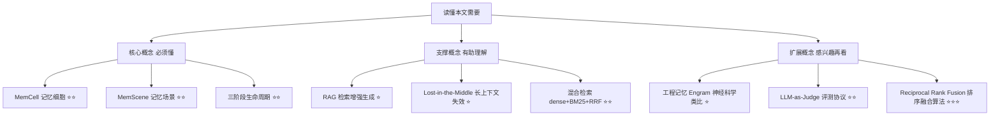
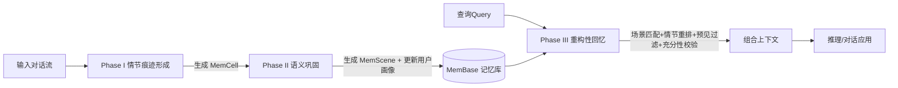

## AI论文解读 | EverMemOS: A Self-Organizing Memory Operating System for Structured Long-Horizon Reasoning

### 作者
digoal

### 日期
2026-08-01

### 标签
AI , LLM , Agent , memory , 仿生记忆系统 , EverMemOS

----

## 背景

> **原文信息**：Chuanrui Hu, Xingze Gao 等（EverMind / Shanda Group）| arXiv:2601.02163 | 提交于 2026年1月5日，修订于1月9日  
> **原文链接**：https://arxiv.org/abs/2601.02163  

---

## 📍 论文定位

**一句话**：EverMemOS 提出了一套"仿生记忆生命周期"式的 LLM 记忆操作系统——把对话流先提炼成带"情节+事实+预见"的记忆细胞，再聚合成主题化的记忆场景并同步更新用户画像，最后按"必要且充分"原则做检索，从而让 AI 智能体在长期交互中表现得更连贯、更懂用户。

**🎓 学术价值**：现有记忆系统（Mem0、Zep、MemOS 等）大多把记忆当作"一堆孤立的记录碎片"，检索时只能捞出零散片段，遇到跨会话的多跳推理或状态更新（比如用户的偏好变了）容易翻车。EverMemOS 首次系统性地把"记忆巩固（consolidation）"作为独立、显式的阶段引入 LLM 记忆架构，填补了"从碎片到结构化知识"这一环节的空白。

**🏭 工业价值**：可以直接用来构建需要长期记住用户的产品，比如私人助理、健康管理 App、旅行规划助手、客服机器人——尤其是那些需要"既要记住旧事，又要能察觉旧偏好和新情况冲突"的场景（比如后文提到的"用户爱喝 IPA，但最近在吃抗生素，就不该推荐酒精饮品"）。

**💡 直觉类比**：普通的记忆系统像一个把所有便利贴随手贴在墙上的人——问什么答什么，但便利贴之间互相矛盾了也不知道。EverMemOS 更像一个善于"睡眠巩固记忆"的人：白天发生的事先记成一条条日记（情节），晚上把相关的日记归类整理成一个个主题笔记本（场景），并且随时更新一份"关于我自己"的摘要卡片（画像），第二天需要用的时候，只挑真正相关、且没过期的内容来用。

---

## 🗺️ 知识地图



**核心概念三件套讲解：**

- **MemCell（记忆细胞）** ：是什么——由"情节叙述+原子事实+带时效的预见+元数据"组成的最小记忆单元；为什么重要——它把一段对话变成了可检索、可推理的结构化知识，而不是原始聊天记录；现实类比——就像把一段模糊的回忆整理成一篇简短的日记条目，附带几条"确凿的事实"和"接下来可能要做的事"。

- **MemScene（记忆场景）** ：是什么——由多个相关 MemCell 聚类而成的"主题簇"，比如"城市旅行规划"这个主题下聚合了多次相关对话；为什么重要——它让系统能看到"全貌"而不是孤立事实，从而做跨轮次的推理和冲突检测；现实类比——好比把散落的日记按主题装订成不同的笔记本（旅行本、健康本、工作本），查资料时先翻对本子，效率和准确性都更高。

- **三阶段生命周期**：是什么——情节痕迹形成（Episodic Trace Formation）→ 语义巩固（Semantic Consolidation）→ 重构性回忆（Reconstructive Recollection）；为什么重要——对应大脑记忆研究里"编码→巩固→提取"的经典流程，让记忆系统有了"越用越有条理"的动态演化能力；现实类比——就像学生"上课记笔记→晚自习归纳整理→考试时按需调取重点"的学习过程。

---

## 🔬 论文精读

### Why — 研究动机

现有主流记忆方案的痛点：

| 维度 | 之前的方法 | 本文 EverMemOS |
|---|---|---|
| 记忆组织方式 | 扁平化存储，孤立记录 | 三阶段生命周期，动态聚合 |
| 检索方式 | 不加区分地捞取"相关片段" | 按"必要且充分"原则主动重构上下文 |
| 状态一致性 | 容易检索到过时/冲突信息（如仍推荐用户已不适合的旧偏好） | 通过场景级巩固+带时效的预见信号，主动感知状态变化 |
| 用户画像 | 大多没有独立、持续更新的用户画像模块 | 显式维护"外显事实+内隐特质"画像，随场景摘要滚动更新 |

一个直观的例子：用户上个月说喜欢喝 IPA，上周又提到牙医给他开了两周抗生素。碎片化检索系统只记得"用户喜欢 IPA"，于是推荐酒精饮品；而 EverMemOS 把这两条经历巩固进同一个连贯的用户状态里，就能识别冲突，转而推荐无酒精替代品。

### What — 核心方法

EverMemOS 的整体流程如下（对应论文 Figure 3）：



三个阶段各自的核心动作：

1. **Phase I 情节痕迹形成**：把连续的对话流切成一个个 MemCell。三步走：① 上下文分段（用 LLM 判断话题边界，检测到边界就把累积的对话打包成"原始情节历史"）；② 叙事合成（把这段原始历史改写成简洁的第三人称叙述 E，消解指代歧义）；③ 结构派生（从 E 中抽取原子事实 F，以及带有效期区间 [t_start, t_end] 的预见信号 P，比如区分"暂时的感冒"和"永久的毕业"）。

2. **Phase II 语义巩固**：新的 MemCell 到来后，系统计算其向量表示，寻找最接近的 MemScene 中心；若相似度超过阈值 τ，就并入该场景并增量更新场景表示，否则新建一个场景（增量聚类，无需批量重算）。同时，当某个 MemCell 被并入场景后，系统会基于"场景摘要"（而非逐条对话）来刷新用户画像，区分"稳定特质"和"临时状态"，并做基于时效的更新与冲突追踪。

3. **Phase III 重构性回忆**：给定一个查询 q，先用稠密检索+BM25 稀疏检索通过 Reciprocal Rank Fusion（RRF）融合排序，对所有 MemCell 的原子事实计算相关性，再按每个 MemScene 内最高相关性给场景打分，选出得分最高的一小批场景；接着在这些场景内汇总情节并重排，选出精简的一组情节；然后做"预见过滤"，只保留当前时间落在有效期区间内的预见信号；最后用一个 LLM 充分性校验器判断检索到的上下文是否够用，不够就触发查询重写，补充检索。

### How — 具体怎么实现的？

- **MemCell 的形式化定义**：`c = (E, F, P, M)`，其中 E 是情节叙述，F 是原子事实集合，P 是带时间区间的预见信号，M 是元数据（时间戳、来源指针）。这个结构把记忆从静态的 (E, F) 升级为"能预判未来"的时序感知表示。

- **增量聚类**：本质是一个在线的最近邻+阈值判断算法——不需要每来一条新记忆就重新聚类全部历史，效率更高，也更适合持续对话场景。

- **混合检索 + RRF**：稠密检索（用 Qwen3-Embedding-4B）捕捉语义相似性，BM25 捕捉关键词精确匹配，两者的排序结果通过 RRF（一种把多个排序列表融合成一个排序列表的算法，不需要归一化分数，只看排名位置）合并，再用 Qwen3-Reranker-4B 精排。

- **充分性校验与查询重写（伪代码逻辑）** ：
```
检索(query) → 得到候选文档
LLM判断: 是否足以完整回答query？
  若足够 → 直接送入下游生成
  若不够 → 生成2-3条互补的重写查询（关键词组合/自然问句/假设性陈述三种风格）
           → 补充检索 → 再次判断
```
论文附录给出了完整的 prompt 模板，实际测试中 31.0% 的问题触发了二次查询重写。

### So What — 结果怎么样？

**主实验结果对比（GPT-4.1-mini 骨干模型下的整体准确率，%）：**

| 方法 | LoCoMo Overall | LongMemEval Overall |
|---|---|---|
| MemoryOS | 60.11 | — |
| Mem0 | 64.20 | 66.40 |
| MemU | 66.67 | 38.40 |
| MemOS | 80.76 | 77.80 |
| Zep | 85.22 | 63.80 |
| **EverMemOS** | **93.05**（↑9.2% 对比最强基线） | **83.00**（↑6.7% 对比最强基线） |

亮点子任务：LoCoMo 多跳推理任务 +19.7%，时序推理任务 +10.0%；LongMemEval 知识更新任务 +20.6%。这说明结构化的 MemScene 聚合确实在"需要串联分散证据、检测状态冲突"的任务上贡献最大。

**消融实验**（去掉 MemScene / 去掉 MemCell / 完全不用外部记忆）显示性能逐级下降——去掉场景级组织会削弱跨轮次聚合能力；再去掉稳定的语义单元（情节/事实）会被迫依赖原始对话匹配；完全去掉外部记忆则长时程性能直接崩溃。

**画像消融**（PersonaMem-v2 数据集）：加入用户画像后整体准确率从 43.93%（仅情节）提升到 53.25%（情节+画像），提升 9.32 个百分点，说明语义巩固确实提供了情节检索之外的额外信号。

**成本效率**：论文展示了"准确率-成本前沿"曲线，EverMemOS 在中等检索预算（K=10）下就能同时实现比其他基线更高的准确率和更低的 token 消耗。

### Now What — 对我们意味着什么？

- **学术界**：为"记忆巩固"在 LLM 智能体记忆系统中打开了一个新的、可复用的设计范式，未来的记忆系统评测可能需要专门设计针对"冲突检测""画像稳定性""前瞻性建议"的基准（论文明确指出现有基准还没覆盖这些能力）。
- **工业界**：可以直接借鉴三阶段流水线来重构现有的记忆中间件——尤其是"场景级用户画像"和"带时效的预见信号过滤"这两个设计，对需要长期陪伴用户的应用（健康管理、旅行助手、客服/私人助理）价值很大。项目已开源（GitHub: EverMind-AI/EverMemOS），具备直接落地条件。

---

## 📖 术语词典

### MemCell（记忆细胞）
- **是什么**：由情节 E、原子事实 F、预见 P、元数据 M 组成的最小记忆单元。
- **为什么重要**：是整个系统的"原子砖块"，后续所有聚合、检索都建立在它之上。
- **现实类比**：就像一张标准格式的日记卡片，正面写故事，背面列关键事实和待办提醒。

### MemScene（记忆场景）
- **是什么**：由若干相似 MemCell 通过增量聚类形成的主题簇。
- **为什么重要**：让检索能"按主题拿一整摞相关记忆"，而不是零散拼凑。
- **现实类比**：像把日记按"旅行""健康""工作"分类装订成不同笔记本。

### Foresight（预见信号）
- **是什么**：从情节中提取的、带有效期区间 [t_start, t_end] 的前瞻性推断（如计划、临时状态）。
- **为什么重要**：让系统能区分"过期信息"和"仍然有效的信息"，避免拿旧的临时状态做当前决策。
- **现实类比**：像手机里设置了到期时间的备忘录提醒，过期自动不再提示。

### Reciprocal Rank Fusion（RRF，倒数排名融合）
- **是什么**：一种把多个独立排序列表（如稠密检索排名和 BM25 排名）合并成一个统一排序的算法，只依赖排名位置而非原始分数。
- **为什么重要**：让语义检索和关键词检索的优势互补，避免只依赖一种检索方式的偏差。
- **现实类比**：像综合几位裁判各自打的名次（而非具体分数）来算出最终排名，避免打分尺度不一致的问题。

### Lost-in-the-Middle（长上下文中段遗忘现象）
- **是什么**：模型在处理超长上下文时，对中间部分信息的利用率明显低于开头和结尾。
- **为什么重要**：说明单纯扩展上下文窗口并不能替代真正的记忆组织机制，这是本文动机的重要背景。
- **现实类比**：像读一本很厚的书，开头和结尾记得清楚，中间大段内容容易模糊。

### LLM-as-Judge（大模型评判协议）
- **是什么**：用另一个（或多个）LLM 来自动评判生成答案是否正确的评测方法。
- **为什么重要**：本文验证了该协议与人工标注的高度一致性（Cohen's κ > 0.89），为大规模自动化评测提供了可信度依据。
- **现实类比**：像用一位经验丰富的阅卷老师代替人工逐题打分，前提是这位老师本身判断力可靠。

### Engram（工程记忆/记忆痕迹）
- **是什么**：神经科学中指大脑里存储特定记忆的物理痕迹/神经元集合。
- **为什么重要**：本文的三阶段设计（形成-巩固-回忆）直接借鉴了这一生物学概念作为架构灵感，而非试图模拟神经元层面的细节。
- **现实类比**：像大脑里"某段记忆对应的一组神经连接"，本文把这个思路搬到了计算系统的记忆组织上。

---

## ⚖️ 批判性评估

**1. 假设前提的合理性**

论文假设"话题边界可以由 LLM 稳定检测"以及"语义相似度阈值 τ 可以跨数据集较好地泛化"。实际上作者自己也承认边界检测"并不完美"（not perfect），只是在下游评测中表现"足够鲁棒"；而 τ 在 LoCoMo（0.70）和 LongMemEval（0.50）上取值差异很大，说明这个超参数依赖数据集特性，迁移到新场景时可能需要重新调参，这削弱了"即插即用"的普适性承诺。

**2. 实验设计的可质疑之处**

- 基线对比中，Mem0、MemU、MemOS、Zep 都是"用官方 API + 官方默认配置"，而 EverMemOS 是作者自己完整实现和调优的系统，公平性上存在"主场优势"的可能——毕竟对自己的系统更容易做超参数搜索。
- LongMemEval 的基线分数直接引用了 MemOS 官方排行榜的结果而非作者亲自复现，这在跨系统评测环境（模型版本、prompt 差异）不完全可控时，可能引入额外误差。
- 评测全部基于 GPT 系列模型（GPT-4.1-mini/GPT-4o-mini）做记忆构建和回答，尚不清楚在其他家族模型（如 Claude、Qwen 系列作为答题者而非仅作为分段/嵌入组件）上是否同样有效。

**3. 方法的适用边界**

- 论文自己在 Limitations 中说明：目前仅在纯文本对话基准上验证，虽然 MemCell/MemScene 抽象号称"模态无关"，但扩展到多模态或具身场景尚未验证。
- 系统引入了大量 LLM 调用（分段判断、叙事重写、事实抽取、充分性校验、查询重写），相比单次前向的基线方法，延迟和计算成本显著更高（Token 成本breakdown 显示 Phase I 和 Phase III 合计消耗接近 20M tokens 处理 1540 个问题）。虽然作者提到可以缓存/批处理/异步化，但这仍是尚待解决的工程问题，对实时性要求高的场景可能不友好。
- 现有基准缺乏对"超长时间跨度"（数月甚至数年）的压力测试协议，因此论文的评估结果不能完全说明系统在极端长时程下的表现。

**4. 未来改进方向**

- 作者提出的 future work：把系统扩展到多模态/具身场景；提升端到端效率（缓存、批处理、异步执行）；构建能压力测试超长时间跨度记忆组织能力的新基准。
- 读者可能还想追问的方向：能否用更轻量级的模型（而非每一步都调用 LLM）来做话题分段和充分性校验，以降低延迟和成本？聚类阈值 τ 能否设计为自适应而非手工调参？在多用户/多智能体共享记忆场景下，MemScene 的隐私隔离和权限控制如何设计？

---

## 📚 参考资料

- 原文链接：https://arxiv.org/abs/2601.02163
- 代码仓库：https://github.com/EverMind-AI/EverMemOS
- 关键对比基线：Zep（arXiv:2501.13956）、Mem0（arXiv:2504.19413）、MemOS（arXiv:2507.03724）、MemoryOS（arXiv:2506.06326）
- 关键基准数据集：LoCoMo（arXiv:2402.17753）、LongMemEval（arXiv:2410.10813）、PersonaMem-v2（arXiv:2512.06688）
  
  
#### [PostgreSQL 解决方案集合](../201706/20170601_02.md "40cff096e9ed7122c512b35d8561d9c8")
  
  
#### [德哥 / digoal's Github - 公益是一辈子的事.](https://github.com/digoal/blog/blob/master/README.md "22709685feb7cab07d30f30387f0a9ae")
  
  
#### [About 德哥](https://github.com/digoal/blog/blob/master/me/readme.md "a37735981e7704886ffd590565582dd0")
  
  

  
