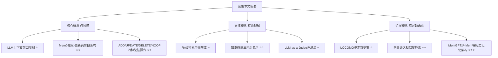
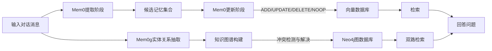

## AI论文解读 | Mem0: Building Production-Ready AI Agents with Scalable Long-Term Memory

### 作者
digoal

### 日期
2026-08-01

### 标签
AI , LLM , Agent , memory , 长期记忆 

----

## 背景
  
> **原文信息**：Prateek Chhikara, Dev Khant, Saket Aryan, Taranjeet Singh, Deshraj Yadav（Mem0.ai） | 2025年4月 | arXiv 预印本
  

---

## 📍 论文定位

**一句话**：本文提出了 Mem0 和它的图增强版 Mem0ᵍ，一套专门给 AI Agent 用的"长期记忆"架构，能从对话中动态提取、去重、更新关键信息，让 Agent 在跨会话、跨月对话中不再"失忆"。

**🎓 学术价值**：在 LOCOMO 长期对话记忆基准上，系统性地把"记忆系统"这件事从零散的工程实践，变成了一套可复现、可量化对比的科学评测框架——同时对比了 5 种历史方法、RAG、全量上下文、商业记忆平台（Zep）、OpenAI 官方记忆功能共 6 大类基线，填补了"记忆架构到底谁更强"这个问题长期缺乏严谨对比的空白。

**🏭 工业价值**：Mem0 就是 Anthropic 之外另一套可以直接商用的"给 LLM 装记忆"的方案（作者本身就是 Mem0.ai 公司），可以直接用来构建带长期记忆的客服机器人、个人助理、AI 伴侣类产品——用远低于"把全部聊天记录塞进上下文"的成本，做到接近甚至局部超越全量上下文的准确率。

**💡 直觉类比**：如果把 LLM 的上下文窗口比作一个人的"工作记忆"（只能记住眼前这点事），Mem0 就像是给这个人配了一本随身笔记本——不是把所有听过的话都抄下来，而是记要点、划重点、过时的划掉、矛盾的更新掉，需要用的时候翻到对应那一页，而不是从头到尾重新读一遍人生履历。

---

## 🗺️ 知识地图



- **LLM 上下文窗口限制（⭐）** ：是什么——GPT-4o、Claude 等模型能"一次看到"的文本量是有限的（几万到几十万 token）；为什么重要——真实的人机关系动辄持续几个月，聊天记录早就超过这个上限；现实类比——就像开会时只能带一本笔记本进场，超过页数的内容就得留在门外。
- **Mem0 提取-更新两阶段架构（⭐⭐）** ：是什么——先从新一轮对话中"提取"候选记忆，再拿去和已有记忆库比对，决定"更新"动作；为什么重要——这是本文的核心创新，保证记忆库不会无限膨胀也不会自相矛盾；现实类比——像整理家里的档案柜，新文件进来先看看有没有旧文件说的是同一件事，有就合并或替换，没有就新建一个文件夹。
- **ADD/UPDATE/DELETE/NOOP 四种操作（⭐⭐）** ：是什么——LLM 通过"工具调用"self 决定对每条候选记忆执行哪种操作；为什么重要——这是让记忆库保持"活的、一致的"的关键机制，而不是简单堆积日志；现实类比——像秘书处理邮件：全新的事情建档（ADD），补充信息合并进旧档案（UPDATE），发现旧结论被推翻就撤销（DELETE），没有新信息就不动（NOOP）。
- **RAG（⭐）** ：是什么——把历史对话切成固定大小的文本块，检索时找最相关的几块拼给 LLM 看；为什么重要——是本文最主要的对比基线之一；现实类比——像图书馆按页码抽取书本中最相关的几页，而不是记住"要点"。
- **知识图谱三元组（⭐⭐）** ：是什么——Mem0ᵍ 把信息表示成"实体-关系-实体"的图（比如 Alice-lives_in-San_Francisco）；为什么重要——能表达实体之间的复杂关系，利于时间推理和多跳查询；现实类比——像人物关系图谱，一眼看出谁认识谁、谁住在哪。
- **LLM-as-a-Judge（⭐）** ：是什么——用另一个更强的 LLM 来给答案打"对/错"分，而不是用字面重合度（F1/BLEU）打分；为什么重要——避免"答案文字很像但事实错了"却被打高分的问题；现实类比——像请一位懂行的老师批改简答题，而不是机械地数关键词重合率。
- **LOCOMO 基准（⭐）** ：是什么——一个专门测试长期对话记忆的数据集，10段对话，每段约600轮、26000 token，配约200道题；为什么重要——本文所有实验的评测场地；现实类比——像给记忆系统安排的"期末考卷"。

---

## 🔬 论文精读

### Why — 为什么要做这个研究？

现有做法的痛点很清楚：

| 方案 | 痛点 |
|---|---|
| 扩大上下文窗口（128K～10M token） | 只是"拖延"问题，没有真正解决；对话一旦持续几个月依然会溢出；而且真实对话经常"跑题再回来"，相关信息可能被埋在几千 token 的无关内容里，注意力机制对远距离 token 的处理本身也会衰减 |
| 传统记忆架构（MemGPT、MemoryBank、A-Mem 等） | 各有各的做法，但从未在同一个严谨基准上被系统性地对比过 |
| RAG | 按固定大小切块检索，检索到的是"原文片段"而非"提炼后的事实"，容易夹杂噪音 |

作者举的例子很典型：用户说自己吃素、不吃奶制品，几百轮无关的编程讨论之后，系统被问"晚饭吃什么"——没有持久记忆的系统很可能推荐鸡肉，直接违背用户此前说过的话。这正是论文想解决的核心问题。

### What — 提出了什么方法/系统？

两套互补的架构：



- **Mem0（基础版）** ：处理成对的消息 (mₜ₋₁, mₜ)，结合"对话摘要 S"（异步周期性刷新，提供全局主题理解）和最近 m 条消息（提供细粒度时序上下文），拼成 prompt 交给一个 LLM 抽取函数 φ，得到候选记忆集合 Ω = {ω₁, ω₂, ..., ωₙ}。
- **Mem0ᵍ（图增强版）** ：把记忆表示成有向标签图 G=(V, E, L)——节点是实体（人、地点、事件等），边是关系（lives_in、prefers、owns），标签是语义类型。用 Neo4j 存储，检索时既支持"实体为中心"的子图探索，也支持"整句语义"的三元组相似度匹配。

### How — 具体怎么实现的？

**Mem0 的更新阶段（核心创新点）** ：对每条候选事实，先从数据库检索 top-s 个语义相似的已有记忆（论文设置 s=10, m=10），把候选事实和这些相似记忆一起丢给 LLM，通过"工具调用（tool call）"接口，让 LLM 自己判断该执行四种操作中的哪一种：

```
ClassifyOperation(f, M):
  如果 f 和已有记忆都不相似 → ADD（全新信息，直接新建）
  否则如果 f 与某条记忆矛盾 → DELETE（旧记忆被推翻，标记删除/失效）
  否则如果 f 能补充某条记忆的信息量 → UPDATE（合并成更丰富的记忆）
  否则 → NOOP（什么都不做）
```

这里的巧思是：没有单独训练一个分类器来判断"该做什么操作"，而是直接复用 LLM 本身的推理能力，通过工具调用的形式让它自己选。全流程用 GPT-4o-mini 完成。

**Mem0ᵍ 的图更新策略**：新的三元组进来时，先计算源节点和目标节点的嵌入，和图里已有节点做相似度比对（超过阈值 t 就复用已有节点，否则新建），再挂上关系边；如果发现和已有关系冲突，用 LLM 驱动的"冲突解决器"把旧关系标记为失效（而不是物理删除），这样既能保持一致性，又保留了做时间推理所需要的历史轨迹。

### So What — 结果怎么样？

**主实验（Table 1，LOCOMO 四类问题，J = LLM-as-a-Judge 分数，越高越好）** ：

| 方法 | Single-Hop J | Multi-Hop J | Open-Domain J | Temporal J |
|---|---|---|---|---|
| A-Mem | 39.79 | 18.85 | 54.05 | 49.91 |
| LangMem | 62.23 | 47.92 | 71.12 | 23.43 |
| Zep | 61.70 | 41.35 | **76.60** | 49.31 |
| OpenAI 官方记忆 | 63.79 | 42.92 | 62.29 | 21.71 |
| **Mem0** | **67.13** | **51.15** | 72.93 | 55.51 |
| **Mem0ᵍ** | 65.71 | 47.19 | 75.71 | **58.13** |

关键发现：
- Mem0 在单跳（single-hop）和多跳（multi-hop）问题上全面领先，比 OpenAI 官方记忆功能高约 26%（相对提升）。
- Mem0ᵍ 在时序推理（temporal）上最强，说明图结构确实对"事件先后顺序"这类问题有独特帮助。
- 唯独在开放域（open-domain）问题上，商业平台 Zep 以微弱优势（76.60 vs 75.71）领先 Mem0ᵍ。
- 图记忆并不是"万能加成"：在单跳和多跳任务上，Mem0ᵍ 反而比 Mem0 略差，说明关系结构在简单检索/复杂整合任务里意义有限，只有在"时序""开放域关系推理"上才真正体现价值。

**效率对比（Table 2，Overall J + 延迟）** ：

| 方法 | Overall J | p95 总延迟(秒) | 记忆/上下文 token |
|---|---|---|---|
| 最强 RAG 配置 | ~61% | 1.6~9.9秒（因分块大小而异） | 视 chunk 而定 |
| Full-context（全量上下文） | 72.90% | 17.117 | 26,031（约26k） |
| Zep | 65.99% | 2.926 | 超过 600k |
| OpenAI 官方记忆 | 52.90% | 0.889 | 4,437 |
| **Mem0** | 66.88% | **1.440**（降91%） | **~7k** |
| **Mem0ᵍ** | **68.44%** | 2.590（降85%） | ~14k |

最令人印象深刻的发现：全量上下文方法（把整段 26000 token 对话原样丢给模型）能拿到最高的 J 分（72.90%），但代价是 p95 延迟高达 17 秒；而 Mem0 用不到 7000 token 的"精炼记忆"，就拿到 66.88% 的分数，延迟只要 1.44 秒（降低 91%）——这正是论文强调的"生产可用性"核心卖点：略微牺牲一点点准确率，换来数量级的成本和延迟下降。

另一个很有意思的对比：商业平台 Zep 虽然在开放域问题上分数最高，但它的记忆库体积是 Mem0 的近百倍（超过 60 万 token vs Mem0 的 7 千 token），而且论文实测发现 Zep 存在"刚写入的记忆立刻查询查不到，几个小时后重新查询才能查到"的异步延迟问题，作者认为这使其难以用于真正的实时场景。

### Now What — 对我们意味着什么？

- **学术界**：论文验证了"提炼后的结构化记忆"优于"直接扩大上下文"和"粗粒度切块检索"两条路线，为后续研究指出了方向——比如如何结合分层记忆、如何降低图记忆的延迟开销。
- **工业界**：对于要做长期记忆 Agent（客服、教育、健康陪伴、企业知识助手）的团队，这篇论文相当于一份"选型参考手册"：如果任务偏简单检索/多跳整合，用 Mem0 基础版就够，延迟低成本低；如果任务强依赖时间顺序或复杂关系推理，值得引入图记忆版本 Mem0ᵍ，但要接受更高的延迟和 token 开销。对 Digoal 关注的"AI Agent skill + 长期记忆"场景，这套提取-更新（ADD/UPDATE/DELETE/NOOP）的思路，和当前很多 AI 记忆系统（包括 Claude 的持久化记忆机制）在工程理念上是相通的——都是"选择性存储 + 冲突消解"而不是"全量堆积"。

---

## 📖 术语词典

### Mem0（Memory Zero，读作 mem-zero）
- **是什么**：本文提出的基础记忆架构，用两阶段（提取 + 更新）流程动态管理自然语言形式的记忆。
- **为什么重要**：是全文的核心贡献，在单跳和多跳问题上取得最优表现，且延迟和 token 开销远低于全量上下文。
- **现实类比**：一本会自动整理、自动划重点、自动删除过时内容的笔记本。

### Mem0ᵍ（Mem0-graph）
- **是什么**：Mem0 的图增强版本，把记忆表示为"实体-关系-实体"的有向图，存储在 Neo4j 中。
- **为什么重要**：在时序推理和开放域问题上表现最好，弥补了纯文本记忆在"关系推理"上的短板。
- **现实类比**：把笔记本升级成一张关系网络图，谁认识谁、谁住哪、什么时候发生的事，一目了然。

### ADD / UPDATE / DELETE / NOOP
- **是什么**：Mem0 更新阶段对每条候选记忆执行的四种操作，全部由 LLM 通过工具调用自主判断。
- **为什么重要**：这是让记忆库保持"活的、无冗余、无矛盾"的核心机制。
- **现实类比**：秘书处理文件——新建档案 / 补充旧档案 / 撤销过时结论 / 什么都不做。

### LOCOMO 基准
- **是什么**：一个专门用于评测长期对话记忆能力的数据集，含10段长对话（每段约26000 token、600轮）和约200道配套问题。
- **为什么重要**：本文所有对比实验的统一"考场"，保证不同方法之间可比。
- **现实类比**：给不同记忆系统安排的同一套期末考卷。

### LLM-as-a-Judge（J）
- **是什么**：用另一个 LLM 对生成答案打"CORRECT/WRONG"标签，而非用字面重合度指标。
- **为什么重要**：能识别"文字很像但事实错误"的答案，比 F1/BLEU 更贴近真实语义正确性。
- **现实类比**：请一位懂行的阅卷老师批改简答题，而不是用查重软件数字词重合率。

### RAG（Retrieval-Augmented Generation）
- **是什么**：把历史对话切成固定长度的文本块，检索时找出最相关的几块拼给 LLM 作为上下文。
- **为什么重要**：本文最主要的对比基线之一，用来说明"记住精炼事实"比"检索原始文本片段"更有效。
- **现实类比**：从一本厚厚的会议记录里，翻出最相关的几页给你看，而不是帮你总结出重点。

### 全量上下文（Full-Context）
- **是什么**：直接把整段对话历史（本文约26000 token）塞进 LLM 的上下文窗口。
- **为什么重要**：是准确率的"天花板"参照，但延迟和成本随对话变长呈指数级增长，不具备生产可用性。
- **现实类比**：每次提问前都要求你把这个人过去半年说的所有话重新读一遍再回答。

### 三元组（Triplet）
- **是什么**：知识图谱中表示关系的最小单元，形如 (源实体, 关系, 目标实体)，例如 (Alice, lives_in, San_Francisco)。
- **为什么重要**：是 Mem0ᵍ 存储和检索关系信息的基本结构。
- **现实类比**：一句最精简的"谁-做了什么-对象是谁"的主谓宾陈述句。

---

## ⚖️ 批判性评估

**1. 假设前提的合理性**

论文假设"用 LLM 自己判断该执行 ADD/UPDATE/DELETE/NOOP 中的哪种操作"是可靠的，但这本质上是把记忆一致性的把关工作，完全交给了一个 GPT-4o-mini 级别的模型做判断。当对话涉及微妙的矛盾（比如用户说"我上个月开始戒糖"，但更早之前说过"我特别爱吃蛋糕"，这两者并不矛盾，只是时间上的变化），LLM 是否总能正确分类为 UPDATE 而不是误删或误合并，论文没有给出针对"操作分类准确率"本身的专项评测，只看了最终问答的 J 分数，这是一个隐藏的假设风险点。

**2. 实验设计的可质疑之处**

- 所有基线和 Mem0 自身都统一用 GPT-4o-mini 做推理引擎，这保证了公平性，但也意味着结论可能对更强或更弱的底座模型不一定成立（比如换成更强的模型后，全量上下文的准确率优势是否会进一步拉大，从而削弱 Mem0 的"效率优先"论证）。
- LOCOMO 数据集仅有10段对话，每段约600轮，样本量在统计意义上不算大，虽然作者对 LLM-as-a-Judge 做了10次重复实验并报告了标准差，但对话样本本身的多样性（是否覆盖足够多的话题类型、语言风格、用户群体）没有专门讨论。
- 论文承认原始 LOCOMO 数据集中的"对抗性问题"类别（测试系统识别"无法回答"的能力）因缺少标准答案被排除，这意味着 Mem0 在"该说不知道的时候敢不敢说不知道"这一重要维度上没有被评测。

**3. 方法的适用边界**

- Mem0ᵍ 在单跳、多跳任务上反而略逊于 Mem0，说明图结构不是普适性增强，只在时序和关系密集型场景中有优势——这提示实际部署时需要"因场景选架构"，而不是默认图版本更强。
- 论文自己也指出，Zep 的开放域分数反超 Mem0/Mem0ᵍ，说明在需要融合"外部知识"的场景里，Mem0 目前还不是全面最优解。
- 文中的延迟数据（p50/p95）是在特定基础设施和特定数据规模下测得的，当记忆库规模远超 LOCOMO 场景（比如企业级几十万用户的长期记忆）时，向量检索本身的延迟特性是否还能保持这种优势，论文没有做规模化压力测试。

**4. 未来改进方向**

- 作者自己提出的未来方向包括：优化图操作以降低 Mem0ᵍ 的延迟开销、探索"分层记忆架构"融合效率与关系表达能力、开发受人类认知启发的更精细记忆巩固机制，以及把记忆框架扩展到程序性推理、多模态交互等对话之外的场景。
- 读者角度可以进一步思考：能否引入显式的"记忆置信度"或"记忆来源可追溯性"机制，让 Agent 在记忆之间出现矛盾时，不只是简单地"用新的覆盖旧的"，而是保留矛盾的上下文供后续澄清；另外，四种操作的分类决策目前缺乏可解释性审计手段，如果要用于医疗、金融等高风险场景，可能需要额外引入人工复核或置信度阈值机制。

---

## 📚 参考资料
- 原文链接：https://arxiv.org/abs/2504.19413
- 项目主页 / 代码：https://mem0.ai/research
- LOCOMO 基准原始论文：Maharana et al., "Evaluating very long-term conversational memory of llm agents", ACL 2024
- 对比基线之一 Zep 的架构论文：Rasmussen et al., "Zep: A temporal knowledge graph architecture for agent memory", arXiv:2501.13956, 2025
  
  
#### [PostgreSQL 解决方案集合](../201706/20170601_02.md "40cff096e9ed7122c512b35d8561d9c8")
  
  
#### [德哥 / digoal's Github - 公益是一辈子的事.](https://github.com/digoal/blog/blob/master/README.md "22709685feb7cab07d30f30387f0a9ae")
  
  
#### [About 德哥](https://github.com/digoal/blog/blob/master/me/readme.md "a37735981e7704886ffd590565582dd0")
  
  

  
