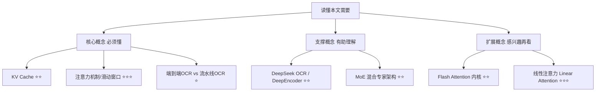

## AI论文解读 | Unlimited OCR Works — Welcome the Era of One-shot Long-horizon Parsing

### 作者
digoal

### 日期
2026-08-01

### 标签
AI , LLM , OCR , 文档解析  

----

## 背景
  
  
> **原文信息**：Baidu Inc. | 2026年6月 | arXiv:2606.23050（cs.CV，技术报告）  
> **原文链接**：https://arxiv.org/abs/2606.23050 ｜ **代码**：https://github.com/baidu/Unlimited-OCR  

---

## 📍 论文定位

**一句话**：百度提出 Unlimited OCR，用一种新的注意力机制（R-SWA）把 OCR 模型的显存占用和推理速度从"越写越卡"变成"从头到尾一个样"，从而能一次性把几十页文档一口气识别完，而不用像现在的模型那样一页一页地"断片式"处理。

**🎓 学术价值**：这是对"线性/受限复杂度注意力能不能用在真实多模态长序列任务上"的一次干净验证——不是空谈效率，而是拿 OCR 这个具体、可量化的任务把架构改动落到实处，并且给出了严格的显存增长公式推导。

**🏭 工业价值**：可以直接用来做整本书、整份合同、整期扫描版杂志的一次性识别，不再需要工程师额外写"分页-拼接-去重"的调度逻辑；同时因为架构改动通用，作者认为同样的思路可以搬到语音识别（ASR）、长文档翻译等"边看边生成"的任务上。

**💡 直觉类比**：想象你在抄一整本书。你不会把已经抄写过的所有页面都在脑子里过一遍才落笔，你只需要瞟一眼原文对应的位置，再看看自己刚写的最后几个字，就能继续往下抄。这篇论文做的事情，就是把当前 OCR 模型从"每写一个字都要把之前写过的所有字重新想一遍"（现有模型的做法），改造成"只记住原文全貌 + 刚写的最近几个字"（人类抄书的做法）。

---

## 🗺️ 知识地图

### KV Cache（键值缓存）⭐⭐
- **是什么**：大模型每生成一个新词，都要把它的"键"和"值"向量存下来，后面每一步都要跟这些存下来的向量做比对，这些存下来的东西就是 KV Cache。
- **为什么重要**：生成的内容越长，KV Cache 就越大，占的显存越多，计算也越慢——这正是本文要解决的核心痛点。
- **现实类比**：好比你写作业时，把每一步的草稿纸都摞在桌上留着，纸摞得越高，找起来、翻起来就越慢，桌子也越占地方。

### 滑动窗口注意力 ⭐⭐⭐
- **是什么**：让模型在生成新内容时，不去看"全部历史"，只看"最近的一小段窗口"。
- **为什么重要**：这样窗口大小是固定的，不会随生成长度不断膨胀，KV Cache 自然也就不会一直涨。
- **现实类比**：像开车看后视镜，你不需要记住这一路开过的每一米路，只需要盯住紧挨着你车尾的那一小段。

### 端到端 OCR vs 流水线 OCR ⭐
- **是什么**：流水线做法是先"检测文字在哪"，再单独"识别文字内容"，两个模型接力；端到端做法是一个模型直接把整页图片变成文字结果。
- **为什么重要**：本文的 Unlimited OCR 属于端到端路线，端到端对模型能力要求更高，但一旦做好，处理流程更简洁，也更适合探索"一次性处理超长内容"这种新玩法。
- **现实类比**：流水线像工厂里"质检员报位置、搬运工来取货"两班倒；端到端像一个老师傅一眼看过去直接把东西挑出来打包。

### DeepEncoder（继承自 DeepSeek OCR）⭐⭐
- **是什么**：一个专门用来把高分辨率文档图片"压缩"成少量视觉 token 的编码器，压缩比可以做到 16 倍。
- **为什么重要**：编码器压缩得越狠，后续解码器要处理的"输入前缀"就越短，这是让模型能一次塞下几十页文档的前提条件之一。
- **现实类比**：好比把一整页 A4 纸的内容拍照后自动生成一张信息浓缩的"提要卡片"，之后只需要带着这张卡片，不用带着原始整页纸。

### MoE 混合专家架构 ⭐⭐
- **是什么**：模型总参数量很大（3B），但每次真正参与计算的只是其中一小部分专家（500M 激活参数）。
- **为什么重要**：在保持模型能力的同时，把每一步推理实际消耗的算力压得比较低，这也是本文模型能做到"轻量高效"的原因之一。
- **现实类比**：像一个大型专家团队，遇到具体问题时只请相关的那几位专家出面，而不是让所有人都同时忙活。

### Flash Attention 内核 ⭐⭐
- **是什么**：一种高度优化的注意力计算实现方式，用于加速 Transformer 里最耗时的注意力运算。
- **为什么重要**：本文用它来实测新注意力机制在真实硬件上的延迟表现，证明"理论上更省"确实能落地成"实际跑得更稳"。

### 线性注意力 Linear Attention ⭐⭐⭐（扩展了解）
- **是什么**：另一种让计算量不随序列长度平方增长的注意力变体，通常靠"状态压缩"实现常数级计算。
- **为什么重要**：论文特意强调自己的方法**不是**线性注意力——因为线性注意力会让视觉 token 也参与状态更新，造成图像特征逐渐"模糊失真"，而本文刻意把视觉 token 排除在这种状态更新之外。

---

## 🔬 论文精读

### Why — 研究动机

**痛点**：现在的端到端 OCR 模型（比如 DeepSeek OCR）虽然能一页一页地识别文档，但没有一个模型能在**一次前向计算**里处理十页以上的文档。做法上只能靠"for 循环"——识别完一页，清空记忆，再识别下一页，靠外部脚本把结果拼起来。

**作者的类比论证**：人类抄书、听译几个小时的录音时，并不会出现"效率随时间推移持续下降"的现象；而现有模型恰恰有这个问题——生成越长，KV Cache 越大，速度越慢。作者认为这不只是"上下文长度不够"的问题，而是**注意力模式本身选错了**：人类抄写时靠的是一种"软遗忘"式的持续认知状态，远处的内容自然淡出记忆，近处内容用来追踪进度；而"逐页清空记忆"的做法把一个连续的长任务硬生生切成了互不相关的短任务，只能算工程补丁，不是通向更通用智能的路。

| 对比维度 | 现有模型（如 DeepSeek OCR） | Unlimited OCR |
|---|---|---|
| 处理方式 | 逐页 for 循环，页与页之间清空记忆 | 一次前向计算处理数十页 |
| KV Cache 增长 | 随生成长度线性增长 | 恒定不变（有上界） |
| 解码延迟趋势 | 越往后越慢，遇到对齐边界还会突然掉速 | 全程延迟稳定 |
| 灵感来源 | 工程调度（page-by-page） | 人类抄书时的持续认知状态 |

### What — 提出了什么方法/系统

核心方案是把 DeepSeek OCR 解码器里**所有**的标准多头注意力（MHA），替换成作者提出的 **Reference Sliding Window Attention（R-SWA，参考滑动窗口注意力）** 。编码器部分（DeepEncoder）保持不变，只训练解码器的语言模型参数。

整体架构上，KV Cache 被设计成一个"容量固定为 m+n 的队列"：每生成一个新 token，就把队列里最早的那个"输出 token"挤出去，永远只保留最近 n 个输出 token，加上不变的 m 个前缀 token（视觉 token + 提示词）。

### How — 具体怎么实现的

R-SWA 的核心思路是把每个生成位置能"看到"的范围，切成两段：

$$\mathcal{N}(t) = \mathcal{P} \cup \mathcal{D}_n(t)$$

- **$\mathcal{P}$ （前缀段）** ：长度固定为 $L_m$ ，是视觉 token 和提示词，对所有后续生成位置**永远可见**，且这部分内容从头到尾只编码一次，不参与任何"状态滚动更新"——这是保证图像细节不被模糊掉的关键。
- **$\mathcal{D}_n(t)$ （解码滑窗段）** ：宽度固定为 $n$ （默认 128），随着生成推进像窗口一样往前滑动，只能看到"最近生成的 n 个 token"，看不到更早之前生成的内容。

白话解释：每个新字在"抬头看一眼原文全貌"的同时，只需要"回头看一眼刚写的一小段"，不需要把已经写过的所有内容都重新过一遍。

对应的 KV Cache 大小公式：

- 标准 MHA： $C_{\text{MHA}}(T) = L_m + T$ —— 会随着已生成长度 $T$ 无限增长。
- R-SWA： $C_{\text{R-SWA}}(T) = L_m + \min(n, T) \le L_m + n$ —— 有一个恒定的上界，跟 $T$ 无关。

论文进一步推导了两者的"缓存比" $\rho(T) = \frac{L_m+n}{L_m+T}$ ，说明当生成长度 $T$ 远大于窗口 $n$ 时， $\rho(T)$ 会趋近于 0——也就是说，文档越长，R-SWA 相对于标准做法节省的显存比例就越可观。

作者还特别强调了 R-SWA 与"线性注意力"的本质区别：线性注意力会让所有 token（包括视觉 token）都参与一种循环状态更新，这会导致视觉特征随时间推移逐渐"模糊失真"；R-SWA 则让视觉 token 全程保持静态、不参与状态转移，只有"输出段"在滑动窗口内更新，因此不会有这种退化问题。

工程实现上，模型基于 DeepSeek OCR checkpoint 继续训练：约 200 万条文档 OCR 样本（单页:多页 = 9:1），多页数据由单页数据拼接合成（每份 2~50 页），全部打包成 32K 长度的训练序列；用 8×16 张 A800 GPU 训练 4000 步，冻结 DeepEncoder 只训练语言模型部分；推理阶段在 Transformers 库和 SGLang 引擎中都实现了对应的 KV Cache 管理优化。

### So What — 结果怎么样

**主榜单表现（OmniDocBench v1.5）** ：在这份权威文档解析榜单上，Unlimited OCR 拿到 93.23 分的总分，比 DeepSeek OCR 基线的 87.01 分高出约 6.22 分，同时在文本编辑距离（TextEdit）、公式识别（FormulaCDM）、表格结构提取（TableTEDs / TEDS-S）、阅读顺序（Read-order Edit）等各个子指标上都优于基线，甚至超过了参数量大得多的 Qwen3-VL（235B）等模型。

**推理效率（Kernel Study 部分）** ：论文用 Flash Attention v3 内核实测延迟，发现标准 MHA 的 DeepSeek OCR 基线随解码步数增加延迟持续攀升，而且在 KV Cache 长度跨越某个对齐边界时还会出现延迟骤增的"尖峰"；Unlimited OCR（R-SWA）则全程保持恒定延迟，同样的稳定性也体现在显存占用曲线上——一个线性增长，一个从头到尾持平。

**长文档解读能力（自建长文本评测）** ：作者额外构建了一个覆盖 2、5、10、20、40+ 页不同长度书籍/文档/论文的内部评测集，用于验证多页一次性解析的实际表现（论文正文提到会用 Distinct-n 和 Edit Distance 两个指标衡量，具体分数表格在原文后续章节，本次抓取的内容未完整覆盖该表格，建议查阅原文 Table 部分获取具体数值）。

*注：受限于本次内容抓取范围，"5.3 Subcategory Study"、"5.4 长文本解析具体数值"、"6 效率分析"、"7 局限与未来工作"等章节的完整细节未能逐字核实，以下批判性评估部分基于论文摘要、方法论及已获取章节进行合理推断，建议关注原文对应章节获取精确数据。*

### Now What — 对我们意味着什么

- **学术界**：这是"受限注意力/滑动窗口思路"在真实多模态生成任务上的一次扎实验证，为"如何在不牺牲精度的前提下摆脱 KV Cache 线性增长"提供了一个具体、可复现的设计范式，也为后续在 ASR、长文档翻译等任务上复用同一思路打开了口子。
- **工业界**：对需要批量处理长文档（合同、书籍、扫描件档案）的场景，意味着可以省掉"切页-识别-拼接-去重"这一整套工程链路，直接丢进模型一次跑完；对显存/成本敏感的部署场景，KV Cache 恒定意味着可以更精确地预估资源开销，而不用为"万一文档特别长"预留额外冗余。

---

## 📖 术语词典

### KV Cache（键值缓存）
- **是什么**：Transformer 解码时为已生成 token 保存的键/值向量集合，用于避免重复计算。
- **为什么重要**：它的大小直接决定了显存占用和推理速度，是本文要攻克的核心瓶颈。
- **现实类比**：写作业时摞在桌上的历史草稿，摞得越高越占地方、翻找越慢。

### R-SWA（Reference Sliding Window Attention，参考滑动窗口注意力）
- **是什么**：本文提出的注意力机制，让每个生成位置永远能看到固定的"参考前缀"（图像+提示词），但只能看到最近一段固定窗口内的已生成内容。
- **为什么重要**：这是让 KV Cache 从"随时间线性增长"变成"恒定上界"的核心设计。
- **现实类比**：抄书时"抬头看原文、回头看刚写的几个字"，而不是把写过的所有字都重新扫一遍。

### DeepEncoder
- **是什么**：源自 DeepSeek OCR 的图像编码器，通过级联窗口注意力和全局注意力实现 16 倍的视觉 token 压缩。
- **为什么重要**：压缩比越高，模型能一次塞进的文档页数就越多，是"一口气处理几十页"的前提之一。
- **现实类比**：把一整页文字拍照后自动提炼成一张精简"提要卡片"。

### KV Cache 恒定上界（ $L_m + n$ ）
- **是什么**：R-SWA 下，无论生成多长，KV Cache 大小都不会超过"前缀长度 + 滑动窗口宽度"这个固定值。
- **为什么重要**：这意味着显存占用和计算成本都可以提前精确预估，不会因为文档变长而失控。

### MoE（Mixture-of-Experts，混合专家架构）
- **是什么**：模型总参数量很大，但每次推理只激活其中一小部分"专家"参数参与计算。
- **为什么重要**：在保持模型容量的同时压低了实际推理开销，是 Unlimited OCR 保持"3B 总参数 / 500M 激活参数"轻量特性的基础。

### OmniDocBench
- **是什么**：一个专门用于评测文档解析能力的权威基准，覆盖文本识别、公式识别、表格结构提取、阅读顺序预测等多个维度。
- **为什么重要**：本文用它来和一系列主流端到端 OCR 模型（包括参数量大得多的模型）做横向比较，证明方法的有效性不是"自说自话"。

---

## ⚖️ 批判性评估

1. **假设前提的合理性**
   论文的核心假设是"人类抄书时的软遗忘认知模式"可以直接映射为"固定窗口 + 静态前缀"的注意力结构。这个类比很直观，但值得追问的是：人类抄书时的"遗忘"其实是渐进式、模糊的衰减，而 R-SWA 的窗口截断是硬性的、非此即彼的（窗口外直接不可见）。这种"硬截断"是否会在某些需要长距离依赖的场景（比如跨页表格、跨段落引用编号）里丢失关键信息，论文并未做专门的失败案例分析。

2. **实验设计的可质疑之处**
   - 主榜单对比是在 OmniDocBench 单页/常规文档场景下进行的，而论文真正想解决的"多页长文档"能力主要靠自建的内部评测集验证——这个内部评测集不是公开、可复现的第三方基准，其书籍/文档的选取标准、语言分布、扫描质量等细节在本次抓取内容中未见充分披露，横向对比的说服力弱于公开基准。
   - 对比表格里的基线模型规模跨度极大（从 0.9B 的 MinerU2-VLM 到 235B 的 Qwen3-VL），虽然 Unlimited OCR 在总分上领先，但这种"以小博大"的对比容易掩盖具体子任务上可能存在的差距，需要结合完整的分项数据综合判断。

3. **方法的适用边界**
   - 窗口宽度 $n$ 默认取 128，这是一个经验设定的超参数；论文没有充分讨论当任务需要"回顾很久之前生成的具体细节"（比如需要核对第一页出现过的编号是否与后面重复）时，固定窗口是否会成为短板。
   - 该方法目前只在 OCR 任务上完整验证，论文提到"可推广到 ASR、翻译等任务"更多是展望性论述，尚未给出这些任务上的实际实验数据，其可迁移性还有待后续工作验证。
   - 训练数据中多页样本是由单页数据人工拼接合成的（而非天然的连续多页文档），这种合成数据与真实世界连续文档（比如同一本书里页与页之间语义连贯、版式统一）之间可能存在分布差异，这一点论文未做专门讨论。

4. **未来改进方向**
   - 论文作者自己提出，希望将 R-SWA 拓展到 ASR、翻译等其他"参考型长距离任务"，这是一个自然的延伸方向。
   - 可以补充的方向：针对窗口大小 $n$ 做更系统的消融实验，量化不同窗口宽度对长距离依赖任务的影响；引入真实的（而非拼接合成的）连续多页文档数据集进行训练和评测，以更贴近实际部署场景；针对"窗口外内容彻底不可见"可能带来的信息丢失风险，探索软性衰减或稀疏长程连接等折中方案。

---

## 📚 参考资料
- 原文链接：https://arxiv.org/abs/2606.23050
- HTML 全文：https://arxiv.org/html/2606.23050
- 代码仓库：https://github.com/baidu/Unlimited-OCR
- 基线模型：DeepSeek OCR（本文架构改动的起点）
- 关键评测基准：OmniDocBench（v1.5 / v1.6）
  
  
#### [PostgreSQL 解决方案集合](../201706/20170601_02.md "40cff096e9ed7122c512b35d8561d9c8")
  
  
#### [德哥 / digoal's Github - 公益是一辈子的事.](https://github.com/digoal/blog/blob/master/README.md "22709685feb7cab07d30f30387f0a9ae")
  
  
#### [About 德哥](https://github.com/digoal/blog/blob/master/me/readme.md "a37735981e7704886ffd590565582dd0")
  
  

  
