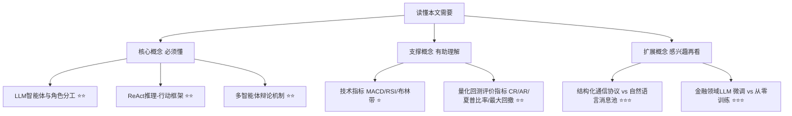

## AI论文解读 | TradingAgents: Multi-Agents LLM Financial Trading Framework

### 作者
digoal

### 日期
2026-08-01

### 标签
AI , LLM , 股票交易 , Agent , 分析师 , 研究员团队 , 交易员 , 风控团队 , 基金经理  

----

## 背景

> **原文信息**：Yijia Xiao, Edward Sun, Di Luo, Wei Wang（UCLA / MIT / Tauric Research）| 2024年12月28日提交，2025年6月修订至v7 | arXiv:2412.20138 (q-fin.TR)
  

---

## 📍 论文定位

**一句话**：这篇论文把一个真实炒股团队"搬"进了 AI 里——基本面分析师、情绪分析师、新闻分析师、技术分析师各司其职，多空研究员吵架辩论，交易员拍板，风控团队再把关，最后由"基金经理"批准执行，全流程用大语言模型（LLM）智能体模拟完成。

**🎓 学术价值**：此前的多智能体金融交易研究，要么是单智能体各自为战，要么虽然是多智能体但沟通全靠自然语言消息堆叠，容易出现"传话游戏"式的信息失真。TradingAgents 首次把真实交易公司的组织结构（分析→研究辩论→交易→风控→审批）系统性地映射成智能体角色分工，并引入"结构化报告 + 自然语言辩论"的混合通信协议，缓解了长链路信息漂移的问题。

**🏭 工业价值**：整个框架不需要 GPU，只靠 API 调用即可跑通，任何人都能用可替换的 LLM（如 gpt-4o-mini 做快速任务、o1-preview 做深度推理）来复现或部署，且每一步决策都有可读的自然语言依据，天然具备可解释性，便于量化团队做实盘前的策略验证或作为投研辅助工具。

**💡 直觉类比**：这就像把一家华尔街投行的"晨会+研究部+交易台+风控委员会"整个搬到了云端，只不过开会的不是人类分析师，而是一群各有专长、又能互相拌嘴的 AI，最后由"AI 基金经理"拍板下单。

---

## 🗺️ 知识地图

读懂这篇论文，需要理解三层概念：核心的多智能体协作机制、支撑性的金融量化指标、以及可以延伸了解的相关技术生态。

- **LLM智能体与角色分工**：是什么——给每个 LLM 实例分配固定的身份、目标、工具和限制；为什么重要——把"预测股价"这种超复杂任务拆成小块，每块交给"专才"处理，避免一个模型什么都干但什么都不精；现实类比——就像一家公司不会让 CEO 亲自去核对财务报表，而是交给专职会计。

- **ReAct 推理-行动框架**：是什么——让模型在做决策前先"想清楚再动手"，边推理边调用工具（如查股价、算指标）；为什么重要——保证每一步决策都留下可追溯的思考轨迹，出了问题能"复盘"；现实类比——像老练的医生问诊，先问诊、查资料，再下结论，而不是看一眼就开药方。

- **多智能体辩论机制**：是什么——多头（看涨）和空头（看跌）研究员就同一支股票展开若干轮针锋相对的辩论，由"裁判"智能体总结出最终倾向；为什么重要——避免单一视角的盲区，逼迫系统同时考虑风险和机会；现实类比——投委会里总有唱多派和唱空派互相质询，观点越辩越清晰。

---

## 🔬 论文精读

### Why — 为什么要做这个研究？

现有的金融 LLM 智能体研究普遍存在两个短板：

| 维度 | 之前的做法 | 本文的做法 |
|---|---|---|
| 组织结构 | 单智能体各管一摊，或多智能体各自收集数据、互不协作 | 完整复刻真实交易公司的分工与流程（分析师→研究员→交易员→风控→基金经理） |
| 沟通方式 | 主要靠自然语言消息历史堆叠，容易"传话失真" | 结构化报告为主、自然语言辩论为辅的混合协议 |
| 结果 | 长链路任务中信息容易被遗忘或扭曲，团队协作的真实优势没被发挥出来 | 每个角色只提取/查询必要信息，减少无关噪音，同时保留辩论带来的深度推理 |

传统量化模型（如均线、MACD 规则策略）难以综合处理新闻、财报、社交媒体情绪这类非结构化文本信息，而深度学习模型虽然能处理，却往往是"黑箱"，决策依据难以解释。这正是 LLM 的强项——既能读懂自然语言，又能把推理过程写出来给人看。

### What — 提出了什么方法/系统？

TradingAgents 定义了五大团队、七种角色，构成一条完整的"决策流水线"：

- **分析师团队（Analyst Team）** ：基本面分析师（看财报、内部交易）、情绪分析师（看社交媒体、Reddit情绪分）、新闻分析师（看宏观新闻、公司大事件）、技术分析师（算 MACD、RSI 等指标），各自产出一份专业报告。
- **研究员团队（Researcher Team）** ：多头研究员和空头研究员基于分析师报告展开 n 轮辩论，由"辩论主持"智能体总结出占优观点。
- **交易员（Trader）** ：综合分析师报告和研究员辩论结论，形成带理由的交易决策（买/卖/持有）。
- **风控团队（Risk Management Team）** ：三个视角（激进/中立/保守）的智能体再对交易决策做 n 轮讨论，调整仓位或风险敞口。
- **基金经理（Fund Manager）** ：审阅风控团队的讨论，最终批准并更新交易决策。

所有角色统一遵循 **ReAct** 提示框架——边推理边调用工具，状态在智能体间共享，保证决策"有理有据"。

### How — 具体怎么实现的？

**通信协议是本文的一个关键设计巧思**：论文观察到，如果所有智能体都靠自然语言消息堆叠沟通，随着对话轮数增多，早期的关键信息容易被"冲淡"或遗忘，就像多人传话游戏一样越传越走样。TradingAgents 的解法是——

1. **分析师、交易员之间**：用**结构化文档**（报告）传递信息，各角色只从全局状态里按需查询自己需要的字段，不需要读完整对话历史。
2. **研究员、风控团队内部辩论**：允许**自然语言对话**，因为辩论本身需要灵活的语言表达来碰撞观点；辩论结束后，主持人会把结论"浓缩"成结构化条目写回全局状态，避免污染后续流程。

这种"结构化为主、自然语言为辅"的混合模式，既保留了辩论带来的深度推理优势，又避免了纯自然语言沟通的信息衰减问题。

**模型选择上的取舍也很务实**：论文按任务的"深浅"分配不同能力的模型——像 gpt-4o-mini、gpt-4o 这类"快思考"模型负责摘要、数据检索、格式转换等浅层任务；像 o1-preview 这类"慢思考"模型负责分析师报告撰写、研究员辩论、交易决策等需要深度推理的任务。这样设计的好处是整个系统**不需要 GPU、只靠 API 调用即可运行**，而且模型可以随时替换升级，具备很好的可扩展性。

### So What — 结果怎么样？

论文用 2024 年 1 月 1 日至 3 月 29 日的历史数据，在苹果（AAPL）、英伟达、微软、Meta、谷歌等科技股上做回测，并与五种基线策略（买入持有、MACD、KDJ+RSI、ZMR均值回归、SMA均线）对比：

| 股票 | 累计收益率 CR% | 年化收益率 AR% | 夏普比率 SR | 最大回撤 MDD% | 相较最佳基线的提升 |
|---|---|---|---|---|---|
| AAPL | 26.62 | 30.5 | 8.21 | 0.91 | 累计收益提升 24.57 个百分点 |
| GOOGL | 24.36 | 27.58 | 6.39 | 1.69 | 累计收益提升 16.58 个百分点 |
| AMZN | 23.21 | 24.90 | 5.60 | 2.11 | 累计收益提升 6.10 个百分点 |

值得注意的是，苹果股票在测试期内波动较大，传统规则型策略（如均线、MACD）大多表现不佳甚至亏损，而 TradingAgents 在这种"逆风局"里反而拿到了超过 26% 的收益，说明其融合多源信息、动态调整的能力在复杂行情下更有韧性。

论文也坦诚地指出：由于每次预测需要 11 次 LLM 调用和 20 多次工具调用，成本较高，所以只做了 3 个月的回测，样本量偏小，夏普比率高达 8 也超出了作者预期的"经验合理范围"（一般 SR>3 已算优秀）；作者复核了决策序列，认为高夏普比率的原因是这段时间内策略几乎没有明显的回撤波动，并表示这是"如实报告"的结果，未来会优化推理和工具调用效率以支持更长周期的回测。

**关于可解释性**：论文附上了完整的单日交易决策日志（附录中收录），展示了每一步的推理过程、工具调用、思考轨迹，这是相对于传统深度学习"黑箱"模型的一大优势——交易员可以直接读懂"AI 为什么这么决策"，甚至据此调试和优化系统。

### Now What — 对我们意味着什么？

- **对学术界**：证明了"结构化通信 + 自然语言辩论"的混合协议是缓解多智能体长程任务信息衰减的一个可行方向；也为如何把真实组织架构映射进多智能体系统提供了一个具体范例。
- **对工业界**：这套框架不依赖 GPU、只靠 API 即可运行，天然适合量化团队做投研辅助、策略回测、甚至作为人工交易员的"影子顾问"——尤其是它的决策可解释性，能帮助真实交易员理解并信任 AI 建议。论文作者也明确表示未来方向是接入实时数据、拓展到实盘交易环境。

---

## 📖 术语词典

### LLM 智能体（LLM Agent）
- **是什么**：以大语言模型为"大脑"，能自主推理、调用工具、与其他智能体交互的软件实体。
- **为什么重要**：是整篇论文的基础构件，每一个"分析师""交易员""风控专家"都是一个独立配置的 LLM 智能体。
- **现实类比**：就像给一个 AI 发了一张"员工卡"，规定了他的岗位、权限和工作范围。

### ReAct 框架（Reasoning + Acting）
- **是什么**：一种提示工程范式，让模型交替进行"思考"和"行动"（如调用工具查数据），而不是一次性给出答案。
- **为什么重要**：保证决策过程可追溯，也让模型能根据中间结果动态调整下一步该查什么。
- **现实类比**：就像侦探先观察线索、再推理、再去现场核实，而不是看一眼就下结论。

### Bull/Bear 研究员（Bullish/Bearish Researcher）
- **是什么**：分别站在"看涨"和"看跌"立场，基于分析师报告构建论证的两个智能体。
- **为什么重要**：通过对立观点的辩论，逼出更全面、更少偏见的投资判断。
- **现实类比**：像投委会里天然存在的"多头派"和"空头派"，观点交锋才能看清全局。

### 结构化通信协议（Structured Communication Protocol）
- **是什么**：智能体之间用固定格式的报告/文档而非自由格式的消息历史来传递信息。
- **为什么重要**：避免自然语言长对话中的"传话失真"问题，让每个角色只按需读取必要字段。
- **现实类比**：就像团队内部用标准化的工作汇报模板，而不是靠口口相传转述会议内容。

### 夏普比率（Sharpe Ratio）
- **是什么**：衡量"每承担一单位风险能换来多少超额收益"的指标，数值越高说明风险调整后收益越好。
- **为什么重要**：论文用它来证明 TradingAgents 不只是收益高，风险控制也做得不错。
- **现实类比**：就像评价一个司机不能只看他跑得多快，还要看他开得稳不稳。

### 最大回撤（Maximum Drawdown, MDD）
- **是什么**：衡量投资组合从最高点到最低点的最大跌幅。
- **为什么重要**：反映策略在最坏情况下能亏多少，是风险控制能力的重要标尺。
- **现实类比**：就像问"过山车最惊险的一段落差有多大"，落差越小说明坐得越稳。

### 深度思考模型 vs 快思考模型（Deep-thinking vs Quick-thinking LLMs）
- **是什么**：论文中按任务复杂度分配不同能力的模型，如 o1-preview 负责复杂推理，gpt-4o-mini 负责简单数据处理。
- **为什么重要**：在保证决策质量的同时控制调用成本和响应速度，是工程落地的关键取舍。
- **现实类比**：就像团队里资深专家只处理疑难杂症，简单的整理归档交给实习生。

---

## ⚖️ 批判性评估

### 1. 假设前提的合理性

论文假设 LLM 智能体的推理过程可以充分模拟人类分析师和交易员团队的专业判断，且不同角色间的分工能带来"1+1>2"的协同效应。这个假设在测试期内看似成立，但要注意：LLM 的判断本质上仍是基于训练数据里的模式和当前上下文的统计推断，而非真正理解市场的因果机制。当市场出现训练数据中未曾见过的极端结构性变化（如黑天鹅事件）时，这种"类人推理"是否依然可靠，论文并未验证。

### 2. 实验设计的可质疑之处

- **回测周期过短**：仅 3 个月（2024年1月-3月），且集中在少数几只美股科技龙头股上，样本量和市场环境的多样性都有限，难以证明策略在熊市、震荡市或其他行业股票上的普适性。
- **夏普比率异常偏高**：作者自己也承认 SR 高达 8.21 超出常规经验范围，这通常提示回测周期太短、样本内过拟合，或者交易频率/滑点假设过于理想化，需要更谨慎看待。
- **基线策略选择**：对比的基线全部是经典规则型策略（均线、MACD、KDJ+RSI等），没有和其他 LLM/深度学习类的先进基线（如论文自己在 Related Work 中提到的 FinMem、FinAgent、TradingGPT 等）做直接对比，说服力打了折扣。

### 3. 方法的适用边界

- **成本高昂**：每次预测需要 11 次 LLM 调用加 20+ 次工具调用，实盘高频交易场景下延迟和成本都会是硬伤，更适合中低频的日频决策。
- **依赖数据源质量**：新闻、社交媒体情绪等数据源本身噪音大、时效性强，如果数据源出现偏差或延迟，分析师报告的质量会直接影响下游决策。
- **未考虑交易成本与滑点等现实摩擦**：论文的回测框架并未详细披露是否计入手续费、滑点、流动性冲击等实盘交易中不可忽视的成本项。

### 4. 未来改进方向

作者自己提出的未来工作方向包括：部署到真实实盘交易环境中验证、拓展更多智能体角色、接入实时数据流以支持更长周期的回测。

从读者角度看，还可以考虑：引入更严格的样本外测试（如跨市场、跨周期的滚动回测）；对比更多同类 LLM 多智能体基线；探索降低调用成本的轻量化方案（如蒸馏出更小的专用模型）；以及研究极端行情下系统的鲁棒性和失效模式，避免"黑天鹅"事件中出现连锁误判。

---

## 📚 参考资料

- 原文链接：[arXiv:2412.20138](https://arxiv.org/abs/2412.20138)
- 项目开源地址：https://github.com/TauricResearch/TradingAgents
- 相关论文：
  - FinMem: A performance-enhanced LLM trading agent with layered memory (Yu et al., 2023)
  - TradingGPT: Multi-agent system with layered memory and distinct characters (Li et al., 2023)
  - MetaGPT: Meta programming for a multi-agent collaborative framework (Hong et al., 2024)
  - ReAct: Synergizing reasoning and acting in language models (Yao et al., 2023)
  - BloombergGPT: A large language model for finance (Wu et al., 2023)
  
  
#### [PostgreSQL 解决方案集合](../201706/20170601_02.md "40cff096e9ed7122c512b35d8561d9c8")
  
  
#### [德哥 / digoal's Github - 公益是一辈子的事.](https://github.com/digoal/blog/blob/master/README.md "22709685feb7cab07d30f30387f0a9ae")
  
  
#### [About 德哥](https://github.com/digoal/blog/blob/master/me/readme.md "a37735981e7704886ffd590565582dd0")
  
  

  
