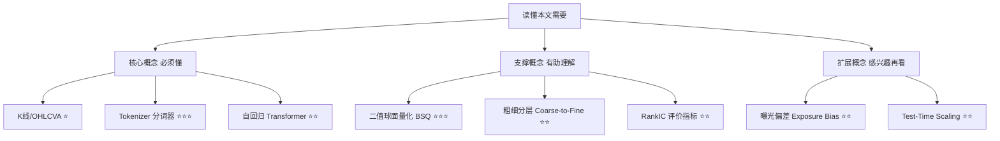
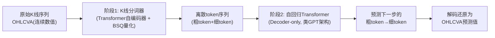

## AI论文解读 | Kronos: A Foundation Model for the Language of Financial Markets

### 作者
digoal

### 日期
2026-08-01

### 标签
AI , LLM , 股票交易 , Agent , 时序数据 , 交易数据 token 化 , 分词 

----

## 背景

> **原文信息**：Yu Shi, Zongliang Fu, Shuo Chen, Bohan Zhao, Wei Xu, Changshui Zhang, Jian Li | 2025年8月（已被 AAAI 2026 接收）| arXiv:2508.02739 (q-fin.ST)
  

---

## 📍 论文定位

**一句话**：Kronos 把 K 线（开高低收+成交量+成交额，即 OHLCVA）当成一门"语言"，先用专门设计的分词器把它切成离散的"词"，再用一个类似 GPT 的自回归 Transformer 在超过 120 亿条全球 K 线记录上做预训练，从而得到一个可以零样本（不用再训练）完成价格预测、波动率预测、模拟生成 K 线等多种金融任务的"金融大模型"。

**🎓 学术价值**：目前通用的时间序列基础模型（TSFM，如 Chronos、TimesFM 等）在金融 K 线数据上往往打不过没有预训练过的专用模型，这是业界一直没解决好的痛点。Kronos 第一次证明了"预训练范式"在 K 线这种低信噪比、非平稳、多变量强耦合的数据上也能大幅跑赢，填补了"金融专用时间序列基础模型"这一空白。

**🏭 工业价值**：一个模型可以直接拿来做价格走势预测、风险（波动率）预测、生成逼真的模拟行情用于压力测试/策略回测、甚至直接驱动一个简单的选股回测策略——大幅减少量化团队为每个任务单独建模的成本。项目已开源在 GitHub（shiyu-coder/Kronos），提供了 mini/small/base 三档可直接下载使用的预训练模型。

**💡 直觉类比**：如果把自然语言 GPT 理解成"读了全网文本后学会了造句"，Kronos 就是"读了全球 45 个交易所超过 120 亿根 K 线后学会了怎么'接着画下一根蜡烛图'"。它不是记住了具体某只股票的走势，而是学会了"K 线语言"里普遍存在的语法规律——比如放量滞涨后大概率要回调、缩量盘整后波动率往往要放大等模式。

---

## 🗺️ 知识地图

在深入原理之前，先搭好前置知识框架：

- **K线 / OHLCVA**（⭐）：每根蜡烛记录一段时间内的开盘价（Open）、最高价（High）、最低价（Low）、收盘价（Close）、成交量（Volume）、成交额（Amount）共 6 个数字，是股票、期货、加密货币行情图最基本的单位。
- **Tokenizer 分词器**（⭐⭐⭐）：在 NLP 里，分词器把一句话切成一个个"词"（token），大模型只认识这些离散的词。Kronos 的分词器要解决的问题是：K 线是连续的数字（比如价格 173.256），怎么把它也变成离散的"词"？这是本文最核心、最有技术含量的部分。
- **自回归 Transformer**（⭐⭐）：和写文章时"根据前面的字猜下一个字"是一回事，只不过这里"字"换成了 K 线的离散 token，模型根据过去的 K 线 token 序列猜下一根 K 线的 token。
- **二值球面量化 BSQ**（⭐⭐⭐）：一种把连续向量压缩成一串 0/1 二进制码的技术，是 Kronos 分词器的数学引擎，来自视频生成领域的最新研究。
- **粗细分层 Coarse-to-Fine**（⭐⭐）：把一个 token 拆成"粗略版"和"精细版"两半，先猜个大概（粗），再在此基础上补充细节（细），类似先画草图再上色。
- **RankIC**：金融预测里最常用的评价指标之一，衡量"模型预测的涨跌排名"和"真实涨跌排名"的相关性，越高说明模型选股/择时能力越强。
- **曝光偏差 Exposure Bias**：模型训练时看到的都是"标准答案"，但推理时只能看到自己之前生成的（可能有误差的）结果，这种训练和推理不一致的问题就是曝光偏差。
- **Test-Time Scaling**：不改变模型参数，只是在推理阶段多花点计算量（比如多采样几次再取平均），换取更好的效果。

---

## 🔬 论文精读

### Why — 为什么要做这个研究？

作者观察到一个矛盾的现象：在自然语言和视觉领域,"预训练大模型"已经是公认最强的范式，但把同样的思路搬到金融 K 线数据上，效果却经常不如那些"从头训练、没有预训练"的专用小模型（比如 iTransformer）。

| 维度 | 之前的通用时间序列基础模型（TSFM） | 本文 Kronos |
|---|---|---|
| 训练数据 | 金融数据只占预训练语料的一小部分，大部分是电力、交通等通用序列 | 专门收集超过 120 亿条、覆盖 45 个交易所、7 种采样频率的 K 线数据 |
| 输入建模方式 | 直接对连续数值做回归，较少考虑金融数据"低信噪比+强非平稳性"的特殊统计性质 | 设计专用分词器，把 OHLCVA 六个维度联合量化成离散 token，显式建模量价联动关系 |
| 覆盖任务 | 主要关注价格预测 | 价格预测、波动率预测、合成数据生成、投资模拟回测等一整套量化任务 |
| 实测效果 | 在 K 线任务上常被非预训练专用模型反超 | 在价格预测 RankIC 上分别比最好的 TSFM、最好的非预训练基线高 93%、87% |

作者认为，根本原因在于金融 K 线的两个特性：一是信噪比低、非平稳、OHLCVA 各维度之间存在复杂的高阶依赖；二是金融数据在已有 TSFM 的预训练语料里天然是"少数派"，导致模型学不到位。

### What — 提出了什么方法/系统？

Kronos 采用"先分词、再自回归"的两阶段框架：

第一阶段把连续的市场信息"翻译"成离散词表里的词，第二阶段则完全照搬语言模型"预测下一个词"的套路，只不过预测对象换成了 K 线的词。这种"离散化+生成式建模"的统一范式，使得同一个骨干网络理论上可以套用到预测、生成等多种下游任务上。

### How — 具体怎么实现的？

**1）分词器：如何把一根 K 线变成一个"词"**

分词器由编码器 $E_{enc}$ 、量化器 $Q$ 、解码器 $E_{dec}$ 三部分组成的 Transformer 自编码器构成。核心创新在量化器上：

- 编码器先把每个时间步的 6 维 OHLCVA 向量 $\mathbf{x}_t$ 映射成一个连续的潜向量 $\bm{\xi}_t$ ；
- 采用**二值球面量化（BSQ）** ，把 $\bm{\xi}_t$ 投影到一组可学习的超平面上，得到一个 $k$ 位的二进制码 $b_t \in \{-1,1\}^k$ （ 本文取 $k=20$ ）。

白话解释：想象给每个时间步的市场状态打一串"是/否"的标签（比如"是否放量""是否突破前高"……20 个这样的二元判断），这串标签的组合就代表了这一时刻的市场状态。

直接用 20 位码会得到 $2^{20}$ （约 100 万）个可能的"词"，对下一步的自回归模型来说词表太大、算起来太贵。于是作者把 20 位码一分为二：前 10 位当"粗 token"（ $b_t^c$ ），后 10 位当"细 token"（ $b_t^f$ ），

$$b_t = [b_t^c, b_t^f], \quad k_c = k_f = k/2$$

这样把一次"猜 100 万选项"的预测，拆成两次"猜 1024 选项"的预测，大幅降低了计算和参数开销。

为了让粗 token 真的承担"抓大方向"、细 token 真的承担"补细节"的分工，训练时用了一个**分层重建损失**：

$$\mathcal{L}_{tokenizer} = \mathcal{L}_{coarse} + \mathcal{L}_{fine} + \lambda \mathcal{L}_{quant}$$

其中 $\mathcal{L}_{coarse}$ 只用粗 token 重建原始 K 线（逼着粗 token 学会捕捉主体结构，类似先画草图）， $\mathcal{L}_{fine}$ 用完整 token（粗+细）重建（逼着细 token 学会补充残差细节，类似上色收尾）， $\mathcal{L}_{quant}$ 是 BSQ 自带的正则项，让连续向量和它对应的二进制码尽量贴近，训练更稳定。

**2）自回归建模：如何"接着画下一根 K 线"**

分词完成后，序列变成一串离散 token，用一个标准的 decoder-only Transformer（因果注意力，只能看过去不能看未来）来建模：

$$p(\mathbf{b}) = \prod_{t=1}^{T} p(b\_t | \mathbf{b}\_{<t})$$  

考虑到每个 token 内部还有粗细两层结构，作者用链式法则把预测进一步拆成两步：

$$p(b\_t | \mathbf{b}\_{<t}) = p(b\_t^c | \mathbf{b}\_{<t}) \cdot p(b\_t^f | \mathbf{b}\_{<t}, b\_t^c)$$  

即先根据历史预测粗 token（"这一步大概是涨是跌、波动大不大"），再把这个粗预测作为额外条件（通过一个交叉注意力机制），去预测细 token（"具体细节怎样"）。

值得一提的实现细节：训练时预测细 token所依赖的粗 token，用的是**模型自己采样出来的**粗 token，而不是标准答案（即不用 teacher-forcing）。这是为了缓解"曝光偏差"——真实推理时模型看不到标准答案，如果训练时全程喂标准答案，模型到了实际预测阶段就会因为"没见过自己犯错后的样子"而表现失常。这个小细节体现了作者对"训练-推理一致性"的重视。

**3）模型规模与数据**

作者按照 LLM 里验证过的 scaling law 思路，训练了三档不同大小的模型：

| 模型 | 层数 | 模型维度 | 前馈维度 | 注意力头数 | 词表大小 | 参数量 |
|---|---|---|---|---|---|---|
| Kronos-small | 8 | 512 | 1024 | 8 | $2^{20}$ | 24.7M |
| Kronos-base | 12 | 832 | 2048 | 16 | $2^{20}$ | 102.3M |
| Kronos-large | 18 | 1664 | 3072 | 32 | $2^{20}$ | 499.2M |

（GitHub 上后续还补充了一个更小的 Kronos-mini，参数量仅 4.1M，上下文长度可达 2048。）

预训练数据是团队从零构建的一个大规模高质量 K 线数据集： **超过 120 亿条观测、覆盖 7 种采样频率、来自全球 45 个交易所**，并专门设计了数据清洗流程剔除异常价格跳变、长期无成交等低质量片段。这一点很关键——通用时间序列领域有很多现成的高质量公开数据集可以直接拼起来用，但金融数据这方面积累非常有限，数据本身的构建就是一大工程量。

### So What — 结果怎么样？

论文在五大类具有代表性的量化任务上做了系统评测（详见下方综合对比）：

| 任务类型 | 关键指标 | Kronos 的表现 |
|---|---|---|
| 价格序列预测 | RankIC | 比最好的通用 TSFM 高 93%，比最好的非预训练专用基线高 87% |
| 波动率预测 | MAE（越低越好） | 比基线低 9% |
| 合成 K 线生成 | 生成保真度 | 比基线提升 22% |
| 投资模拟回测 | 累积收益曲线 | 在图 4(e) 展示的回测中优于对比基线（具体数字见论文附录 F 完整实验结果） |

论文的消融实验（Ablation Study）进一步验证了两个关键设计的必要性：一是"分层粗细 token"的设计比不分层直接量化效果更好；二是预训练本身（相对于不做预训练、直接在下游任务上训练）带来了明显增益，说明大规模金融语料预训练确实学到了有迁移价值的通用市场表征，而不只是过拟合了训练集里的模式。

此外论文还做了 **Test-Time Scaling** 实验：在不改变模型参数的前提下，通过在推理阶段增加采样次数（多次生成取平均），可以进一步提升预测稳定性和准确度，这和近期 LLM 领域"推理时多花算力换效果"的思路是一致的。

### Now What — 对我们意味着什么？

- **对学术界**：证明了"专用分词器 + 大规模预训练"这套在 NLP/CV 已被验证的范式，只要针对目标数据的统计特性做足功课（这里是分层量化 + 精心的数据清洗），完全可以在金融时间序列这种出了名难啃的领域上跑通，为后续"垂直领域基础模型"的设计提供了一个可复制的方法论模板。
- **对工业界**：量化团队现在有了一个开箱即用、零样本可用的基座模型，可以直接跑价格预测、波动率预测；更实际的是，作者还提供了在自己数据上做微调（finetune）的完整流程（基于 Qlib 框架，针对 A 股场景给出了示例），中小团队不需要从零训练就能把这套框架用到自己的资产标的上。同时作者也坦诚地提醒：demo 里的信号是"原始信号"，实盘还需要叠加组合优化、风险中性化等工程才能形成真正稳健的策略。

---

## 📖 术语词典

### K线 / K-line（Candlestick）
- **是什么**：记录某个时间窗口内开盘价、最高价、最低价、收盘价、成交量、成交额（OHLCVA）六个数字的行情单位。
- **为什么重要**：它是几乎所有量化分析、技术分析的最小信息载体，Kronos 整篇论文都是在研究怎么给它建模。
- **现实类比**：就像一天的天气简报——开盘=早上气温、最高/最低=当天极值、收盘=晚上气温，成交量/额则像是当天出行的人数和消费总额。

### 分词器 / Tokenizer
- **是什么**：把连续、高维的原始数据转换成一串离散符号（token）的编码模块。
- **为什么重要**：自回归模型只能对离散的"词表"做下一词预测，分词器是连接"连续市场数据"和"语言模型式建模"的桥梁。
- **现实类比**：就像把一段连续的语音转成一串文字，之后才能用输入法联想下一个字。

### 二值球面量化 BSQ（Binary Spherical Quantization）
- **是什么**：把一个连续向量投影到若干可学习超平面上，得到一串 -1/1 的二进制码的量化方法。
- **为什么重要**：它是 Kronos 分词器把连续 K 线数据变成离散 token 的数学核心，兼顾了表达能力（码长可调）和计算效率。
- **现实类比**：就像给一个复杂的物体做一套"是否偏胖、是否偏高、是否偏红……"的多选判断题，答案串起来就成了这个物体的"身份编码"。

### 粗细分层 token（Coarse & Fine Subtoken）
- **是什么**：把一个完整 token 拆成"粗略版"（抓大方向）和"精细版"（补充细节残差）两部分分别建模。
- **为什么重要**：避免直接对一个超大词表（ $2^{20}$ ）做预测导致的计算爆炸，同时让模型有"先定调、再细化"的层次感，提升生成质量。
- **现实类比**：就像先画素描草稿定好构图比例（粗），再上色添加光影细节（细）。

### 自回归 Transformer / Decoder-only Transformer
- **是什么**：只能看到"过去"、按顺序逐步预测"下一个"的 Transformer 结构，GPT 系列模型都是这个架构。
- **为什么重要**：是 Kronos 第二阶段学习市场时序动态的骨干网络。
- **现实类比**：就像下棋时只能根据已经落下的棋子判断下一步，不能偷看后续棋局。

### 曝光偏差 Exposure Bias
- **是什么**：训练时模型总能看到"标准答案"作为上下文，但推理时只能依赖自己此前生成的（可能有误差的）结果，两者不一致导致的性能损失。
- **为什么重要**：Kronos 在预测细 token 时特意用"模型自己采样的粗 token"而非标准答案来训练，就是为了缓解这个问题。
- **现实类比**：就像考试时平时刷题都对着标准答案抄流程，真考试却只能凭自己前一步（可能算错）的结果继续往下算——如果平时练习时不模拟这种"自产自销"的场景，正式考试就容易翻车。

### RankIC
- **是什么**：预测的涨跌幅排名与真实涨跌幅排名之间的秩相关系数（Rank Information Coefficient）。
- **为什么重要**：是量化选股/择时里最主流的效果度量之一，本文的核心卖点（"RankIC 提升 93%"）就是用它衡量的。
- **现实类比**：就像老师预测全班考试排名，RankIC 越高说明预测的名次顺序和真实名次顺序越吻合，而不要求猜中具体分数。

### 测试时扩展 Test-Time Scaling
- **是什么**：不改变模型参数，只在推理阶段增加计算量（如多次采样取平均）来提升效果的方法。
- **为什么重要**：说明 Kronos 的概率化生成机制天然支持"花算力换精度"，为实际部署时的精度/成本权衡提供了空间。
- **现实类比**：像做重要决策前多找几个人分别拍脑袋给意见，然后综合意见，往往比只问一个人靠谱。

---

## ⚖️ 批判性评估

### 1. 假设前提的合理性

论文的核心假设是"K 线数据本身包含了足够驱动短期价格走势的信息"（作者在附录 H 的 Q1 里专门讨论了这一点，选择只用 OHLCVA 六个字段而不引入基本面、新闻情绪等外部信息）。这个假设在弱式有效市场之外的场景（比如某些流动性较差、信息不对称明显的市场）或许成立，但在信息高度充分定价的成熟市场里，纯价量数据能挖出的 alpha 天然有限——这也是论文只敢说"零样本预测能力强"，而不是"能预知市场"的原因。此外，模型完全基于历史统计规律学习，隐含了"历史模式会在未来延续"的假设，一旦遇到极端的黑天鹅事件或制度性变化（monetary regime shift），这类基于历史分布学习的模型大概率会失效。

### 2. 实验设计的可质疑之处

- 论文对比的基线里，"通用 TSFM"和"非预训练专用模型"分别代表两条不同技术路线，但摘要里给出的百分比提升（93%、87%）是否在所有市场、所有频率、所有资产类别上都稳定成立，还是集中在某些特定子集上表现突出而被平均数放大，需要去看附录 F 的完整实验结果表格才能判断，仅从摘要/正文的汇总数字里不容易分辨。
- 投资模拟回测部分（Investment Simulation）虽然给出了累积收益曲线，但正文对交易成本、滑点、冲击成本等实盘因素的处理细节，以及具体的回测周期长度、样本市场覆盖范围，都放在了附录 D 里，需要读者进一步查证这些设置是否足够贴近真实交易环境。
- 论文标题里的"Foundation Model"意味着零样本泛化能力，但严格来说预训练数据本身已经覆盖了全球 45 个交易所、7 种频率的海量样本，某种程度上评测集里的市场/频率组合是否与预训练数据存在潜在重叠（数据穿越风险），论文没有给出非常细致的说明，这是评估基础模型泛化能力时普遍存在、也值得关注的问题。

### 3. 方法的适用边界

- **上下文长度限制**：从 GitHub 仓库信息看，Kronos-small/base 的最大上下文长度只有 512（Kronos-mini 是 2048），这意味着模型能"看到"的历史窗口有限，对于需要长周期宏观趋势判断的任务（比如年度级别的走势研判）可能力有不逮。
- **仅依赖价量数据**：模型完全不使用基本面、宏观、新闻舆情等信息，在这些信息驱动价格的关键时刻（财报发布、突发政策、黑天鹅事件）预测能力会明显受限。
- **计算成本**：自回归生成本身需要逐步采样、多次前向计算，Kronos-large 达到约 5 亿参数，在需要对大批量资产做高频（分钟级甚至秒级）实时预测的场景下，推理延迟和算力成本是现实的工程挑战。
- **金融数据的极端非平稳性**：论文自己也承认 K 线数据"低信噪比、强非平稳"，这意味着模型即便预训练规模再大，也难以完全消除市场结构性变化（比如从慢牛到急跌的切换）带来的分布漂移风险。

### 4. 未来改进方向

作者在结论和附录讨论部分暗示了几个方向：一是词表因子分解方式（现在是 $n=2$ ，分成粗细两段）在参数节省和延迟成本之间存在权衡，未来可能探索更细粒度的分层方案；二是当前只用了 OHLCVA 六个字段，是否可以在不破坏"统一离散化建模"框架的前提下融合其他模态（如新闻文本、订单簿深度数据）值得探索；三是 Test-Time Scaling 实验说明"多花推理算力换精度"这条路是可行的，后续如何设计更高效的采样/搜索策略（类似 LLM 里的推测解码、思维链搜索）来进一步压榨零样本能力，也是一个自然的延伸方向。从读者角度看，将 Kronos 这类基础模型与更成熟的组合优化/风险中性化流程结合，形成端到端可控风险的实盘系统，也是把"论文数字"转化为"实盘收益"的关键一步。

---

## 📚 参考资料

- 原文链接：https://arxiv.org/abs/2508.02739
- HTML 全文：https://arxiv.org/html/2508.02739v1
- 开源代码与预训练模型：https://github.com/shiyu-coder/Kronos
- 在线演示（BTC/USDT 24 小时预测）：https://shiyu-coder.github.io/Kronos-demo/
      
  
#### [PostgreSQL 解决方案集合](../201706/20170601_02.md "40cff096e9ed7122c512b35d8561d9c8")
  
  
#### [德哥 / digoal's Github - 公益是一辈子的事.](https://github.com/digoal/blog/blob/master/README.md "22709685feb7cab07d30f30387f0a9ae")
  
  
#### [About 德哥](https://github.com/digoal/blog/blob/master/me/readme.md "a37735981e7704886ffd590565582dd0")
  
  

  
