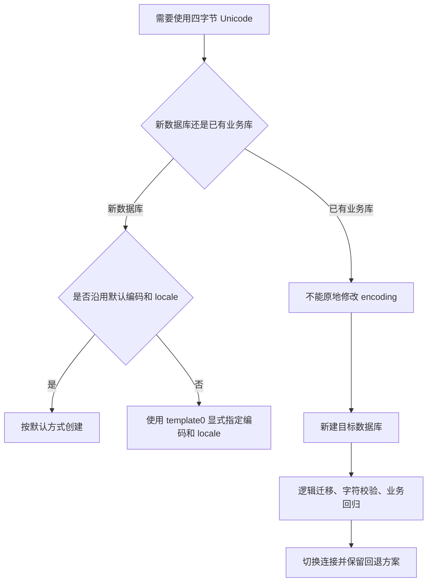
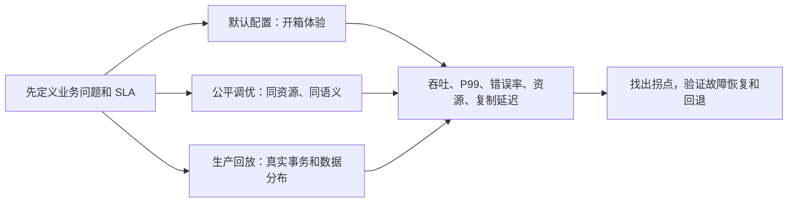
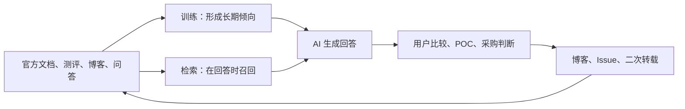

## 德说-第532期, AI 时代，公网内容就是产品的第二张脸 
  
### 作者  
digoal  
  
### 日期  
2026-08-01  
  
### 标签  
AI , Agent , 公网数据 , 产品形象 , 产品刻板印象 , 投毒  
  
----  
  
## 背景 
  


产品在公网上的内容就是产品的第二张脸, 不管这些内容是不是来自官方、权威机构、技术专家发布的文章, 对产品影响都极大. 

这是我的亲身经历. 

我用女娲 SKILL 写了一个金仓数据库的全栈专家技能, 它调研了很多公开资料, 最后生成了这个专家技能.

然后我用 金仓数据库全栈专家 技能来写 mysql 迁移到金仓数据库的最佳实践, 内容本身很过硬.

但是这条“utf8mb4 4字节 emoji：KES UTF8 默认不支持完整 utf8mb4，需测试验证；`initdb` 后不可改 encoding（必须重建实例)”. 实际上用 template0 模板新建数据库即可.

还有这条“写入性能口径：独立评测显示 KES "读强写弱"（04-community-views.md S18/S27），高写入场景（QPS > 5000）务必压测”. 我看了这个 04-community-views.md 文件, 发现是技术专家在公网上写的文章沉淀的, 而且明确说明未优化默认配置的测试结果. 这对产品来说就很吃亏, 哪有拿数据库默认配置去做PK的? 别的产品优化了就你没优化. 

所以回到我开头说的: 产品在公网上的内容就是产品的第二张脸, 不管这些内容是不是来自官方、权威机构、技术专家发布的文章, 对产品影响都极大. AI 时代, AI 会消化这些内容, 然后形成刻板印象.   

今天这篇文章不替金仓做性能排名，也不把一次事实核查扩大成产品好坏的裁判。我们只沿着一条链路往回看：内容怎么上网，AI 怎么读，用户怎么相信，产品方又能怎样把正确版本重新放回这条链路。

## 先把两条话改回原来的尺寸

### “KES UTF8 不支持 emoji”把三个问题混在了一起

MySQL 的 `utf8mb4` 是 MySQL 里的字符集名称，不是“凡是叫 UTF8 的数据库都必须另有一个 4 字节版本”。按[金仓本地化支持手册的字符集说明](https://help.kingbase.com.cn/v8/admin/reference/local/appendix-a.html)，KES 的 `UTF8` 被列为服务器端可用编码，单个字符可以占 1 到 4 个字节。因此，不能把“KES UTF8 默认不支持四字节 emoji”当成产品事实。

真正容易混淆的是 `initdb` 到底决定了什么。它初始化的是数据库集簇，并设置模板数据库和以后建库时的默认编码；它不是给整个实例铸上一块“以后什么都不能变”的铁牌。新建数据库时，可以用干净的 `template0` 覆盖默认设置。金仓文档也给出了这种建库方式，见[字符集与建库说明](https://help.kingbase.com.cn/v8/admin/reference/local/local-3.html)。

在测试环境里，思路大致是这样：

```sql
CREATE DATABASE app_utf8
  WITH TEMPLATE template0
       ENCODING 'UTF8'
       LC_COLLATE '<操作系统中已安装的 UTF-8 locale>'
       LC_CTYPE   '<操作系统中已安装的 UTF-8 locale>';
```

这里有三个边界不能省掉：

- **新建一个不同编码的数据库**，通常不需要重建整个实例，`template0` 可以解决模板复制限制。
- **已有业务库想原地换编码**，不能直接改系统目录里的编码字段。正确路径是新建目标库，再做逻辑导出导入或使用经过验证的迁移工具，最后校验并保留回退点。
- **想把整个集簇以后默认使用的编码换掉**，那是另一件事，可能涉及重新初始化或厂商支持的模板方案，不能拿“新建一个 UTF8 数据库”来代替。



还有一层语义要说清楚：能保存四字节 Unicode，不等于和 MySQL 的 `utf8mb4` 排序规则、大小写折叠、索引行为、客户端转换完全相同。要证明“这个版本、这套驱动、这条迁移链路支持 emoji”，至少应写入并读回 `😀` 和一个增补平面汉字，再检查字符是否相等、字符长度与字节长度是否符合预期，并继续验证 JDBC/ODBC、导入导出、备库复制和应用接口。屏幕上显示不出彩色表情，有时只是字体问题；数据被替换或导出丢失，才是存储链路的问题。

### “读强写弱，QPS 超过 5000”把一次实验抬成了产品性格

被引用的那篇测试文章写得很明白：单节点、默认安装、没有针对任何数据库做优化，实验结果只对那次实验负责。它观察到金仓在那套环境、那种 Python 批量写入方式下写入较慢、读取较快，这个观察可以作为复现线索；它不能自动变成“KES 的内核属性”。[原始测评](https://www.cnblogs.com/yclh/p/18556625)本身就没有给出跨版本、跨硬件的产品排名承诺。

把其他几篇公开材料也放回原文后，工作负载、平台、批量大小和索引条件并不相同，结果方向也没有稳定复现“读强写弱”。所谓“三源交叉验证”，其实是把“三篇都谈过性能”误读成“三篇都证明同一个结论”。这不是措辞保守不够，而是证据合并出了问题。

“QPS > 5000”还混淆了两个概念。QPS 是每秒请求数，TPS 是每秒完成的业务事务数，一个事务可能包含多条 SQL。没有被核对的原文建立这个 5000 分界线，就不能把它写进最佳实践。真正合理的压测触发条件是：业务 SLA 接近已测容量，或者版本、硬件、驱动、数据规模、事务模型、索引、审计、加密、同步复制发生了明显变化。低于 5000 也可能需要压测，超过 5000 也不能靠一个数字替代压测。

数据库性能至少要分三条赛道。默认配置回答“装上就用的体验”；公平调优回答“相同资源、相同持久性和高可用语义下，合理配置能到哪里”；真实业务回放回答“这套系统能否满足我的 SLA”。三条赛道可以都做，不能混成一张榜。



这里的 P99 可以简单理解成“最慢的那批请求有多慢”：平均值很好看，不代表高峰时用户没有卡住。一个能被复现的性能结论，至少要交代版本、硬件、数据、事务与提交方式、持久性、高可用、驱动和脚本，并报告持续吞吐、尾延迟、错误率及资源瓶颈。否则，它最多是“这次测试看到了什么”，不是“这个产品天生是什么”。

## AI 会压缩内容，也会放大内容

开发者并不是只看官网。Stack Overflow 2024 开发者调研显示，在线资源仍是学习和选型的主要入口；同一份调研也把 AI 输出中的错误信息列为重要担忧。大家一边问 AI，一边对答案打折听，这个状态很真实：懒得从零检索，却也没有时间逐条核验。

AI 进入公网内容，大致有两条路。预训练像把旧网页、书籍和代码消化成“长期记忆”，更新慢，有知识截止线；联网检索或 RAG（检索增强生成）像回答前临时翻资料，能带来新内容，但会受到搜索排序、来源可抓取性和模型选择的影响。Anthropic 在 2025 年的[官方 Web Search 说明](https://claude.com/blog/web-search)展示了“搜索并附引用”的产品路径，但这不意味着所有模型都访问同样的网页，也不意味着有引用就自动正确。



金仓案例里的失真，正好说明了中间发生了什么。原文可以是：

> 在某台机器上，默认配置、某种批量提交方式下，Python 写入观察较慢；结果只代表本次实验。

经过二次转述，它变成：

> 金仓写入较慢，读取较快。

再经过一次摘要，就可能变成：

> KES 读强写弱，高写入 QPS 超过 5000 要谨慎。

这叫“去条件化”：结论留下来了，版本、硬件、批量、配置和适用范围被压掉了。限定词太长，不好当标题；短断言却很适合搜索、转发和回答。AI 复述错误时可是复读机级别的稳，错三次都不带改口的。

重复出现也会制造一种假象：同一篇文章被几十个账号转载，看起来像几十个独立证据，实际上只是一个源头的回声。AI 再把这些回声聚成一句话，用户就会听到“大家都这么说”。这不是 AI 凭空发明了错误，而是它把公网里原本松散、带条件的内容压缩成了更方便传播的版本。

## “凝固”有条件，不是写死在石碑上

“失真一旦进入 AI 就永远改不了”也太绝对。更准确的说法是：它会形成惯性，纠偏难度取决于产品所处的语料区间、用户是否真的用 AI 调研，以及模型是否联网、何时更新。

最容易出问题的，通常是“公网讨论不少，官方可引用材料却不够，测评文章占了大头”的中间地带。金仓这类 B 端数据库正有这个特征：AI 找得到一些内容，所以敢回答；内容又不足以覆盖版本、场景和反例，所以不一定答得对。

反过来，像成熟开源项目那样，官方文档、代码、变更记录和可复现实例长期密集存在，模型回答往往更稳定。完全没有公网讨论的小众工具则是另一种麻烦：AI 可能直接说不了解，也可能拿相近产品胡编。这里不能把“AI 形成产品印象”和“AI 形成错误印象”当成同一个命题。

失真的性质也不同，纠偏速度不能套一条曲线：

- **工程事实**，例如 API 参数、错误码、某版本是否支持某语法，配上稳定文档、可运行代码和回归测试，往往能在较短时间内纠正。它可以被一个可复现的反例证伪。
- **印象类判断**，例如“读强写弱”“不适合高并发”，涉及跨厂商比较和经验预期，更黏，需要多轮同口径测试、客户回放和持续引用来改变。单篇声明通常不够。
- **安全、合规和政策类说法**，有自己的权威渠道和放大器，不能用普通 FAQ 或营销稿代替漏洞公告、认证文件和正式政策原文。

大模型版本更新、检索源变化、合成数据增加，也可能成为集体纠偏窗口。所以“时间越久越难”是方向上的提醒，不是“7 天形成、90 天定型”的硬公式。工程类错误有时几周就能被新文档覆盖，印象类错误可能拖得更久，安全争议则要另算。

这件事其实不用靠争论来证明。选一组固定问题，让多个模型在同一时间回答，记录四件事：答案是否正确、限定条件保留了多少、引用了哪些来源、是否标注版本和不确定性。一个月后用同样的问题复测。若不同模型高度一致地重复同一错误、引用反复指向同一批旧文章，说明“失真惯性”确实存在；若答案分散、主动给出版本边界，并开始引用新的官方材料，原先那种“AI 已经锁死产品印象”的说法就该收窄。

## 产品方要管理的是“可引用的事实”

公网内容不是广告的延长线，而是产品体验的一部分。广告没人看了就过去，错误的迁移命令、错误的字符集判断和错误的容量阈值，却会被开发者复制进项目、被销售拿来回答异议，最后变成支持成本和流失线索。

### 先做事实卡，再做漂亮的 PR

针对高频误解，产品方应该有稳定的 HTML 页面，而不是只发一张海报或一篇会被改标题的公众号稿。每张事实卡都把问题写在标题里，第一屏给直接答案，随后写清适用版本、前置条件、复现步骤、不能推出什么、更新时间和变更记录。

KES 可以先做两张：一张回答“UTF8、四字节 emoji 和 `template0` 到底是什么关系”，把“新库”和“已有库”分开；另一张回答“如何理解 KES 性能数据”，把默认配置、合理调优和真实业务回放分开，并明确没有证据支持任意 QPS 5000 阈值。

结构化有用，但结构化不是权威本身。FAQ、机器可读的字段、清楚的标题和引用，能让搜索与模型更容易找到页面。Princeton GEO 论文（2024）确实显示，引用、统计信息和内容组织会影响生成式回答中的可见度；但研究效果会随问题类型变化，操作类、API 类和性能数字不能照搬一套“GEO 配方”。`llms.txt` 之类做法可以试，却不该被当成所有模型都会遵守的通行证。

一句话概括： **结构化负责让事实被找到，可验证的方法负责让事实值得相信。**

### 把测评的边界写进标题

一个值得长期引用的基准，不需要假装自己回答了所有问题。默认配置测试可以诚实地回答“第一次安装的体验”；公平调优测试可以说明在相同资源和相同 ACID、复制语义下的表现；生产回放则回答具体业务能否在 P99、错误率和复制延迟约束下达标。三种结果都公开，反而比只放一张“领先多少倍”的海报更有说服力。

以 OceanBase 的公开 TPC-C 结果为例，长期价值不在某个脱离年份的数字，而在于独立审计、方法公开、版本和时间点清楚。反过来，厂商自己的 TPS 或 tpmC 页面，如果没有完整硬件、版本、事务模型、持久性、持续时间和原始报告，就应标成“厂商自述”或“能力线索”，不能冒充 TPC 官方成绩。拿一个没有条件的营销数字去覆盖另一个没有条件的社区数字，只是把问题换了个方向。

顺带提醒一下，政策和市场数字也会被传播“写满”。把 79 号文压缩成“所有单位到某年一律 100% 替代”，就抹掉了分阶段、分类别推进的政策语境；把一次测试写成“独立证明”，也抹掉了测试方法和证据等级。遇到这类句子，先追原文、年份、适用对象，再决定能说到哪一步。

### 纠偏不要先变成舆论对战

原作者写了一个有边界的实验，不等于原作者“造谣”。更有效的动作是：先复现原测试，承认它在原条件下观察到的现象；再补做公平调优和真实回放，公开差异来自批量提交、连接方式、日志持久化、索引还是参数；最后把结论和边界沉淀到自己的文档与勘误页。

有条件时，可以邀请作者、DBA 社区或客户一起跑；没有条件拿到信通院、赛迪等机构联合署名，也不必停摆。权威背书本来就是稀缺资源，中小厂商更现实的路径是公开脚本、配置差异、原始 CSV、监控指标和复现说明，邀请别人来挑错。一份能被第三方复跑的报告，通常比十篇“行业领先”的通稿更能改变开发者心智。

### 让 AI 监测成为产品工作，而不是临时公关

每月固定一组“产品名 + 性能”“产品名 + 迁移”“产品名 + 缺点”的问题，交给几个主流模型回答。不要只看有没有正面提及，更要看错误陈述出现率、限定条件保留率、官方来源引用率和版本标注率。把这些结果和真实的销售异议、POC 失败原因、工单关键词放在一起，才能知道 AI 印象是否真的影响了业务。

如果三个月后官方事实卡已经上线，但模型仍稳定引用旧测评，就说明问题不在“有没有写文章”，而在页面可抓取性、外部引用和证据质量；如果正确率上升、错误率下降，却没有带来任何 POC 改善，也要承认“公网内容影响被高估”的可能。指标的作用不是给公关部门报喜，而是允许结论被推翻。

## 一个小团队也能做的 90 天闭环

**前 7 天，先盘点。** 固定 20 个左右真实问题，在多个模型上做基线；把高频说法分成工程事实、印象判断、安全合规三类，给每条标版本、证据等级和负责人。不要一上来就做大而全的内容矩阵，先找最可能影响迁移和 POC 的十条。

**第 8 到 30 天，发布两张事实卡。** 用问答开头，附最小复现脚本和完整边界；为原有错误引用建立稳定勘误页；把官方手册里藏在 PDF、图片和章节深处的关键事实，改成可搜索的 HTML。内容既要让机器容易切片，也要让人读完能照着做，不能写成只有机器人看得懂的碎片。

**第 31 到 60 天，做三条测评赛道。** 先在默认配置下复现争议，再给所有对照组相同的调优条件，最后用脱敏业务回放验证 SLA。公开版本、硬件、脚本、参数、原始结果和已知限制；能找到同行一起复跑，就不要只在自家环境里宣布胜负。

**第 61 到 90 天，复测并修订。** 用同一组问题重新访问多个模型，比较引用来源和限定条件；同步检查销售材料、迁移 SKILL、知识库和客服话术，避免官网改对了，内部工具还在继续喂错答案。以后每次版本发布，都把兼容性和性能边界当作变更记录的一部分。

如果只能做一件事，我会选“版本化、可复现、稳定可抓取的事实页”。它不需要先拿到昂贵的权威背书，却能同时服务开发者、搜索引擎、AI 和内部团队，是最小的共同底座。

## 把主线收回来

公网内容已经是产品的一部分，不是产品的广告。对数据库、操作系统、芯片这类长决策、强技术产品，开发者在正式 POC 之前就会先用搜索和 AI 筛掉一批选项；错误内容可能在这一步造成损失。

失真也不是“会不会发生”的二选一。它更容易发生在语料中等、权威材料稀薄、测评条件常被省略的产品区间；工程事实、产品印象和安全合规争议的纠偏速度不同；模型更新和多模型差异又会改变结果。把这些边界写出来，结论才不会从一个极端滑到另一个极端。

产品方真正要做的，不是要求公网上所有人只说好话，也不是追着每个 KOL 打嘴仗，而是让正确版本比错误版本更容易被找到、更值得相信、更方便复现。等 AI 下次再回答“KES 能不能存 emoji”“高写入什么时候压测”时，最有力的品牌声明不是一句“我们不是这样”，而是一页能让人和机器都核对的证据。
  
  
#### [PostgreSQL 解决方案集合](../201706/20170601_02.md "40cff096e9ed7122c512b35d8561d9c8")
  
  
#### [德哥 / digoal's Github - 公益是一辈子的事.](https://github.com/digoal/blog/blob/master/README.md "22709685feb7cab07d30f30387f0a9ae")
  
  
#### [About 德哥](https://github.com/digoal/blog/blob/master/me/readme.md "a37735981e7704886ffd590565582dd0")
  
  

  
