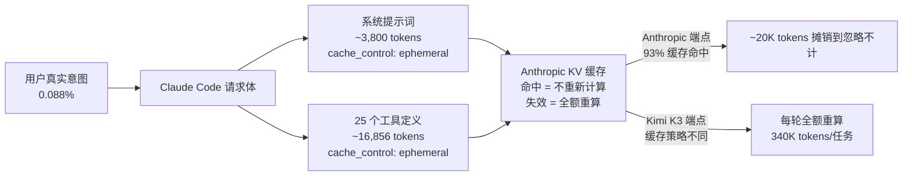

## Claude 居然“暗算” Kimi ? 
  
### 作者  
digoal  
  
### 日期  
2026-08-02  
  
### 标签  
AI , Agent , Claude , CLI , Kimi , Harness , KV Cache , 缓存 , 速度 , 价格 , 质量 , 完成度
  
----  
  
## 背景 

今天看到好友 steven 发的一篇文章, 使用不同的 agent 产品对同一模型 kimi k3 的同一批任务的测试, 就看 3 个指标: 耗费、速度、任务完成数; 

结果发现一个惊天大秘密, Claude Code Agent 竟然如此不堪, 速度、耗费、任务完成数都大打折扣.           

不至于这么坑害用友商模型吧? 真应验了“商场就是战场”.

仔细研究发现, 并不简单, 是我阴谋论了.  

下面是更详细的分析过程.

> Claude Code 用 Anthropic 模型飞快，换友商模型就贵 4 倍、慢 2 倍——不是巧合，是架构层面的精准锁死。

Composio 最近做了一个只有一层变量的测试：同一套 Kimi K3 模型，塞进 6 个不同的 Agent 框架，跑完全相同的 26 个任务。结果任务完成数最多只差 4 项，账单最多差 3.8 倍，速度最多差 2.1 倍。Claude Code 在所有负面榜单上都排第一。 **真正决定你账单的数字不是模型，是框架与推理基础设施之间的耦合深度。**

这间接说明了为什么每家模型厂商都要自己开发 coding agent . 

## 用户意图只占 0.088% 的上下文

先看一个扎眼的数字。有人建了一个代理网关，把 Claude Code 和 Anthropic API 之间的所有请求全量记录下来——10 个会话、223 次 LLM 调用，逐字节分析。 **你敲进终端的第一条消息，只占整个 API 请求的 0.088%。** 其余 99.912% 是 Claude Code 自动注入的"基础设施"。

这个基础设施拆成两大部分：

82.6 KB 的固定基线与用户意图的比例关系是 911:1。这 82.6 KB 就是一份完整的员工手册：git 提交协议、PR 工作流、bash 安全规则、记忆系统说明、任务管理、Cron 调度、子 Agent 框架——全部 25 个工具定义以完整 JSON Schema 格式注入，每次都一模一样。 **Claude Code 不可能知道你下一条消息是写代码还是 rebase 分支，所以它什么都在第一次请求里全塞给你。** 这个设计的工程判断本身没有问题。

问题是它如何摊销这笔固定开销。

  

## 摊销的秘密：只有 Anthropic 才有这张优惠券

Claude Code 整个架构围着 prompt caching 转。系统提示词和工具定义上都打了 `cache_control: ephemeral` 标记——精确前缀匹配机制保证：只要请求前缀与已缓存的 KV Cache 完全一致，那部分 token 的 prefill 计算完全跳过，缓存读取价仅为标准输入价的 10%。

真实测量中，Anthropic 端点上 93.3% 的请求内容是缓存读取，1.2% 是缓存写入，0.1% 是没有缓存标记的账单头。 **这套摊销机制不是在客户端实现的，是在 Anthropic 服务端的 KV Cache 里实现的。** 客户端只负责把内容原封不动地每次重发一遍，真正省钱的魔术发生在远程。

现在把请求发到 Kimi K3 的兼容端点会发生什么？第三方端点的缓存策略与 Anthropic 官方不完全一致。composio 测到的结果是：Kimi Code 每任务约 61,000 tokens，Claude Code 约 340,000。 **同一条任务、同一个模型、5.9 倍的 token 消耗差距。**

34 万 vs 6.1 万——这个数字不是 Claude Code 变笨了，是它的固定开销没有摊销出去。那 82.6 KB 的"员工手册"在 Kimi K3 端点上每轮都要全额重算 prefill。

| 框架 | 完成数 | 单任务成本 | 中位耗时 | 中位 token |
|------|--------|-----------|---------|-----------|
| Hermes | 20 | $0.39 | — | ~67K |
| Pi Agent | 19 | $0.40 | 161.7s | — |
| Claude Code | 19 | **$1.47** | **347.6s** | **~340K** |
| Kimi Code | 21 | $0.22 | 297s | ~61K |

Bill 是另一回事。Claude Code 在 Anthropic 端点上的成本结构是：第一轮全额写入缓存（1.25× 价格），后续轮次 10% 读取价——83.6% 的固定开销第二轮开始近乎免费。 **这个价格体系只对持有 Anthropic KV Cache 的主体开放。**

这不是"水土不服"。这是架构层面的精准锁死：Claude Code 的高效率不在它的代码里，在 Anthropic 服务端的缓存里。把整个设计搬到任何没有同等缓存策略的端点，都会现原形——这是必然的，不是意外。

 

## 暗算

Claude Code 不需要针对第三方端点做任何恶意操作。 **架构本身就完成了所有"暗算"。**

**第一种：把框架成本伪装成模型质量。**

当企业用 Claude Code 跑 Kimi K3 的 benchmark，看到的是一笔高昂的账单和一张未完成的任务清单。企业用户的判断逻辑是：这个模型贵、慢、没完成任务——换一个。他们不会把成本拆成"框架固定开销"和"模型 token 消耗"，行业也没有标准化方法来衡量这个拆分。Kimi K3 被不公平地钉在了一个由框架制造的性能幻象上。

**第二种：把用户锁定在推理基础设施上。**

Claude Code 的设计决定了：想便宜用 Claude Code，你必须用 Anthropic 的端点，因为只有那里的缓存策略和它的架构假设完全匹配。换任何第三方端点，代价立刻变成 3.7–3.8 倍。这不是定价策略，是架构强制的迁移成本——你的代码不需要改，只要改一行 `ANTHROPIC_BASE_URL`，账单乘以 4。经济学上这叫"转换成本"，由架构隐性强制执行，比任何合同条款都有效。

**第三种：让框架替模型做选择。**

最具杀伤力的一点：Claude Code 的用户不是在选择模型，是在选择推理基础设施。当你的终端工具默认发往 Anthropic，你的 benchmark 跑在 Anthropic 的缓存上，你的 token 摊销依赖 Anthropic 的 KV Cache——你实际上已经被 Anthropic 的生态锁定了，只是还没收到账单。

Sebastian Raschka（威斯康星大学 AI 研究员）看到 Composio 数据后复现了一次： **"这和我用 Qwen3.6 的观察一致，Claude Code token 用量常是其他 harness 的 2–3 倍，但差异只出在输入 token，不在输出 token。Claude 并没有多写一倍的内容。"** 多出来的输入 token 全是从上下文里反复塞回模型的固定开销和累积历史。

## 这不是第一次

巧合只能解释一次，解释不了三次。

**Databricks（7 月 8 日）：** 内部真实 PR 基准，同一个 Claude Opus 4.8，Pi harness 比 Claude Code 便宜 2 倍，成功率相同。

**Writer（7 月 8 日）：** arXiv 论文，换 harness 层后 token 降 38%、成本降 41%，而且所有 6 个基础模型都受益——框架税不是某个模型的问题，是通用结构性问题。

**Composio（8 月 1 日）：** Kimi K3 单模型单 harness 变量，最高成本差 3.8 倍，时间差 2.1 倍，完成数差 4 项。

三家公司、三种任务集、两个模型组合，指向同一方向。 **Agent 的成本和速度，很大程度由执行框架决定，模型反而是第二变量。** 行业需要一个新的基准维度——不是"哪个模型更强"，而是"这套 harness 在你的端点上实际烧多少 token"。

  

## 结论

Composio 的测试揭示的不只是一个产品 bug，是一个结构性事实： **在 Agent 时代，推理基础设施已经成为比模型更深层的竞争壁垒。** Claude Code 的高效率不是靠代码实现的，是靠 Anthropic 的 KV Cache 实现的——代码只负责每次都原封不动地重发一遍。这个设计让 Claude Code 在 Anthropic 端点上飞快，让 Kimi K3 在 Claude Code 框架上贵得离谱。

不是 Kimi K3 差，是你的框架不允许它便宜。下次你看到一篇 benchmark 说某个模型"贵、慢、任务完成少"，先问一句： **它是在哪个框架上跑的？那个框架依赖的缓存能力在你的端点上生效了吗？**

   

## 参考来源

- [Composio 官方推文（基准数据来源）](https://x.com/composio/status/2083161873357111297)
- [Composio 第二组基准数据](https://x.com/composio/status/2083161879489220722)
- [KuCoin 新闻报道：Kimi K3 agent 框架测试](https://kucoin.com/news/flash/kimi-k3-agent-framework-test-shows-claude-code-most-expensive-and-slowest)
- [Hacker News 讨论串](https://news.ycombinator.com/item?id=48883275)
- [Shubham Thorat: "Your 'Hello' Sends 20,000 Tokens" — 82.6KB 请求拆解（ Medium, 2026 年 3 月）](https://medium.com/@shubhamatucsd/your-hello-costs-20-000-tokens-whats-really-inside-every-claude-code-request-239c7ce4424d)
- [Claude Code 官方 prompt caching 文档](https://code.claude.com/docs/zh-CN/prompt-caching)
- [机器之心 / 36氪 报道：三大框架最多差 30 倍（2026 年 7 月 31 日）](https://m.36kr.com/p/3919477277666692)
- [CSDN: Claude Code 接入 MiMo 缓存失效分析](https://blog.csdn.net/baidu_33303454/article/details/163399302)
- [Writer 公司 arXiv 论文（控制变量实验，2026 年 7 月）](https://arxiv.org/html/2607.06906v1)
- [Sebastian Raschka 推文：Qwen3.6 + Claude Code 观察](https://x.com/rasbt)
    
  
#### [PostgreSQL 解决方案集合](../201706/20170601_02.md "40cff096e9ed7122c512b35d8561d9c8")
  
  
#### [德哥 / digoal's Github - 公益是一辈子的事.](https://github.com/digoal/blog/blob/master/README.md "22709685feb7cab07d30f30387f0a9ae")
  
  
#### [About 德哥](https://github.com/digoal/blog/blob/master/me/readme.md "a37735981e7704886ffd590565582dd0")
  
  

  
