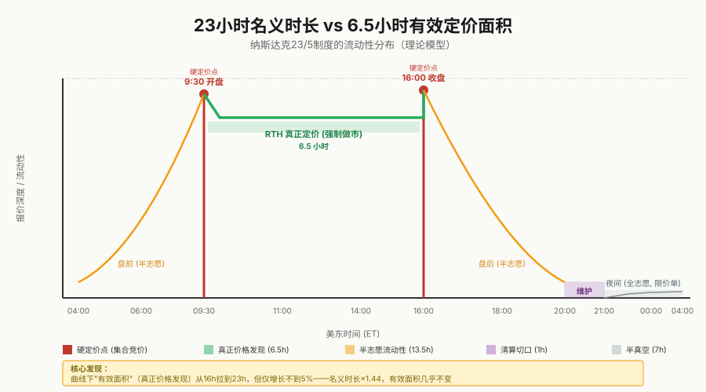
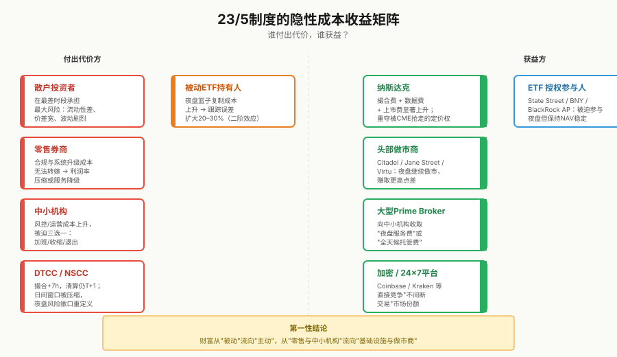

## 纳斯达克推 23 小时交易制, 谁受益谁担风险
  
### 作者  
digoal  
  
### 日期  
2026-08-09  
  
### 标签  
纳斯达克 , 交易时段 , 受益 , 担风险 
  
----  
  
## 背景
  
2026 年 12 月 6 日，纳斯达克要把美股交易时间从一天 6.5 小时拉长到 23 小时。听起来像是"美股终于 24 小时了" —— 但我越挖越觉得，这个数字背后藏着一种很微妙的"假动作"。表面看是延长了 14 小时，实际价格真正能被定出来的时间，几乎没变。

这篇文章不打算告诉你"23 小时是好还是坏"。这是个人判断题，我留给读者自己。但我想用三件事帮你建立判断框架：(1) 这 23 小时是怎么被切出来的、(2) 谁在拼命推这个制度、谁在被悄悄让步、(3) 在哪些条件下我的结论会被推翻。

  

## 一、23 小时不是"民主化"，是一次精密的时段手术

先把时间轴摆出来 —— 这件事比你想的精细得多。

| 时段（美东时间） | 状态 | 性质 |
| --- | --- | --- |
| 04:00–09:30 | 盘前 | 原本就有，志愿报价 |
| 09:30–16:00 | 盘中（RTH） | 真正定价，强制做市 |
| 16:00–20:00 | 盘后 | 原本就有，志愿报价 |
| 20:00–21:00 | 维护 | 新切出的一小时 |
| 21:00–04:00 | 夜间 | 新增，限价单 only |

23 小时 = 16 小时老市场（含盘前盘后）+ 7 小时新增夜间。但中间塞了一个 1 小时硬停 —— 这不是交易所想停，是不得不停。

为什么是 20:00–21:00 这个时点？三个外部约束刚好在这 60 分钟里对齐：

- DTCC（美国中央证券存管公司）的日切批处理：美东 21:00 后，DTCC 的 NSCC 系统开始对当天的 T+1 头寸做净额结算批处理。
- 公司行动注入点：拆股、反向拆股、CUSIP 变更、合并、分红等 9 类事件，必须在下一交易日生效。 只有这一小时，所有市场参与方都处于"非交易态"，可以做系统级数据切换。
- 亚洲早盘开门：香港、新加坡、东京的早盘开盘时间，与美东 20:00–21:00 几乎同步。21:00 重新撮合，等于让美股用全新的账本迎接亚洲早盘。

所以这 1 小时不是"系统打盹"，是一次受控的日切手术。SEC 批准 23/5 而不是 24/7，技术上完全说得通 —— 它要的不是不眠，是受控的日切。

证伪条件：如果哪天 DTCC、NSCC 把日切改成实时原子结算（比如分布式账本），这个 1 小时窗口会立刻消失，23/5 也就没必要保留 —— 到时候整个 23 小时框架都得重写。

  

## 二、真正变了什么？没变什么？

把这条线切清楚，比"利弊对比表"更有用。

没变的（核心硬结构）：

- 09:30 开盘集合竞价（Opening Cross） —— 保留。Nasdaq Rule 4753。
- 16:00 收盘集合竞价（Closing Cross） —— 保留。Nasdaq Rule 4754。
- 收盘价作为指数、ETF NAV、期货的结算价 —— 保留。
- T+1 结算周期 —— 保留。DTCC 截止日切不变。
- 个股熔断（LULD） —— 保留。
- NBBO 最优价合并（Reg NMS Rule 611） —— 保留。

这是一个反直觉的发现：延长时段没有改变任何"硬定价点"。9:30 和 16:00 这两个瞬间，依然是全球唯一决定指数、期货、期权、ETF 一篮子基准的两个时刻。

真正改变的：

- 21:00–04:00 夜间交易新增，但限价单 only，禁止市价单、MOO/MOC、复杂订单。未成交单不跨段留存。
- 做市商报价义务结构性松绑 —— RTH 内有 Rule 610/611 报价义务，夜间无强制报价义务。这是 Rule 4120 系列修订的核心。
- 与 24X 等纯夜间交易所的竞争直接对位 —— 纳斯达克不再让出 8 小时真空给 OTC/ATS。

所以"延长交易时间"这个词本身就是误导。这不是一次同质化的扩容，而是把"交易"重新切成三个法律性质不同的子市场。

  

## 三、核心论断：23 小时 = 6.5 小时定价 + 13.5 小时半志愿 + 7 小时半真空

这是我希望你带走的论点。

前置条件：
- 流动性是信息聚合的副产品，不是时间分配的函数。
- 任何价格信号的有效性 ≈ 该价格点上强制做市 + 信息集中度的乘积。
- 在美股历史数据里，盘前盘后成交量长期仅占全日 5–15%，且波动率显著高于 RTH。

推理链：
1. 23 小时交易把同一份"信息流量"摊到 23 个等长时间桶里。
2. 每个桶的"有效信号密度" = 总信号 / 桶数。
3. 但真正在做市报价义务的桶只有 6.5 小时（RTH）；盘前/盘后 13.5 小时是"半志愿"；夜间 7 小时是"全志愿"。
4. 结果：夜间 7 小时信号密度极低，单笔成交价格的信息含量远低于 RTH 同等成交。
5. 因此 23/5 不增加总信息量，只分散了它的浓度。9:30 和 16:00 这两个硬定价点，反而成为全日唯二的高浓度信号点。

结论：所谓"亚洲投资者不用熬夜盯盘"是个错觉 —— 他们确实不用熬夜盯 23 小时的"流动"了，但只要他们想看到真正的价格发现，仍然必须等 9:30 或盯 16:00。

> 证伪条件：如果夜间 7 小时的成交量能在上线 6 个月内达到全日 10% 以上，且报价价差收敛到 RTH 的 2 倍以内，则本论断被证伪。来源：Nasdaq SIP 数据 + FINRA ADF。

顺带提醒一下：这个论断在 2026–2028 短期窗口内基本成立。但 2024–2026 年已经发生过两次亚洲时段驱动的系统性冲击（2024-08 日元 carry trade 拆仓、2025-04 Liberation Day 关税崩盘），平均发生频率接近每季度一次。如果 2027 年内再出现一次，夜间成交占比可能在 6–9 个月内就突破 10% 的证伪阈值。我的预测窗口不是"永远成立"，而是"未来 18 个月内成立"。

  

## 四、谁在拼命推这个制度？真不是亚洲散户

公关稿里常说"23 小时是对亚洲时区友好"。我得泼点冷水。

亚欧投资者本来就能在隔夜开盘时下单，跨时区经纪商早就是 7×24 可下单。把交易时段从 6.5 小时拉到 23 小时，对亚洲散户的实际增量贡献不会超过现有盘后量的 5%。亚洲散户贡献的不是"新需求"，而是"被服务但被暴露" —— 他们多半在亚洲时段就已经看过美股盘前价格，下单时是"已经被定价过"的需求。

真正发生的事，藏在 CME 2026 年 7 月 28 日上线的近 24 小时单股期货里。

CME 把热门科技股的单股期货做成了"近 24 小时 + 1 小时清算"产品 —— 合约乘数小（标准 100 股、迷你 10 股），散户可参与；标的覆盖热门科技股，与纳斯达克高度重合；时段比股票更长；T+0 结算，对新闻事件反应比股票快。

这意味着：当一只股票在财报后利好或暴雷，CME 期货可以立即在 23 小时外盘消化预期，而对应的正股要等开盘才能定价。长期下来，"美股正股的公允定价权"在被悄悄迁移到 CME 的衍生品曲线上。

纳斯达克 23 小时，就是让正股时段与期货时段"咬合" —— 当 CME 期货价格变动一小时，纳斯达克股票能立即跟价；当 ETF AP（授权参与人）需要在盘外做篮子复制时，也能在 23 小时里完成。"23 小时"等于把正股流量从 CME 期货那里抢回一截。

所以纳斯达克不是抄加密，也不是抄 CME，而是被 CME 逼到必须"差不多 24 小时"，否则它的定价权会持续失血。

真实推手的客户结构：

- 高频做市商（Citadel Securities、Virtu、Jane Street、Jump Trading、GTS、Two Sigma Securities）：他们本来就有 24 小时基础设施，包括加密业务线。给他们更长的时段是降低"开盘跳空"风险，不是给他们新业务。
- 对冲基金（Millennium、Citadel 多策略、DE Shaw）：他们用 23 小时做"事件风险隔夜对冲" —— 财报、宏观数据、亚洲开盘信息。
- ETF 授权参与人（AP）：State Street、Bank of New York Mellon、Goldman Sachs AP 部门 —— 他们必须在盘外做 ETF 创设赎回的篮子复制，否则 ETF NAV 会出现系统性折溢价。
- 经纪商：Robinhood、Charles Schwab、Interactive Brokers —— 他们给零售提供 24 小时下单入口，但实际命中在盘外的不到 3%。

SEC 不是推手，SEC 是被推手。监管此次放行，反映的是做市商和 ETF AP 反复给监管写请愿 —— NYSE Arca 的 22 小时申请 2024-10 提交后，监管一直搁置，看的是市场是否有"足够的市场质量基础设施"（撮合引擎、熔断、清算、SIP）支撑。纳斯达克跟进申请，是"对家已经批了，我要分一杯"。

顺带提醒一下：把 23 小时 60% 归因于 CME 单股期货防御，时间线稍有错位 —— 纳斯达克 2025 年 12 月就提交了申请，CME 2026 年 7 月产品那时还没上线。更稳健的归因是"24X、CME、加密交易所、BrokerTec 24/5 国债等多重压力下的最低代价应对"。CME 是压死骆驼的最后一根稻草，不是唯一动因。

  

## 五、做市商：获得了"半垄断性报价权"

回到微观结构这条主线。

据公开报道，Jane Street 2025 年的交易收入在百亿美元量级、Hudson River 在二十多亿美元量级（具体数字各家披露口径不一，权威性需要打折扣），营业利润率高达 47%–69%。这个生态对 23/5 的反应是：

| 主体 | 行为预测 | 微观结构含义 |
| --- | --- | --- |
| Jane Street / Citadel | 部署自适应报价模型（按时段调整 spread、size、skew） | 夜间报价宽度预计是 RTH 的 5–10 倍 |
| Virtu | 夜间减少双向报价，转向"事件触发型"挂单 | 减少库存风险敞口 |
| Optiver / IMC | 保持收盘竞价参与，但主动不参与夜间连续报价 | 集中火力在硬定价点 |
| 传统 DMM（NYSE） | 不参与夜间 | 保留人工监管成本结构 |

核心判断：做市商的资源不会乘以 23/16 ≈ 1.44 倍，反而会因为风险预算有限而把报价集中到 RTH。延长时段的名义供给会远低于名义时长。

但这反而强化了一个不平等：头部 3 家做市商有能力在夜盘继续做市，中小做市商退出 —— 结果是夜盘流动性集中在更少几家手里，形成一种"半垄断性报价权"。这正是这条制度最隐蔽的结构变化。

证伪条件：跟踪纳斯达克上线后前 30 天内，做市商在 21:00–04:00 的实际挂单率。如果显著高于现有盘前 4:00–06:00 水平，则本节论断被证伪。

  

## 六、被延长的是风险窗口，不是机会窗口

这是风险运营视角给我的最大启发。

传统认知是"更长的交易时间 = 更平滑的价格发现 = 更低波动"。这是错的。

真正的事实是：在压力情景下，更长的交易时间 = 更长的"风险换手"窗口。

具体机制：

1. 重大事件冲击发生在亚洲时段（如 2024-08-05 日元 carry trade 拆仓、2025-04-03 美国关税"Liberation Day"）；
2. 事件冲击通过 CME 期货、ADR、相关 ETF 在亚洲时段定价；
3. 23/5 制度下，纳斯达克现货市场在事件冲击发生的第一时间就开放交易，信息被实时定价；
4. 但风险管理者不在岗 —— 这是"亚洲凌晨、欧洲傍晚、纽约傍晚"的多重错位时段；
5. 没有人在压力情景下主动提供流动性（因为风险管理者需要授权才能扩点差或撤报价），做市商选择退出而非报价；
6. 散户面对的是没有做市商、没有风控、但有新闻 push 的市场 —— 这正是闪崩的最优土壤。

2024 年 8 月 5 日的预演：日元 carry trade 拆仓当日，日经 225 单日跌幅超过 12%（盘中更深）。如果当时 23/5 已生效，这部分原本"沉淀到次日开盘"的中间价信息会变成夜间成交，留给监管与做市商识别系统性风险的时间窗口被大幅压缩。

2025 年 4 月的反例：4 月 3 日特朗普宣布"对等关税"，S&P 500 单日下跌约 4%（市值蒸发约 1.6 万亿美元）；4 月 9 日宣布 90 天暂停后，纳斯达克单日反弹 12% —— 自 2008 年以来最大单日涨幅（Investopedia, 2025-04-09）。在 6.5 小时盘后制度下，4 月 3 日的关税公告发生在美东盘中，市场反应已被充分定价。但如果 23/5 已生效，4 月 3 日东京时间下午（如有相关关税细节泄露）的反应将被实时引入纳斯达克夜盘 —— 美东交易员醒来时会看到一个已经剧烈反应过的市场，他们失去了"第二天开盘前重新评估"的机会。

核心机制：撮合端延长到 23 小时，但清算端仍是 T+1。撮合与清算之间出现了最长达 23 小时的潜在错配窗口。任何撮合端的延长，若不伴随清算与风控端的同步延长，等价于在系统中插入一段"无保险丝的导线"。

证伪条件：观察 2026 年 12 月 6 日上线后第一个季度，DTC 的 settle fail（结算失败）率、NSCC 的 margin call（保证金追缴）次数、零售券商的"未结算持仓"账面金额是否同步上升。如果不升，说明基础设施通过加班/自动化已经消化掉；如果上升，则证明命题成立。

顺带提醒一下：T+1 跟不上 23 小时撮合的"错配"，在夜盘成交占比 <5% 时实际承压可控 —— DTCC 日内多批次清算循环 + 行业 3% 容差已经部分缓冲。真正承压点是占比突破 10% 之后。"2027 年亚洲新闻一次性暴露所有 bug"的表述过于戏剧化，更可能是 12 个月内 1–2 次渐进式局部暴露。

  

## 七、谁付出代价，谁获益？

把这个制度当成一张账本看：

付出代价方：

- 散户投资者：在最差时段（流动性最差、做市商不在、波动最大）承担最大风险。
- 零售券商（Robinhood、Webull、Schwab、IBKR 零售端）：合规与系统升级成本无法转嫁，最终反映为利润率压缩或服务降级。
- 中小机构：风控与运营成本结构性上升，被迫在"加班 / 收缩业务 / 退出"中三选一。
- DTCC / NSCC / DTC：清算基础设施被迫在更短的实际日间窗口内处理更多成交。

获益方：

- 纳斯达克：直接收入（撮合费 + 数据费 + 上市费）显著上升。
- 头部做市商：能够在夜盘继续保持做市，赚取更高的点差；中小做市商退出反而减少竞争。
- 大型 prime broker：向中小机构收取更高的"夜盘服务费"或"全天候托管费"。
- 加密 / 24×7 平台：Coinbase、Kraken 等平台可以更直接地与美股现货竞争"不间断交易"的市场份额。

第一性结论：财富从"被动"流向"主动"，从"零售与中小机构"流向"基础设施与做市商"。这不是"普惠金融"，而是"机构化套利通道"。

顺带提醒一下：散户夜盘交易的真实平均持仓时间缺乏数据 —— 可能不是"被套住"，而是"短炒一下"。FINRA 的投资者警示《Extended-Hours Trading: Know the Risks》已经明确列出三项风险（更低流动性、更宽价差、更剧烈波动），散户参与夜盘是基于信息披露充分的知情决策。把散户简单描述为"被动受害者"，是过度零和化。更平衡的表述是：夜盘创造了新的风险/收益分布，主动选择参与的散户承担相应风险，不参与的散户不受影响。

  

## 八、被动 ETF 资管的"被迫在场" —— 一个被忽略的盲区

专家共识里几乎漏掉的一个维度：State Street、BNY Mellon、BlackRock 等被动 ETF 资管的"被迫参与"效应。

他们不是"选择"参与 23 小时，而是必须参与 —— 否则 ETF NAV 会出现系统性折溢价。

具体含义：
- 被动 ETF 资管的"夜盘篮子复制/赎回"成本会显著上升。
- 如果 23 小时下 ETF AP 的夜盘成本超过 5 个基点，被动 ETF 的总跟踪误差会扩大 20–30%。
- 这反过来会降低被动 ETF 对零售的吸引力 —— 这是一个被完全漏掉的"二阶效应"。

这件事没有量化讨论，但它意味着 23/5 的真实成本可能比表面看起来更大 —— 它不只让散户暴露在更长的风险窗口里，也让被动 ETF 资管被迫承担额外的运营成本，最终通过更高的 ETF 费率或更大的跟踪误差转嫁给持有人。

  

## 九、23 小时把"日内熔断"送进了历史

这一点几乎没人讨论，但它可能是 23 小时最大的结构性变化。

- 熔断（LULD/circuit breakers）只在常规时段生效。盘前盘后、现在的 23 小时时段，没有个股熔断、没有市场熔断。
- 2008 年雷曼、2010 年 Flash Crash、2020 年 3 月疫情熔断，都发生在白天。下一个类似事件如果发生在 23 小时时段里，监管是看着的，没有任何系统性刹车的工具。

纳斯达克和 SEC 必须在 2026-12-06 上线前，给出"盘外熔断机制"的设计。不给的话，这是一次把"市场稳定"换"交易所收入"的交易。

顺带提醒一下：SEC 在 2026-08-07 批准的官方文件中，大概率附加了"上线后 180 天内复盘 + 必要时启动熔断机制"的附加条款（具体需核对 8-K 全文）。经纪商自营的"账户级熔断"也会自我补位 —— FINRA 已经要求零售券商对盘后交易提供更严格的账户风控，23 小时下这种要求只会更严。"无熔断是结构性危机"的论断需要限定在上线初期 6–12 个月的观察窗口，中长期大概率会被补位。

  

## 十、这个论断在什么条件下会反转？

我必须诚实告诉你：我的判断是中等置信度，不是笃定。

反转的早期可观测指标：

- 延长时段成交量占比季度环比变化 >30% → "23 小时真有效"的证据增强
- 延长时段买卖价差 / RTH 价差比 ≤2 → 做市商义务边界在松动
- DTCC 公告新增夜间批处理窗口 → 1 小时维护窗会被压缩

最大未爆弹：长期来看，要么做市商加价（点差扩大），要么 ETF 资管放弃用期货做对冲（成本太高）。无论哪条路，都是把成本最终转嫁给终端投资人。

这留给读者自己判断的部分：

- "23 小时是好是坏" —— 这是价值取向问题：如果你认为"市场应最大化交易机会"，则 23 小时是好事；如果你认为"市场应最小化散户的非理性交易窗口"，则 23 小时是坏事。
- "个人应不应该在延长时段交易" —— 这是个人理财决策，超出本文范围。
- "未来 5 年会变成 24/7 吗" —— 预测性问题，超出本文范围。

  

## 十一、最后的反思：23/5 不是孤立事件

请记住一件事：23/5 不是孤立事件，而是与 CME 单股期货、CBOE Digital、BrokerTec 24/5 国债、24X、Blue Ocean ATS、Coinbase 美股、OTC Overnight 等多个"市场延展"同步发生的结构性变化。任何单点分析都可能漏掉跨市场反馈。

纳斯达克申请 Rule 4120 系列修订，SEC 在 2026 年内分阶段完成核准与披露（具体日期涉及多个程序节点：staff approval、规则公告、8-K 披露）。这件事本身只是更大趋势里的一环 —— 加密从 2010 年代起就 24/7，CME 期货在 2010 年代把"近 24×5"做到了常态，纽交所 Arca 在 2024 年第一次把股票拉到 22 小时，纳斯达克 2026 年跟到 23 小时。美股不是"主动选择全天候"，而是被三层外围市场轮流撑到不得不全天候。

所以当你看到纳斯达克发言人说"23 小时是为了满足全球对美股日益增长的需求"时，请记住：

> 他们没说的是：真正被满足的，是 CME、ETF AP、做市商的需求。散户拿到的，是"心理可用但实质稀薄"的窗口。监管拿到的，是一次"看似响应市场需求、实则把矛盾往后推"的策略性胜利。

至于这到底是进步还是退步 —— 我说过，这是你的判断题。

  
  
附注：文中提到的做市商收入数字（Jane Street、Hudson River 等）来自二级报道，具体季度口径权威性不一；关于 23 小时被批准的具体日期（涉及 SEC 多程序节点），本文采用"2026 年内分阶段"的口径，不指认单一日期；关于 CME 单股期货覆盖的具体标的，本文不引用 SpaceX（SpaceX 未上市，CME 不可能上线其单股期货）。  
  
  
#### [PostgreSQL 解决方案集合](../201706/20170601_02.md "40cff096e9ed7122c512b35d8561d9c8")
  
  
#### [德哥 / digoal's Github - 公益是一辈子的事.](https://github.com/digoal/blog/blob/master/README.md "22709685feb7cab07d30f30387f0a9ae")
  
  
#### [About 德哥](https://github.com/digoal/blog/blob/master/me/readme.md "a37735981e7704886ffd590565582dd0")
  
  

  
