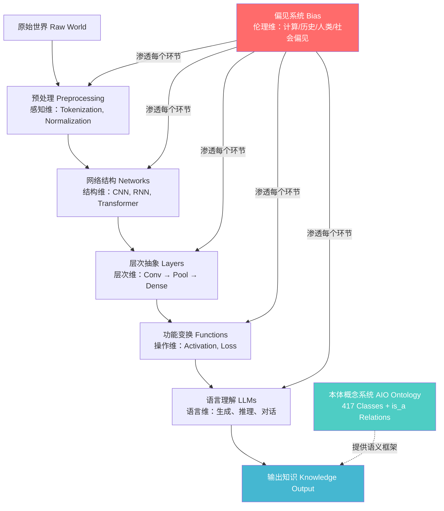

## AI 本体论系列文章: AI 认识世界的哲学奠基理论
  
### 作者  
digoal  
  
### 日期  
2026-08-10  
  
### 标签  
AI , 本体论 , 定义世界 , 认识世界 , 加入世界 , 影响世界  
  
----  
  
## 背景
  
> 基于论文：*The Artificial Intelligence Ontology: LLM-assisted construction of AI concept hierarchies*   
> https://arxiv.org/abs/2404.03044  
> arXiv:2404.03044 | Joachimiak et al., 2024  

---

## 一、核心命题：世界需要被"命名"才能被认知

> [!IMPORTANT]
> **本体论前提**：AI 认识世界的第一步，不是计算，而是**概念化（Conceptualization）** —— 将混沌的现实切割为有名字、有边界、有关系的**离散概念单元**。

AIO（人工智能本体）的根本假设与哲学传统完全一致：
- **亚里士多德**：知识从范畴（Category）开始，概念是理解世界的基本砖块
- **维特根斯坦**：语言的边界即世界的边界，能被命名的才能被思考
- **AIO 的实践**：建立 417 个 AI 概念类（Classes），每个概念有精确名称、同义词、定义，构成 AI 的"词汇表与语法"

**哲学意义**：AI 不是在"直接感知"世界，而是通过一套**受控词汇（Controlled Vocabulary）** 来映射、压缩、并组织关于世界的信息。

---

## 二、六大本体分支 = AI 认识世界的六个维度

论文构建的六个顶层分支，恰好对应 AI 认知世界的**六个哲学维度**：

```
┌─────────────────────────────────────────────────────────────────┐
│              AI 认识世界的本体六维框架（AIO）                    │
├────────────┬────────────────────────────────────────────────────┤
│  本体分支  │  哲学认知维度                                       │
├────────────┼────────────────────────────────────────────────────┤
│ Networks   │ 【结构维】—— 认知器官的架构：AI 如何组织自身       │
│ Layers     │ 【层次维】—— 认知的深度分层：从感知到抽象的阶梯    │
│ Functions  │ 【操作维】—— 认知的基本动作：激活、损失、变换      │
│ LLMs       │ 【语言维】—— 语言是高级认知的核心载体              │
│ Preprocessing│【感知维】—— 世界进入认知前的预处理与表示         │
│ Bias       │ 【伦理维】—— 认知的局限性与价值负载性              │
└────────────┴────────────────────────────────────────────────────┘
```

### 2.1 结构维（Networks）：认知器官的形态决定认知的可能性

- AI 通过不同网络架构（CNN、RNN、Transformer、GAN…）"观察"世界
- **哲学类比**：康德的"先验直觉形式"——时间与空间是人类感知的先天框架；网络架构是 AI 感知的"先天框架"
- 不同网络架构 = 不同的世界观：卷积网络偏向局部模式识别，Transformer 偏向全局关系推理

### 2.2 层次维（Layers）：认知是递进抽象的过程

- 从原始输入 → 低级特征 → 高级语义，层层抽象
- **哲学类比**：黑格尔的辩证法三阶段（正题-反题-合题），认知是螺旋上升的抽象运动
- 卷积层、池化层、归一化层各自承担"感知→整合→稳定"的认知功能

### 2.3 操作维（Functions）：认知是一种主动的变换行为

- 激活函数（ReLU、Sigmoid）决定"什么信号值得传递"——**注意力的本质**
- 损失函数（Cross-entropy、MSE）决定"什么算犯错"——**价值判断的来源**
- **哲学意义**：AI 的认识论不是被动镜像，而是**能动建构**（Active Construction），与杜威的实用主义认识论相通

### 2.4 语言维（LLMs）：语言是 AI 认识世界的最高形式

- 大型语言模型代表 AI 认知的"语言转向"（Linguistic Turn）
- **核心洞见**：语言不仅仅是 AI 的输出格式，更是其**内部表示（Internal Representation）** 的组织方式
- **哲学呼应**：海德格尔"语言是存在之家"——LLM 通过语言结构来"居住"在概念世界中

### 2.5 感知维（Preprocessing）：认识世界之前必先处理"感官数据"

- Tokenization、Normalization、Embedding 是 AI 的"感官加工系统"
- 人类感知也经过神经系统的大量预处理才能形成意识体验
- **哲学意义**："给定的"（The Given）并不存在，所有进入认知的信息都是**被构造的**（Sellars 的神话批判）

### 2.6 伦理维（Bias）：认知永远是有立场的，AI 也不例外

这是 AIO 最具哲学深度的分支，包含六类偏见：

| 偏见类别 | 哲学本质 |
|---------|---------|
| 计算偏见（Computational） | 算法结构本身携带的价值预设 |
| 历史偏见（Historical） | 过去的不公正通过训练数据延续至未来 |
| 人类偏见（Human） | 数据标注者的主观性嵌入模型 |
| 制度偏见（Institutional） | 社会权力结构在数据中的编码 |
| 社会偏见（Societal） | 文化规范与刻板印象的自动复制 |
| 系统性偏见（Systemic） | 多层次偏见的叠加与放大 |

**哲学意义**：AI 的认知**从不中立**。它是社会性、历史性、政治性的——这是对"客观计算"神话的根本性解构。

---

## 三、本体论的三大哲学原则

### 原则一：`is_a` 关系 —— 世界的等级秩序（Hierarchy）

AIO 的 414 条 `is_a` 关系构成了 AI 知识的**存在链（Chain of Being）** ：

```
深度学习
  └── is_a 机器学习
        └── is_a 人工智能
              └── is_a 计算方法
```

**哲学根基**：波菲利之树（Porphyrian Tree）——一切概念都可以通过属差（Differentia）和种（Genus）安置在知识谱系中。这是西方形而上学的分类传统，AIO 将其数字化。

> [!NOTE]
> `is_a` 不仅是分类关系，更是**存在论上的归属关系**：某物"是"某类，意味着它继承该类的所有属性与约束。AI 认识世界，本质上是在执行一种**归类操作（Classification as Ontological Commitment）** 。

### 原则二：模块化组合 —— 世界是可组装的

- Layer 和 Function 分支被设计为"可模块化组合"
- Transformer = Attention Layer + Feed-Forward Layer + Layer Norm + ...
- **哲学类比**：莱布尼茨的单子论变体——复杂系统由简单的原子性概念组合而成
- **实践意义**：AI 的创新不是凭空发明，而是已知概念的**重新组合与重配（Recombination）**

### 原则三：动态更新 —— 知识是开放的、未完成的

AIO 通过 LLM 辅助、持续更新：
- **哲学呼应**：波普尔的批判理性主义——所有知识都是暂时性的，永远向证伪开放
- **实践表现**：新的 AI 方法持续涌现，本体必须持续演化——知识系统不是封闭的，而是**活的（Living Ontology）**

---

## 四、AI 认识论的核心哲学张力

### 张力一：符号 vs. 连接（Symbol vs. Connection）

| 维度 | 符号主义传统（AIO 本体） | 连接主义（深度学习模型） |
|------|------------------------|------------------------|
| 认知单元 | 离散概念、有名词汇 | 连续向量、分布式表示 |
| 知识形式 | 规则、层级、关系 | 权重、梯度、激活模式 |
| 可解释性 | 高 | 低 |
| 泛化方式 | 演绎推理 | 归纳拟合 |

AIO 是一座**桥梁**——它用符号系统来描述连接主义的世界，试图调和 AI 认识论的最大内部矛盾。

### 张力二：通用 vs. 特殊（Universal vs. Particular）

- 本体追求**通用概念**（如"神经网络"这一抽象类）
- 实际应用需要**特殊实例**（如 GPT-4 这个具体模型）
- **哲学经典问题**：共相之争（Problem of Universals）——通用类概念是实在的还是仅仅是名称？
- AIO 的立场： **实概念论（Conceptualism）** ——类别是心智建构的，但对认知组织是必要的

### 张力三：技术 vs. 伦理（Technique vs. Ethics）

> [!WARNING]
> AIO 将 **Bias（偏见）** 与 Networks、Layers 平行列为顶层分支，这是一个重大的哲学声明： **伦理不是技术的附录，而是与技术同等地位的认识论维度。**

AI 认识世界不只是一个认知问题，更是一个**价值问题**。偏见分支的存在意味着：AI 的知识生产从一开始就嵌入了价值立场，这要求 AI 系统的设计者具有**批判性认识论意识（Critical Epistemological Awareness）** 。

---

## 五、AIO 揭示的 AI 认识世界的深层机制



**结论**：AI 认识世界是一个**多维度、多层次、价值负载的建构过程**，而非单纯的数据→输出的黑箱变换。

---

## 六、哲学奠基：AI 认识论的五个公理

基于 AIO 论文，可以提炼出 AI 认识世界的五个哲学公理：

> [!IMPORTANT]
> **公理一：概念先于计算（Concept Before Computation）**  
> AI 的一切计算都预设了一套概念框架。没有被命名和定义的概念，就没有可操作的知识。

> [!IMPORTANT]
> **公理二：层级先于平等（Hierarchy Before Equivalence）**  
> AI 的知识不是扁平的信息集合，而是有结构的层级体系。`is_a` 关系是知识继承与推理的基础。

> [!IMPORTANT]
> **公理三：组合先于创造（Composition Before Creation）**  
> AI 的创新本质是模块化概念的重新组合。理解单元的意义等同于理解其在组合中的角色。

> [!IMPORTANT]
> **公理四：动态先于静止（Dynamics Before Stasis）**  
> AI 的知识系统必须持续演化。任何封闭的知识框架都无法应对现实世界的开放性与复杂性。

> [!IMPORTANT]
> **公理五：价值先于中立（Value Before Neutrality）**  
> AI 对世界的认识永远携带价值立场。偏见不是例外，而是嵌入在每一个认知环节的结构性现实。

---

## 七、对 AI 系统设计者的哲学启示

| 哲学洞见 | 实践含义 |
|---------|---------|
| 概念化是认识的前提 | 在训练前，必须认真设计**知识图谱与本体结构** |
| 层级结构承载推理能力 | 模型需要能处理**抽象层次跳跃**的训练数据 |
| 偏见具有结构性 | 不能仅靠数据清洗解决偏见，需要**系统性框架审视** |
| 知识是动态的 | AI 系统需要设计**持续学习与知识更新机制** |
| 语言是最高认知形式 | LLM 不只是工具，是 AI 认识论的**核心载体** |

---

*论文来源：Joachimiak et al. (2024). The Artificial Intelligence Ontology: LLM-assisted construction of AI concept hierarchies. arXiv:2404.03044*    
*哲学提炼：基于 AIO 六分支结构与本体论方法论*  

  
  
#### [PostgreSQL 解决方案集合](../201706/20170601_02.md "40cff096e9ed7122c512b35d8561d9c8")
  
  
#### [德哥 / digoal's Github - 公益是一辈子的事.](https://github.com/digoal/blog/blob/master/README.md "22709685feb7cab07d30f30387f0a9ae")
  
  
#### [About 德哥](https://github.com/digoal/blog/blob/master/me/readme.md "a37735981e7704886ffd590565582dd0")
  
  

  
