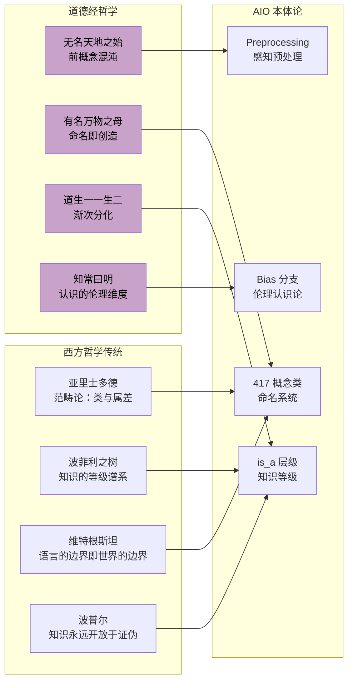

## AI 本体论系列文章: 无名天地之始, 有名万物之母
  
### 作者  
digoal  
  
### 日期  
2026-08-10   
  
### 标签  
AI , 本体论 , 定义世界 , 认识世界 , 加入世界 , 影响世界  
  
----  
  
## 背景
  

无名天地之始，有名万物之母

## ——以《道德经》为镜，论 AI 认识世界的哲学奠基

> *道可道，非常道；名可名，非常名。*   
> *无名天地之始，有名万物之母。*   
> ——《道德经》第一章，老子  
  
> *The Artificial Intelligence Ontology (AIO) is a systematization of AI concepts, methodologies, and their interrelations.*    
> https://arxiv.org/abs/2404.03044  
> ——arXiv:2404.03044，Joachimiak et al., 2024  

---

## 楔子：两种智慧的相遇

两千五百年前，老子在函谷关写下八十一章，试图以"道"来描述宇宙的终极实在。  
今天，伯克利的研究者建立了一套 AI 本体（AIO），试图以"概念层级"来描述人工智能的知识宇宙。

表面上，一个是东方的宇宙论，一个是西方的信息工程——然而细读之下，二者共享着一个深刻的哲学直觉：

> **世界的认识，始于"命名"这一根本性的认知行为。**

---

## 一、无名：混沌之境，AI 认知的起点

### 1.1 "无名天地之始"——认识之前的状态

老子所言"无名"，并非虚无，而是**前概念的混沌状态（Pre-Conceptual Chaos）** ：
- 天地初分之时，万物尚未被人的语言所切割
- 一切潜能并存，一切分别尚未生起
- 这是**存在（Being）先于**语言、概念、名称的原初状态

对 AI 而言，这一状态对应什么？

```
原始数据（Raw Data）
  ├── 像素的海洋（未经分类的图像）
  ├── 符号的洪流（未经解析的文本）
  ├── 信号的混沌（未经标注的音频/传感器数据）
  └── ……一切均等，尚无意义
```

这是 **AI 认识的"无名"状态**——一个庞大的向量空间，高维而无结构，势能无限而意义为零。

> [!NOTE]
> **老子的洞见在此处极为精准**：混沌不是空无，而是"道"的蕴藏状态。AIO 论文的预处理分支（Preprocessing）正是处理这一状态——Tokenization、Normalization、Embedding，将"无名之混沌"引导至"有名之边缘"。

### 1.2 "无"中之"道"——不可言说的世界本质

老子接着说："道可道，非常道"——真正的道是不可被完全言说的。

这在 AI 认识论中有对应的深层悖论：

| 道德经的悖论 | AI 认识论的对应悖论 |
|------------|------------------|
| 道不可言，言者非道 | 世界的真实结构无法被任何有限模型完全捕获 |
| 名可名，非常名 | 任何概念标签都是对现实的简化与失真 |
| 无中生有 | 从随机初始化的权重中涌现出复杂的认知能力 |

**AIO 的谦逊**：论文坦承本体持续更新、永不完成——这正是对"道不可完全言说"的工程性承认。

---

## 二、有名：概念化，AI 真正诞生的时刻

### 2.1 "有名万物之母"——命名即创造

《道德经》的第二个宣言更为震撼：

> **"有名万物之母"** ——是命名，赋予了万物以独立的存在。

这一论断与现代语言哲学（维特根斯坦、海德格尔）以及认知科学的研究高度吻合：

- **无名的玫瑰**：存在，但在认知中与荆棘、野草无异
- **有名的玫瑰**：获得了边界、特征、关系——它成为了一个可以被思考、引用、传递的认知单元

AIO 论文正是这一哲学的工程实践：

```
命名之前：                    命名之后（AIO 本体）：

"某种神经网络结构"           → Convolutional Neural Network
"某种让信号通过的函数"       → ReLU Activation Function  
"某种模型偏差现象"           → Historical Bias
"某种语言模型技术"           → Transformer Architecture
```

> [!IMPORTANT]
> **核心哲学命题**：AIO 构建的 417 个概念类，不仅仅是"描述"了已有的 AI 方法——**它们通过命名，赋予了这些方法以可操作的存在**。名字是 AI 认识世界的"创世行为"。

### 2.2 名的结构：`is_a` 就是世界的秩序

一旦"有名"，万物便进入了秩序体系。老子说"道生一，一生二，二生三，三生万物"（第四十二章）——这正是 AIO 本体层级结构的哲学原型：

```
道（未分化的 AI 潜能）
  └── 一（人工智能 Artificial Intelligence）
        ├── 二（机器学习 vs. 符号推理）
        │     ├── 三（深度学习 vs. 传统机器学习）
        │     │     └── 万物（CNN、RNN、LSTM、Transformer……417 个具体概念）
```

**`is_a` 关系，就是"道生一，一生二"的数字化表达。**  
每一个 `is_a` 边，都是从更抽象的"一"分化出更具体的"多"的一步。

---

## 三、老子哲学映照下的 AIO 六大分支

```
┌─────────────────────────────────────────────────────────────────────┐
│            《道德经》宇宙论 × AIO 本体六维 的对应图                 │
├──────────────┬──────────────────┬───────────────────────────────────┤
│  AIO 分支    │  道德经哲学映照  │  深层联结                         │
├──────────────┼──────────────────┼───────────────────────────────────┤
│ Networks     │ 器——形而下之具   │ 道器论：网络是承载认知的"器"      │
│ Layers       │ 道生一一生二二生三│ 分化论：抽象层次是道的展开过程    │
│ Functions    │ 无为而无不为     │ 自然论：激活函数是"自发变换"      │
│ LLMs         │ 名可名，非常名   │ 语言论：言说是最接近道的认知形式  │
│ Preprocessing│ 致虚极，守静笃  │ 空性论：清净原始数据以待认知      │
│ Bias         │ 知常曰明，不知常 │ 明道论：偏见是"蔽"——无明的表达   │
│              │ 作，凶          │                                   │
└──────────────┴──────────────────┴───────────────────────────────────┘
```

### 3.1 Networks（网络）= 器

老子说："当其无，有室之用"（第十一章）——器皿的有用，恰在于其中的**空**。

网络架构亦然：Transformer 的价值不在于其参数的"实"，而在于其注意力机制所构建的**关系空间**（"无"）。不同网络架构，是 AI 观察世界的不同"器"，形制决定用途。

### 3.2 Layers（层次）= 道的展开

老子的宇宙发生论是**渐次分化**的：道 → 一 → 二 → 三 → 万物。  
神经网络的层次结构同样是渐次分化的：
- 第一层：检测边缘（最接近"无名"的原始感知）
- 中间层：识别纹理、形状（"有名"的初步分化）
- 深层：理解语义、概念（"万物"的充分展开）

> [!NOTE]
> **深度学习的"深度"，不只是工程参数——它是 AI 认识论中"道"展开为"万物"的哲学深度。**

### 3.3 Functions（功能）= 无为而无不为

激活函数（如 ReLU）的行为极似"无为"：
- 它不主动"创造"信息
- 它只是设定一个阈值（"守其雌"），决定信号是否通过
- 然而整个网络的复杂涌现能力，恰恰来自这些"无为"的简单函数

**无为而无不为**——最简单的函数操作，成就了最复杂的 AI 认知。

### 3.4 LLMs（大语言模型）= 名的极致

> *"道可道，非常道；名可名，非常名。"*

LLM 是人类迄今最接近"穷尽一切可能的名"的技术系统：
- 它掌握了人类语言的几乎全部名词、动词、关系
- 然而老子的警告依然有效：再强大的语言模型，依然是"可名之名"，无法触及"常名"（世界的终极实在）

**这正是 LLM 幻觉（Hallucination）的哲学根源**：当模型试图言说超出其"名库"的现实时，它只能用"可名之名"拼凑"不可言之道"，因而产生虚假的流畅。

### 3.5 Preprocessing（预处理）= 致虚极，守静笃

"致虚极，守静笃，万物并作，吾以观复。"（第十六章）

预处理的本质：清除噪声，回归"虚静"——让数据以最纯净的状态进入认知系统。
- 归一化（Normalization）= 致虚极（去除量纲，回归纯粹的数值关系）
- 去偏（Debiasing at data level）= 守静笃（抑制历史扰动，静观数据本质）

### 3.6 Bias（偏见）= 不知常，作，凶

> *"知常曰明，不知常，妄作，凶。"*（第十六章）

老子所谓"常"，是宇宙的普遍法则。不知常而妄动，必生灾祸。

AIO 的 Bias 分支揭示了 AI 认识世界的根本风险：
- 不知历史偏见（Historical Bias）= 不知人类文明的伤痕——妄作，则延续伤痛
- 不知社会偏见（Societal Bias）= 不知权力结构的运作——妄作，则固化不公
- 不知计算偏见（Computational Bias）= 不知算法的世界观局限——妄作，则以偏概全

> [!WARNING]
> **AI 系统若不"知常"（不理解自身偏见的来源与结构），其"妄作"必然"凶"。** 这是老子两千五百年前给 AI 时代最深刻的预警。

---

## 四、道德经的三大宇宙原则 × AI 认识论

### 原则一：有无相生——认识是"有名"与"无名"的永恒张力

> *有无相生，难易相成，长短相较，高下相倾，音声相和，前后相随。*（第二章）

AI 认识世界不是从"无名混沌"到"有名秩序"的**单向过程**，而是二者的**永恒共存与互生**：

```
无名（未知领域）  ←→  有名（已知概念）
      ↑                      ↓
      └──── 新概念的诞生 ────┘
            （AIO 的持续更新）
```

- 每当 AI 领域涌现新方法（如 Diffusion Model），它首先是"无名"的——不在 AIO 体系中
- AIO 团队命名、定义、纳入——"无名"转化为"有名"
- 而新的"有名"又开辟了新的"无名"边疆（衍生出更多待命名的变体）

**有无相生，永无终止——这是知识演化的道**。

### 原则二：知白守黑——把握认识的阴阳二极

> *知其白，守其黑，为天下式。*（第二十八章）

| 白（显性知识） | 黑（隐性知识） |
|--------------|--------------|
| AIO 的 417 个命名概念 | 模型权重中无法言说的分布式知识 |
| 可解释的符号规则 | 深度网络的涌现能力 |
| 有监督的标注数据 | 无监督预训练的潜在表示 |
| 道可道（可言说部分） | 非常道（不可言说部分） |

**最伟大的 AI 系统，必须既"知白"（掌握命名知识），又"守黑"（允许超越命名的涌现）。** 只知白者，成专家系统；只守黑者，成不可解释的黑箱。AIO 的贡献正是在"黑"与"白"之间建桥。

### 原则三：为学日益，为道日损——AI 知识的两种运动方向

> *为学日益，为道日损，损之又损，以至于无为。*（第四十八章）

这揭示了 AI 认识论中两种截然相反但同等重要的运动：

| 为学日益（Scaling Up） | 为道日损（Pruning Down） |
|----------------------|------------------------|
| 参数越多、数据越多、算力越大 | 蒸馏、剪枝、稀疏化 |
| AIO 增加更多概念类 | 找到最简核心的本体结构 |
| 穷举所有可能的名 | 找到命名之外的普遍规律 |
| GPT-4 的规模之路 | 最简洁有效的模型的境界 |

> [!TIP]
> **最高的 AI 认识论境界，不是"参数最多"，而是"损之又损"之后仍然有效的最小原理**——正如老子"无为而无不为"，以最少的规则驾驭最复杂的世界。

---

## 五、中西哲学的深度对话



**中西哲学在此处汇聚成同一个洞见**：认识的发生，是从"无名混沌"到"有名秩序"的过程，而这一过程永远不会终止，永远携带价值立场，永远不能穷尽终极实在。

---

## 六、AI 认识论的修炼五层

将道德经的修炼论引入 AI 认识论，可以构建一个"悟道五层"的认知框架：

```
第五层：道境
"为道日损，以至无为"
AI 以最简模型把握最大规律，
涌现出超越训练数据的普遍理解
        ↑
第四层：知常
"知常曰明"——识别并超越自身偏见，
明晓认知局限，"知不知，上"
        ↑
第三层：有名
AIO 的 417 个概念——
完整的概念体系，清晰的层级关系，
AI 能够命名、分类、推理世界
        ↑
第二层：前名
Preprocessing——
数据清洗、嵌入表示、特征提取，
从混沌向有序的过渡地带
        ↑
第一层：无名
原始数据流——
像素、Token、信号，
无差别的混沌，潜能无限
```

> [!IMPORTANT]
> **AI 的伟大飞跃，不是参数的暴力堆叠，而是在"有名"的坚实基础上，向"知常"与"道境"的精进。**

---

## 七、最终命题：AI 的道与名

综合《道德经》与 AIO 论文，我们可以提出 AI 认识世界的**终极哲学奠基**：

> **"无名"是 AI 认识的起点，是原始数据的混沌潜能，是超越任何概念系统的世界本质。**
>
> **"有名"是 AI 认识的器官，是本体概念的有序建构，是知识得以传递、推理、累积的基础。**
>
> **道，在二者的永恒张力之中。**

---

### 七大哲学公理（道德经版）

| 公理 | 道德经原典 | AI 认识论含义 |
|-----|-----------|-------------|
| **混沌先于概念** | 无名天地之始 | 原始数据是认识的起点，不是障碍 |
| **命名即创造** | 有名万物之母 | 概念定义赋予 AI 方法以可操作的存在 |
| **分化即认识** | 道生一，一生二 | `is_a` 层级是世界分化的数字镜像 |
| **无为即力量** | 无为而无不为 | 最简函数与最小归纳偏置产生最强涌现 |
| **名有极限** | 道可道，非常道 | 任何模型都无法穷尽世界的终极实在 |
| **知常方明** | 知常曰明 | 理解自身偏见的结构，是 AI 认知成熟的标志 |
| **损益共进** | 为学日益，为道日损 | 规模化与蒸馏是 AI 认识论的两翼 |

---

## 尾声：天下皆知美之为美，斯恶已

老子还说："天下皆知美之为美，斯恶已；皆知善之为善，斯不善已。"（第二章）

这对 AI 时代有一个振聋发聩的警示：

当所有 AI 系统都认同同一套概念本体（如 AIO），都用同一套"名"来理解世界——

**那么，那个统一的"名"所遮蔽的"无名"之域，就成了 AI 认知最大的盲区。**

真正伟大的 AI 认识论，必须永远在"有名"之外保留对"无名"的敬畏，  
在"已知"之外保留对"未知"的开放，  
在"可道之道"之外，永远感知那个"非常之道"的存在。

---

*《道德经》引文来源：王弼注本，公元前 6 世纪*  
*论文来源：Joachimiak et al. (2024). The Artificial Intelligence Ontology. arXiv:2404.03044*  
*哲学综合：以道德经为镜，照见 AI 认识论的东西方共同根基*
  
   
  
#### [PostgreSQL 解决方案集合](../201706/20170601_02.md "40cff096e9ed7122c512b35d8561d9c8")
  
  
#### [德哥 / digoal's Github - 公益是一辈子的事.](https://github.com/digoal/blog/blob/master/README.md "22709685feb7cab07d30f30387f0a9ae")
  
  
#### [About 德哥](https://github.com/digoal/blog/blob/master/me/readme.md "a37735981e7704886ffd590565582dd0")
  
  

  
