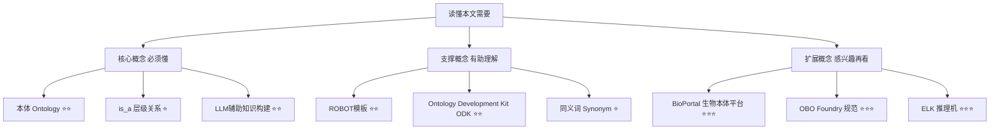
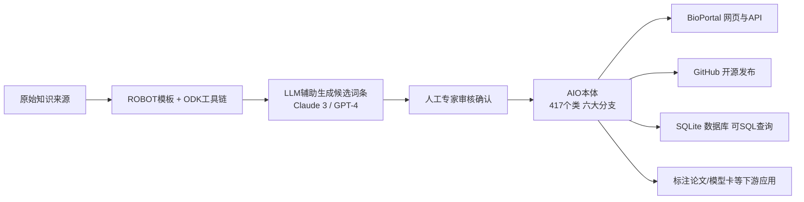

## AI论文解读 | The Artificial Intelligence Ontology: LLM-assisted construction of AI concept hierarchies

### 作者
digoal

### 日期
2026-08-10

### 标签
AI , 本体论 , 哲学奠基 , 道德经 , 有名 , 无名 , 定义世界  

----

## 背景

> **原文信息**：Marcin P. Joachimiak, Mark A. Miller, J. Harry Caufield, Ryan Ly, Nomi L. Harris, Andrew Tritt, Christopher J. Mungall, Kristofer E. Bouchard | 2024年4月3日提交 | Lawrence Berkeley National Laboratory | arXiv:2404.03044 [cs.LG]  
> **解读日期**：2026-08-10  

---

## 📍 论文定位

**一句话**：本文提出了 AIO（Artificial Intelligence Ontology，人工智能本体），用一套结构化的"概念词典 + 关系图谱"，把网络、层、函数、大语言模型、预处理、偏见这六大类 AI 概念统一命名、分类、连接起来，并且借助大语言模型（Claude 3、GPT-4）来辅助构建和扩展这套体系。

**🎓 学术价值**：以往的机器学习本体（如 MLOnto、ITO）要么偏重顶层分类，要么偏重统计概念和评测指标，很少覆盖 LLM 时代爆发式增长的新词汇，也很少把"伦理与偏见"当作与技术概念同等重要的一等公民。AIO 填补了"技术概念 + 伦理概念"统一建模，并第一次系统性引入 LLM 辅助构建流程这一空白。

**🏭 工业价值**：AIO 可以直接用来给论文、代码仓库、模型卡（Model Card）打标签，让"这篇论文用了什么方法""这个模型有哪些已知偏见类型"变成可以用标准术语检索、比较、统计的结构化数据，而不是散落在自然语言里的模糊描述。

**💡 直觉类比**：如果把 AI 领域比作一座迅速扩张、无人规划的城市，新词汇像新建筑一样杂乱地冒出来，同一个东西在不同论文里可能有好几个名字。AIO 就像给这座城市绘制的一张"官方地图 + 门牌编号系统"：它告诉你哪些建筑（概念）属于同一个街区（分支），哪些建筑之间有"父子"关系（is_a 层级），并且用 AI 帮忙持续更新地图，跟上城市扩张的速度。

---

## 🗺️ 知识地图

在读懂本文之前，你需要对"本体（Ontology）"这个概念有基本认识——它不是深度学习模型，而是一种"知识组织工具"。下面这张知识树帮你理清脉络：

**本体（Ontology）**
- 是什么：一种用"类别 + 关系"来形式化表示某个领域知识的结构，类似一个可以被计算机读取和推理的、有层级关系的词典。
- 为什么重要：它让"狗是动物的一种"这类常识变成计算机可以查询、匹配、推理的结构化事实，而不只是人脑里的直觉。
- 现实类比：就像图书馆的杜威十进制分类法，每本书都有唯一的编号和所属类别，你可以按类别浏览，也可以顺着"总类→大类→细类"逐层下钻。

**is_a 层级关系**
- 是什么：本体里最基础的关系，表示"A 是 B 的一种"，例如"卷积层 is_a 层"。
- 为什么重要：这是构建分类树的骨架，AIO 全文 417 个类之间共有 414 条 is_a 边，几乎每个概念都靠这种关系挂在树上。
- 现实类比：就像家谱里"儿子是父亲的下一代"，一层层往下延伸，最终形成一棵树。

**LLM 辅助知识构建**
- 是什么：让大语言模型阅读已有的本体条目样例，然后按照同样的格式"举一反三"，生成新的候选概念、定义和同义词，再由人工审核确认。
- 为什么重要：AI 领域新词汇冒出的速度远超人工整理的速度，LLM 辅助可以把本体维护从"纯人工"变成"人机协作"，大幅提速。
- 现实类比：就像请一个博览群书的助理先帮你把新出的论文摘要整理成卡片，你只需要审核修改，而不用从零开始逐字阅读。

---

## 🔬 论文精读

### Why — 为什么要做这个研究？

AI 领域的词汇正在"野蛮生长"：新模型、新层类型、新训练技巧层出不穷，同一个概念在不同论文、不同框架（PyTorch vs TensorFlow）里叫法还可能不一样。已有的相关工具各有侧重，但都没有完整覆盖"技术 + 伦理"两个维度，也缺乏跟上 LLM 时代更新速度的机制。

| 维度 | 之前的方案 | 本文（AIO） |
|---|---|---|
| 覆盖范围 | MLOnto 偏重顶层分类；ITO 偏重评测指标和基准 | 同时覆盖网络结构、层、函数、LLM、预处理、偏见六大分支 |
| 伦理/偏见建模 | NIST AI glossary 只做术语表，不含关系；多数本体不把偏见当顶层类 | 把"Bias"设为顶层分支，与技术概念平级 |
| 更新机制 | 依赖人工持续维护，跟不上 LLM 时代的词汇爆发 | 引入 LLM（Claude 3、GPT-4）辅助生成候选词条，加速扩展 |
| 与主流框架对齐 | 术语体系与具体工程框架脱节 | 直接对齐 PyTorch、TensorFlow 的层/函数命名 |

### What — 提出了什么方法/系统？

AIO 的整体结构是一棵以六大分支为顶层的知识树，其中"网络（Network）""层（Layer）""函数（Function）"三个分支相互连接：很多网络结构本质上是"层的序列"，因此可以用"层 + 函数"模块化拼装出具体网络。

六大分支及其知识来源各不相同：
- **Networks（网络）** ：来自已发表文献、Asimov Institute 的"神经网络动物园"图谱、维基百科。
- **Layers / Functions（层 / 函数）** ：直接对齐 PyTorch 和 TensorFlow 的官方文档命名（TensorFlow 的层和函数全部收录，PyTorch 目前只收录了归一化层和池化层作为示范）。
- **LLMs（大语言模型）/ Preprocessing（预处理）** ：主要用 LLM 辅助方法新建，因为这两个领域词汇更新最快、人工整理成本最高。
- **Bias（偏见）** ：基于 NIST 的 AI 偏见报告和维基百科条目，划分为计算性、历史性、人为、机构性、社会性、系统性六类偏见。

### How — 具体怎么实现的？

**技术栈**：整个本体用 Ontology Development Kit（ODK）搭建，这是一套开源的本体开发工具箱，底层依赖 ROBOT 库，能自动生成 OBO、OWL、obojson 等多种格式的产出物，并通过 Docker 容器保证任何人都能用同一套工具复现构建过程。

**ROBOT 模板机制**：每个分支先建一个"模板表格"（可以直接放在 Google Sheets 里协作编辑），领域专家和自动化脚本都能往表格里填新行，再由 ROBOT 把表格编译成正式的本体文件。这种表格化的设计，恰好也是 LLM 最擅长处理的格式——你可以把已有的几行样例喂给模型，让它按同样的字段结构（术语名、定义、同义词等）续写新行，这就是论文强调的"prompt 中给少量样例做小样本学习（few-shot）"。

**LLM 辅助流程的关键设计选择**：作者没有让 LLM"自由发挥"，而是把 LLM 限定在"给定表格式样例 → 续写同结构新行"这个受控任务里，且所有生成结果都要经过人工审核后才正式并入本体。这样既借助了 LLM 的知识广度和生成速度，又避免了 LLM 幻觉直接污染本体数据。

**验证方法**：用 ELK 推理机对本体做逻辑一致性校验（AIO 刻意避免使用过于复杂的 OWL-DL 构造，只用相对简单的 EL 描述逻辑子集，这样推理速度快、出错概率低）。

### So What — 结果怎么样？

| 指标 | 数值 |
|---|---|
| 本体类别总数 | 417 |
| 同义词总数 | 360 |
| is_a 关系总数 | 414 |
| 覆盖分支数 | 6（Bias/Function/Layer/LLM/Machine Learning/Network/Preprocessing，注：统计表中细分为7个子类） |

**真实数据验证实验**：作者拿 AIO 去标注 Papers with Code 上 2,194 篇 AI/ML 方法论文的元数据，用 OAK 工具做精确词条+同义词匹配，结果发现：
- 共产生 6,484 次 AIO 术语命中，其中 4,647 次是与类名精确匹配，1,837 次是与同义词匹配；
- AIO 417 个类里，有 205 个（接近一半）在论文标题或方法分类字段中被实际提及，说明 AIO 的术语体系确实贴近当前 AI 研究的真实用词习惯；
- Papers with Code 的方法分类里，"自然语言处理"和"强化学习"两个大类在 AIO 中有对应覆盖，而"音频""计算机视觉""图""序列"等则超出了 AIO 当前的 AI/ML 核心概念范围（作者认为这是有意为之的范围限定，而非疏漏）。

**消融/对比说明**：本文并非模型类论文，没有传统意义上的消融实验，但作者做了一个类似"交叉验证"的操作——把 AIO 在四种不同场景下分别解析、加载、使用一遍（OBO 格式命令行工具、SQLite 数据库查询、BioPortal 网页与 API、ROBOT 统计报告），以此证明本体本身格式规范、可复用性强。

### Now What — 对我们意味着什么？

**学术界**：为"用 LLM 辅助构建/维护本体"提供了一个可复制的工作范式——受控的模板格式 + few-shot 提示 + 人工复核，这个思路可以迁移到其他快速演化的技术领域（如生物信息学工具链、云原生技术栈）的知识体系构建上。

**工业界**：可以直接把 AIO 集成到模型卡（Model Card）生成流程里，让模型的架构描述、使用的层/函数、已知偏见类型都用标准化术语呈现，方便下游做自动化的模型比较、合规审查、检索。对于做论文/代码语料库标注、AI 领域知识图谱构建的团队，AIO 也可以作为现成的词表和层级关系直接复用。

---

## 📖 术语词典

### 本体（Ontology）
- **是什么**：用类别和关系对某个领域的知识进行结构化、形式化表示的体系，可被计算机解析和推理。
- **为什么重要**：是整篇论文的核心产出物类型，理解它是理解全文的前提。
- **现实类比**：就像一本带索引和交叉引用的百科全书，每个词条不仅有定义，还标明了它和其他词条的从属、关联关系。

### AIO（Artificial Intelligence Ontology）
- **是什么**：本文提出的、专门针对 AI/ML 领域的本体，包含 417 个类，分为六大顶层分支。
- **为什么重要**：是本文的主角，也是本文所有实验和讨论的对象。
- **现实类比**：相当于 AI 领域的"专业术语国标"草案。

### ROBOT 模板
- **是什么**：一种把本体内容以电子表格形式组织的工具/格式，方便协作编辑，再由 ROBOT 程序自动编译成正式本体文件。
- **为什么重要**：它让本体编辑从"直接写复杂的本体代码"降级为"填表格"，同时天然适合喂给 LLM 做续写。
- **现实类比**：像填一张标准化的报名表，你只需要按列填信息，系统自动帮你生成正式证件。

### Ontology Development Kit（ODK）
- **是什么**：一套开源的本体构建与维护工具箱，负责组织项目结构、自动化构建流程、生成多种格式的本体文件。
- **为什么重要**：为 AIO 提供了标准化、可复现（基于 Docker 容器）的工程基础设施。
- **现实类比**：类似软件开发里的脚手架工具（如创建 React 项目的 CLI），帮你把繁琐的初始化和构建配置都自动化好。

### is_a 关系
- **是什么**：本体中表示"子类属于父类"的基本关系，例如"循环神经网络 is_a 网络"。
- **为什么重要**：是构建分类树、支持逐层浏览和推理的基础。
- **现实类比**：家谱中"某人是某人的孩子"这种最基本的血缘关系。

### 同义词（Synonym）标注
- **是什么**：本体为同一个概念登记多个不同的叫法（例如"CNN"和"卷积神经网络"）。
- **为什么重要**：现实中同一概念常有多种写法，同义词标注让基于文本的自动检索/标注更准确，本文的匹配实验中就有 1,837 次命中依赖同义词而非精确类名。
- **现实类比**：就像身份证系统里登记曾用名，方便你用任何一个曾用过的名字都能查到同一个人。

### ELK 推理机
- **是什么**：一种针对 EL 描述逻辑（OWL 的一个受限子集）的高效自动推理工具，用来检查本体内部逻辑是否自洽。
- **为什么重要**：保证像 AIO 这种规模的本体在扩展过程中不会出现自相矛盾的分类关系。
- **现实类比**：像代码里的静态类型检查器，帮你在"编译"本体之前先揪出结构性错误。

### LLM 辅助知识构建（AI-assisted curation）
- **是什么**：给大语言模型提供已有本体条目作为样例，让其按相同格式生成新条目候选，再经人工审核确认。
- **为什么重要**：是本文区别于以往本体工作的核心创新点，展示了 LLM 在结构化知识工程中的一种务实用法。
- **现实类比**：像请一个熟悉表格格式的实习生，先按现有条目的格式草拟新条目，主编再逐条把关。

### 模型卡（Model Card）
- **是什么**：一种记录 AI 模型性能特征、适用场景、局限性的标准化文档格式。
- **为什么重要**：本文提出可以用 AIO 的标准化术语来丰富模型卡的内容，是 AIO 的一个具体应用场景示例。
- **现实类比**：类似食品包装上的营养成分表，用统一的格式告诉消费者这个"产品"（模型）的关键信息。

### BioPortal
- **是什么**：一个面向生物医学及相关领域本体的托管与检索平台，提供网页浏览和 API 访问。
- **为什么重要**：AIO 通过 BioPortal 对外发布和分发，借助其现成的浏览、检索、跨本体术语映射能力。
- **现实类比**：类似一个专业词典的在线托管网站，别人不需要自己搭服务器就能查阅和调用你编的词典。

---

## ⚖️ 批判性评估

### 1. 假设前提的合理性

AIO 隐含假设"AI/ML 领域的核心概念可以被相对稳定地归入六个顶层分支，并以树状 is_a 关系组织"。但 AI 领域的许多概念本身具有交叉性（例如一个模型同时是"网络架构"又是"预处理方法"的组成部分），树状层级结构对这种交叉关系的表达能力有限，作者自己在"局限性"部分也承认了这一点——层与层之间的组合可能存在环路等更复杂的拓扑，而 AIO 目前把网络层简化为线性列表。

### 2. 实验设计的可质疑之处

论文用 Papers with Code 的 2,194 篇论文做"覆盖率"验证，但这个数据源本身有偏——它更侧重收录有开源代码的、相对成熟的方法，可能对最新、小众或非代码类的研究（如纯理论工作、伦理研究）覆盖不足。此外，"205/417 个类在论文中被提及"这一覆盖率数字，并没有和其他本体（如 ITO、MLOnto）在同一数据集上做直接对比，缺少一个"如果换成别的本体，覆盖率会是多少"的基线，使得这个数字本身的说服力打了折扣。

### 3. 方法的适用边界

AIO 明确不覆盖计算机视觉、音频、图数据、序列建模等 Papers with Code 划分的大类，作者的解释是这些超出了"AI/ML 核心概念"的范围。这意味着 AIO 目前更适合"通用深度学习架构 + LLM + 数据预处理 + 偏见"这一相对偏工程和治理的知识管理场景，如果想用它去标注一篇纯粹的计算机视觉论文，覆盖率会明显下降。另外，AIO 不建模具体的参数取值和"方法组合是否与输入数据类型匹配"，因此暂时无法支持"两个方法能否直接拼接使用"这类更细粒度的可组合性判断。

### 4. 未来改进方向

作者自己提出的未来工作包括：利用 Ontology Access Kit（OAK）自动化生成本体间的词条映射、挖掘文献以发现新的候选类和同义词、以及跟踪新出现的模型架构。从读者角度看，还可以考虑的改进方向有：引入版本化/时间戳机制以追踪概念的历时演变（例如"Transformer"这个词在不同年份的含义外延变化）、建立更细粒度的"参数敏感"层表示以支持真正的方法组合推理、以及针对 LLM 辅助生成内容设计更系统性的偏见/幻觉审计流程，而不仅依赖人工抽查。

---

## 📚 参考资料
- 原文链接：https://arxiv.org/abs/2404.03044
- PDF：https://arxiv.org/pdf/2404.03044
- 开源仓库：https://github.com/berkeleybop/artificial-intelligence-ontology
- BioPortal 页面：https://bioportal.bioontology.org/ontologies/AIO
- 相关工作：Machine Learning Ontology（Braga et al., 2020）；Intelligence Task Ontology and Knowledge Graph, ITO（Blagec et al., 2022）；NIST AI Glossary（Schwartz et al., 2023）；Model Cards for Model Reporting（Mitchell et al., 2019）  
  
  
#### [PostgreSQL 解决方案集合](../201706/20170601_02.md "40cff096e9ed7122c512b35d8561d9c8")
  
  
#### [德哥 / digoal's Github - 公益是一辈子的事.](https://github.com/digoal/blog/blob/master/README.md "22709685feb7cab07d30f30387f0a9ae")
  
  
#### [About 德哥](https://github.com/digoal/blog/blob/master/me/readme.md "a37735981e7704886ffd590565582dd0")
  
  

  
