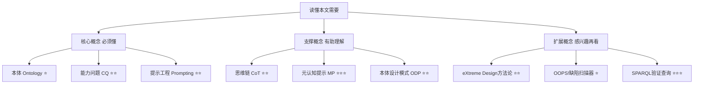
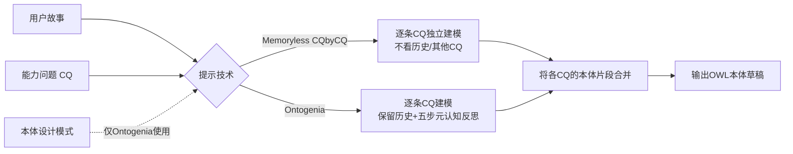

## AI论文解读 | Ontology Generation using Large Language Models

### 作者
digoal

### 日期
2026-08-10

### 标签
AI , 本体论 , 哲学奠基 , 道德经 , 有名 , 无名 , 定义世界  

----

## 背景

  
> **原文信息**：Anna Sofia Lippolis, Mohammad Javad Saeedizade, Robin Keskisärkkä, Sara Zuppiroli, Miguel Ceriani, Aldo Gangemi, Eva Blomqvist, Andrea Giovanni Nuzzolese | 2025年3月 | arXiv:2503.05388（University of Bologna / ISTC-CNR / Linköping University）  
> **解读日期**：2026-08-10  

---

## 📍 论文定位

**一句话**：这篇论文让大语言模型（LLM）根据"用户故事 + 能力问题（CQ）"直接起草 OWL 本体，并设计了两种新的提示技术——Memoryless CQbyCQ 和 Ontogenia——同时提出一套多维度评价体系来检验这些草稿到底靠不靠谱。

**🎓 学术价值**：本体工程（Ontology Engineering）长期依赖领域专家手工建模，效率低、门槛高。这篇论文把"分解式提示（decomposed prompting）"和"元认知提示（Metacognitive Prompting）"两条技术路线系统地搬到本体生成任务上，并第一次把"冗余元素比例"作为独立的结构性评价维度，填补了以往评测只看"CQ 有没有建模成功"这种单一指标的空白。

**🏭 工业价值**：如果 LLM 能产出"及格线以上"的本体草稿，企业和数据团队就能把本体工程从"从零手搓"变成"AI 起草 + 人工精修"，尤其对没有本体设计经验但需要做语义互操作、知识图谱建模的团队非常实用。

**💡 直觉类比**：这就像给一群实习建筑师（LLM）一份"业主需求清单"（用户故事）和"验收标准"（能力问题），让他们画建筑图纸（OWL 本体）。论文比较了两种带教方式——一种是"健忘型学徒"（Memoryless CQbyCQ，每次只看当前这一条需求，画完就忘，最后把图纸拼在一起），一种是"反思型学徒"（Ontogenia，每画一步都要回头检查、参考标准图集，还要做自我复盘）——然后请两位资深工程监理（专家评审）加自动质检仪（OOPS! 扫描器）来验收图纸质量。

---

## 🗺️ 知识地图

读懂这篇论文，你需要三层背景知识：

- **本体（Ontology）**⭐：一套描述某个领域"有哪些类、有哪些关系、有哪些规则"的形式化词表，本质上是给机器看的领域知识地图。
- **能力问题（CQ）**⭐⭐：用自然语言写的"这个本体应该能回答的问题"，比如"一本书的作者是谁？"，是检验本体是否好用的验收标准。
- **提示工程（Prompting）**⭐⭐：不改模型参数，只靠精心设计输入文字来"指挥"LLM完成特定任务，本文的两种新技术都属于这一类。
- **思维链（CoT）**⭐⭐：让模型把推理过程一步步写出来再给答案，公认能提升复杂任务的准确率、减少胡编（hallucination）。
- **元认知提示（MP）**⭐⭐⭐：CoT的进阶版，模仿人类"边做边反思"的习惯，让模型在生成过程中主动做自我检查和修正。
- **本体设计模式（ODP）**⭐⭐：业界总结出来的"本体建模最佳实践模板"，类似软件工程里的设计模式，可以直接复用避免重复造轮子。
- **eXtreme Design（XD）方法论**⭐⭐：一种敏捷本体工程方法论，强调用CQ和用户故事驱动设计、复用ODP、并反复迭代校验，Ontogenia的流程就是照着它的思路设计的。
- **OOPS!**⭐：一款自动化本体质检工具，专门扫描常见建模错误（比如属性的定义域/值域冲突）。

---

## 🔬 论文精读

### Why — 研究动机

本体工程一直是个"重手艺活"：需要同时懂知识表示、逻辑学和计算语言学，就算是有经验的工程师也容易出错、耗时长。LLM 已经在代码辅助、数据清洗等任务上证明了自己的能力，但把 LLM 真正用于**从头生成完整 OWL 本体**这件事，此前的研究要么只做局部任务（比如只抽取实体关系，不产出完整本体），要么只在单一案例上验证、缺乏系统评测。

| 维度 | 之前的方法 | 本文方法 |
|---|---|---|
| 生成方式 | 人工手工建模，或LLM只做局部子任务（如关系抽取） | LLM 直接从用户故事+CQ生成完整OWL本体草稿 |
| 提示策略 | CQbyCQ：保留历史生成结果（有"记忆"） | 新增 Memoryless CQbyCQ（无记忆，逐条独立建模）和 Ontogenia（有记忆+元认知反思） |
| 评价标准 | 主要看"CQ有没有建模成功"这一个指标 | OOPS!缺陷扫描 + CQ覆盖率 + 冗余元素率 + 专家评审，四管齐下 |
| 对比基准 | 多为孤立案例，缺乏与"新手人类工程师"的系统对比 | 与学生（novice engineer）提交的本体作业直接对比 |

作者据此提出三个研究问题：LLM 到底能在多大程度上支持满足需求的本体生成？该用什么标准评价 LLM 生成的本体？这些本体的优缺点分别是什么？

### What — 核心方法

论文的核心是"两种生成方法 × 两种提示技术"的组合矩阵：

- **独立生成（Independent）**：每条 CQ 单独喂给 LLM，各自生成一个小本体，用于纯粹考察"模型能不能建模好单条需求"，不受多CQ相互干扰。
- **增量生成（Incremental）**：一个用户故事下的所有 CQ 一次性交给 LLM，最终产出一个覆盖整个故事的完整本体，更贴近真实建模场景。

### How — 具体怎么实现的？

**Memoryless CQbyCQ** 是对已有 CQbyCQ 技术的"减负"版：原版 CQbyCQ 会把之前已经生成的本体状态和已处理过的其他 CQ 都放进上下文，而 Memoryless 版本干脆去掉这部分"记忆"，只用当前这一条 CQ 加上用户故事作为输入，输入长度因此减少约 60%。这么做的直觉是：长上下文容易让模型"分心"（distraction），与其让模型在一堆半成品之间纠结，不如让每次建模都轻装上阵，最后再把结果合并——哪怕合并时会有些许重叠或冲突，这些小问题对人类工程师来说也远比一个"跑偏"的整体方案容易修。

**Ontogenia** 则是把元认知提示（MP）的五个步骤和 eXtreme Design 方法论的三个要求（复用CQ与用户故事、选用并整合ODP、迭代校验需求覆盖）揉在一起：
1. **解读与情境化**：理解CQ在故事里的语境，把CQ拆解成逻辑元素，帮助定位需要哪些类和属性；
2. **反思扩展**：在已识别的骨架上补充规则和约束（比如基数限制）；
3. **决策确认**：对生成结果给出清晰的推理说明，确认这就是最终答案；
4. **推理评估**：为本体构造带实例的测试用例，验证生成结果在逻辑上站得住脚。

和 Memoryless CQbyCQ 不同，Ontogenia 在处理每条新 CQ 时会**保留**之前已生成的本体内容作为上下文，还会显式要求模型补充标签（label）、注释（comment）、逆关系（inverse property）和实例（individual），并强制注入 ODP 模板供复用。

**最小本体模块（Minimal Ontology Module）** 是论文用来做"标准答案"的核心概念：给定一个本体 O 和一条 CQ，把 O 中所有对回答这条 CQ"没用"的类/属性（即**冗余元素**）都去掉之后剩下的部分，就是这条 CQ 对应的最小本体模块——相当于"刚好够用、不多不少"的黄金标准。

### So What — 结果怎么样？

独立生成实验（GPT-4）显示，Memoryless CQbyCQ 和 Ontogenia 在简单 CQ（单一数据属性/对象属性）上表现都不错，但复杂 CQ（涉及具体化 Reification、限制 Restriction）上明显掉分：

| 指标（GPT-4，独立生成） | Memoryless CQbyCQ | Ontogenia |
|---|---|---|
| CQ建模成功率（严格） | 0.91 | 0.84 |
| CQ建模成功率（忽略小问题） | 0.94 | 0.89 |
| 复杂CQ建模成功率 | 0 | 0.66 |

增量生成实验（仅在"SemanticWebCourse"数据集，3个故事共45条CQ）中，Ontogenia 搭配 OpenAI o1-preview 是综合表现最好的组合，两种新技术都明显超过了此前的 CQbyCQ 基线和学生提交的作业。专家评审（表3节选）进一步印证了这一点：

| 故事 | Llama-3.1-405B + MemorylessCQbyCQ | Llama + Ontogenia | o1-preview + MemorylessCQbyCQ | o1-preview + Ontogenia |
|---|---|---|---|---|
| Music | 0.60 | 0.86 | 0.90 | 0.96 |
| Theatre | 0.66 | 0.63 | 0.73 | 1.00 |
| Hospital | 0.63 | 0.66 | 0.73 | 1.00 |

但硬币的另一面是**结构质量**：OOPS! 扫描发现最常见的严重缺陷是"一个属性被定义了多个定义域/值域"，这在 OWL 语义下会被解释为交集，容易产生意料之外的推理结果甚至逻辑矛盾；结构分析还发现，两种新提示技术虽然 CQ 覆盖率更高，却比旧的 CQbyCQ 基线产生了更多冗余元素（比如同一个 CQ 下同时生成 `employedSince` 和 `employmentStartDate` 这种语义重复的属性），Llama-3.1-405B 的冗余率接近 40%，是三个模型里最差的。

### Now What — 对我们意味着什么？

对学术界，这篇论文提出的"OOPS!缺陷扫描 + CQ覆盖率 + 冗余元素率 + 专家评审"四位一体评价框架，为后续 LLM 本体生成研究提供了一套可复用的多维度评测标准，避免只看单一指标造成误判。对工业界，结论相对乐观但务实：如果预算允许使用商业模型（如 o1-preview），LLM 生成的本体草稿质量已经能达到甚至超过没有经验的新手工程师，可以显著压缩本体项目启动阶段的人力和时间成本，未来完全可以做成"本体工程副驾驶"插件，把 LLM 起草和人工精修（尤其是清理冗余元素、修正属性定义域/值域）结合起来使用。

---

## 📖 术语词典

### 能力问题（Competency Question, CQ）
- **是什么**：用自然语言描述的、本体应该能够回答的问题。
- **为什么重要**：它是评价本体"好不好用"的验收标准，也是本文驱动 LLM 生成本体的核心输入。
- **现实类比**：就像验收房子时业主列出的"必须满足"的清单，比如"必须有两个卫生间"。

### 用户故事（User Story）
- **是什么**：描述某个具体使用场景和需求背景的短文本，通常配合CQ一起提供给建模者。
- **为什么重要**：给CQ提供上下文，避免建模者望文生义、断章取义地理解需求。
- **现实类比**：类似"客户画像+使用场景说明"，帮助设计师理解需求背后的真实意图。

### 最小本体模块（Minimal Ontology Module）
- **是什么**：针对某条CQ，去掉所有无关（冗余）元素后剩下的、刚好能回答这条CQ的本体子集。
- **为什么重要**：作为"标准答案"，用来衡量LLM生成结果是否"恰到好处"，既不缺也不多。
- **现实类比**：像是拼图游戏里"刚好拼出这幅画所需的那几块拼图"，多一块少一块都不对。

### 冗余元素（Superfluous Element）
- **是什么**：本体中那些没有被任何验证CQ用到的类、对象属性或数据属性。
- **为什么重要**：论文用它衡量本体的"简洁度"，是与CQ覆盖率互补的重要质量维度。
- **现实类比**：就像装修时买了一堆用不上的建材，虽然不影响房子能住，但增加了维护和理解成本。

### 小问题（Minor Issue）
- **是什么**：本体只缺少某一个对象属性或数据属性，只要补上这一个元素CQ就能被建模成功的情况。
- **为什么重要**：区分"差一点点就对"和"完全没建对"，让评价更细致公平。
- **现实类比**：就像作文只差一个标点符号就满分，扣分但不算离题。

### 分解式提示（Decomposed Prompting）
- **是什么**：把一个复杂任务拆解成多个小任务分别交给LLM处理，再合并结果的提示策略。
- **为什么重要**：Memoryless CQbyCQ和Ontogenia的"逐条CQ建模"思路都源于这一策略。
- **现实类比**：像把一份大作业拆成小组分工完成，各自负责一部分再拼装。

### 元认知提示（Metacognitive Prompting, MP）
- **是什么**：受人类"自我反思"习惯启发的提示技术，通过引入解读、反思、确认、评估等步骤，让模型在生成过程中主动检查自己。
- **为什么重要**：是Ontogenia技术设计的核心蓝本，被认为比普通思维链（CoT）效果更好。
- **现实类比**：就像考试时不仅要答题，还要多留几分钟回头检查有没有算错。

### 本体设计模式（Ontology Design Pattern, ODP）
- **是什么**：业界总结沉淀下来的、可复用的本体建模最佳实践片段。
- **为什么重要**：Ontogenia 强制注入 ODP 供模型参考，帮助生成更规范、更符合行业惯例的本体结构。
- **现实类比**：类似软件开发中的设计模式库，遇到常见问题直接套用现成方案。

### eXtreme Design（XD）方法论
- **是什么**：一种以CQ和用户故事驱动、强调复用ODP、迭代校验的敏捷本体工程方法论。
- **为什么重要**：Ontogenia的整体流程设计直接借鉴了XD的思路。
- **现实类比**：类似软件开发里的敏捷迭代开发模式，搬到了本体建模领域。

### OOPS!（OntOlogy Pitfall Scanner!）
- **是什么**：一款自动化工具，专门扫描本体中常见的建模错误和不良实践（比如属性定义域/值域冲突）。
- **为什么重要**：本文用它对生成的本体做标准化、可复现的质量体检，是多维度评测框架的第一环。
- **现实类比**：像代码里的静态检查工具（Linter），自动帮你揪出潜在问题。

---

## ⚖️ 批判性评估

**1. 假设前提的合理性**
论文的整个评价框架都建立在"能力问题（CQ）+用户故事能充分代表本体需求"这一假设上，这正是 eXtreme Design 方法论的基本前提。但现实中很多本体项目的需求相当模糊，未必都能被提炼成结构清晰的CQ列表，这可能限制了方法的普适性。此外，论文用"学生作业"作为"新手工程师"的代表性基准，但这些学生样本全部来自同一门硕士课程、同一位授课老师，是否能代表更广泛意义上的"novice ontology engineer"，值得打一个问号。

**2. 实验设计的可质疑之处**
增量生成实验只在"SemanticWebCourse"这一个数据集（3个故事、45条CQ）上做了完整对比，覆盖的领域和规模都比较有限，难以断言结论能推广到更大、更复杂的真实本体项目。OOPS!部分只报告了"严重缺陷"的数量，没有做显著性检验或置信区间估计；专家评审虽然报告了 Cohen's kappa=0.61（substantial agreement），但终究只有两位专家参与判断，样本量偏小，主观性风险依然存在。另外，论文也没有对 Memoryless CQbyCQ 和 Ontogenia 两种技术之间的差异做正式的统计显著性检验，"谁更好"更多是描述性比较而非严格证明。

**3. 方法的适用边界**
Memoryless CQbyCQ 因为主动丢弃了历史上下文，天然不适合处理"跨CQ强关联"或"需要依赖对话历史"的建模任务，这一点论文自己也在局限性部分承认了。目前的验证也仅限于"单模块本体"（single-module ontology），尚未验证这套方法在大型、跨领域、多模块拼接的复杂本体上是否依然有效。另外，表现最好的组合（Ontogenia + o1-preview）依赖商业闭源模型，调用成本和黑箱不可控性，都是工业落地时绕不开的现实障碍。

**4. 未来改进方向**
作者提出的方向包括：把生成的本体交给 OOPS! 之类的工具自动识别冗余元素，再由人工（human-in-the-loop）移除或通过更精细的提示规避；扩展到更多领域的数据集以缓解潜在的数据泄露风险（论文为此还专门把CQ/用户故事和标准答案OWL文件分开发布，并给标准答案加了密码保护）；未来可以把这套方法封装成插件形式的"本体工程协作工具"。从读者的角度看，还可以进一步探索"LLM生成 → OOPS!自动扫描 → LLM根据反馈自我修正"的闭环迭代机制，或者在评测中加入"生成质量 vs. token成本"的性价比维度，这对工业落地决策会更有参考价值。

---

## 📚 参考资料
- 原文链接：https://arxiv.org/abs/2503.05388
- 补充材料（GitHub）：https://github.com/dersuchendee/Onto-Generation
- 关键参考文献：Saeedizade, M.J., Blomqvist, E. "Navigating ontology development with large language models." European Semantic Web Conference (2024) —— 本文 CQbyCQ 技术与学生基准数据集的直接来源
- 关键参考文献：Lippolis, A.S. et al. "Ontogenia: Ontology Generation with Metacognitive Prompting in Large Language Models." ESWC2024 Poster & Demo —— Ontogenia 技术的原始出处
- 关键参考文献：Poveda-Villalón, M. et al. "OOPS! (OntOlogy Pitfall Scanner!): An On-line Tool for Ontology Evaluation." IJSWIS (2014) —— 本文使用的自动化本体质检工具

  
  
#### [PostgreSQL 解决方案集合](../201706/20170601_02.md "40cff096e9ed7122c512b35d8561d9c8")
  
  
#### [德哥 / digoal's Github - 公益是一辈子的事.](https://github.com/digoal/blog/blob/master/README.md "22709685feb7cab07d30f30387f0a9ae")
  
  
#### [About 德哥](https://github.com/digoal/blog/blob/master/me/readme.md "a37735981e7704886ffd590565582dd0")
  
  

  
