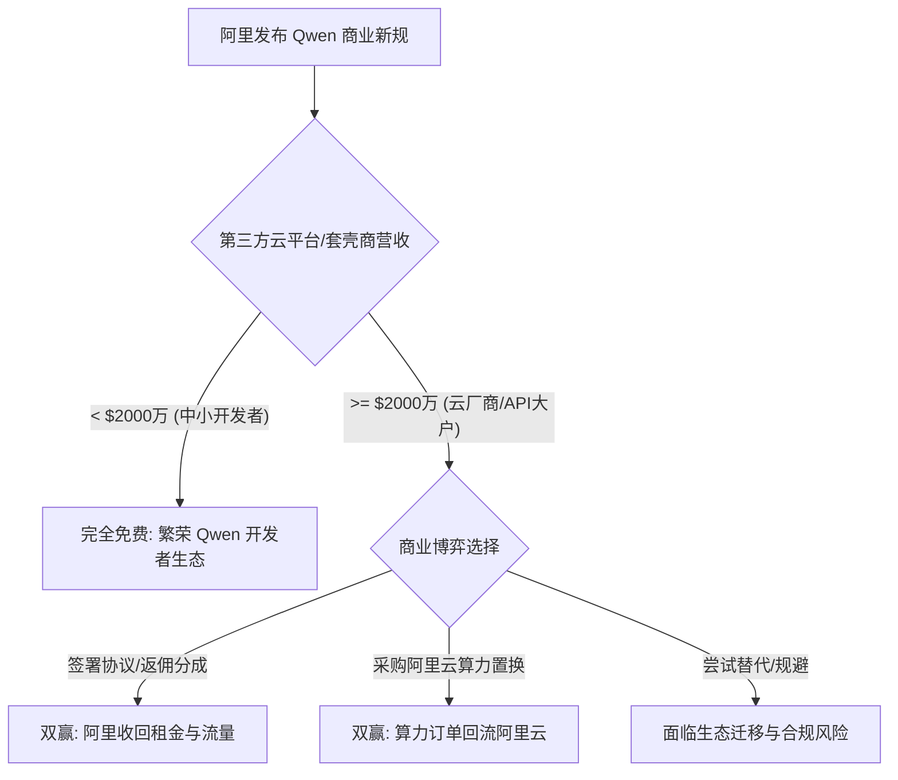
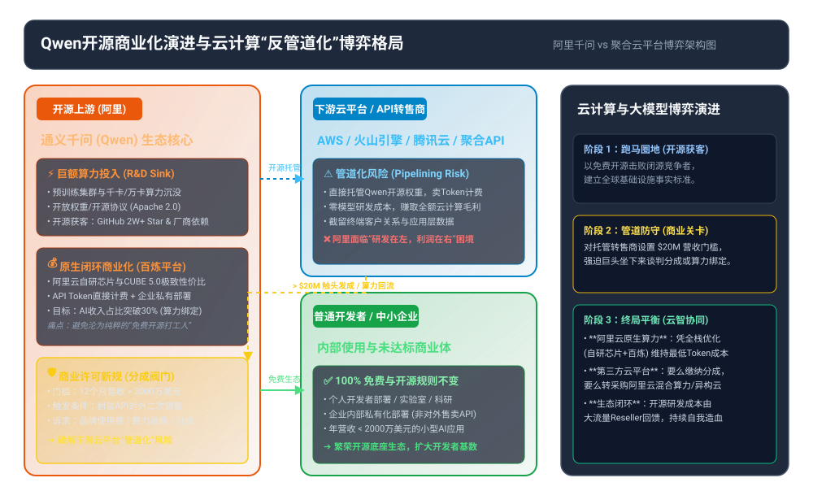

## 阿里千问“劫富济贫”背后: 开源大模型的商业模式

### 作者
digoal

### 日期
2026-08-10

### 标签
AI , 开源大模型 , 千问 , Qwen , 收费模式 , 劫富济贫

----

## 背景

前阵子 AI 圈传出一则引人瞩目的消息：阿里通义千问（Qwen）团队正在测试全新的商业许可策略，准备向那些靠包装其开源模型转售 API、且年收入超过 2000 万美元（约 1.4 亿元人民币）的商业大户收取授权费或营收分成。消息一出，坊间热议不断，有人担心“开源精神死了”，也有人觉着这是理所当然。天下哪有永远免费的算力？今天我们就抛开虚头巴脑的口号，把大模型开源商业化背后的这本账彻底拆明白。

## 天下没有免费的算力

如果把 AI 开源生态比作大家合租搞烧烤，有人出肉有人出炭，但要是有大户直接端走整个烤架开加盟店赚钱，那出肉的大哥坐下来谈个加盟分成，也确实没毛病。

要理解阿里的收费动机，首先得搞清大模型开源和传统软件开源（比如 Linux 或 MySQL）的底层逻辑差异。在软件工程里，代码开发完成后，复制和分发一份的边际成本（Marginal Cost）几乎为零。但在 AI 大模型时代，想要维持模型的顶尖性能，研发厂商必须投入高昂的固定资本支出（CapEx）——数万张昂贵的 GPU 显卡集群、巨额的电力开支、海量高质量数据的清洗以及持续的强化学习（RLHF）训练，动辄消耗数千万甚至数亿美元。

如果任由下游大型 API 转售商以零研发摊销成本免费榨取开源权重的价值，上游基座厂商就会陷入“开得越多、亏得越狠”的尴尬境地。

为了打破这种非对称的“搭便车”现象，阿里设定的 2000 万美元门槛本质上是一场精准的三级价格歧视。对于 99% 的普通个人开发者、学术研究机构以及企业内部自用场景，依旧维持 100% 完全免费，以此保护开发者生态的活水与网络效应；而唯独针对那 1% 依靠模型包装销售获取暴利的商业巨头，强制要求其将外部收益反哺上游，实现“研发-开源-抽租-再研发”的循环。

## 收税收到了谁头上

在开源法律和软件历史的视角下，只要在协议里加上了营收上限或特定用途限制，严格意义上就不再符合 OSI（开源推进组织）对于纯粹开源（Open Source）的定义，而应该划归为“开放权重”（Open Weights）或“专有源码可用（Source-Available）”的范畴。

阿里这套做法并不是凭空独创，行业里早有先例可循：

* **Meta 的 MAU 门槛**：Meta 在发布 Llama 3 / 3.1 社区许可协议时，就明确规定如果产品的月活跃用户（MAU）超过 7 亿，必须单独向 Meta 申请商业授权（出自 *Meta Llama 3 Community License Agreement*），直接挡住了 Google、Apple 等科技巨头免费将 Llama 嵌入其超级 APP 的可能。
* **月之暗面的 Kimi K3 模式**：月之暗面在其商业协议里，同样以连续 12 个月累计营收 2000 万美元作为分界线（出自 *Moonshot AI Commercial License*），首次在生成式 AI 领域探索了按比例进行商业分成的机制。

再回头看看传统开源软件史，Elasticsearch 因为 AWS 推出 OpenDistro 免费托管服务而被迫撕下 Apache 2.0 标签转向 SSPL 协议，Redis 也因云厂商转售暴利而修改了 BSD 许可。AI 大模型的训练成本远超传统数据库，基座厂商如果建立不起商业防线，开源造血干涸只是时间问题。

## 牌桌上的三角博弈

在这场许可协议演变中，最值得关注的其实是阿里云与第三方云平台（如 AWS、字节火山引擎、腾讯云等）之间的管道化防守战。

在云计算迈入 MaaS（模型即服务，Model-as-a-Service）时代后，云算力的计费单位从传统的“vCPU/小时”演化成了“每百万 Token 多少钱”。第三方云平台如果直接拉取 Qwen 开源权重部署在自己的 Serverless 集群上对外卖 Token，不仅卷走了高额的云算力毛利，还死死卡住了终端客户关系。阿里掏了几亿砸出的模型，到头来却替别的云厂商做了嫁衣，直接面临被“管道化”的风险。

通过设立 2000 万美元的收费关卡，阿里把许可协议变为了云计算算力导流与利润再分配的监管阀门：

如果第三方云平台不想交这笔分成，也可以选择将推理算力采购订单直接置换回流至阿里云基础设施，从而完成“以模型带算力”的商业闭环。

## 这个模式的隐形软肋

这场看似完美的商业闭环推演，在现实的真实工程与商业世界里，其实藏着不少脆弱的缝隙。

凡事都要辩证地看。这个收费模式想要顺畅运转，隐藏着一个极其硬核的前置推理条件： **Qwen 必须在能力上保持绝对的不可替代性（SOTA 溢价）** 。如果市场上存在性能旗鼓相当、且完全免费开放的替代品，抽租条款就会瞬间失效。

这里顺带纠正一个常见的误区：很多人以为开源大模型全都是 Apache 2.0 协议，但实际上像 DeepSeek 官方发布的代码与模型权重，采用的是更为宽松的 **MIT 许可证**。一旦 Qwen 强推分成，那些极度看重成本的套壳 API 大户完全可能在一夜之间切换底座，顺手把原本依赖 Qwen 的开源生态生态位拱手让给 DeepSeek。

除了替代模型的威胁，还有三个工程与法律上的隐形边界：

1. **黑盒蒸馏与合成数据脱敏**：下游大户根本不需要直接转售 Qwen 原始权重 API。他们完全可以付费调用 Qwen 产生海量的顶级合成数据（Synthetic Data），用来“蒸馏”（Distillation）或训练自研的小模型。在现有版权法框架下，利用模型输出训练新模型是否构成侵权在法律上极难举证，分成条款对黑盒蒸馏形同虚设。
2. **云厂商的 BYOW 防御战**：面对阿里的分成诉求，AWS 或火山引擎等第三方巨头不见得会乖乖就范。他们完全可以推出“BYOW（Bring Your Own Weights，自带权重）”托管模式——云平台只卖纯粹的 GPU 算力容器，让终端企业客户自己去下载 Qwen 权重部署（符合企业内部自用免费条款）。如此一来，云厂商既赚到了算力费，又在法律合同上完美避开了“转售 MaaS API”的定义。
3. **维权成本与技术水印衰减**：在法律层面，AI 权重的版权地位在跨国诉讼中尚存争议，追讨海外匿名 API 平台所需的律师与审计成本往往远超收回的分成；在技术层面，下游大户只要对 Qwen 权重进行二次微调（Fine-tuning）或量化压缩（INT4/FP8），原本植入的模型水印和神经元激活特征就会严重稀释，难以作为法庭上的侵权铁证。

## 如何判断这场变革是赚是赔

这场商业策略调整究竟是成功实现了“以商养开源”，还是因门槛过高导致了生态失血？我们可以通过一套清晰、可观测的指标体系来进行验证与证伪：

### 证明策略成功的信号
* **开发者生态留存**：Qwen 在 GitHub 上的 Star 增速与 Hugging Face 月度下载量保持平稳增长（月环比增长 > 5%），未出现开发者大规模社区撤离。
* **商业收入与回流**：阿里云百炼平台的 MaaS 商业授权与算力收入保持年化 30% 以上的高速增长，且头部 Top 5 的 API 托管平台有超过 80% 主动完成合规报备与商业签约。

### 证伪策略失败的信号
* **基座无缝迁移率**：热门 GitHub 开源框架和下游套壳商中，将默认底层模型由 Qwen 批量切换为 DeepSeek（MIT 许可）等纯宽松开源模型的项目占比超过 30%。
* **蒸馏泛滥与维权赤字**：GitHub 上基于 Qwen 输出进行“模型蒸馏与脱敏”的开源工具包数量剧增，且阿里向拒不支付分成的 API 大厂追讨许可费的跨国维权成本占到了收回分成金额的 50% 以上。

## 结语

阿里巴巴对 Qwen 模型拟引入的 2000 万美元营收分成新规，标志着开源大模型行业正式告别了“单向免费输血的跑马圈地时代”，步入“精细化商业造血与生态平衡”的新阶段。

这绝非开源精神的倒退，而是大模型高额 Capex 属性下的必然选择。只要将 99% 的中小开发者妥善保护在免费伞下，仅对 1% 依靠模型包装获利超 1.4 亿元的商业巨头精准提成，开源生态就能建立起商业可持续的良性循环。至于这场博弈的终局，终究还是要看阿里能否持续保持技术断层优势，以及能否提供全网最低的单 Token 算力性价比。
  
  
#### [PostgreSQL 解决方案集合](../201706/20170601_02.md "40cff096e9ed7122c512b35d8561d9c8")
  
  
#### [德哥 / digoal's Github - 公益是一辈子的事.](https://github.com/digoal/blog/blob/master/README.md "22709685feb7cab07d30f30387f0a9ae")
  
  
#### [About 德哥](https://github.com/digoal/blog/blob/master/me/readme.md "a37735981e7704886ffd590565582dd0")
  
  

  
