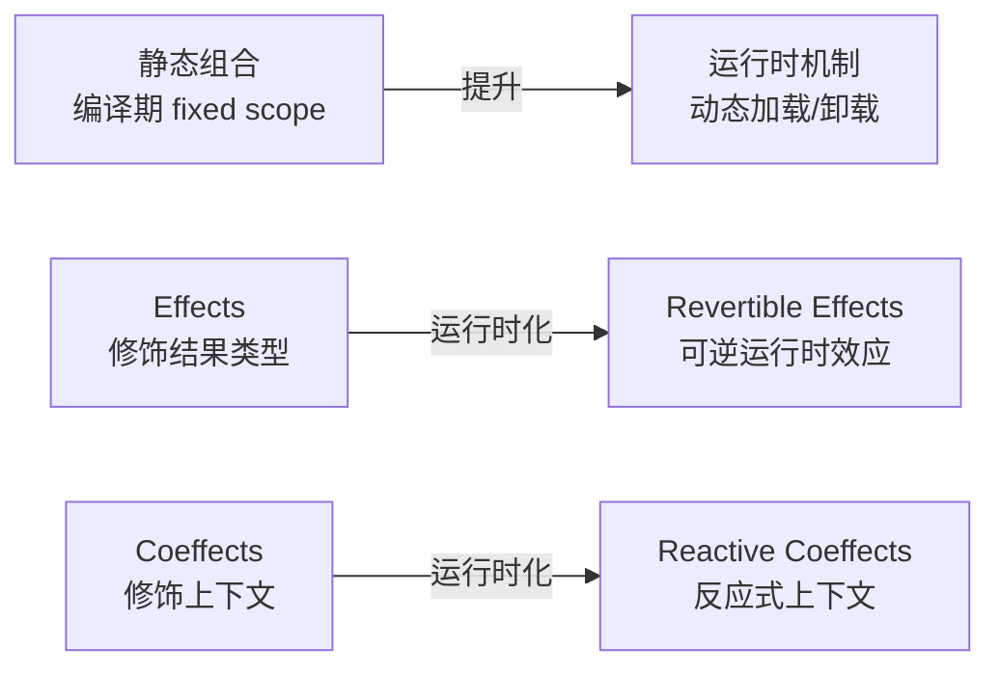
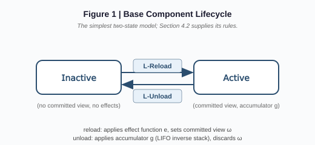
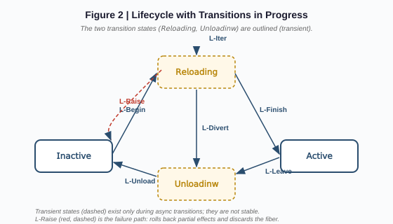

## AI论文解读 | Spatiotemporal Composability 编程范式

### 作者
digoal

### 日期
2026-08-15

### 标签
AI , Agent , 自进化 , 热更新 , DeepSeek , Harness , 插件化 , Cordis  

----

## 背景
Cordis 框架的形式化基础

> 一篇来自北京大学+DeepSeek-AI 的编程语言理论(PL)论文,把"插件可热更新"这件事做成了完整的演算 + 元理论 + 工业级实现。

---

## 论文元数据

| 项 | 内容 |
|----|------|
| 标题 | A Programming Paradigm for Spatiotemporal Composability |
| 作者 | Yifan Shi¹·², Wei Zhang¹, Tianyi Cui² |
| 机构 | ¹ 北京大学(Peking University), ² DeepSeek-AI |
| 类型 | 编程语言理论 / 软件工程 |
| 预印本日期 | 2026-08-13(草案,仍在修订) |
| 预印本地址 | https://github.com/cordiverse/paper/blob/main/paper.pdf |
| 代码仓库 | https://github.com/cordiverse/cordis + https://github.com/deepseek-ai/deepseek-harness(已 vendored) |
| 页数 | ~80 页(4478 行提取文本) |

---

## 1. 论文定位

### 1.1 现实问题

现代软件(插件系统、自我演化的 agent harness)越来越需要动态组合:组件运行时加载、卸载、重配。但现有的形式化基础是静态组合:函数调用、模块导入、类继承都在编译时确定。两者之间的鸿沟巨大——以至于业界只能用"进程重启"和"容器编排"这种粗粒度方案糊弄。

### 1.2 学术价值

把经典编程语言理论中的 effects(刻画程序对环境的修改)和 coeffects(刻画程序对环境的依赖)从编译期静态分析,提升到运行时机制——并以此为基础,建立完整的演算(metatheory)和工程实现。

### 1.3 工业价值

直接落地为 Cordis 框架——已被 DeepSeek 的 deepseek-harness 项目 vendored 作为底层。Koishi(4000+ 社区插件的生产系统)已在用。

### 1.4 一个直觉类比

把"组件加载"想成租房子:
- 静态组合 = 买房子(签合同就锁定,过户要复杂手续)
- 现有插件系统(VSCode) = 短租公寓(入住容易,退租要整栋楼清空)
- 容器编排(K8s) = 酒店长住(退房方便,但每次都要重新办入住)
- Cordis 范式 = 智能办公空间(你租的工位自动登记,你走了之后工位灯光/网络/打印机自动恢复原状,你隔壁工位的人换工作内容时,你能自动感知并重新连线)

一句话总结:这套范式让"插件可热插拔"成为数学上的结构性保证,而不是开发者的小心翼翼。

---

## 2. 前置知识地图

理解这篇论文需要三层概念:

```
┌─────────────────────────────────────────┐
│ 核心概念(必须懂)                          │
│  Effects / Coeffects / 代数效应 / 余单子    │
└────────────────┬────────────────────────┘
                 │
┌────────────────▼────────────────────────┐
│ 支撑概念(有助于理解)                       │
│  类型论 / 范畴论基础 / Lambda 演算          │
└────────────────┬────────────────────────┘
                 │
┌────────────────▼────────────────────────┐
│ 扩展概念(感兴趣再看)                       │
│  RAII / 依赖注入 / 事务内存 / 可逆计算      │
└─────────────────────────────────────────┘
```

### 2.1 核心概念速通

Effects(效应)
- 程序对环境的修改(写文件、发请求、改状态)
- 形式化:`Γ ⊢ t : T^effect`,结果类型带一个 effect 标注,说明这段代码可能产生哪些副作用
- 经典方案:单子(monad)、代数效应(algebraic effects)

Coeffects(上下文依赖)
- 程序对环境的依赖(读配置、调用服务、访问资源)
- 形式化:`Γ^coeffect ⊢ t : T`,上下文带一个 coeffect 标注,说明这段代码需要什么环境
- 经典方案:余单子(comonad)、分级 coeffects

两类范式的对比:
- Effects = 程序"对外做了什么"
- Coeffects = 程序"对内需要什么"

### 2.2 论文的视角切换



关键洞察:静态分析的"effect/coeffect 标注"在运行时不再只是注释,而是可操作的数据结构——运行时能直接读、改、回滚它们。

---

## 3. 论文精读

### 3.1 Why: 为什么要做这个研究?

#### 痛点 1:VSCode 插件不能热卸载

VSCode 在所有扩展共享的 extension host 里运行所有插件。一旦插件的 `activate` 函数执行过,卸载它需要重启整个 host,影响所有已加载的插件。

论文给出的数据:top 100 扩展中,87 个含可执行代码——这 87 个都需要重启才能卸载。

> 想想:你开发一个插件,关闭它就要重启 VSCode,这是 2026 年的 IDE 该有的样子吗?

#### 痛点 2:Self-Evolving Agent Harness 需要热更新

现代 AI Agent(论文引述 OpenAI/Anthropic 的"harness engineering")能:
- 生成自己的新组件
- 持续服务请求的同时自我修改
- 工具集、执行环境、权限、沙箱、状态、上下文管理……都在变化

没有时间可组合性,每次自修改就得重启,丢失所有进程内状态——累积下来不可用时间巨大。

没有空间可组合性,模块之间需要各自用 ad-hoc 方式检测依赖变化,可能悄悄破坏依赖者或引入循环依赖。

#### 痛点 3:粗粒度方案代价高

业界用两种粗粒度方案替代:
- 操作系统(process 粒度的 temporal 隔离)
- 容器编排(service 粒度的 spatial 隔离)

代价:
- 重启丢失所有进程内状态(缓存、连接、部分计算)
- 维护可用性需要冗余副本(资源浪费)
- 容器间通信不能本地调用,要网络开销
- 粒度不匹配:现代系统在进程/容器内部组合,这两个机制只能管到边界

### 3.2 What: 提出了什么?

一句话总方案:把 effects 和 coeffects 运行时化,构成一个新的编程范式——Spatiotemporal Composability——并给它完整的形式化模型和元理论。

两个新机制:
1. Revertible Effects(可逆运行时效应):每个 context 变换都带一个 inverse,运行时跟踪,卸载时自动回滚
2. Reactive Coeffects(反应式上下文依赖):组件声明它需要什么依赖,context 变化时自动通知该组件

三个统一:
- 把 effect context 和 coeffect context 统一为一个 context type
- 在这个统一类型上建立了编程范式
- 给这个范式完整的演算(calculus)和元理论(metatheory)

一个实现:Cordis meta-framework —— 内核提供效应跟踪和 coeffect 解析,上层提供声明式组件加载和 HMR。

### 3.3 How: 怎么实现?

#### 3.3.1 Revertible Effects(可逆效应)

```typescript
// 理论模型
type Effect<Γ> = (ctx: Γ) => [Γ, (Γ) => Γ]
//                    ^^^   ^^^^^^^^^^^^
//                  新状态   逆操作

// 运行时对应:ctx.effect(callback)
async function effect(ctx, callback) {
    let armed = true
    let inverse = () => {}  // no-op
    
    const task = (async () => {
        const iter = callback()
        while (armed) {
            const { value, done } = await iter.next()
            if (value) inverse = compose(value, inverse)  // LIFO 累积
            if (done) break
        }
        return inverse
    })()
    
    const dispose = async () => {
        if (!armed) return
        armed = false
        const recover = await task
        recover()  // 卸载时回滚
    }
    
    ctx.dispose = compose(dispose, ctx.dispose)
    return dispose
}
```

关键设计:每一个 effect 操作都要返回它的"逆操作"。运行时把这些逆操作LIFO(后进先出)累积——卸载时反向执行,自动把 context 恢复到组件加载前的状态。

#### 3.3.2 Reactive Coeffects(反应式 coeffects)

```typescript
// ctx.set(key, value) 不仅是写入,还会触发依赖该 key 的组件
function set(ctx, key, value) {
    return ctx.effect(function*() {
        const realm = ctx[ISOLATE][key]
        ctx[STORE][realm] = value
        notify(ctx, [key])  // 通知所有声明了该 key 的组件
        
        // inverse:删除该值
        return function() {
            delete ctx[STORE][realm]
            notify(ctx, [key])  // 再次通知
        }
    })
}

// notify 检查每个 fiber,如果它声明了该 key,刷新它的 target
function notify(ctx, keys) {
    const affected = new Set()
    for (const fiber of all_fibers(ctx)) {
        for (const key of keys) {
            if (key in fiber.inject && 
                fiber.ctx[ISOLATE][key] === ctx[ISOLATE][key]) {
                refresh(fiber)
                affected.add(fiber)
                break
            }
        }
    }
    return affected
}
```

#### 3.3.3 Component Lifecycle(组件生命周期)

每个组件被实例化成一个 fiber(线程/纤程)。论文给出了两张关键图:

Figure 1:基础两状态模型



Figure 2:包含进行中转换的完整状态机



关键点:
- Inertial(惯性):转换一旦开始,必须跑完才能接受新目标
- Self-stopping:每个 fiber 在卸载前先通知自己的依赖者,等它们完成卸载,然后才回滚自己的 effect
- Cascading:父卸载会自动级联到子(LIFO,子树按深度优先卸载)
- L-Raise(图 2 中红色虚线):转换失败时,回滚部分 effect 并丢弃 fiber

#### 3.3.4 Declarative Configuration(声明式配置)

Cordis 把 imperative 的 `ctx.use(...)` 调用层包装成一个声明式 loader:

```yaml
# cordis.yml
- id: database
  url: ./components/postgres.ts
  config:
    host: localhost
    port: 5432

- id: api
  url: ./components/api.ts
  inject: [database]    # 声明依赖
  config:
    port: 3000

- id: webapp
  inject: [api]
  url: ./components/web.ts
  intercept: { rate-limit: { rps: 100 } }
```

loader 的作用:把你写的 yaml 翻译成 ctx.use 调用,自动 reconcile,自动 HMR(改 yaml 文件不重启)。

### 3.4 So What: 实验/案例结果怎么样?

论文没有做对照组实验(这是 PL 理论论文,不是系统论文),但提供两个案例验证:

#### 案例 1:Koishi
- 生产级 bot 框架,已运行多年
- 4000+ 社区插件
- 所有插件都基于 Cordis 范式
- 数据:插件可以独立启用/禁用,卸载后运行时无残留,依赖关系自动协调

#### 案例 2:Self-Evolving Agent Harness(未来方向)
- 论文展望(Section 8 Conclusion):未来值得验证的场景是 AI agent 自己生成/替换自己的 harness 组件
- 当前未做实证,但论文论证了范式的理论适用性

### 3.5 Now What: 对我们意味着什么?

| 我们关心的事 | 这篇论文的启发 |
|---|---|
| 写插件/中间件 | 用 Cordis 范式,而不是依赖"小心写 deactivate 钩子" |
| 设计 SaaS 系统 | 把"组件"概念运行时化,支持不停机更新 |
| Agent Harness 工程 | Self-evolving harness 的理论可行性已有依据 |
| PL/系统研究 | 这是一个"运行时化静态理论"的范式,可推广到其他理论 |
| deepseek-harness 用户 | 底层就是 Cordis,可以用声明式 cordis.yml + 完整 vendored 框架 |

---

## 4. 关键定理

论文给出了 4 个核心定理(具体形式见 paper):

| 定理 | 内容 | 意义 |
|------|------|------|
| Theorem 16 | 单个 fiber 的 LIFO 恢复保证终止性 | 一个组件的卸载一定能结束 |
| Theorem 63 | coeffect 排序:被依赖者先卸载 | 防止"组件还活着但依赖先没了" |
| Theorem 64 | 单个转换内不会跨两个 coeffect 解析 | 转换原子性 |
| Theorem 66 | 整个 lifecycle 关系终止 | 整个系统一定能收敛到 quiescent 状态 |

统一元理论保证:无论你插入/卸载多少组件、按什么顺序操作,系统保证会回到稳定的 quiescent state(就像数据库事务的 ACID 之于 SQL)。

---

## 5. 术语表

Effect(效应)
- 是什么:程序对环境的修改
- 为什么重要:可逆版本让"撤销组件影响"成为结构性保证
- 现实类比:一个函数的副作用,但带撤销按钮

Coeffect(上下文依赖)
- 是什么:程序对环境的依赖
- 为什么重要:反应式版本让"依赖变化自动传播"成为结构性保证
- 现实类比:DI(依赖注入)框架,但带自动重连

Revertible(可逆的)
- 是什么:每个 effect 都带有显式的 inverse,运行时跟踪并 LIFO 累积
- 为什么重要:卸载时能完整恢复环境,不需要开发者写 deactivate 钩子
- 现实类比:数据库事务的 commit/rollback,但作用于运行时组件

Reactive(反应式的)
- 是什么:context 变化时,声明依赖该 context 的组件自动被通知并重新计算
- 为什么重要:依赖拓扑变化时无需手动同步
- 现实类比:Excel 公式(A1 改了,所有引用 A1 的单元格自动重算)

Fiber(纤程)
- 是什么:组件的运行时实例化,带独立 lifecycle state
- 为什么重要:同一个组件可以多次实例化,每个有独立生命周期
- 现实类比:goroutine(但带结构化的 lifecycle)

Component(组件)
- 是什么:`(d, p, e)` 三元组,声明它读什么、写什么、做什么
- 为什么重要:三者的分离让"声明"和"实现"解耦
- 现实类比:接口(interface)+ 实现(class)的运行时版本

Comonad(余单子)
- 是什么:coeffect 的代数基础,类似 monad 的对偶
- 为什么重要:提供了 context-dependent 计算的形式化基础
- 现实类比:monad 是"程序串成一个值",comonad 是"从一个 context 提取值"

Calculus(演算)
- 是什么:用形式化规则定义系统的状态转换
- 为什么重要:让系统行为可证明、可推理
- 现实类比:TLA+ 之于分布式系统,Coq 之于数学证明

Spatiotemporal Composability(时空可组合性)
- 是什么:论文提出的新范式,结合了 temporal(可逆) + spatial(反应式)两种可组合性
- 为什么重要:这是论文的核心贡献——把两件事用一个编程范式统一了
- 现实类比:Git 之于代码版本控制(可回滚+可合并),但作用于运行时组件

---

## 6. 批判性评估

### 6.1 论文强在哪里

1. 形式化完备
- 给出完整演算 + 4 个核心定理 + 实现对应表(Table 2)
- 这是 PL 圈子的"金标准"——不光做工程,还把工程的合理性证明出来

2. 选题精准
- 痛点真实(VSCode 87/100 插件需要重启)
- 时机好(2026 是 self-evolving agent 元年,理论需要跟上)
- 实现落地(Koishi 4000+ 插件已生产验证)

3. 理论联系实践
- 每个理论概念都有运行时对应(Table 2 的 mapping)
- 给了完整算法(Algorithm 1-6)而不仅有定义
- Koishi 案例不是玩具系统,是真生产系统

4. Related Work 充分
- 与 RAII、STM、可逆计算、依赖注入、FRP 等都做了清晰对比
- 明确说"我们的取舍是什么,放弃的是什么"

### 6.2 边界在哪里

1. "Obligation on the developer"
- Theorem 61 依赖开发者手写正确的 inverse
- 论文明说 "the runtime verifies" — 这是结构性 vs 规约性的取舍
- 风险:如果开发者写错 inverse,系统会进入不一致状态

2. 异步控制的复杂度
- 论文承认 inertial + async + LIFO 三者交织很复杂
- 实际项目中 debug 一个失效的 fiber cascade 可能很痛苦
- 风险:异步场景下的"quiescent state"判定比理论描述的微妙

3. 性能开销未量化
- 每次 ctx.effect 调用都要包裹 inverse tracker
- 每次 ctx.set 都要触发 notify
- 论文没有基准测试(不是系统论文)
- 风险:高吞吐场景下可能有显著 overhead

4. "Realm" 概念被简化
- Section 4.1 明说"we do not introduce realms here",把 realm 简化成全局一个
- 这使得"两个 fiber 提供同一个 key 但在不同 realm"的情况无法优雅支持
- 风险:复杂隔离场景(多租户、权限分级)需要扩展,可能破坏现有理论

5. 自我演化场景未实证
- 论文 Section 8 把"self-evolving agent harness"列为未来方向
- 没有 LLM 实际生成/替换组件的实验
- 风险:AI 生成代码的不可预测性,可能突破论文假设("writing correct inverses")

6. 语言独立性有水分
- 论文声称"language-agnostic"
- 但 Algorithm 1-6 用 async/iterator 这种 TypeScript 特定语法
- Python coroutines / Rust futures 的实现差异被 footnote 提及但未深入
- 风险:跨语言移植时,某些理论保证可能因宿主语言特性失效

### 6.3 我认为未来可改进的方向

1. 静态验证 inverse 的正确性——用 dependent types 或 refinement types 证明 inverse 真的能 undo effect
2. Realm 系统扩展——把 single-realm 限制去掉,支持多租户场景
3. 性能基准论文——单独一篇 system paper,量化 effect tracking 和 notify 的 overhead
4. Self-evolution 实证——做一个最小 LLM agent harness,实测 self-modification 下的可用性
5. 形式化到 Rust 的实现——Rust 的所有权系统天然适合做"inverse obligation",可能比 TypeScript 更优雅

---

## 7. 我学到了什么

这篇论文让我重新理解了"组合性":
- 静态组合是类型论已经解决的问题
- 动态组合没有成熟的形式化基础
- 论文把 effect/coeffect 运行时化,是填补这个空白的优雅尝试

对我(一个 AI Agent + 软件工程师):
- 写插件系统时,先想清楚 inverse 和 notify,而不是"先跑起来再说"
- 把"组件"概念从"代码块"提升到"运行时声明 + 运行时追踪 + 运行时协调"的三元组
- 在设计 self-evolving 系统时,用 Cordis 范式作为理论基础,而不是 ad-hoc 拼凑

---

## 8. 引用与索引

| 引用位置 | 内容 |
|----------|------|
| 论文 Section 1 | 痛点(VSCode, self-evolving harness, 粗粒度 workaround) |
| 论文 Section 3.1 | Revertible Effects 的形式化 |
| 论文 Section 3.2 | Reactive Coeffects 的形式化 |
| 论文 Section 3.3 | The Context Paradigm(两个机制统一) |
| 论文 Section 4 | 动态组合演算 + 元理论 |
| 论文 Section 5.1 | 核心库实现(Algorithm 1-6) |
| 论文 Section 5.2 | 声明式 loader |
| 论文 Section 5.3 | Koishi 案例研究 |
| 论文 Section 7 | Related Work(与 RAII, STM, FRP, DI 等对比) |
| 论文 Section 8 | 结论 + self-evolving agent 未来方向 |

相关引用:
- Moggi (1991): Notions of computation and monads — effects 的代数基础
- Petricek et al. (2013): Coeffects: unified static analysis of context-dependence — coeffects 的代数基础
- Plotkin & Power (2001): Adequacy for algebraic effects — algebraic effects 的形式化

---

## 9. 评估清单

按 paper-interpretation skill 的 output checklist 验证:

- ✅ 标题、Paper metadata
- ✅ 1-3 句话总览
- ✅ 学术价值 + 工业价值
- ✅ 知识地图(mermaid + 概念分层)
- ✅ 问题-方法-验证的精读(Why-What-How-So What-Now What)
- ✅ 关键术语表
- ✅ 批判性评估 + 未来方向
- ✅ 引用指向论文章节
- ✅ 公式/算法用 plain language 解释

本文提取自论文 PDF:`https://github.com/cordiverse/paper/blob/main/paper.pdf`(4478 行提取文本)  

论文框架实现在:`https://github.com/deepseek-ai/deepseek-harness`(已 vendored cordis)  
  
  
  
#### [PostgreSQL 解决方案集合](../201706/20170601_02.md "40cff096e9ed7122c512b35d8561d9c8")
  
  
#### [德哥 / digoal's Github - 公益是一辈子的事.](https://github.com/digoal/blog/blob/master/README.md "22709685feb7cab07d30f30387f0a9ae")
  
  
#### [About 德哥](https://github.com/digoal/blog/blob/master/me/readme.md "a37735981e7704886ffd590565582dd0")
  
  

  
