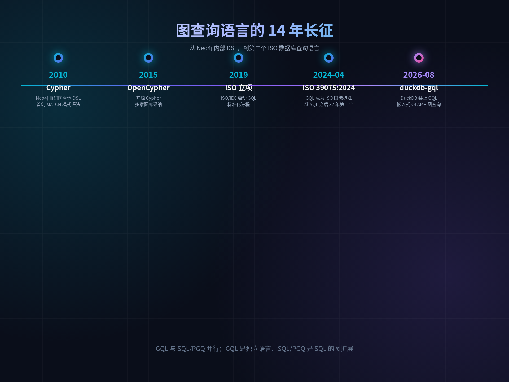
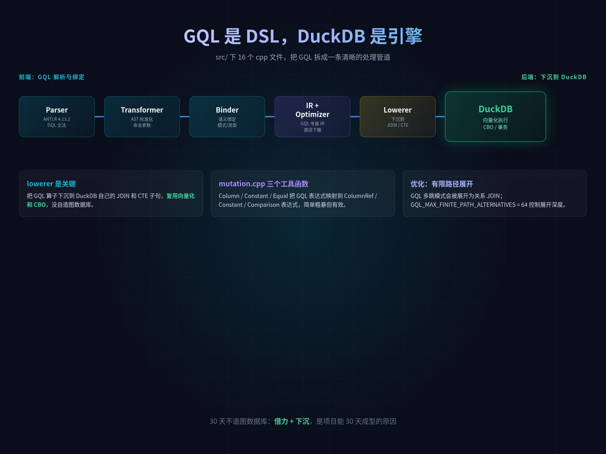
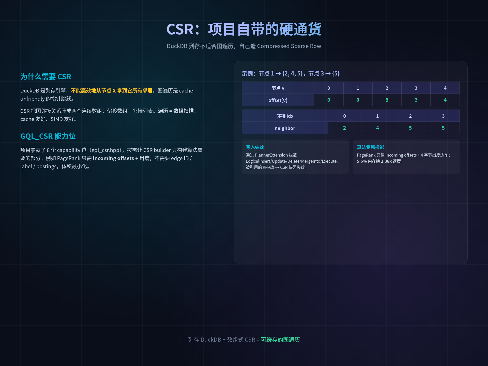
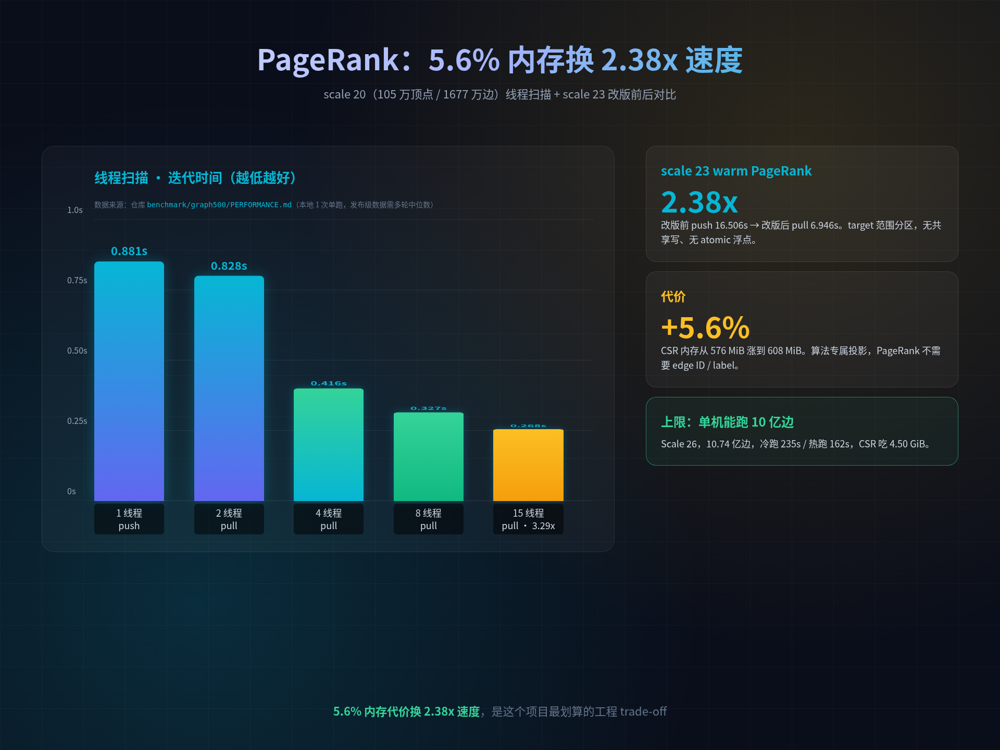
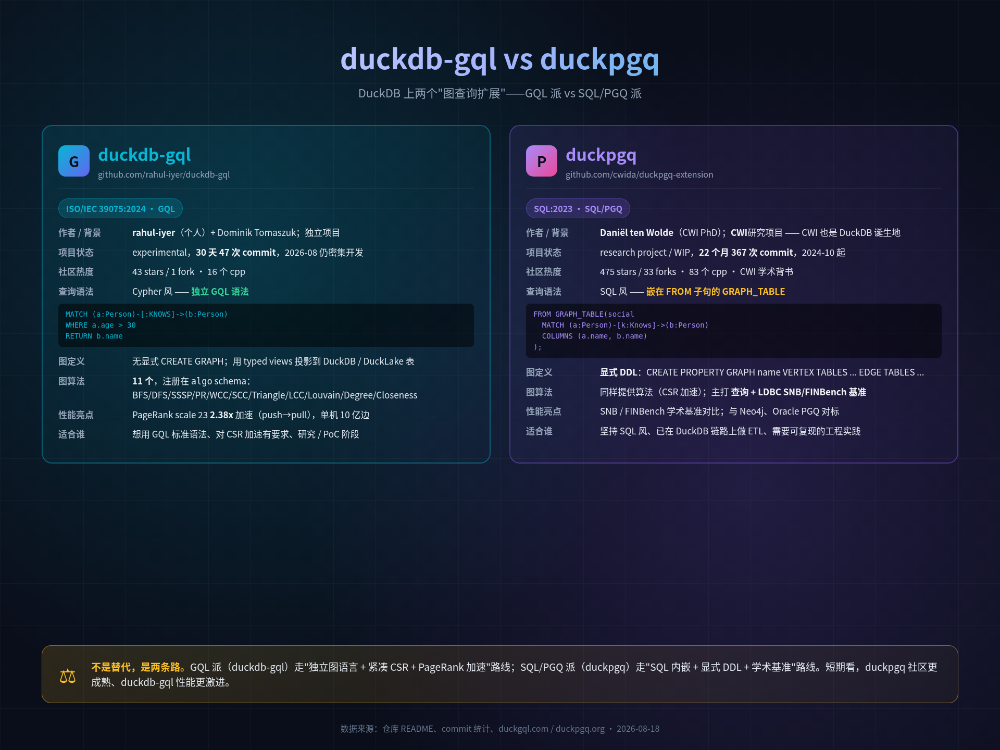
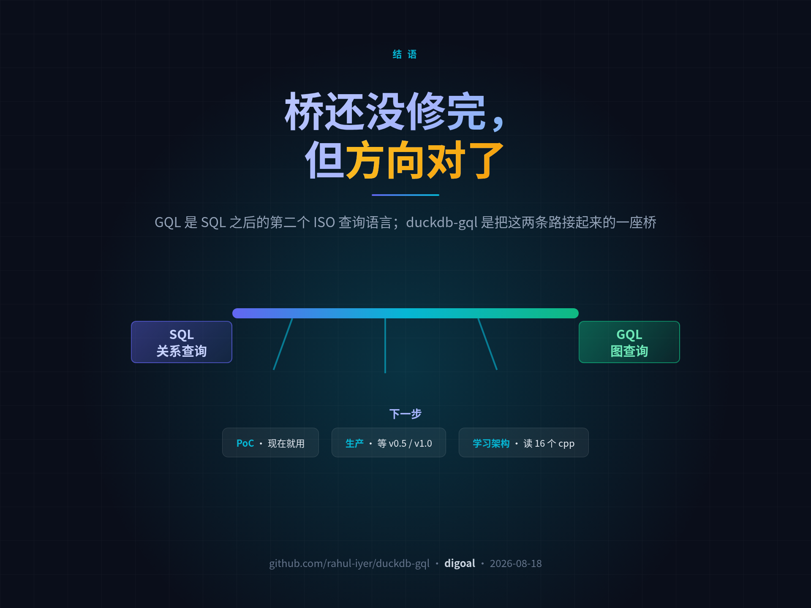

## DuckDB 属性图插件 DuckPGQ vs DuckGQL

### 作者
digoal

### 日期
2026-08-18

### 标签
DuckDB , 属性图 , SQL/PGQ , GraphQL , DuckPGQ , DuckGQL

----

## 背景
  
## 一、为什么是 DuckDB + GQL



对做数据库的人来说，最近几年最让人心里痒痒、又最难落地的事，是"图查询"。

关系型 OLAP 已经够强了，但只要数据稍微复杂一点——"找出和 Tom Hanks 合作过两次以上、且在 1999 年前出生的演员"——SQL 就要拼四五个 JOIN，脑子随时断片。专门的图数据库（Neo4j、Nebula、Kuzu）体验好，但要把数据搬出 DuckDB，多一套栈、多一份运维、多一份一致性要维护。

2024 年 4 月，ISO 干了件大事：发布 ISO/IEC 39075:2024 GQL——继 SQL 之后 37 年，第二个数据库查询语言国际标准。

GQL 几乎就是 Cypher 的标准版，语法读起来一目了然：

```sql
MATCH (tom:Person {name:'Tom Hanks'})-[r]->(m:Movie)
RETURN type(r) AS type, m.title AS movie
```

节点 - 关系 → 节点，沿着图的边走。可视化的图模式，直接镜像数据的连接方式。

但 GQL 只是标准。DuckDB 不会原生支持 GQL——它是纯 SQL 的列存引擎，要它装上图查询能力，没门。直到有人在 DuckDB 扩展仓库里塞进了一个叫 DuckGQL 的东西。

补一句背景：GQL 与 SQL/PGQ（SQL:2023 引入的图查询属性）是 ISO 同期推进的两套图查询标准——GQL 是独立语言，SQL/PGQ 是 SQL:2023 的图扩展；前者由图数据库圈主导，后者由 SQL 圈主导。

## 二、项目全景：30 天、一个人、装了 11 个图算法

DuckGQL（[github.com/rahul-iyer/duckdb-gql](https://github.com/rahul-iyer/duckdb-gql)）是 DuckDB 的一个 C++17 扩展，给 DuckDB 加上一门实验性但已可用的 GQL 方言。一行 SQL 装上：

```sql
INSTALL duckgql FROM community;
LOAD duckgql;
```

几个数字：

- 30 天 47 次 commit（2026-07-19 → 2026-08-17，2026-08-17 还在 push：Avoid static type symbol linkage on ARM64）
- 作者 2 人：主提交 rahul-iyer，加上 Dominik Tomaszuk（domel）
- 目标 DuckDB v1.5.5，ANTLR 4.13.2 做 GQL 文法解析
- 11 个图算法注册在 `algo` schema：BFS / DFS / SSSP / PageRank / WCC / SCC / Triangle Counting / LCC / Louvain / Degree / Closeness
- 截至 2026-08-18，43 stars / 1 fork

43 stars 说明还在飞奔——但这种"基础设施型独苗项目"早期 star 数字不重要，跑起来能不能用才重要。

## 三、它怎么把 GQL 塞进 DuckDB 的



这是项目最值钱的工程决策。`src/` 下 16 个 cpp 文件，把 GQL 的处理拆成一条非常清晰的管道：

```
gql_parser.cpp        → ANTLR 生成的 GQL 文法 → AST
gql_transformer.cpp  → 命名参数、AST 标准化
gql_binder.cpp       → 语义绑定、模式、类型、路径长度
gql_ir.cpp           → GQL 专属中间表示
gql_optimizer.cpp    → 谓词下推、有限路径展开
gql_relational.cpp   → 把 GQL 模式匹配翻译成 DuckDB JOIN
gql_lowerer.cpp      → GQL 算子下沉到 DuckDB 关系算子
gql_mutation.cpp     → INSERT / SET / REMOVE / DELETE 走 DuckDB 原生算子
gql_storage.cpp      → gql_internal 元数据 schema（图、表、序列）
gql_csr.cpp          → CSR 快照构造、缓存、写入失效
gql_algorithms.cpp   → 11 个图算法 + 工具函数注册
gql_catalog.cpp      → 解析图类型
gql_import.cpp       → graph-header CSV / 压缩 CSV / Parquet bulk import
gql_extension.cpp    → 扩展入口、注册 algo schema、注册所有 table function
gql_sql_utils.cpp    → DuckDB 端的 SQL 工具
parser/generated/    → ANTLR 自动生成的 GQLLexer / Parser / Visitor
```

关键在 lowerer。GQL 的 `MATCH (a:Person)-[:KNOWS]->(b:Person) WHERE a.age > 30 RETURN b.name` 到了 lowerer 这一层，会被翻译成 DuckDB 自己的 SELECT + JOIN 子句。`GqlCompatibilityMatch` 把多个 MATCH 阶段展平，`FlattenMatchStage` 把 OPTIONAL MATCH 转成带可选标记的 pattern，最终 `GqlRecursiveMatchFunction` 把整条 MATCH 管道变成一个 table function，让 DuckDB 的 CBO 当成普通 JOIN 来优化。

换句话说：GQL 是前端 DSL，DuckDB 是后端引擎。项目没自造图数据库，它把 GQL 当语法糖，复用 DuckDB 已经做好的向量化执行、连接优化、CBO、事务。

我读 `gql_mutation.cpp` 头三个工具函数：Column / Constant / Equal，把所有 GQL 表达式映射到 DuckDB 的 ColumnRefExpression / ConstantExpression / ComparisonExpression。简单粗暴，但有效。`gql_relational.cpp` 把 MATCH 拆成 staging + join；`gql_optimizer.cpp` 做谓词下推和有限路径展开（`GQL_MAX_FINITE_PATH_ALTERNATIVES = 64` 这种工程常量在 binder 里能看到）。

这就是 30 天成型的根本原因：借力。项目不重复发明列存引擎、不重复发明 CBO、不重复发明事务——这些 DuckDB 都做好了，它只做"DSL 翻译"。

但"借力"归"借力"，DuckDB 是列存，不适合做图遍历——你不能高效地"从节点 X 拿到它所有邻居"。所以项目自己搞了一套 CSR。

## 四、CSR：项目自带的硬通货



CSR（Compressed Sparse Row）把图邻接关系压成两个连续数组：偏移数组 + 邻接列表。图遍历 = 数组扫描，cache 友好、SIMD 友好。

DuckGQL 的 CSR 体系做对了几件事：

写入感知失效。`gql_csr.cpp` 通过 `PlannerExtension` 在 DuckDB 计划阶段拦截 `LogicalInsert / Update / Delete / MergeInto / Execute` 节点——一旦发现要写入被图引用的表，就让该图的 CSR 快照失效。这意味着：你改了一张 DuckDB 表，那个图下次 MATCH 不会拿到陈旧数据。

算法专属投影。项目暴露了 8 个 capability 位（`GQL_CSR_OUTGOING` / `GQL_CSR_INCOMING` / `GQL_CSR_EDGE_IDS` / `GQL_CSR_EDGE_LABELS` / `GQL_CSR_VERTEX_LABELS` / `GQL_CSR_VERTEX_LABEL_POSTINGS` / `GQL_CSR_EDGE_STATS` / `GQL_CSR_OUT_DEGREES`），让算法按需让 CSR builder 只构建自己需要的部分。PageRank 只需要 incoming offsets 加一个 4 字节的出度边车，edge ID、edge label、vertex labels、postings 全部不物化——5.6% 的内存代价，换 2.38x 的 warm PageRank 速度。

独立 builder 缓存。CSR 在连接级（connection-local）缓存，热跑无需重建。配合写入感知失效，整体既快又正确。

## 五、数据说话：2.38x 加速是怎么来的



数字是项目可信度的关键。性能数据全部来自作者公开的 `benchmark/graph500/PERFORMANCE.md`——我没有自己跑 build，没有改写数字。

作者在 macOS arm64、24 GiB 内存、DuckDB v1.5.5、15 线程、`memory_limit='10GB'` 的环境下，用 Graph500 生成器（edge factor 16）实测。

两个 scale 的基本数字：

- Scale 20：105 万顶点 / 1677 万边，CSR 76 MiB，冷跑 0.843s / 热跑 0.270s
- Scale 23：839 万顶点 / 1.34 亿边，CSR 608 MiB，冷跑 12.155s / 热跑 6.946s

scale 20 线程扫描（迭代时间，越低越好）：

| 线程 | 迭代时间 | 加速比 |
|---:|---:|---:|
| 1（push）| 0.881s | 1.00x |
| 2（pull）| 0.828s | 1.06x |
| 4（pull）| 0.416s | 2.12x |
| 8（pull）| 0.327s | 2.69x |
| 15（pull）| 0.268s | 3.29x |

scale 23 改版前 vs 改版后：

| 指标 | 改版前（push）| 改版后（pull）| 提升 |
|---|---:|---:|---:|
| 冷跑（含 CSR 构建）| 22.795s | 12.155s | 1.88x |
| 热跑（仅 PageRank）| 16.506s | 6.946s | 2.38x |
| CSR 内存 | 576 MiB | 608 MiB | +5.6% |

怎么做到的？PageRank 内核从单线程 push 切到多线程 pull：每个 task 独占一段目标顶点范围，从对应 incoming 邻接读 source，没有共享写、没有 atomic 浮点更新。对内存子系统友好，对 NUMA 友好。单线程时，pull 输给 push（cache-friendly 顺序写 vs cache-unfriendly 随机读）；4 线程时 pull 显著胜出（2.12x）；15 线程时拿到 3.29x。收益从 4 线程开始清晰，4 之后回报递减。

更要命的是算法专属投影：scale 23 改版时，作者让 PageRank 只向 CSR builder 要"incoming offsets + compact incoming-neighbor ordinals + 一个 compact outgoing degree per vertex"——edge ID、edge label、vertex labels、postings、edge statistics 全部不物化。如果已有一个兼容的 full outgoing CSR，offset 差值就足以满足出度需求，不重复建一份边车。算法用多少，CSR 就建多少——这是工程上难得的克制。

扩展性上限：单机也能跑 scale 26（10.74 亿边），冷跑 235s / 热跑 162s，CSR 吃 4.50 GiB。注意作者明确指出，10 亿边规模下，DuckDB 的 memory_limit 不约束原生扩展分配，所以他们额外加了物理内存安全保护——这是一个值得每个扩展作者抄作业的工程细节。

> 注：以上是作者本地 1 次单跑，发布级数据需要多轮中位数。`PERFORMANCE.md` 自己也标了这一点。SQL 回归套件在该机器上通过了 2,520 条断言、18 个测试用例，scale 20 与 scale 23 上 PageRank 分别在 27、28 次迭代内收敛，rank 和分别为 1.000000000009598 与 1.000000000096708——结果与理论值一致，说明数学正确性没问题。

## 六、两个对真实工作流有用的设计 + 其余 10 个算法

对做数据分析的同事来说，光有 GQL 不够，能不能复用已有表、能不能接湖仓才重要。

零拷贝 typed projections：你已有的 DuckDB / DuckLake 表，直接当成图来 MATCH，不需要 ETL、不需要 copy。DuckGQL 在表之上加一个图视图，原表不动；顶点表里的 label 列、属性列直接当作 GQL 节点 label / 节点属性。

DuckLake 集成：多张 DuckLake 顶点/边表能映射成一个只读图，支持 live 或 pinned snapshot。这对接湖仓的同事是杀手锏——你 Parquet 表里的图结构，直接 MATCH + PageRank，不用搬数据；想要可复现的分析，就 pin 一个 snapshot。

> DuckLake 是 DuckDB 团队 2025-2026 年推出的湖仓格式（已在 DuckDB 官方扩展列表）；GQL 与 SQL/PGQ（SQL:2023 引入的图查询属性）并行，是 ISO 同期推进的两套图查询标准。

PageRank 之外，剩下的 10 个算法分别能干什么？我列个对数据库从业者最有用的清单：

| 算法 | 用途 | 典型场景 |
|---|---|---|
| `algo.bfs` / `algo.dfs` | 广度/深度优先遍历 | 找节点 N 跳内的所有邻居、社交网络好友发现 |
| `algo.sssp` | 单源最短路径（无权）| 层级关系、最近公共祖先、网络跳数 |
| `algo.wcc` / `algo.scc` | 弱/强连通分量 | 找出互不相连的子图、循环引用检测 |
| `algo.triangle_count` | 三角形计数 | 社交网络聚类系数、欺诈环检测 |
| `algo.lcc` | 局部聚类系数 | 节点周围的"三角形密度" |
| `algo.louvain` | Louvain 社区发现 | 自动把图分成若干社区，无需指定数量 |
| `algo.degree` | 度数 | 找超级节点（hub）、关注者排序 |
| `algo.closeness` | 接近中心性 | 找"信息中介"——到所有节点路径最短的节点 |

每个算法的输入参数都通过 GQL 命名参数传入（`damping := 0.85` / `target_vertex_id := 42` / `edge_label := 'KNOWS'`），参数 schema 由 `gql_algorithms.cpp` 里的 `GqlProcedureDefinition` 数组统一注册。

> 注：BFS/DFS 在图遍历里太基础，但在 DuckDB 里手动写很难——`algo.bfs` 把"从某节点出发、向下 N 跳"这件事封装成 table function，调用方式是 `SELECT * FROM algo.bfs('my_graph', frontier := 1, depth := 3)`。

## 七、必须老实说的局限

> 这一段对想"现在就上生产"的同事特别重要。

1. README 自己标 experimental——"under active development"，"use the conformance manifest, not parser coverage"。项目还显式告诉读者：以 `iso-gql-2024.tsv` 为准，不要看 parser 覆盖。30 天的密集开发里，README 写"experimental"是诚实。
2. GQL 子句大量是 `planned` 或 `partial`——仓库里的 `test/conformance/iso-gql-2024.tsv` 把每个 GQL 族的状态写得很明白：MATCH 模式 partial、OPTIONAL MATCH partial、聚合 partial、LET 还没动、过程（procedure）planned。想用事务、动态查询、完整 GQL 兼容——还得等。
3. TCK 大量 `Port status: pending`——295 个测试文件，大多数从 openCypher TCK 转过来的场景还没适配。`test/features/sqllogic/clauses/with-orderBy/WithOrderBy1.test` 这种文件的头部注释清楚写着「`GENERATED by scripts/generate_gql_clause_sqllogic.py; do not edit. Scenarios move into test/sql only after fixture adaptation and semantic assertions have been reviewed`」——意思是从 TCK 转过来的场景，没经过语义断言评审。
4. 平台绑定紧——必须匹配 DuckDB v1.5.5 + 对应 OS/arch；开发构件未签名，生产环境需 `-unsigned` 启动。DuckDB 一升级、扩展就要重 build。
5. 43 stars、1 fork——社区还没真正接进来；遇到坑大概率只能问作者本人。
6. 作者精力分散——rahul-iyer 8 月份同时在 4 个仓库 commit，其中 LadybugDB（KuzuDB 被 Apple 收购后由社区延续的"DuckDB for graphs"分支，MIT 协议）也是同一条赛道上的项目；他同时给两边提 PR，roadmap 优先级有变数。

把这 6 条连起来看，这个项目目前是"能跑、性能好、但生态嫩"的状态——不是不能上，是不适合"现在就上"。

## 八、不能不聊的 duckpgq：GQL 派 vs SQL/PGQ 派



写到第八节，必须说一个绕不开的事实：DuckDB 上做图查询的扩展不止 duckdb-gql 一个。

DuckDB 社区扩展仓库里，另一个老牌选手是 duckpgq（[github.com/cwida/duckpgq-extension](https://github.com/cwida/duckpgq-extension)）。两个项目名字只差一个字母，但走的路完全不同：

第一条路 duckdb-gql：ISO GQL 派。本调研对象。遵循 ISO/IEC 39075:2024 GQL——独立的图查询语言，2024-04 发布，语法就是 Cypher 那一套。30 天密集开发，43 stars，作者个人主导。目标是"用 SQL 之后的第二个 ISO 查询语言，撬开 OLAP 之王"。

第二条路 duckpgq：SQL/PGQ 派。主开发是 Daniël ten Wolde（CWI 博士生），CWI（Centrum Wiskunde & Informatica，荷兰数学与计算机科学研究所）出品——而 CWI 正是 DuckDB 的诞生地。duckpgq 遵循 SQL:2023 SQL/PGQ（SQL:2023 新增的图查询属性），语法上不引入新语言，而是把 MATCH 塞进 `FROM GRAPH_TABLE(...)` 表格函数里。22 个月 367 次 commit，475 stars / 33 forks / 83 个 cpp 文件 / 学术背书——比 duckdb-gql 成熟一个量级。

最像的地方：两个项目都是 DuckDB 社区扩展，都做"图模式匹配 + 图算法"，都基于 DuckDB 的列存做底层执行。安装命令几乎一样（`INSTALL duckpgq FROM community; LOAD duckpgq;`），CSR 加速器在两边都有。

最不像的地方：

| 维度 | duckdb-gql | duckpgq |
|---|---|---|
| 标准 | ISO/IEC 39075:2024 GQL | SQL:2023 SQL/PGQ |
| 语法风格 | 独立 GQL（Cypher 风）| SQL 内嵌（`GRAPH_TABLE(...)`）|
| 图定义 | typed views 隐式投影到 DuckDB / DuckLake 表 | 显式 `CREATE PROPERTY GRAPH ...` DDL |
| 作者 | rahul-iyer（个人）+ Tomaszuk | Daniël ten Wolde（CWI PhD）|
| 社区 | 43 stars / 30 天 / 16 cpp | 475 stars / 22 个月 / 83 cpp |
| 算法 | 11 个，集中注册在 `algo` schema | 同样有，配套 LDBC SNB / FINBench 基准 |
| 性能主张 | PageRank scale 23 2.38x 加速 | SNB / FINBench 学术基准 |
| 2026-08 状态 | experimental / WIP 末端 | research project / 持续更新 |

短期看：duckpgq 社区更成熟、工程更稳、文档更好；duckdb-gql 性能更激进、新功能上线更快。

长期看：GQL 与 SQL/PGQ 都是 ISO 标准，两条路都不会死。SQL 圈会用 SQL/PGQ（图库圈妥协），GQL 圈会用 GQL（SQL 圈让步）。两个扩展都在 DuckDB 社区里活着，说明这个需求是真的。

> 我的态度：不要二选一。做 PoC 时把两个都装上，用 duckpgq 验证业务可行性（学术基准齐全、SQL 风好融入 ETL 链路），用 duckdb-gql 试性能上限（CSR 紧凑、PageRank 快）。等两者都成熟到 1.0，再选一个进生产。

## 九、我们该怎么看这个项目

如果现在有同事问："DuckDB 里能跑 GQL 吗？"

回答：能跑，但只跑子集，还在飞奔。

这是工程上成立的项目，不是产品上完成的项目。三个判断：

架构选择是对的——把 GQL 当 DSL、DuckDB 当引擎、CSR 当加速器，三个层次各司其职。30 天能成型就是这个原因。Lowerer 下沉、PlannerExtension 拦截、算法专属 CSR 投影，这三件事里任何一件做错，项目都跑不到这个性能。

性能优化是真的——不是嘴上说说，benchmark 数据全部来自作者的 `PERFORMANCE.md`，PageRank 在 scale 23 上拿到 2.38x 加速、5.6% 内存代价，trade-off 写得明明白白。作者自己把局限列在 benchmark 文档里（"publication-quality numbers should add warmups and report medians"），这种自我披露的诚实度，比一味吹"我支持 GQL"珍贵得多。

标准跟踪认真——`iso-gql-2024.tsv` 把每个 GQL 族的状态标了 planned / partial / done，"我能跑什么、还不能跑什么"是清楚的。

对生态的意义。站在 2026 年中看图查询生态，正处在一次大洗牌：

- KuzuDB 被 Apple 收购，开源停摆（LadybugDB 官网原话："The graph database market just lost its leader"）
- Neo4j Cypher 在向 ISO 靠拢，但 Neo4j Enterprise 仍是商业产品
- NebulaGraph 在国内有一定市场，但 nGQL 是自家方言
- DuckDB 团队推出 DuckLake，湖仓与图分析正在融合
- 在这个时点，duckdb-gql 是"用 SQL 之后的第二个 ISO 查询语言，撬开 OLAP 之王"的一次尝试

它不是"Neo4j 杀手"——它的目标用户根本不是 Neo4j 用户。它的目标用户是已经在 DuckDB 上做分析、但偶尔需要图查询的人。这条赛道里，它几乎是唯一选择。

但要进生产：等 1.0、等 DuckDB 1.6+ 兼容、等 TCK 适配完成、等社区至少有 5-10 个真实 issue / PR、等 Signed binary。

对不同人的建议：

- 做 PoC → 现在就用，社区扩展一条 SQL 装上，能体验 GQL 在嵌入式 OLAP 上的手感；想完整对比，把 duckpgq 也装上
- 做生产 → 先 star，等 v0.5 / v1.0；短期上 Kuzu 已被收购、LadybugDB 还在收编，等生态清晰
- 想学架构 → 认真读 `src/` 的 16 个 cpp，"DSL 前端 + OLAP 后端 + 显式加速器"是教科书范式



## 十、一句话总结

GQL 是 SQL 之后的第二个 ISO 查询语言；duckdb-gql 是把这两条路接起来的一座桥，duckpgq 是桥的另一头。桥还没修完，但方向对了。

- 仓库 `README.md`、47 个 commit、`src/` 16 个 cpp、`test/conformance/iso-gql-2024.tsv`、`benchmark/graph500/PERFORMANCE.md`
- 官网 [duckgql.com](https://duckgql.com/)
- ISO/IEC 39075:2024 标准摘要（[antpedia](https://www.antpedia.com/standard/2030690440.html)）、[Microsoft Fabric GQL 文档](https://learn.microsoft.com/zh-cn/fabric/graph/gql-language-guide)、EDBT 2025 Angles 论文、[LadybugDB 官网](https://ladybugdb.com/)


  
  
#### [PostgreSQL 解决方案集合](../201706/20170601_02.md "40cff096e9ed7122c512b35d8561d9c8")
  
  
#### [德哥 / digoal's Github - 公益是一辈子的事.](https://github.com/digoal/blog/blob/master/README.md "22709685feb7cab07d30f30387f0a9ae")
  
  
#### [About 德哥](https://github.com/digoal/blog/blob/master/me/readme.md "a37735981e7704886ffd590565582dd0")
  
  

  
