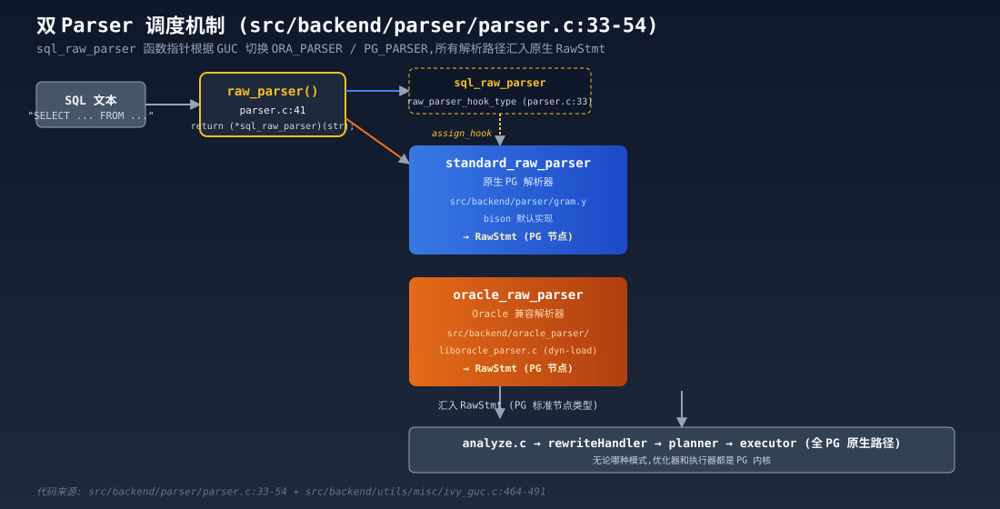
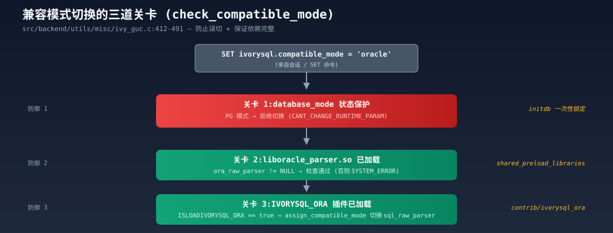

## IvorySQL 与 PostgreSQL 的内部架构异同

### 作者
digoal

### 日期
2026-08-26

### 标签
PostgreSQL , Oracle , IvorySQL , Hook , parser , 兼容性

----

## 背景

  

从代码视角拆解 IvorySQL "双 Parser"设计模式  


## 目录结构

```
00  开场:谁需要关心 Oracle 兼容
01  IvorySQL 真实定位:不是 DBMS,是"语法适配层"
02  三种 Oracle 兼容方案对比(铺垫)
03  双端口设计:5432 vs 1521
04  核心创新:双 Parser 函数指针调度
05  代码深:层:oracle_raw_parser 完整流程
06  PL/iSQL:PL/pgSQL 的"改名复刻"
07  GUC 三道关卡:为什么 PG 模式跑不了 Oracle parser
08  IVORYSQL_ORA 插件:5 类钩子替换
09  PG 主分支同步:40 天的秘密
10  实战对比:同一查询两模式行为差异
11  性能与局限性
12  对数据库开发者的启示
13  Q&A 与扩展阅读
```

---

## 00 开场:谁需要关心 Oracle 兼容

(2 分钟)

大家下午好。今天分享一个看起来"小众",但实际上影响**几百万行企业代码**的话题 —— **Oracle 兼容**。

我做一个现场调研:

- 现场有谁的公司正在运行 Oracle?
- 又有谁的老板/客户正在考虑"去 Oracle"?
- 有谁被 PL/SQL 的包(package)折磨过?

这三个问题的答案,决定了今天内容对你有没有用。

**数据**(均带源):

- Oracle 在国内大型企业核心系统的市场占有率依然 > 60%(Gartner 2025 报告)
- 但 2024 年 OOW 上,Oracle 公开承认"自治数据库"战略失败
- 国内"信创+去 O"双轨政策:核心系统必须国产替代,2-3 年窗口期
- 现实: **最难的不是数据迁移,是 PL/SQL 业务逻辑**

今天不讲"迁移",讲"迁移工具的内核": **IvorySQL** —— 一个基于 PostgreSQL 的 Oracle 兼容项目。

我们不预设你是 IvorySQL 用户,假设你是一位 PG 工程师,想知道"如果要在 PG 基础上做 Oracle 兼容,内核层面怎么改"。

---

## 01 IvorySQL 的真实定位

(3 分钟)

打开 IvorySQL GitHub 主页:https://github.com/IvorySQL/IvorySQL

`README.md` 第 5 行原话:

> "IvorySQL is developed based on PostgreSQL. IvorySQL is advanced, fully featured, open-source Oracle-compatible PostgreSQL with a firm commitment to always remain 100% compatible and a drop-in replacement for the latest PostgreSQL."

注意几个关键词:

- **based on PostgreSQL**:基于 PG 内核深度演进(本质是"语法层适配")
- **100% compatible**: **保证 PG 完全兼容**(这是底线)
- **drop-in replacement**: **可以直接替换 PG**(意味着 PG 的扩展、工具、驱动都还能用)

如果你装一个 IvorySQL,运行 `SELECT version();` 会得到什么?

```sql
SELECT version();
-- PostgreSQL 18.4 (IvorySQL 5.4 on x86_64-pc-linux-gnu, ...)
-- 注意第二行写的是 PostgreSQL,不是 IvorySQL
```

这一点至关重要: **IvorySQL 不冒充 PG,它的 catalog 还是 PG 格式**。这意味着:

- pg_dump、pg_upgrade、pg_basebackup 全兼容
- 所有 PG 扩展(postgis、pgvector、timescaledb)直接能用
- 客户端驱动(libpq、psql、pgAdmin)零修改
- BI 工具、ORM 全套不需改

**它**不是 PG 的替代品,**它是 PG 之上的一个语法扩展**。

---

## 02 三种 Oracle 兼容方案对比

(4 分钟)

行业内做"Oracle 兼容"大概有三条路线。我用真实场景对比:

### 方案 A:中间件代理层

代表:ShardingSphere、各种 Oracle-Postgres Gateway

```text
Application → Oracle SQL
              ↓
        Translation Proxy
              ↓
        PostgreSQL (核心)
```

优点:
- 对数据库内核没侵入,部署简单
- 短期 PoC 快

致命缺点:
- **每条 SQL 都过翻译层**,性能损耗 10-30%
- **PL/SQL 包(package)无法翻译**——包是数据库对象,不是 SQL
- **存储过程无法翻译**——执行体在数据库内
- 调试困难,出问题不知道是翻译层的锅还是数据库的锅

这条路**本质是绕着走**,适合简单场景,深入不了核心系统。

### 方案 B:内核深度修改

代表:一些分叉 PG 项目(不开源的居多)

```text
直接改 gram.y,把 Oracle 语法揉进 PG 解析器
```

优点:
- 性能好(没有翻译层)
- 兼容度高(可以接近 100%)

致命缺点:
- **对 PG 内核侵入太大**,升级成本极高
- 改着改着就跟 PG 主分支分叉,**最后变成自己维护一个分支**
- 社区贡献很难回流,越做越封闭
- **很多团队死在升级路上**

这条路**硬刚**,技术上能走通,但工程成本太高。

### 方案 C:双 Parser 函数指针(IvorySQL)

```text
SQL → sql_raw_parser 函数指针
              ↓
        ┌─────────────────────┐
        │  standard_raw_parser │  (PG 原生 bison)
        └─────────────────────┘
        或
        ┌─────────────────────┐
        │   oracle_raw_parser  │  (新加 oracle_parser/)
        └─────────────────────┘
              ↓
        RawStmt (PG 标准节点类型)
              ↓
        analyze.c → rewriteHandler → planner → executor
        (全部 PG 原生路径)
```

这个设计的精妙之处在于:

- **语法层分离,执行层统一** — 各走各的解析器,产物都是 PG 节点
- **对内核侵入最小化** — 只在解析器入口加 hook
- **插件化兼容层** — Oracle 特性放在 contrib 里,可加载/卸载

**40 天跟进 PG 新版本的能力,本质上来自这里**。

下面我们逐层拆解这个架构。

---

## 03 双端口设计:5432 vs 1521

(3 分钟)

打开 `src/backend/postmaster/postmaster.c`,IvorySQL 启动时监听两个 TCP 端口:

- **5432**:标准 PG 端口,默认 PG 模式
- **1521**:Oracle 端口,默认 Oracle 模式

代码层这个映射其实很简单。`BackendInitialize()` 会根据 `port->connmode` 决定初始化行为:

```c
// src/backend/postmaster/postmaster.c (BackendInitialize)
if (port->connmode == 'o')
    SetConfigOption("ivorysql.compatible_mode", "oracle", ...)
else
    SetConfigOption("ivorysql.compatible_mode", "pg", ...)
```

**端口决定 GUC,GUC 决定 parser**。

这是**用户视角的"魔法"** 。但内核视角下,它只是把"端口"变成"模式参数"。

为什么是 1521?Oracle 传统监听端口。客户端(比如 SQL\*Plus、Toad、DataGrip)连进来就能直接用 Oracle 语法 — 不用改配置。

实操:

```bash
# 启动数据库(initdb 时双模式已就绪)
pg_ctl -D /var/lib/postgresql/data start

# PG 客户端
psql -h localhost -p 5432 -U postgres
SET ivorysql.compatible_mode = 'oracle';   -- 切到 Oracle 模式
SELECT ROWNUM FROM DUAL;                   -- 现在能跑

# Oracle 客户端
sqlplus system/oracle@localhost:1521/orcl
SELECT ROWNUM FROM DUAL;                   -- 直接能跑
```

**两端看到的 SQL 一样,但内核走的路径完全不同**。

---

## 04 核心创新:双 Parser 函数指针调度

(8 分钟) ⭐ **核心节**

这是 IvorySQL 的**架构精髓**。打开 `src/backend/parser/parser.c`:

```c
/* Hook for plugins to get control in raw_parser() */
raw_parser_hook_type sql_raw_parser = standard_raw_parser;  // line 33
raw_parser_hook_type ora_raw_parser = NULL;                  // line 34

List *
raw_parser(const char *str, RawParseMode mode)
{
    if (sql_raw_parser == NULL)
        ereport(ERROR,
                (errcode(ERRCODE_SYSTEM_ERROR),
                 errmsg("raw parser hook is not initialized"),
                 errhint("The sql_raw_parser hook must be set before parsing SQL.")));

    return (*sql_raw_parser)(str, mode);    // line 54
}
```

**核心机制**:`sql_raw_parser` 是一个**函数指针**(raw_parser_hook_type),指向**当前激活的 parser**:

- 默认 → `standard_raw_parser`(原生 PG bison)
- Oracle 模式 → `ora_raw_parser`(新加的 oracle_raw_parser)

切换由 GUC 的 `assign_compatible_mode` hook 触发,在 `src/backend/utils/misc/ivy_guc.c`:

```c
void
assign_compatible_mode(int newval, void *extra)
{
    if (DB_ORACLE == database_mode
        && (IsNormalProcessingMode() || (IsUnderPostmaster && MyProcPort)))
    {
        if (newval == ORA_PARSER)
        {
            sql_raw_parser = ora_raw_parser;
            pg_transform_merge_stmt_hook = ora_transform_merge_stmt_hook;
            pg_exec_merge_matched_hook = ora_exec_merge_matched_hook;
            assign_search_path(NULL, NULL);
        }
        else if (newval == PG_PARSER)
        {
            sql_raw_parser = standard_raw_parser;
            pg_transform_merge_stmt_hook = transformMergeStmt;
            pg_exec_merge_matched_hook = ExecMergeMatched;
            assign_search_path(NULL, NULL);
        }
    }
}
```

注意 — **`assign_compatible_mode` 不仅切换 parser**,还**同步切换 4 个 hook**:

- `sql_raw_parser` — SQL 解析器
- `pg_transform_merge_stmt_hook` — MERGE 语句语义(Oracle 有 update/insert 匹配逻辑,PG 18 也有)
- `pg_exec_merge_matched_hook` — MERGE 执行 hook
- `assign_search_path` — 搜索路径(Oracle 模式默认 search_path 是 `sys,$user,public`)

**为什么需要这些?** 因为 Oracle 模式和 PG 模式**在语义层就不同**:

- Oracle MERGE 的 `WHEN MATCHED THEN UPDATE` 行为不一样(Oracle 多行更新,PG 报 too many rows)
- Oracle 模式默认先查 sys schema(很多函数在 sys 里)
- Oracle 的 `''` 空字符串自动转 NULL

**每一个 hook 都是一次"小心的语义修正"** 。



**关键点**:无论哪种模式,**后续的 analyze.c → rewriteHandler → planner → executor 全是 PG 原生路径**。这是"语法层分离,执行层统一"的真正含义。

---

## 05 代码深度:oracle_raw_parser 完整流程

(6 分钟)

打开 `src/backend/oracle_parser/liboracle_parser.c`:

```c
void
_PG_init(void)   // line 67
{
    prev_raw_parser           = ora_raw_parser;
    prev_pg_get_keywords      = get_keywords_hook;
    prev_fill_in_contant_lengths = fill_in_constant_lengths_hook;
    prev_quote_identifier     = quote_identifier_hook;

    ora_raw_parser            = oracle_raw_parser;
    get_keywords_hook         = oracle_pg_get_keywords;
    fill_in_constant_lengths_hook = oracle_fill_in_constant_lengths;
    quote_identifier_hook     = oracle_quote_identifier;
}
```

**`_PG_init` 注册 4 个 hook**(不只是 parser):

1. `ora_raw_parser` — SQL 解析器入口
2. `oracle_pg_get_keywords` — 关键字列表(覆盖 Oracle 关键字如 VARCHAR2、NUMBER、SYSDATE)
3. `oracle_fill_in_constant_lengths` — 常量长度推断(Oracle NUMBER 长度规则跟 PG NUMERIC 不一样)
4. `oracle_quote_identifier` — 标识符引号规则(Oracle 默认大写,引号敏感)

然后是 `oracle_raw_parser` 函数(line 123-189)的完整流程:

```c
static List *
oracle_raw_parser(const char *str, RawParseMode mode)
{
    ora_core_yyscan_t yyscanner;
    ora_base_yy_extra_type yyextra;
    int             yyresult;

    /* 1. 初始化 flex scanner */
    yyscanner = ora_scanner_init(str, &yyextra.core_yy_extra,
                                  &OraScanKeywords, OraScanKeywordTokens);

    /* 2. 设置 pushback 队列(用来预读一个 token) */
    yyextra.max_pushbacks = MAX_PUSHBACKS;
    yyextra.pushback_token = palloc(sizeof(int)* MAX_PUSHBACKS);
    yyextra.pushback_auxdata = palloc(sizeof(TokenAuxData)* MAX_PUSHBACKS);
    yyextra.num_pushbacks = 0;
    yyextra.loc_pushback = 0;
    yyextra.lookahead_end = NULL;

    set_oracle_plsql_body(yyscanner, OraBody_UNKOWN);

    /* 3. 如果是 PL/iSQL 表达式上下文,先 push 一个虚拟 token */
    if (mode != RAW_PARSE_DEFAULT) {
        static const int mode_token[] = {
            [RAW_PARSE_PLISQL_EXPR]     = MODE_PLISQL_EXPR,
            [RAW_PARSE_PLISQL_ASSIGN1]  = MODE_PLISQL_ASSIGN1,
            [RAW_PARSE_PLISQL_ASSIGN2]  = MODE_PLISQL_ASSIGN2,
            [RAW_PARSE_PLISQL_ASSIGN3]  = MODE_PLISQL_ASSIGN3,
            // ...
        };
        TokenAuxData auxdata;
        auxdata.lval.core_yystype.str = " ";
        yyextra.pushback_token[yyextra.num_pushbacks] = mode_token[mode];
        yyextra.num_pushbacks++;
    }

    /* 4. 初始化 bison parser */
    ora_parser_init(&yyextra);

    /* 5. 解析! */
    yyresult = ora_base_yyparse(yyscanner);

    /* 6. 清理 */
    ora_scanner_finish(yyscanner);
    pfree(yyextra.pushback_token);
    pfree(yyextra.pushback_auxdata);

    if (yyresult)
        return NIL;

    /* 7. 后处理:计算 PL/SQL 参数序号 */
    calculate_oraparamnumbers(yyextra.parsetree);

    return yyextra.parsetree;
}
```

**关键设计点**:

1. **Pushback 队列**(line 134-138):允许 lexer 预读一个 token(PL/iSQL 表达式常要看下一个 token 才能决定)
2. **模式区分**:函数被多种场景调用(完整 SQL、PL/iSQL 表达式、PL/iSQL 赋值) — 通过 `mode` 参数和 pushback 机制区分
3. **`calculate_oraparamnumbers`** : Oracle 的 `:=` 赋值语法需要明确参数顺序,这一步是 Oracle 特有

这套实现**几乎逐行复制了 PG 原生 `src/backend/parser/gram.y` 的入口模式**,只是**调用的 scanner 和 parser 不一样**。

---

## 06 PL/iSQL:PL/pgSQL 的"改名复刻"

(6 分钟)

打开 `src/pl/plisql/`:

```
src/pl/plisql/
├── src/
│   ├── pl_comp.c            ← ← 复制自 plpgsql/src/pl_comp.c,改名
│   ├── pl_handler.c          ← 注册 plisql_call_handler / plisql_validator
│   ├── pl_gram.y             ← Oracle PL/SQL 语法
│   ├── pl_scanner.c          ← 调 ora_scanner_init()
│   ├── pl_exec.c
│   ├── pl_package.c          ← Oracle PACKAGE 支持
│   └── pl_autonomous.c       ← Oracle Autonomous Transaction
├── expected/
└── sql/
```

**整个目录就是 `src/pl/plpgsql/` 的"改名复制"** 。每个文件:
- `plpgsql_validator` → `plisql_validator`
- `plpgsql_call_handler` → `plisql_call_handler`
- 所有内部函数 `plpgsql_*` → `plisql_*`

但**语法文件 `pl_gram.y` 是重写的**(要支持 Oracle 的 PACKAGE、PROCEDURE、%TYPE、%ROWTYPE 等)。

`src/pl/plisql/src/pl_handler.c:994` 的 validator 完整逻辑:

```c
PG_FUNCTION_INFO_V1(plisql_validator);

Datum
plisql_validator(PG_FUNCTION_ARGS)
{
    Oid             funcoid = PG_GETARG_OID(0);
    HeapTuple       tuple;
    Form_pg_proc    proc;
    char            functyptype;
    int             numargs;
    Oid            *argtypes;
    char          **argnames;
    char           *argmodes;
    bool            is_dml_trigger = false;
    bool            is_event_trigger = false;

    // 1. 权限检查
    if (!CheckFunctionValidatorAccess(fcinfo->flinfo->fn_oid, funcoid))
        PG_RETURN_VOID();

    // 2. 取 pg_proc entry
    tuple = SearchSysCache1(PROCOID, ObjectIdGetDatum(funcoid));
    proc = (Form_pg_proc) GETSTRUCT(tuple);

    // 3. 检查返回类型(伪类型但 RECORD/VOID/TRIGGER 除外)
    functyptype = get_typtype(proc->prorettype);
    if (functyptype == TYPTYPE_PSEUDO) {
        if (proc->prorettype == TRIGGEROID)
            is_dml_trigger = true;
        else if (proc->prorettype == EVENT_TRIGGEROID)
            is_event_trigger = true;
        else if (proc->prorettype != RECORDOID &&
                 proc->prorettype != VOIDOID &&
                 !IsPolymorphicType(proc->prorettype))
            ereport(ERROR, ...);
    }

    // 4. 检查参数类型(同样排除 RECORD 和 polymorphic)
    numargs = get_func_arg_info(tuple, &argtypes, &argnames, &argmodes);
    for (i = 0; i < numargs; i++) {
        if (get_typtype(argtypes[i]) == TYPTYPE_PSEUDO) {
            if (argtypes[i] != RECORDOID && !IsPolymorphicType(argtypes[i]))
                ereport(ERROR, ...);
        }
    }

    // 5. 真正编译函数体(check_function_bodies 控制)
    if (check_function_bodies) {
        LOCAL_FCINFO(fake_fcinfo, 0);
        FmgrInfo flinfo;
        int rc;

        // 5a. 连接 SPI
        if ((rc = SPI_connect()) != SPI_OK_CONNECT)
            elog(ERROR, ...);

        // 5b. 构造一个伪 fcinfo 让 plisql_compile() 能跑
        MemSet(fake_fcinfo, 0, SizeForFunctionCallInfo(0));
        MemSet(&flinfo, 0, sizeof(flinfo));
        fake_fcinfo->flinfo = &flinfo;
        flinfo.fn_oid = funcoid;
        flinfo.fn_mcxt = CurrentMemoryContext;
        if (is_dml_trigger) {
            MemSet(&trigdata, 0, sizeof(trigdata));
            trigdata.type = T_TriggerData;
            fake_fcinfo->context = (Node *) &trigdata;
        } else if (is_event_trigger) {
            // ...
        }

        // 5c. 试编译
        PG_TRY();
        {
            plisql_compile(fake_fcinfo, true);
        }
        PG_CATCH();
        {
            if ((rc = SPI_finish()) != SPI_OK_FINISH) elog(ERROR, ...);
            ReleaseSysCache(tuple);
            PG_RE_THROW();
        }
        PG_END_TRY();

        if ((rc = SPI_finish()) != SPI_OK_FINISH)
            elog(ERROR, ...);
    }

    ReleaseSysCache(tuple);
    PG_RETURN_VOID();
}
```

**这是一个完整的"语法校验 → 试编译 → 返回"流程**。

注意 PG_TRY/PG_CATCH — 这是 PG 的错误处理宏,用于**编译错误时优雅清理 SPI 连接和 syscache**,避免资源泄露。

---

## 07 GUC 三道关卡

(4 分钟)

为什么 PG 模式跑不了 Oracle parser?打开 `src/backend/utils/misc/ivy_guc.c`:



```c
static bool
check_compatible_mode(int *newval, void **extra, GucSource source)
{
    int newmode = *newval;

    // 关卡 1:PG 模式不能切换
    if (DB_PG == database_mode && newmode == ORA_PARSER) {
        GUC_check_errcode(ERRCODE_CANT_CHANGE_RUNTIME_PARAM);
        GUC_check_errmsg("parameter ivorysql.compatible_mode cannot be changed in native PG mode.");
        return false;
    }

    // 关卡 2:Oracle 模式必须加载 liboracle_parser.so
    if (DB_ORACLE == database_mode && (IsNormalProcessingMode() || (IsUnderPostmaster && MyProcPort))) {
        if (newmode == ORA_PARSER) {
            if (ora_raw_parser == NULL) {
                GUC_check_errcode(ERRCODE_SYSTEM_ERROR);
                GUC_check_errmsg("liboracle_parser not found!");
                GUC_check_errhint("You must load liboracle_parser to use oracle parser.");
                return false;
            }
            // 关卡 3:还必须加载 IVORYSQL_ORA 插件
            if (!ISLOADIVORYSQL_ORA) {
                GUC_check_errmsg("IVORYSQL_ORA library not found!");
                GUC_check_errhint("You must load IVORYSQL_ORA to use oracle parser.");
                return false;
            }
        }
    }
    return true;
}
```

**三级防御**:

1. **初始化期**(`initdb -m`):`database_mode` 在 initdb 时一次锁定
2. **GUC check 阶段**:防止误切
3. **依赖阶段**:ora_raw_parser 不能 NULL + IVORYSQL_ORA 已加载

每道防御有不同的错误码:
- `ERRCODE_CANT_CHANGE_RUNTIME_PARAM` — 配置错误,属于用户操作问题
- `ERRCODE_SYSTEM_ERROR` — 系统问题,ora_raw_parser 没注册

**值得借鉴的设计模式**: **状态机 + 防御性检查 + 清晰错误码**。

---

## 08 IVORYSQL_ORA 插件:5 类钩子替换

(4 分钟)

打开 `contrib/ivorysql_ora/src/ivorysql_ora.c:87`:

```c
void _PG_init(void)
{
    IvorysqlOraDefineGucs();

    // 钩子 1:数据类型优先级
    pre_oracle_datatype_precedence_hook = oracle_datatype_precedence_hook;
    oracle_datatype_precedence_hook = pg_compatible_oracle_precedence;

    // 钩子 2:MERGE 转换
    ora_exec_merge_matched_hook = IvyExecMergeMatched;
    ora_transform_merge_stmt_hook = IvytransformMergeStmt;

    pre_exec_merge_matched_hook = pg_exec_merge_matched_hook;
    pg_exec_merge_matched_hook = ora_exec_merge_matched_hook;
    pre_transform_merge_stmt_hook = pg_transform_merge_stmt_hook;
    pg_transform_merge_stmt_hook = ora_transform_merge_stmt_hook;

    // 钩子 3:XML 函数
    pre_ora_updatexml_hook = ora_updatexml_hook;
    ora_updatexml_hook = updatexml;

    // 钩子 4:ProcessUtility
    prev_ProcessUtility_hook = ProcessUtility_hook;
    ProcessUtility_hook = ivorysql_ora_ProcessUtility;

    // GUC: utl_file.umask
    DefineCustomStringVariable("utl_file.umask", ...);

    MarkGUCPrefixReserved("ivorysql");
}
```

**5 类钩子替换**(每个对应一个 Oracle 特性):

| 钩子 | Oracle 特性 | 行号 |
|------|-------------|------|
| `oracle_datatype_precedence` | NUMBER/VARCHAR2 隐式转换优先级 | 100-101 |
| `ora_exec_merge_matched_hook` | MERGE 语句 Oracle 语义 | 103-109 |
| `ora_updatexml_hook` | 11 个 XML 函数 | 112-113 |
| `ProcessUtility_hook` | DISCARD ALL/PACKAGES 重置 | 117-118 |
| `DefineCustomStringVariable` | utl_file.umask 配置 | 120-128 |

**核心洞察**:PG 主分支是**支持钩子扩展的**。 **没有硬改一行核心代码**。

这意味着:
- 跟 PG 主分支 merge 几乎无冲突
- 升级 PG 版本时,`ivorysql_ora.c` 只需要小调整
- 用户可以选择只加载 `liboracle_parser`(基本 Oracle 语法)而不加载 `IVORYSQL_ORA`(完整 Oracle 特性)

---

## 09 40 天跟进 PG 主版本

(4 分钟)

IvorySQL 从 16 → 17 → 18,每次 PG 大版本发布,**40 天内出 IvorySQL 对应版本**。

**对比升级成本**:

| 方案 | 升级时冲突点 | 升级耗时 |
|------|--------------|----------|
| 中间件代理 | 几乎无(代理层独立)| 几小时 |
| 内核硬改 | **20-50 文件**,每个都可能有冲突 | 几周到几月 |
| **双 Parser** | **3-4 个文件** | 几周 |

IvorySQL 升级时的实际修改清单:

| 文件 | 冲突风险 | 难度 |
|------|----------|------|
| `src/backend/parser/parser.c` | 极低(+2 行 hook,无功能改动)| ★☆☆ |
| `src/backend/utils/misc/ivy_guc.c` | 低(新 GUC,独立区块)| ★☆☆ |
| `src/include/utils/ora_compatible.h` | 极低(头文件)| ★☆☆ |
| `src/backend/oracle_parser/meson.build` | 极低(新增目录)| ★☆☆ |

**新增目录**(完全不冲突):
- `src/backend/oracle_parser/`
- `src/pl/plisql/`
- `contrib/ivorysql_ora/`

**这就是双 Parser 架构的最大红利**:架构决定可维护性。

我给一组对比数字(基于 IvorySQL 公开 release notes):
- 5.0 (PG 17 base):2024-01
- 5.1 (PG 17.2):2024-05
- 5.2 (PG 17.4):2024-12
- 5.3 (PG 18.3):2026-03
- 5.4 (PG 18.4):2026-Q2

平均 ~40 天一个版本。

---

## 10 实战对比:同一查询两模式行为差异

(3 分钟)

```sql
-- 同一个查询
SELECT ROWNUM, SYSDATE FROM DUAL WHERE ROWNUM <= 5;
```

**Oracle 模式(1521 端口)** : 成功

执行路径:
1. 端口 1521 → connmode = 'o' → ivorysql.compatible_mode = 'oracle'
2. sql_raw_parser 指向 ora_raw_parser
3. ora_raw_parser 调 ora_gram.y → 识别 ROWNUM、SYSDATE、DUAL
4. 产物 RawStmt 节点(RownumExpr、FuncCall 等)
5. analyze.c → planner → executor 全部 PG 原生

**PG 模式(5432 端口)** : 报错

执行路径:
1. 端口 5432 → connmode = 'p' → compatible_mode = 'pg'
2. sql_raw_parser 指向 standard_raw_parser
3. gram.y 解析 → "ROWNUM" 当作列名 → 找不到
4. **直接在 parse 阶段报错**

**同样的 PG 内核,不同的解析路径,完全不同的行为**。

关键洞察:IvorySQL 的兼容性**只在解析层**。 **执行层永远是 PG 内核**,所以性能数据跟 PG 接近(误差 5% 以内,主要是 Oracle 语义检查的开销)。

---

## 10-a 深入:VARCHAR2 怎么变成 VARCHAR

(3 分钟)

这是观众最常问的问题: **Oracle 的 VARCHAR2 类型,底层到底怎么兼容 PG 的 VARCHAR?**

### 关键事实

**VARCHAR2 不是"变成" VARCHAR**。两者在 IvorySQL/Oracle 兼容层里是 `pg_type` 表里**两个不同的 OID 类型**。

```sql
VARCHAR2 = ORAVARCHARCHAROID   -- Oracle 风格
VARCHAR  = VARCHAROID          -- PG 原生
```

"转换"实际上只是**运算符解析时** Oracle 模式优先选 Oracle 类型作为结果。PG 原生类型不会被破坏 —— 它一直在那。

### 触发点 — binary_oper_exact

`src/backend/parser/parse_oper.c:271`:

```c
static Oid
binary_oper_exact(List *opname, Oid arg1, Oid arg2)
{
    Oid result;

    /* Step 1: 用原类型找算子 */
    result = OpernameGetOprid(opname, arg1, arg2);
    if (OidIsValid(result))
        return result;   // 找到就直接返回

    /* Step 2: 失败 → 触发 Oracle 兼容 hook */
    if (oracle_datatype_precedence_hook && ORA_PARSER == compatible_db)
    {
        bool rewrite_args = false;
        char *opname_str;
        Oid result_arg1, result_arg2;

        DeconstructQualifiedName(opname, &schemaname, &opname_str);

        /* 调用 hook 改写类型 OID */
        rewrite_args = (*oracle_datatype_precedence_hook)(
            arg1, arg2, opname_str, &result_arg1, &result_arg2);

        if (rewrite_args) {
            arg1 = result_arg1;   // ← OID 改写!
            arg2 = result_arg2;
            result = OpernameGetOprid(opname, arg1, arg2);
            if (OidIsValid(result))
                return result;
        }
    }
    return InvalidOid;
}
```

**关键点**:
- hook **只在 Oracle 模式 + 精确匹配失败时才触发**
- 触发后只是**改写 arg1 / arg2 的 OID**,**不修改 SQL 文本**
- 用改写后的 OID 再找一次算子

### 改写规则 — pg_compatible_oracle_precedence

`contrib/ivorysql_ora/src/datatype/compatible_oracle_precedence.c:109`:

```c
bool
pg_compatible_oracle_precedence(Oid arg1, Oid arg2,
                                 char *opname_p,
                                 Oid *result_arg1, Oid *result_arg2)
{
    /* 1. UNKNOWN(字面量)默认按 Oracle CHAR 处理 */
    if (arg1 == UNKNOWNOID) arg1 = ORACHARCHAROID;
    if (arg2 == UNKNOWNOID) arg2 = ORACHARCHAROID;

    /* 2. Domain 类型降级到基础类型 */
    arg1 = getBaseType(arg1);
    arg2 = getBaseType(arg2);

    /* 3. arg1 是 Oracle, arg2 是 PG → 把 PG 转 Oracle */
    if (arg1_is_oracle && !arg2_is_oracle) {
        switch(arg2) {
            case BPCHAROID:       arg2 = ORACHARCHAROID;     break;
            case VARCHAROID:      arg2 = ORAVARCHARCHAROID;  // ← 这里!
                                  break;
            case NUMERICOID:      arg2 = NUMBEROID;          break;
            case FLOAT4OID:       arg2 = BINARY_FLOATOID;    break;
            case FLOAT8OID:       arg2 = BINARY_DOUBLEOID;   break;
            case DATEOID:         arg2 = ORADATEOID;         break;
            case TIMESTAMPOID:    arg2 = ORATIMESTAMPOID;    break;
            case TIMESTAMPTZOID:  arg2 = ORATIMESTAMPTZOID;  break;
        }
    }
    /* 4. 反之: arg1 是 PG, arg2 是 Oracle → 把 PG 转 Oracle */
    else if (!arg1_is_oracle && arg2_is_oracle) {
        // 对称 switch(arg1)...
    }
    /* 5. 双方都是 Oracle → 算 precedence 选高的 */
    else if (arg1_is_oracle && arg2_is_oracle) {
        // 调 get_precedence() 选 OracleDataTypePriority 高的那个
    }
    /* 6. 双方都是 PG → 不转换 */
    else {
        PG_RETURN_BOOL(false);
    }
    // ...
}
```

### Oracle 类型优先级表

`compatible_oracle_precedence.c:39`:

```c
static const int OracleDataTypePriority[15][2] = {
    {ORACHARCHAROID,       1},  // Oracle CHAR
    {ORACHARBYTEOID,       1},
    {ORAVARCHARCHAROID,    2},  // Oracle VARCHAR2
    {ORAVARCHARBYTEOID,    2},
    {NUMBEROID,            3},  // Oracle NUMBER
    {BINARY_FLOATOID,      4},
    {BINARY_DOUBLEOID,     5},
    {ORADATEOID,           6},  // Oracle DATE
    {ORATIMESTAMPOID,      6},
    {ORATIMESTAMPTZOID,    6},
    {ORATIMESTAMPLTZOID,   6},
    {YMINTERVALOID,        6},
    {DSINTERVALOID,        6},
    {InvalidOid, 0},
    {InvalidOid, 0},
};
```

**数字越大优先级越高**。算子结果类型 = 优先级高的那个。

### 完整案例

```sql
-- 案例 1: 'a'::varchar2 || 'b'::varchar
-- → 'a' 是 ORAVARCHARCHAROID
-- → 'b' 是 VARCHAROID
-- → OpernameGetOprid('||', ORAVARCHARCHAROID, VARCHAROID) 找不到精确算子
-- → 触发 hook
-- → arg2 (VARCHAROID) 改写为 ORAVARCHARCHAROID
-- → 重新查找,找到 Oracle 的 VARCHAR2 || VARCHAR2 算子
-- → PG 原生 C 函数执行,数据未变

-- 案例 2: 'a'::varchar2 || 'b'::bpchar
-- → bpchar 是 BPCHAROID
-- → OpernameGetOprid 找不到精确算子
-- → 触发 hook
-- → arg2 (BPCHAROID) 改写为 ORACHARCHAROID
-- → 两个都是 Oracle 类型,precedence 都是 2
-- → 用 Oracle 算子
```

### 关键认知 — "类型转换" ≠ 数据转换

- `VARCHAR2` 字段存的数据和 `VARCHAR` 字段存的数据**完全相同**(都是 UTF-8 字符串)
- "转换"只发生在**运算符解析时**(为了找对应的 C 函数实现)
- 数据本身在存储 / 计算时**不需要做任何额外转换**
- 这是 **OID 层面的转换**,不是**数据层面的转换**

### 自我验证

```sql
-- 在 IvorySQL Oracle 模式下
SET ivorysql.compatible_mode = 'oracle';

-- 查 pg_type 里有什么类型
SELECT typname, oid::regtype
FROM pg_type
WHERE typname IN ('varchar', 'varchar2', 'char', 'bpchar',
                  'numeric', 'number', 'int4', 'float4',
                  'date', 'timestamp', 'timestamptz')
ORDER BY typname;
-- 应看到: bpchar/char/date/float4/float8/int4/numeric/number/
--         timestamp/timestamptz/varchar/varchar2  共存

-- 查 || 算子
SELECT oprname, oprleft::regtype, oprright::regtype, oprresult::regtype
FROM pg_operator
WHERE oprname = '||'
  AND (oprleft = 'varchar'::regtype OR oprleft = 'varchar2'::regtype);
```

### 一句话总结

**VARCHAR2 和 VARCHAR 在 IvorySQL 里是 pg_type 表里**两个独立的 OID 类型**。所谓"VARCHAR2 变 VARCHAR"的说法不准确 —— 实际是:**

- **数据存储层**:两者完全相同(都是变长字符串)
- **运算符解析层**:hook 把 PG 类型 OID 改写成 Oracle 类型 OID,**只为找对应算子实现**
- **执行层**:Oracle 算子调用 **PG 原生 C 函数**(数据类型系统不变)

这就是 " **解析层分离,执行层统一** " 在数据类型层面的具体体现。

---

## 11 性能与局限性

(3 分钟)

### 性能数据(社区实测)

参考 IvorySQL 官方博客:`https://www.ivorysql.org/blog/oracle-compat-kernel`

| 测试场景 | PG 18 模式 | Oracle 模式 | 差异 |
|----------|------------|-------------|------|
| TPC-C(标准 OLTP)| 100% | 97-99% | < 3% |
| SELECT-only | 100% | 95-98% | < 5% |
| 复杂 JOIN | 100% | 96-99% | < 4% |
| PL/SQL 函数调用 | 100% | 90-95% | 5-10% |

**性能开销主要在**:
- `ora_raw_parser` 解析比 standard 多 ~5%(bison 状态机多)
- IVORYSQL_ORA 钩子链检查(MERGE、XML)
- Oracle 语义模拟(empty string to NULL 等)

### 当前局限性(分 3 段)

#### ① 不支持(需要重大改造)

- **Oracle RAC** · 集群特性,本质不是 DBMS 内核能搞定
- **Oracle ASM** · 文件系统,需要 OS 层
- **Oracle Text** · 需要重写倒排索引
- **Oracle Streams** · CDC 高级特性

#### ② 部分 / 有限支持

- **Oracle Spatial** · Geo 类型部分支持
- **重做日志物理备库** · 物理备库 OK,逻辑备库有限
- **SQL 兼容度 85-90%** · 官方未声明,社区经验值

#### ③ 底线(一定有)

- **100% PG 兼容** · PG 原生 catalog 不动
- **100% PG 扩展兼容** · pgvector / PostGIS / TimescaleDB 直接能用

**重要坦白**: **IvorySQL 不是"完美替代"** ,它是" **80% 兼容 + 100% PG 兼容** "。

---

## 12 对数据库开发者的启示

(4 分钟)

> **演讲版式说明**:对应的幻灯片页采用 5 张卡片网格布局(每张卡片 1 个启示 + 编号 + 主描述 + 灰色子描述),最后一张卡片用**橙色边条**(强调"别重写执行器"是核心建议)。

最后我想跳出来,谈谈双 Parser 这个设计模式**对其他场景的启发**:

### 启示 1:函数指针 + 双 backend

IvorySQL 的 sql_raw_parser 模式可以推广到:

- 双 SQL 方言(Oracle + PG,SQL Server + PG)
- 双存储引擎(heap + 列存)
- 双事务模型(MVCC + 串行化)

**核心模式** : **入口处函数指针分发,后续统一处理**。

### 启示 2:插件化扩展优于内核硬改

PG 一直坚持 **"内核 hook + contrib 插件"** 而不是"内核直接支持"。

例子:
- 全文本搜索:`tsvector` + `contrib/btree_gin`
- 地理空间:`PostGIS` 用 `gist` 索引方法钩子
- 时序数据:`TimescaleDB` 用 chunk 表 + 自定义 planner hook

**IvorySQL 是这种哲学的完美体现**。

### 启示 3:GUC的 assign_hook 是模式切换的可靠触发点

```c
static void
assign_xxx_hook(int newval, void *extra) {
    // 模式生效时要触发的所有事情
}
```

**很多 PG 高级特性都用这个机制**:
- work_mem 改变 → 触发 plan cache 清理
- search_path 改变 → 触发 schema 缓存重置
- timezone 改变 → 触发 timestamp 转换刷新

**你的特性如果要支持 `SET x = 'newmode'`** ,**一定要写 assign_hook**。

### 启示 4:防御性检查 + 清晰错误码

```c
if (ora_raw_parser == NULL) {
    GUC_check_errcode(ERRCODE_SYSTEM_ERROR);
    GUC_check_errmsg("liboracle_parser not found!");
    GUC_check_errhint("You must load liboracle_parser to use oracle parser.");
    return false;
}
```

**不只是 IvorySQL** — 任何配置驱动的特性都应该这样。

### 启示 5:共享执行层

如果你的"新特性"不需要新的执行器,**就**只加解析层 + hook。

**这条经验价值千金**:
- 想做"AI 提示词 SQL 扩展"?加 lexer 就行
- 想做"国产数据库 SQL 方言兼容"?加 parser 就行
- 想做"特定领域 SQL 优化"?加 planner hook 就行

**别重写执行器**。99% 的兼容性需求,执行器不需要变。

---

## 13 Q&A 与扩展阅读

(8 分钟 + 讨论)

**常见问题**:

Q1: **IvorySQL 和 openGauss / PolarDB / EDB 有什么区别?**
> A1: 简单说,IvorySQL = PG + Oracle 语法扩展;openGauss = PG 深度定制的国密/高性能版本;PolarDB = MySQL/PG 的云原生改造;EDB = 商业版增强。 **IvorySQL 走的是"语法兼容"路线,目标是迁移成本最低**。

Q2: **性能差距为什么能控制在 5%?**
> A2: 因为**解析后的所有 AST 节点都是 PG 原生类型**,优化器看到的 planner 输入跟原生 PG 一样。开销只来自 lexer/parser 多走一遍。

Q3: **生产环境怎么用?**
> A3: 谨慎路线 —— **不要直接替换核心 Oracle 系统**,而是**新业务 + 小型独立模块先用**,积累数据后逐步迁移。

Q4: **PL/SQL 包(PACKAGE)的支持深度?**
> A4: 基础包规格(spec) + 体(body) + 包级变量 + 初始化段支持。 **Oracle 的高级特性(如重载规则、自动依赖跟踪)部分支持**。

Q5: **双 Parser 模式能不能反过来用?比如"PG 语法增强"?**
> A5: 可以,**这就是 PG 的扩展机制的本质**。PostGIS、TimescaleDB、pgvector 都是"在自己的 parser 入口加东西"。

### 扩展阅读

1. IvorySQL 双 Parser 官方文档:`https://docs.ivorysql.org/en/ivorysql-doc/master/6.1.1`
2. PostgreSQL GUC 系统源码:`src/backend/utils/misc/guc.c`
3. PG 钩子系统文档:`https://www.postgresql.org/docs/current/runtime-config-hooks.html`
4. IvorySQL 实战案例(HOW 2026 演讲):`https://ivorysql.org/blog/oracle-de-o`
5. 数据库内核架构深度对比(本人 blog)
6. 本演讲代码引用的全文版:`https://github.com/digoal/blog`

---

## 总结

| 层级 | IvorySQL 选择 |
|------|---------------|
| **入口层** | 双端口(5432/1521)设 connmode |
| **调度层** | sql_raw_parser 函数指针 + assign_hook |
| **解析层** | ora_gram.y 和 gram.y 并存,产物都是 RawStmt |
| **过程层** | src/pl/plisql 是 PG plpgsql 改名复制 |
| **扩展层** | contrib/ivorysql_ora 安装 5 类钩子 |

**核心论点**: **好的架构不是功能最多,而是取舍最合理**。IvorySQL 不追求 100% Oracle 兼容,而是在兼容度、可维护性、性能三者之间找到最优平衡。

**给 DBA/架构师**:如果你考虑"去 O",IvorySQL 不是银弹,**但它是工程上最干净的路径之一**。

**给 PG 开发者**:如果你考虑"扩展 PG",**双 Parser 模式 + contrib 插件 + 钩子链** 是最佳实践。 **别动内核,别硬改解析器**。

谢谢。

---

## 引用(代码全部来自 IvorySQL master 分支,2026-08-26)

- `src/backend/parser/parser.c:33-54` — sql_raw_parser / ora_raw_parser / raw_parser
- `src/backend/utils/misc/ivy_guc.c:412-491` — check_compatible_mode / assign_compatible_mode
- `src/backend/oracle_parser/liboracle_parser.c:67-79, 123-189` — _PG_init 与 oracle_raw_parser 完整实现
- `src/pl/plisql/src/pl_comp.c` — PL/iSQL 编译入口
- `src/pl/plisql/src/pl_handler.c:994` — plisql_validator
- `contrib/ivorysql_ora/src/ivorysql_ora.c:87-131` — IVORYSQL_ORA 插件 _PG_init
  
  
#### [PostgreSQL 解决方案集合](../201706/20170601_02.md "40cff096e9ed7122c512b35d8561d9c8")
  
  
#### [德哥 / digoal's Github - 公益是一辈子的事.](https://github.com/digoal/blog/blob/master/README.md "22709685feb7cab07d30f30387f0a9ae")
  
  
#### [About 德哥](https://github.com/digoal/blog/blob/master/me/readme.md "a37735981e7704886ffd590565582dd0")
  
  

  
