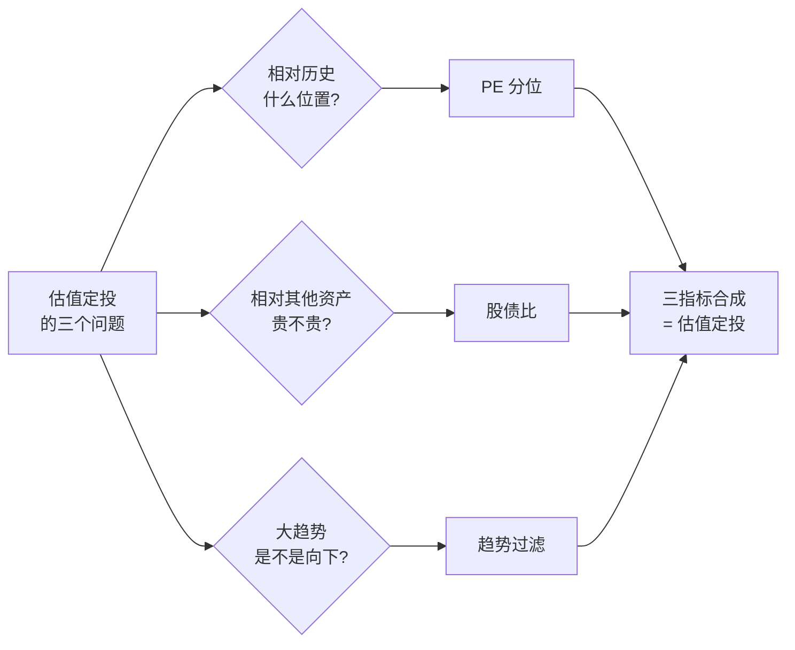
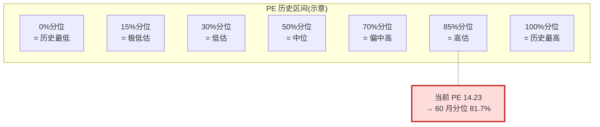
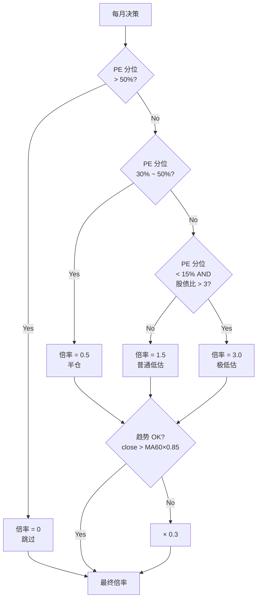

## 估值法定投原理

### 作者
digoal

### 日期
2026-08-27

### 标签
估值法 , 定投 , 基金 

----

## 背景
  

> 写给懂逻辑但不玩股票的朋友。

估值法定投原理参考源头: 

https://weixin.qq.com/sph/AW7a7BjTcy

https://www.bilibili.com/video/BV15WbB6GEaH/

https://mp.weixin.qq.com/s/1T1OLx4gcmt3_rOim-KOeg


-----

定投标的选择: 易方达(或其他公司)沪深 300 ETF联接A , 不要买主动型. 

定投策略选择: 估值法(低估时吸纳筹码, 中等或高估时不买)

策略黑盒风险: 估值算法、买入门槛、买入策略不透明

什么时候开始定投: 低于过去N年(跨越2个熊牛周期)30%估值时, 吸纳筹码( <15% 3倍吸纳, <30% 1.5倍吸纳, 30%~50% 0.5倍吸纳, 假设一周定投1000为1倍 ). 可以写个 hermes cron 每工作日给你推送, 然后你自己判断是否买入, 或者你相信售卖平台的估值法黑盒定投策略, 直接买.
- 实际情况可能更复杂, 这里只说了一个, 还有两个分别是相对其他资产(长期国债)是否被低估, 以及当前是否处于下降通道中(现在虽然低, 但是还会更低). 

什么时候卖: 高估就卖(高于过去N年(跨越2个熊牛周期)70%估值时)

平台: 支付宝APP,基金. 或银行 APP 


## 一、问题:为什么大多数定投其实是赌命

每月发工资的那天,自动扣 1000 块买沪深300。

听起来很理性:不择时、不追涨杀跌、长期主义。巴菲特都说了嘛。

但你冷静想一下 —— 2015 年 6 月高位定投,和 2019 年 1 月低位定投,虽然每月扣的钱一样,买到的份额却差了三倍。前者套了三年才解套,后者一年翻倍。

"机械定投"的本质,是默认未来不会比现在更贵。 这个假设在单边牛市里成立,在震荡市里就翻车。

2018 年那波阴跌,多少人咬着牙扣了 12 个月,看着账户从赚 20% 跌到亏 10%。坚持到底是对的,但你本来可以少亏一半 —— 如果你能识别出"现在明显是高位"。

这就是"估值定投"的出发点。

## 二、核心思想:便宜多买,贵的不买 —— 说起来像废话

估值定投的逻辑用大白话说就一句:当市场便宜时多买,贵时少买甚至不买。

听起来像废话对吧?问题不是"该不该便宜多买",而是 "怎么知道现在便宜还是贵" 。

三种主流判断方法:



下面逐一拆解,每个都用"它想回答什么问题 + 怎么算 + 陷阱在哪"三段式讲透。

## 三、PE 分位:你在历史里站多高

PE(市盈率) 是公司市值除以年盈利。PE-TTM 是用最近 12 个月滚动盈利算的,比静态 PE 更及时。

PE 越低,意味着"花同样的钱能买到更多盈利",理论上越便宜。但 PE 有个坑:它会被动抬升或压低,公司盈利大幅波动时(疫情、政策周期),PE 看起来低其实是被动虚高。所以光看 PE 绝对值不靠谱。

靠谱的方法是看分位:你现在在历史上是什么位置。



分位的算法:

1. 拿过去 N 年(通常 5 年)沪深300的月度 PE
2. 把当前 PE 放进去从小到大排
3. 你落在 30% 分位,意味着历史上只有 30% 的时间比你便宜

直觉:这就像体检报告里的"在同龄人中身高排名"。170cm 在小学生里算高,在 NBA 球员里算矮。绝对数不重要,相对位置才重要。

沪深300 目前(2026-08)的 PE 14.23 倍,放在过去 5 年里属于前 18% 贵的位置。直觉告诉你:这时不该买。

但 PE 分位有个致命陷阱:它只看历史,不告诉未来。2023 年初 PE 看着只有 30% 分位,你以为便宜,结果市场又跌了一波,因为那时候盈利在下修 —— PE 看着低其实是假低估。所以你还需要第二把尺子。

## 四、股债比:不跟债券比,你怎么知道自己贵

PE 分位告诉你"在股市历史上贵不贵",但没回答"相对其他资产,股市值不值得投"。

股债比 就是回答这个问题的指标。公式很简单:

```
股债比 = (1 / PE) / 国债收益率
         = 股票盈利收益率 / 国债收益率
```

分子是"投资股市能拿到的隐含回报率",分母是无风险利率。比值越高,股市相对债券越有吸引力。

历史经验值:

| 股债比 | 含义 |
|---|---|
| > 3.0 | 股市极其便宜,大胆买 |
| 2.0 ~ 3.0 | 股市便宜或合理,可以买 |
| 1.0 ~ 2.0 | 股市偏贵,谨慎 |
| < 1.0 | 股市比债券还贵,撤离 |

直觉:这就像两套房对比 —— 一套年租回报 5%,一套只有 2%,你要选 5% 那个。股票就是那套年租回报率更高的"房"。

沪深300 当前的股债比 = (1/14.23) / 1.72% ≈ 4.09,看起来不低。但 PE 分位也是 81.7%。两个指标没有共振 —— 一个说"绝对不便宜",一个说"相对债券还行"。

为什么? 因为国债收益率也在历史低位(1.72%)。当无风险利率极低时,几乎任何风险资产看起来都不贵。这时候你更要警惕:PE 分位的权重应该更高。

股债比也有陷阱:分子分母都是波动量,指标会震荡得很厉害。单看一个月没意义,得看趋势。

## 五、趋势过滤:为什么不能接飞刀

上面两个指标都是"估值"的视角,但它们解决不了"现在是不是该买"的所有问题。

想象 2012-2014 年的 A 股:PE 看着低,股债比看着高,但指数阴跌了两年。如果你根据"便宜就买",连续 24 个月被套,虽然最后解套了,但心理上很难坚持。

更糟糕的是 2022 年的阴跌段:PE 分位跌破 30%,你说"低估,买买买",结果又跌了 20%。

"低估"不等于"该买"。 低估可以更低估。

趋势过滤就是解决这个问题的:看一眼价格的中长期方向,如果整体还在向下走,再便宜也要克制。

简单粗暴但有效的算法:

```
如果当前价格 < 过去 60 个月的均价 × 85%
  → 趋势恶化,扣款额打折到 30%
```

这条规则的意思是:市场可能进入熊市,你别 full position,留点子弹。85% 这个数字是经验值 —— 留得越宽,扣款越保守;留得越窄,越接近"纯估值驱动"。

沪深300 当前点位 6799,60 月均线 5769。当前价是均价的 117.8% ,远高于 85% 阈值,趋势判断 OK。所以趋势这块不扣分,问题完全在估值上。



这就是完整的 v4 算法。

## 六、回测结论:12 年真实数据告诉你什么

光讲理论是耍流氓。用真实数据回测 2014-2026 年(152 个月),对比四种策略:

| 策略 | 累计投入 | 终值 | 年化 | 买入月数 |
|---|---|---|---|---|
| 普通定投 | 152,000 | 220,452 | 2.98% | 152/152 |
| 支付宝风(PE<30%才买) | 89,000 | 147,660 | 4.08% | 89/152 |
| 三指标简化(中性 0.5x) | 114,000 | 181,009 | 3.72% | 110/152 |
| v4 三指标+趋势(本文) | 134,200 | 207,698 | 3.51% | 111/152 |

同期沪深300全收益指数 2602 → 6799,涨幅 161%。

几个反常识的观察:

第一,支付宝风的年化 4.08% 看着最高,但代价是 41% 时间空仓,绝对收益 5.9 万,远低于 v4 的 7.5 万。年化是给营销看的,总收益才是真的。

第二,普通定投的终值 22 万最高,但它花了 15.2 万本金;v4 只花了 13.4 万,终值 20.8 万。少花 1.8 万,少赚 1.2 万,资金效率反而更高。

第三,最有启发的是分段回测:

| 时段 | 行情 | 普通定投年化 | v4 年化 |
|---|---|---|---|
| 2019-2020 | 慢牛 | 14.57% | 20.37% |
| 2021-2023 | 阴跌 | -5.90% | -2.84% |
| 2024-2026 | 反弹 | 6.33% | 12.38% |

v4 在三种完全不同行情下都跑赢普通定投。这就是估值信号的真实价值 —— 不是因为它在牛市赚更多,而是因为它在熊市少亏、反弹期多赚。

第四,有个让人警觉的事实:最近 12 个月(2025-09 ~ 2026-08),v4 的决策是全部 0 倍,跳过不投。沪深300 当前 PE 分位 81.7%,过去 5 年没这么贵过。按这套算法,你过去一年应该一分钱都没投。这是好信号还是错过? 看 2024 段就知道了 —— 那段起价 3431 点,期末 6799,涨幅 98% 。v4 没投,事后看是对的。

## 七、当下判断:现在的沪深300 是贵还是便宜

截至 2026 年 8 月底:

| 指标 | 数值 | 含义 |
|---|---|---|
| 沪深300 点位 | 6799 | — |
| PE-TTM | 14.23 | 中性(通常 10-15 倍算中性) |
| PE 60 月分位 | 81.7% | 偏贵(前 18% 贵的 5 年位置) |
| 10年国债 | 1.72% | 极低 |
| 股债比 | 4.09 | 看着不低,但分母也很低 |
| 60月均线 | 5769 | 现价高于均线,趋势 OK |
| 决策 | 0 倍,不投 | 偏中高估,跳过 |

算法决策很清晰:贵,不买。

但有读者会问: "这不是错过吗?涨了 98%!"

我的回答:

1. 算法不知道未来。它是基于"现在贵"的历史规律做保守判断,不预测明天涨不涨。
2. 错过不是错。错过是相对"满仓持有"而言的相对概念。如果你还有仓位,你可以减仓而不清仓 —— 这不在估值定投讨论范围内(那是资产配置)。
3. 算法的价值不在"对未来的预测",而在"对当下行为的纪律" 。纪律能让你 2021-2023 那波阴跌少亏一半,这才是真金白银的价值。

## 八、支付宝的"估值定投",为什么不告诉你规则

如果你在支付宝里搜"估值定投",会找到一个智能定投选项,声称"低估多买,高估少买"。听起来就是这套算法。

但支付宝没告诉你三件事:

1. 分位计算用的窗口 是 5 年还是 10 年?没说。可能随手一改。
2. "低估"的阈值 是 PE < 30% 还是分位 < 30%?没说。
3. 它实际买的基金 是按这个信号扣的吗?扣款率具体怎么算? 没说。

更糟糕的是,这套规则是蚂蚁财富自己写的营销功能,和易方达沪深300ETF联接A 这只基金本身没有任何关系。基金合同里没有"低估买入"条款,蚂蚁随时可以改这个逻辑,你根本不知道。

所以真要靠估值定投,要么自己搭一套(也不难),要么找一个开源、有回测、有文档的。本文就是后者。

## 九、自己搭一套:成本比你想象的低

如果你看完了上面所有内容还愿意动手,搭一套自己的估值定投,实际工作量不到一天。

需要的东西:

1. 数据源:akshare 这个 Python 包,一行代码拿沪深300月度 PE 和10年国债
2. 算法:本文 v4 的规则,翻译成 Python 大概 30 行
3. 定时执行:Linux cron 或 macOS launchd,每天跑一次脚本
4. 推送:每天把决策推到微信/Telegram/邮件

完整代码在 GitHub 上开源: `github.com/digoal/skills` 仓库的 `finance/hs300-valuation-dca/` 目录。你 clone 下来改两个参数就能用。

两个参数可以改:

- PE 滚动窗口:默认 60 月。窗口越长越稳定,但对最近行情反应越迟钝。
- 趋势阈值:默认 0.85(60 月均线 × 0.85)。可以调成 0.80(更保守)或 0.90(更激进)。

调完后,跑一遍 `backtest_v2_extended.py` 回测 2014-2026 的历史,看年化和分段表现有没有变好。这叫"参数敏感性测试" —— 任何量化策略都必须做。

## 十、估值的边界:这种方法不是万能药

估值定投能解决"不在最贵的时候买",但它解决不了几个问题:

第一,盈利下修带来的假低估。2023 年初 PE 看着 30% 分位,买进去又跌 20%,因为那段时间企业盈利在下修,PE 被动抬升,看着便宜其实是陷阱。 专业做法是加"盈利预期修正"过滤,但这超出了本文范围。

第二,单一指标会被骗。只看 PE 分位,2021 年初看着合理,但加上股债比和趋势就看出问题。本文 v4 用三指标交叉验证就是为了过滤"假低估"。

第三,长期利率结构性变化会让估值中枢漂移。日本失去的 20 年里,日经225 PE 长期 15-20 倍,你按美股 25% 分位算低估就错了。中国未来如果利率中枢继续下移,PE 的合理中枢也会变。 没有哪个分位方法是永恒的。

第四,这个算法只对宽基指数(沪深300、中证500 这类)有效。个股、行业指数的估值波动大得多,PE 30 分位可能是个陷阱。

第五,心理门槛比看起来高。"自动定投"听起来不需要看账户,但估值定投要求你每月打开 App 看一眼决策,再决定是否执行。很多时候,决策是 0 倍不投,这需要你接受"不操作"也是操作。普通人很难做到。

## 十一、结尾:别把估值定投当成"更聪明的定投"

把它当成对"机械定投"的反思。

机械定投默认"未来不会更贵",这是赌博。
估值定投默认"贵的时候我认",这是算账。

算账不一定赚得更多,但你知道自己在做什么。

特别是当下 —— 沪深300 在 4100-4200 点徘徊,PE 14 倍,分位 81%,按本文算法,你应该停止所有定投,等便宜了再说。

这是不是错过了? 可能。但比起 2018 年那种"看着账户缩水还要继续扣钱"的绝望,这种错过是可接受的。

投资里最难的不是赚钱,是知道自己为什么赚、为什么亏。

估值定投给不了你阿尔法(超额回报) —— 它只能让你少做蠢事。

而少做蠢事,长期下来,就够了。

---

## 附录 A:核心术语

| 术语 | 解释 |
|---|---|
| PE / PE-TTM | 市盈率 = 市值 / 盈利。TTM 是滚动 12 个月 |
| PB | 市净率 = 市值 / 净资产 |
| 股债比 (ERP) | (1/PE) / 国债收益率,衡量股票相对债券的吸引力 |
| PE 分位 | 当前 PE 在过去 N 年 PE 中的百分位 |
| 趋势过滤 | 用中长期均线判断市场方向,避免接刀 |
| 60 月均线 | 过去 5 年的月度均价 |
| 全收益指数 | 沪深300全收益指数含分红,价格指数不含 |
| akshare | 开源 Python 数据包,免费拿中国金融数据 |

## 附录 B:开源资源

- 算法 + 回测 + 部署:`github.com/digoal/skills` → `finance/hs300-valuation-dca/`
- 沪深300月度 PE 数据源:中证指数官网 `csindex.com.cn`
- 中国国债收益率历史数据:雪球 `xueqiu.com` 公开接口

---

2 个 SKILL
    
https://github.com/digoal/skills/finance/
  
`fund-quant-backtest`: A 股指数/基金的可运行回测脚手架, 用 historical data 验证择时/定投/轮动策略。用户给策略想法,产出年化收益、最大回撤、夏普等指标。
  
`hs300-valuation-dca`: 单一策略的生产化部署 —— PE 分位 + 股债比 + 趋势过滤的沪深300 估值定投,带 cron 飞书推送 + 回测已验证。
   
- 对比:  
    - 风格: fund-quant 是通用工具(多策略/多标的),hs300 是特定策略的成品(单标的/已固化算法/每天跑)
    - 关系: hs300 是 fund-quant 验证后选定的最优策略,生产化封装
    - 复用: 改 hs300 算法 → 仍要回测;改 fund-quant 数据源 → hs300 可能复用

  
-----
  
1 个开源项目
  
https://github.com/digoal/hs300_valuation_dca


  
  
#### [PostgreSQL 解决方案集合](../201706/20170601_02.md "40cff096e9ed7122c512b35d8561d9c8")
  
  
#### [德哥 / digoal's Github - 公益是一辈子的事.](https://github.com/digoal/blog/blob/master/README.md "22709685feb7cab07d30f30387f0a9ae")
  
  
#### [About 德哥](https://github.com/digoal/blog/blob/master/me/readme.md "a37735981e7704886ffd590565582dd0")
  
  

  
