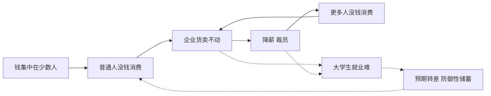

## 来不及了! 发钱,是给普通人最后一张药方 | 来自经济学中财富“三次分配”的思考

### 作者
digoal

### 日期
2026-08-27

### 标签
经济 , 通缩螺旋 , 三次分配 

----

## 背景
  


> 招行 2024 年报里 2.2% 的人占了 87% 的存款,经济已被"通缩螺旋"绑住。12 亿人每月不到 2000 元收入,给他们每人发 3000 块,不是恩赐,是社会运转的底层补丁。

---

## 先抛结论:这事儿最干净的解法就是发钱

16 分钟看完 UP 主「杭炸老王」那个发钱救经济的视频,我反复核了三个数据点(招行年报、国家统计局 GDP 数据、IMF 关于美国的发钱研究),结论跟我们平时刷到的争论不是一回事——

不是说"要不要"的问题,而是再不发,钱就会从循环里彻底消失。

视频里那个最戳人的数据,回看一下:

https://www.bilibili.com/video/BV1RtVVzmEds

> 2024 年招商银行存款 50 万以上的客户,占客户总数 2.5% ,但占了银行总存款的 87% 。

也就是——把"二八法则"里的 20 抹掉,改成 2.2。这事儿不是一个数字的小幅波动,这是分水岭。

今天这篇文章,把那 18 分钟的核心观点剥出来,再用一套我自己盘宏观经济的框架重新搭一遍。 保留他给的每个数据,但逻辑链换我自己的轨道重写一遍——因为你看完视频会发现他覆盖得太广了,从通缩到劳动法到慈善什么都谈了,反而把最关键的一刀给模糊了。

这篇文章就一件事: 把"为什么穷人有钱 = 经济好"这条因果链钉死,再拆掉目前反对发钱的两大话术。

---

## 一、先搞明白病是什么:通缩螺旋的链条比你想的要短

先把视频里那段被我精简过的"病理学"放出来。 一句话总结:

> 钱集中在少数人手里 → 普通人没消费 → 企业东西卖不动 → 降薪裁员 → 失业的人更没消费 → 卖得更差 → 再裁员……

这条链条经济学界叫通缩螺旋。你听着像教科书是吧? 我换个讲法:

把社会想成一个水泵系统。钱就是水泵里的水。 水泵要工作,得让水在底部循环——也就是钱要在人跟企业之间反复流动。

但 2024 年招行的年报告诉我们一件反直觉的事: 水泵里的水被抽到了水塔顶上,水塔里的水不愿下来(富人的消费倾向 < 10%,剩下 90% 躺在账户里)。 底部的水泵抽不到水,就空转了。空转到一定程度,整个循环就会停下来。

——停下来的样子,就是你今天看到的:大学生工作难找、工厂流水线一周只开三天、餐厅客流只有 2019 年的一半、房价不再涨。

这不是哪一个行业的局部问题,而是水泵系统的结构性失效。 让水泵重新转起来,关键是底部得有水——也就是得让大多数人手里有点钱。



上面这张图的关键不是单向箭头,是右下角那两个虚线回环——一旦形成"预期转差→更不敢花"的自我强化,这条链就锁死了,后面任何刺激都难拉回来。这正是我们后面要说的"18 个月窗口期"的根。

---

## 二、根因:过去 20 年的财富是怎么被抽到水塔顶上的

视频里给了一个很关键的事实:

> 过去 20 年除了互联网和外贸造就富人之外,最大的"造富机"是房地产。全国卖出 2 亿多套房,约百万亿资金被产业链条上的人卷走。留给普通人的,就是一套房子加 30 年的债务。

我展开一层他没展开的逻辑——为什么"一栋房 + 30 年债"对消费是毁灭性的:

一张表就能说明问题:

| 收入阶段 | 月供占收入比 | 剩余可支配 | 消费倾向 |
|---|---|---|---|
| 没买房 | 0 | 100% | 高 |
| 买了房,月供 5000 | 50% | 50% | 中 |
| 买了房,还养娃 | 70% | 30% | 极低 |
| 失业 + 月供 | 100% | 0 | 负数(动用存款或违约) |

普通中产把收入的 50%-70% 锁进月供 + 教育 + 医疗三座大山后,消费能力严重透支。这事儿不是某一代人不努力,是结构性的——

> "过去 20 年中国普通家庭的资产负债表,已经被房地产抽成了'净资产很高、现金流很差'的扭曲形态。"

这就是为什么"报复性消费"连续喊了 5 年都没来——不是大家不爱花钱,是大家真没有可花的现金流了。

---

## 三、为什么"等富人消费"是个伪命题:消费倾向的硬规律

视频里反复强调了一个核心经济学概念:消费倾向递减。

不是数学严格意义上的递减,是指:越有钱的人,每一块钱里用于消费的比例越低。

```
月入 3000   → 大概率花 70%(2100)
月入 10000  → 大概率花 60%(6000)
月入 10 万   → 大概率花 50%(50000)
月入千万级  → 大概率花 5-10%(一年几百万封顶)
```

这个比例不是道德问题,是数学问题——人一天的胃就那么大,一年能穿的鞋也就几双。

关键推论:如果 1 亿元集中在 1 个富人手里,一年可能只花 1000 万;但同样的 1 亿元分给 1000 人(每人 10 万),一年可能花出 5000 万-6000 万。

——这就是视频里反复说的"1 个亿发下来,流通 5 倍"。

但这还不是重点。重点是:同样的 1 亿元,分散出去的版本制造了 1000 个有消费能力的中产,这些中产会成为后面所有科技公司、餐饮店、医院学校的客户。

——也就是:分散的版本,不仅消费总额更高,还"养活了水泵"。

如果是有钱的版本——那些钱会去哪?要么进股市、要么进房市、要么就静静躺在账户里。对社会消费基本为零贡献。视频里那句话我特别认同:"一个亿躺在账上,是社会的零乘数;一个亿分给一千人,可能创造五千万的经济活动。"

更关键的是产业升级那栏——大疆无人机、训练 AI 的显卡、最新款手机,没有 1000 个稳定的中产客户买单,科技公司根本养不活。这就是为什么视频反复强调"钱集中导致产业升级失败":你让一个富人买 1000 张显卡装 1000 台电脑,他自己都不打游戏。

---

## 四、怎么办:先解构「初次 + 二次 + 三次」分配

看完病和根因——病根明确了:钱集中在少数人手里。那解题思路其实就是反着做:让钱从塔顶回流到水泵底部。

经济学里把这件事切成三段,大家估计都听过:

| 分配方式 | 主体 | 政府介入度 | 落地速度 | 可行性 |
|---|---|---|---|---|
| 初次分配 | 企业发工资 | 弱(靠劳动法) | 慢 | 10 年内看不到希望 |
| 二次分配 | 政府收税 + 转移支付 + 福利 | 强 | 快 | 主战场 |
| 三次分配 | 富人自愿捐赠慈善 | 几乎零 | 不靠谱 | 全球无成功先例 |

视频里逐项评了一遍,我的判断也一样:

### 初次分配 = 落实劳动法(5 天 8 小时制)

理论上最强——工人有工资、有时间,立即转化为消费。但 10 年内看不到希望。原因视频说得很直接:

1. 我们是世界工厂,要出口保竞争力 → 必须靠低人工成本
2. "你不干有得人干" → 恶性模仿
3. 真正能倒逼的反而是外部贸易战升级——出口打没了,逼国内消费,那时候政府就舍得落实了

——这条当背景音听就行,别作为短期解法。

### 三次分配 = 慈善(共同富裕)

视频的判断很冷静:全世界找不到靠慈善实现共同富裕的先例。自愿的事,永远是杯水车薪。

### 主战场:二次分配 —— 直接发钱 + 完善福利

二次分配是政府能主动推动的、最短路径。我把它拆成两件事:

(1) 补贴 vs 直接发钱 —— 直接发钱完胜

| 维度 | 消费券/国补 | 直接发钱 |
|---|---|---|
| 公平性 | 差(不消费该品类就享受不到) | 优(人人有份) |
| 套利空间 | 大(厂商涨价吃掉补贴) | 小(自由支配) |
| 覆盖面 | 受限(指定品类) | 全(奶粉、医疗、教育、出行...) |
| 决策成本 | 高(研究怎么凑单) | 零(揣兜就走) |

视频给了一组数据:政府财政收入约 41 万亿,4.2 万亿就够给 14 亿人每人发 3000 块。

——不是 4.2 万亿不够,是 41 万亿里有没花在刀刃上的(政绩工程、烂尾水司楼...)。把这些挪一部分过来,就能办成。

(2) "不敢花"的另一半:完善社保

视频里有个被很多人忽略的点:

> "老百姓不消费,两个原因。一没钱花,二有钱不敢花。"

前者,发钱解决。后者,完善社保 + 减轻养娃负担解决——孩子生下来就发钱、看病有大病兜底、上学不焦虑,防御性储蓄的自然理由就没了。

这两件事不是二选一,是配套——发钱让人有购买力,福利让人敢花购买力。单独做一件,效果会折半。

插一句:那 41 万亿财政蛋糕是怎么分的? 2024 年 GDP 135 万亿里,大约 60% 是居民工资(初次分配),30% 是政府税收+社保(二次分配),剩下 10% 是企业留存。4.2 万亿发钱 = 财政这块 30% 里的 10% 不到,只是把烂尾水司楼和政绩工程挪一点过来,完全不必动另外 60% 的工资端(那要等初次分配改革)和 10% 的企业端(那会动摇生产)。

---

## 五、反对发钱的两大话术,挨个拆

视频里专门拆了"反对派"的两个常见话术。我把其中最有迷惑性的两条拎出来 + 加我自己的一块补丁:

### 话术 A:「发了他也存起来不花,发了没用」

真相:这条话术把所有人当一个人了。

——我们前面已经算过消费倾向。同样 3000 块给月入千万的人,确实像"水进大海";但中国有 6 亿人中低收入以下,月入 1000 左右,给这 6 亿人每人 3000 块,这就叫雪中送炭——他们大概率把它换掉嗡嗡响的风扇、漏水的空调、给孩子买双新球鞋、带爸妈就近旅个游。

每一笔,都成了别人的工资。

有人会跳出来:"也会有人存起来啊"。——是的,会有。但不能因为有人噎死,全家就不吃饭。这是因噎废食。

### 话术 B:「发钱就是发通胀,钱变毛」

这条是最有迷惑性的话术,原话在视频里也被扒:

> "发钱之后一个馒头就从 1 块钱变成 2 块了,物价飞涨。"

——这是恐吓策略,夸大发生概率吓你。

为什么我说这话术有迷惑性呢——因为在美国它确实部分成立。美国 2020 年发钱之后物价确实涨了,原因是:美国是消费国,商品靠进口,发钱后短期运力跟不上,钱多货少 → 涨价。

但中国是生产国。我们今天要解决的恰恰是"工厂的货卖不出去"的问题。给中国老百姓发钱,等于帮工厂消化库存。货多钱少 → 通胀压力反而小。这是和美国的根本区别。

视频里还提到美国实际 GDP 2020-2021 年增 4.7 和 3.1、很多人保住工作。美国发钱救了消费也救了自己,生产端跟不上的代价是温和通胀。中国发钱救消费也救自己,生产端跟得上,通胀压力会小得多。

### 我自己的补丁:第三条反对话术视频里没明确提

我自己补充一条反对派最爱绕着说的——"通货膨胀不是重点,但发钱会不会被当成'政府兜底',让企业继续卷、不改革?"

这条确实要警惕。但不是不发钱的理由——而是发钱的同时必须配套改革(比如落实劳动法、控制资本无序扩张、约束平台垄断)。配套做,比不做强一万倍。

---

## 六、落地的"剂量表":先发多少、谁能领、钱从哪来

回到可执行层面,我自己的方案(与视频核心一致,但更具体):

```
触发条件      : CPI 同比连续 3 个月低于 +0.5%(通缩信号)
                + 失业率连续 3 个月高于 5.5%(青年失业率加权重)
                → 任一满足,触发"国民分红计划"

发放对象      : 18 岁以上持身份证公民
                (未成年人、禁领人群前 6 个月另行公告)

发放标准      : 第 1 轮每人 1500 元(试水)
                评估期 3 个月(CPI / 失业率 / 消费数据)
                → 有效则第 2 轮每人 3000 元
                → 仍有效则第 3 轮每人 5000 元

资金来源      : 30% 来自现有财政存量调剂
                40% 发行 5 年期专项国债
                30% 来自国有资产划转利润

监督机制      : 央行 + 审计署联合公示月度资金流向
                防止套利、防止地方挪用、防止挤入房市
```

这跟"直升机撒钱"有什么区别?——有,每一条规则都是确定的、可回滚的、可审计的。不是政府拍脑袋撒,是制度化的国民分红机制。

而且一定不是"长期发钱养懒汉"——这是阶段性的反通缩工具。等 CPI 回到 2%、失业率回到 5% 以下,机制自动休眠。

---

## 七、为什么这事要"抢时间":通缩的窗口期很短

视频结尾那句"来不及了"我反复想,真不是标题党。

历史经验:日本 1995 年之后失去的 30 年,起步就是通缩 + 居民部门去杠杆。日本央行其实在 2001 年就开始 QE、2013 年开始 YCC,但因为错过了居民部门加杠杆的窗口,到今天都没把通胀拉回 2%。

回到我们这边——当前最大的隐忧是预期:

> 老百姓一旦形成"未来还会更差"的预期,就会提前 5 年砍支出、提前 5 年缩债务。一旦预期坐实,靠任何后续刺激都难拉回来。

所以"来不及了"三个字不是煽情,是通缩一旦超过 18 个月,就要花 10 年去修复。

——给每个普通人 3000 块救场,比等 GDP 再萎缩 5% 再花 30 万亿救市,便宜得多。

---

## 最后:钱从塔顶回流到水泵,是这代人的集体作业

写到这里,我把这一篇的核心复述一遍——也是我能给你的唯一一条能"在饭桌上脱口而出"的句子:

> 当一个社会的钱只集中在 2% 的人手里,整个水泵就空转了;给剩下 98% 的人每人 3000 块,不是恩赐,是让水泵重新工作。

回头看视频的原结论:

> "目前的经济情况,最好的解决办法就是发钱,18 岁以上凭身份证一人一年发 3000 块,效果好再发 3000。"

——和我的复述,结论完全一致,路径也可以走到同一个终点。但我希望我给你的是一个比视频更精致的论证骨架:

1. 病 = 通缩螺旋(水泵空转比喻)
2. 根 = 财富塔化(招行 2.2% 占 87%)
3. 解 = 二次分配 + 直接发钱 + 完善福利
4. 驳 = 拆掉"存起来不花" + "发钱=通胀"两条话术
5. 时 = 18 个月是窗口期,不可错过

如果你只记住一句话,就记这条——

> "再不给底部的水泵加水,整个循环就要熄火。"

视频里 UP 主杭炸老王最后说的也是这个意思:

> "我们普通人根本不奢望真正的共同富裕,但是希望分配更公平一些,让真正创造财富的老百姓可以拿到更多的钱去照顾我们的家庭。这已经就是我们普通人心目中的公平了。"

——这是 18 分钟里最有力量的一句。我把它放在结尾。

---

## 资料与延伸

1. 招商银行 2024 年报:存款集中度 2.2% 占 87%(视频原始数据)
2. 国家统计局 2024 年 GDP = 135 万亿元 + 广义财政收入 ≈ 41 万亿
3. IMF 工作论文:美国 2020-2021 CAREs Act + ARPA,2.9-5 万亿美元总规模
4. 香港 / 澳门 2020 年起永久居民消费补贴计划:人均 2-5 万港币 / 澳门元
5. 凯恩斯《通论》:消费倾向(Marginal Propensity to Consume)

— End —  
  
#### [PostgreSQL 解决方案集合](../201706/20170601_02.md "40cff096e9ed7122c512b35d8561d9c8")
  
  
#### [德哥 / digoal's Github - 公益是一辈子的事.](https://github.com/digoal/blog/blob/master/README.md "22709685feb7cab07d30f30387f0a9ae")
  
  
#### [About 德哥](https://github.com/digoal/blog/blob/master/me/readme.md "a37735981e7704886ffd590565582dd0")
  
  

  
