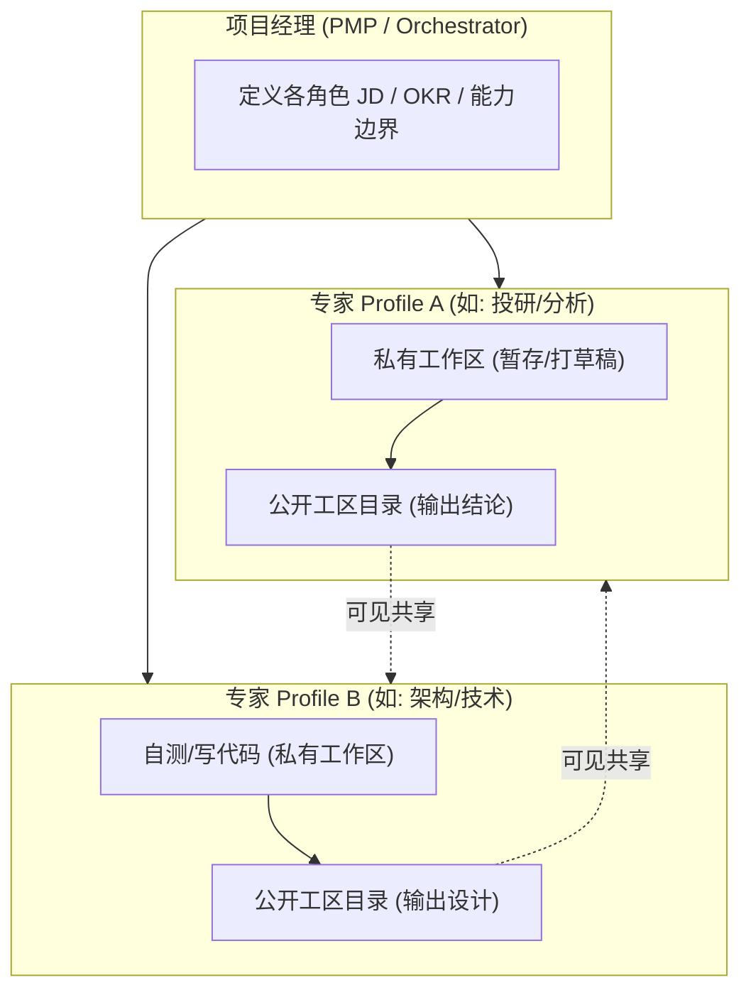

## AI “屠龙刀” 的秘密 | 为什么你的 AI 越用越笨，而有人却能练出“肌肉记忆”？
  
### 作者  
digoal  
  
### 日期  
2026-08-29  
  
### 标签  
AI , 屠龙刀 , 记忆 , 肌肉记忆 , 大模型 , LLM , SOP , 技能包 , 工具包 , 自动化任务 , 脚本库 , 程序库 , 沉淀 
  
----  
  
## 背景  
我的AI屠龙刀的秘密：
- 第一部分：LLM+Agent+运行环境+联网只是载体，
- 第二部分才是核心：
    - 越用越好（这里包含了积累、迭代进化、遗忘），
    - 用进废退，越专业越好，自带极强标签和影响力，又省Token效率和质量又高，
    - 编排能力越强越好，多profile 代表各领域专家，团队作战能力强。
    - 用进废退指“不断积累的记忆，好的经验和踩坑经验，SOP，技能包，工具包，程序包，定时任务包，以及编排组织能力包”。
    - 和人的成长一模一样。顶级人才的成长过程就是AI屠龙刀学习的榜样。
   
-----
   
很多人用大模型，总觉得是个玄学。
今天聊得好好的，明天开个新会话，它又被打回原形。
上下文塞得越多，幻觉越严重，最后满嘴跑火车。

其实，真正能越用越强、越用越顺手的 AI 架构，
大自然在几亿年前的人体设计里，早就把底牌亮出来了。

---

### 一、脑细胞与身体细胞：把“思考”和“执行”彻底拆开

人体的底层机制非常反直觉：

你的大脑神经元细胞，几乎一生都不更换。
它们只负责沉淀终生记忆、心智模型和深层思考。

但你的身体细胞，大部分几天到几个月就彻底换一轮。
皮屑脱落、红细胞代谢、肠道上皮更新。
它们只负责执行。
你天天撸铁，身体就长出肌肉记忆；天天躺平，肌肉就用进废退。

很多人用 AI，犯的最大错误就是“脑身不分”。
把临时任务、长期偏好、代码执行、背景资料，一股脑全塞进同一个 Prompt 里。
这相当于让大脑一边做微积分，一边亲自去搬砖，脑子不炸才怪。

我常说的“AI 屠龙刀” ( [《我的“屠龙刀” | “AI Agent + 数据库 + Skills + 记忆层” Docker 镜像及制作过程》](../202607/20260730_02.md)   )，核心逻辑就是把这两层完全物理剥离：

- **大脑层（不可替代的记忆中枢）** ：沉淀长期上下文、决策偏好、价值判断。
- **身体层（高频迭代的执行器官）** ：沉淀 SOP、技能包（Skills）、工具库（Tools）、自动化脚本。

大模型本身随时可以换最新最强的，
但你沉淀下来的 SOP 和肌肉记忆，才是真正的资产。

---

### 二、标签与 Profile 隔离：专业度决定了“第一被唤醒权”

在搜索引擎的算法里，标签的权重是决定性的。
领域越垂直、标签越专一，匹配得分就越高，越能被排在第一位。

现实里的人也是一样。
别人遇到什么棘手问题，凭什么第一个想到你？
靠的从来不是“我什么都能干一点”，而是你在某个极其垂直的领域里，标签被钉得死死的。

用 Agent（比如 Hermes Agent）也是同理。
千万不要试图调教一个“全知全能的超级大管家”。

正确的做法是按领域拆分 **Profile Agent**：
- 跑数据库内核排查的，专看 WAL、执行计划、锁等待；
- 搞内容写作的，专盯用户痛点、钩子结构、口播节奏；
- 做投研分析的，专抓数据校验、产业链逻辑、证伪信号。

每一个 Profile 都有专属的上下文边界。
隔离了无关噪音，不仅推理速度飞快、Token 消耗骤减，
更关键的是——它在自己的专业战场里，输出质量永远是最顶级的。

---

### 三、多 Agent 协作：从单兵作战到“自运转军团”

当你有了一群垂直领域的专家 Profile，怎么让他们协同作战？

靠的不是乱糟糟地群聊，而是严谨的组织架构设计：

1. **给每个 Agent 明确的 JD**：
   定义清晰的职责范围、能力模型以及这次任务的 OKR。别让干厨子的去洗衣服。
2. **私有工作区与公开工区严格解耦**：
   每个 Agent 必须有自己的私有空间，用于存放中间草稿、排错日志和思考过程，避免过程垃圾污染全局；
   同时只把最终交付物输出到各自的“公开工区目录”。
3. **公开工区透明互通**：
   所有 Agent 相互知道对方的公开工区路径，需要上游产出时，直接去读取结构化结果，完成跨角色思维碰撞。
4. **PMP 统一调度编排**：
   通过项目管理（PMP）的视角来拆解阶段目标、把控交付节点，让多 Agent 的协作像齿轮一样咬合。

---

### 总结

AI 不会因为模型参数变大，就自动替你解决复杂的现实业务。

真正的高手，都是把 AI 当成一个生物组织在构建：

- 用**记忆与 SOP** 沉淀脑力与肌肉；
- 用 **Profile 标签** 锁死专一性与上下文边界；
- 用 **私有/公开工区 + PMP** 编排出一支高协同的多 Agent 专家军团。

越练越强，越用越顺手。
本质上，就是把混乱的临时交互，变成了有秩序的组织演进。

  
  
#### [PostgreSQL 解决方案集合](../201706/20170601_02.md "40cff096e9ed7122c512b35d8561d9c8")
  
  
#### [德哥 / digoal's Github - 公益是一辈子的事.](https://github.com/digoal/blog/blob/master/README.md "22709685feb7cab07d30f30387f0a9ae")
  
  
#### [About 德哥](https://github.com/digoal/blog/blob/master/me/readme.md "a37735981e7704886ffd590565582dd0")
  
  

  
