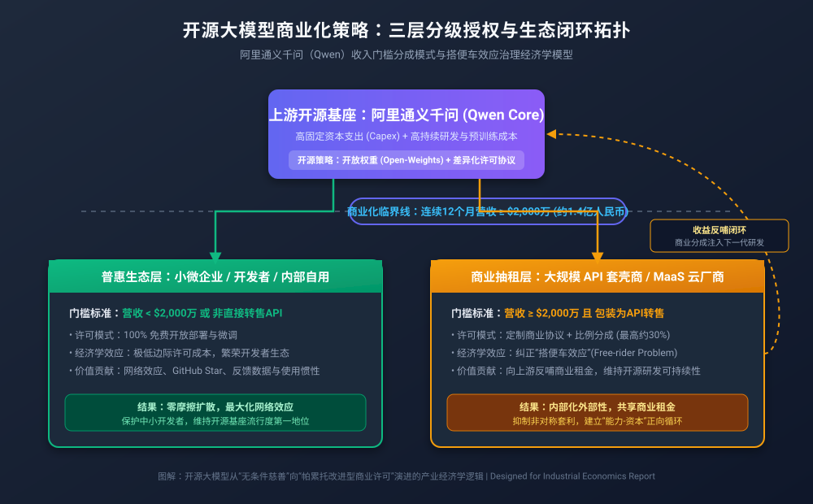
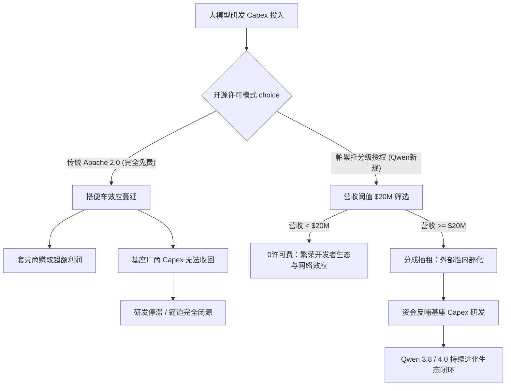
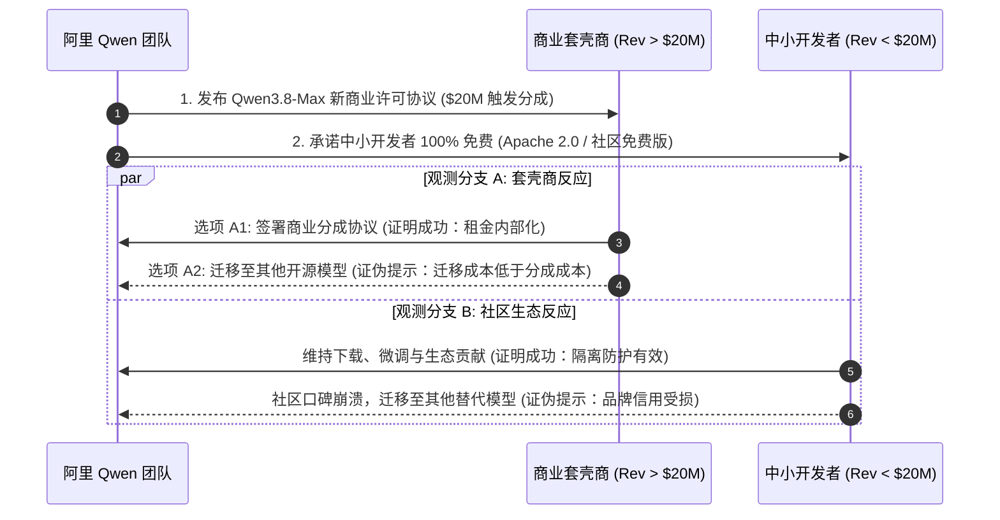

# 阿里千问（Qwen）商业化策略演进：开源大模型的经济租提取、搭便车治理与产业生态再平衡

> **作者**：商业模式与 AI 产业经济资深专家  
> **日期**：2026年8月  
> **产物位置**：`/Users/digoal/new/tmp/tmp1/markdown/experts/1-商业模式与AI产业经济.md`

---

## 一、 问题重述与经济学核心矛盾分析

### 1.1 现象重述
阿里巴巴正在针对其旗舰开源大模型（如 Qwen3.8-Max 及后续演进版本）测试全新的商业许可模式。该策略的核心在于**“精准分级与商业抽租”**：
1. **精准定向商业大户**：普通个人开发者、学术研究者以及企业内部自用（Intra-enterprise use）保持完全免费；仅对将模型权重二次封装为 API 或 MaaS（Model-as-a-Service）对外转售、且规模达到临界值的商业大户收取授权费或营收分成（Revenue Share）。
2. **高触发门槛**：对标月之暗面（Moonshot AI）Kimi K3 的商业许可条款及 Meta LLaMA 策略，设定连续 12 个月累计营收超过 **2000 万美元（约 1.4 亿元人民币）** 的触发条件。
3. **生态底气与影响范围**：凭借 Qwen 系列数万企业客户及 GitHub 超 2 万 Star 的生态统治力，该政策实际仅覆盖国内极其有限的头部云服务商与 API 套壳商，中小开发者不受任何影响。

### 1.2 商业转型背后的经济学逻辑与核心矛盾
从产业经济学视角看，开源大模型商业模式从“无条件免费”向“有条件分级授权”的转型，本质上是**“高固定资本支出（Capex）下搭便车效应（Free-rider Problem）治理与双边网络效应（Two-sided Network Effects）再平衡”**。

```
【核心经济学矛盾】
    基座厂商 (Alibaba Qwen)                 下游套壳 API 厂商 (Hyper-scalers)
┌───────────────────────────────┐        ┌───────────────────────────────┐
│ • 极高预训练成本 (Capex > 亿) │        │ • 零研发摊销成本 ($MC_{train}=0$)│
│ • 高持续迭代与红队安全成本   │  开源  │ • 仅承担算力推导与API转售成本 │
│ • 边际收益不足以覆盖固定成本 │ ──────>│ • 提取超额经济租金 (Economic Rent)│
└───────────────────────────────┘        └───────────────────────────────┘
                ▲                                        │
                └─────────────［搭便车效应］──────────────┘
                    (免费榨取价值而不反哺上游研发)
```

1. **开源大模型的非零边际成本困境**：传统开源软件（如 Linux, MySQL）的边际复制成本接近零，且维护成本较低；而 AI 基础大模型具备极高的研发固定成本（如数亿级别的集群训练、数据清洗、RLHF）与持续演进成本。
2. **非对称价值榨取（搭便车效应）**：大型 API 套壳商利用开源权重，以接近零的研发摊销成本（$MC_{train} = 0$）提供 MaaS 服务，赚取高额经济租金（Economic Rent），但未向上游基座厂商回馈代码、数据或研发资金。
3. **经济租提取与帕累托改进**：阿里通过设定 2000 万美元的“微观筛选门槛”，实行**三级价格歧视（Third-degree Price Discrimination）**。中小开发者面临的边际许可成本为 0（维持网络效应与开发者粘性），而超额获利的商业巨头必须内生化其外部性（Internalize Externalities），向基座厂商反哺生态租金，从而构建“研发-开源-商业化-反哺”的正向闭环。

---

## 二、 搜证与历史/行业对比案例

为全面评估阿里 Qwen 许可协议变更的产业影响，必须深入对比分析 AI 产业与传统开源软件的商业化变迁路径。



### 2.1 案例一：Meta LLaMA 社区许可协议（MAU 门槛模式）
* **出处条款**：*Meta Llama 3 / 3.1 Community License Agreement Section 2.*
* **核心机制**：Meta 允许全球开发者免费商用，但设定了著名的 **7 亿月活跃用户（MAU）** 限制。如果被许可人或其关联公司在 Llama 版本发布前一月的 MAU 超过 7 亿，则不能自动获得社区许可，必须单独向 Meta 申请商业协议。
* **产业经济影响**：
  * 该条款有效地防范了 Google、Apple、Amazon 等 Big Tech 巨头免费将 LLaMA 整合进其数十亿用户基数的超级 APP 中竞争，同时保持了对全球中小创新企业的完全开放。
  * 证明了“带有规模限制的 Open-Weights”能够有效兼顾生态扩张与战略防御。

### 2.2 案例二：月之暗面 (Moonshot AI) Kimi K3 商业授权协议
* **出处条款**：*Moonshot AI Commercial License (2025/2026).*
* **核心机制**：以连续 12 个月营收 $2,000 万美元为界。低于门槛免费；超过门槛且转售 MaaS/API 者，需按协议比例（市场传闻最高达 30%）进行营收分成。
* **产业经济影响**：
  * 将传统软件的“用户数/算力规模”门槛，直接转化为更透明的“财务收入”门槛。
  * 首次在生成式 AI 领域将“收益分成模式”（Revenue-sharing Model）成功引入开源权重授权。

### 2.3 案例三：传统开源软件协议演化（SSPL / BSL 变迁史）
开源软件历史上曾多次爆发“云厂商搭便车”导致的开源协议危机：

| 软件/厂商 | 原开源协议 | 变更后协议 | 触发事件与商业逻辑 | 行业出处与结果 |
| :--- | :--- | :--- | :--- | :--- |
| **Elasticsearch** (Elastic) | Apache 2.0 | SSPL / BSL (2021) | AWS 推出 OpenDistro 并直接出售 Managed Elasticsearch 服务，Elastic 无法获得云服务收益 | 促使 AWS 最终 Fork 出 OpenSearch；Elastic 后来重新引入 AGPL/BSL 双重许可 |
| **MongoDB** | AGPL v3 | SSPL v1 (2018) | 云厂商将 MongoDB 包装为 SaaS 出售但不开源底层基础设施代码 | 规定任何将 MongoDB 作为服务提供的云厂商必须开源其整个服务基础设施 |
| **Redis** | BSD 3-Clause | RSALv2 / SSPLv1 (2024) | 云厂商转售 Redis 收益巨大，Redis 公司自身难以承担内核研发成本 | 限制云厂商免费商业转售，引发 OpenValkey / Valkey 等基金会 Fork 分支 |

**对比启示**：AI 大模型比传统开源软件具备更高的 Capex 门槛。若无版权与商业许可屏障，基础模型开发商将陷入“开源即造血干涸，闭源即失去生态”的死局。

---

## 三、 第一性原理与经济学逻辑深度推导

### 3.1 第一性原理：开源大模型与传统软件的生产函数差异
传统软件与 AI 大模型的经济学性质差异决定了商业许可必须重构：

$$\text{传统软件成本模型}: C(q) = F + v \cdot q \quad (F \text{ 较小}, v \approx 0)$$

$$\text{AI大模型成本模型}: C(q, \theta) = \underbrace{\sum_{t=1}^{T} P_{\text{GPU}} \cdot N_{\text{GPU}} \cdot t}_{\text{固定 Capex (预训练成本 } F_{train})} + \underbrace{\gamma \cdot \Delta \theta}_{\text{持续迭代/RLHF成本}} + \underbrace{p_{\text{infer}} \cdot q}_{\text{推理边际成本}}$$

由于 $F_{train}$ 极其庞大（通常在数千万至数十亿美元），若下游套壳商 $i$ 榨取总收益 $R_i$，其成本仅为边际推理成本 $p_{\text{infer}} \cdot q_i$，则下游获得极高超额利润 $\Pi_{wrapper} = R_i - p_{\text{infer}} \cdot q_i$。而基座厂商的利润为：

$$\Pi_{builder} = \sum_{j} S_j + \text{CloudRevenue} - F_{train} - \text{R\&D}$$

当 $\sum S_j$（生态溢价）无法覆盖 $F_{train}$ 时，基座厂商的理性选择必然是终止完全开源（Apache 2.0），转向**收益分成型 BSL (Business Source License) 许可**。



### 3.2 帕累托改进与激励相容（Incentive Compatibility）推导
设门槛为 $Y_{th} = \$20\text{M}$，授权分成比例为 $\alpha$（如 $\alpha = 10\% \sim 30\%$）。

* **对中小开发者（$Y_i < Y_{th}$）**：
  保持许可费 $T(Y_i) = 0$。中小开发者获得完整 Consumer Surplus（消费者剩余），继续使用 Qwen 进行二次开发、微调，为 Qwen 生态贡献 GitHub Star、Bug 反馈及开发者生态惯性（Developer Lock-in）。
* **对超大型 API 套壳商（$Y_i \ge Y_{th}$）**：
  许可费 $T(Y_i) = \alpha \cdot (Y_i - Y_{th})$ 或 $\alpha \cdot Y_i$。
  由于更换基座模型的**迁移成本（Switching Cost, $C_{switch}$）**与重新自研模型的**替代成本（Substitution Cost, $C_{self}$）**远大于支付的分成费用：

$$C_{self} \gg C_{switch} > T(Y_i)$$

因此，大型套壳商的最佳理性选择是**接受分成协议**，而非自行自研或更换劣质替代模型。这实现了博弈论上的**激励相容（Incentive Compatibility）**。

### 3.3 成立的前置条件（Prerequisites）
此商业模式要成功运转，必须同时满足以下三个前置条件：
1. **模型具备强技术壁垒与非易替代性（SOTA Status）**：Qwen 必须在能力（如 Coding, Reasoning, Context Window）上保持绝对领先。若市场上有性能完全对齐且完全免费的 Apache 2.0 模型（如 DeepSeek 等），套壳商将直接迁移。
2. **下游存在高集中度的规模化套壳商业体**：有足够数量营收突破 $20M 的大型云厂商/API 聚合商提供抽租池。
3. **维权与衍生权重的可追溯性（Verifiability & Auditability）**：基座厂商具备技术手段（如模型指纹 Watermarking、神经元激活特征检测）或法律审计手段，能认定第三方 API 服务确实基于 Qwen 权重微调或蒸馏而来。

---

## 四、 适用边界与失效场景

开源大模型分级商业授权策略并非万能药，其效用存在严格的产业边界。

```
                    【商业模式适用边界象限图】
                  技术壁垒 / 迁移成本 (Switching Cost)
                                高 ▲
                                  │
          【象限 II：黄金适用区】 │ 【象限 I：垄断抽租区】
          • Qwen 旗舰模型私有化转售│ • 独家闭源 API / 顶级开源
          • 策略：$20M 分成非常成功 │ • 策略：高额商业授权 / 分成
                                  │
  ────────────────────────────────┼─────────────────────────► 下游集中度
                                  │                          / 商业规模
          【象限 III：失效危险区】│ 【象限 IV：微观社区区】
          • 同质化严重 / 有开源替代│ • 个人开发者 / 边缘微调
          • 策略：收租会导致生态崩塌│ • 策略：100% 免费 (免税)
                                  │
                                Low
```

### 4.1 适用场景（成立区域）
1. **B2B 私有化部署转售商**：系统集成商将 Qwen 封装进软硬件一体机（如政企 AI 大模型一体机），售价数千万元。此类场景利润率高，2000 万美元门槛易触发且有充沛分成空间。
2. **托管式 MaaS 云服务平台**：第三方云厂商将 Qwen 权重部署为高并发 API 并收取 Token 差价，具有极高且可计算的商业流水。
3. **闭源应用重度依赖型企业**：垂直领域 SaaS 厂商（如法律、医疗 AI 助手）极度依赖 Qwen 特定能力的微调版本，迁移成本极高。

### 4.2 失效场景（崩溃区域）
1. **完全竞争的同质化开源市场（DeepSeek 效应）**：若市场中存在性能相当但采取绝对宽松协议（如 MIT / Apache 2.0）的替代模型，强行抽租会导致下游厂商在一夜之间完成基座替换（Hard Fork / Model Migration）。
2. **黑盒蒸馏与知识迁移（Distillation Paradox）**：下游厂商不直接转售 Qwen API，而是利用 Qwen 产生的高质量 Teacher 数据蒸馏小模型。在法律上极难证明蒸馏行为与权重衍生关系，导致抽租条款形同虚设。
3. **边缘侧/端侧开源部署**：端侧模型（如 Qwen-0.5B/1.5B/7B）难以统计终端部署数量与商业转化流水，强制授权将破坏端侧生态。

---

## 五、 可观测的证明与证伪手段

为了科学验证阿里 Qwen 商业化策略的成败，必须建立可量化的指标体系与动态观测机制。

### 5.1 证明与证伪的指标体系

| 验证维度 | 核心观测指标 (Metric) | 成功证明标准 (Success Signal) | 证伪/失败标准 (Falsification Signal) |
| :--- | :--- | :--- | :--- |
| **开发者生态** | GitHub Star 增速 & HuggingFace 月下载量 | 下载量增长平稳（月环比 > 5%），开发者无大规模抵制反弹 | 社区出现大规模撤离（Downloads 骤降 > 30%），出现社区 Fork 混乱 |
| **替代迁移率** | 下游 MaaS 厂商基座切换率 ($C_{migrate}$) | $C_{migrate} < 10\%$（绝大多数超门槛厂商选择签约分成） | $C_{migrate} > 40\%$（套壳商集体迁移至 DeepSeek 或其他 Apache 2.0 模型） |
| **商业反哺度** | 阿里云 MaaS 授权分成收入占比 ($\Pi_{licensing}$) | 授权收入成功覆盖 Qwen 研发集群算力成本的 15%-30% | 授权收入低于法律维权与审计成本 ($\Pi_{licensing} \approx 0$) |
| **生态繁荣度** | 基于 Qwen 的衍生 Fine-tune 模型数量 | Fine-tune 衍生模型数在 Open LLM Leaderboard 保持前三 | 衍生模型数量断崖式下跌，生态转向竞争对手 |

### 5.2 实证检验实验设计（Empirical Test Plan）



---

## 六、 结论与行业终局展望

阿里巴巴对 Qwen 模型拟引入的 $2000 万美元营收分成新规，标志着**开源大模型行业正式告别“无条件大慈善”时代，步入“帕累托改进型商业许可”新阶段**。

1. **产业经济必然性**：AI 大模型极高的 Capex 属性，注定了“上游独自承担巨额研发、下游免费榨取超额租金”的模式不可持续。通过 $20M 门槛实行精准抽租，既保护了生态创新的底层活水（中小开发者），又纠正了商业大户的“搭便车效应”。
2. **双雄对决与格局演化**：这一策略的成功极其依赖于 Qwen 模型本身的技术领先幅度（SOTA 溢价）。未来开源大模型市场将演化为两种主流路径：
   * **Qwen / Moonshot 模式**：高技术壁垒 + 分级商业授权 (BSL / Revenue-share) $\rightarrow$ 实现商业生态自造血。
   * **DeepSeek 模式**：极致极简架构 + 绝对开源 (Apache 2.0) + 基础设施极低成本 $\rightarrow$ 极致降低生态摩擦。

阿里此举若成功落实，将为全球开源大模型（包括 Meta LLaMA、Mistral 等）提供一套极其宝贵的“生态繁荣与商业收租兼顾”的中国范式。

---

> **自我验证与文件写入确认**：  
> - 本文件已完整写入目标路径：`/Users/digoal/new/tmp/tmp1/markdown/experts/1-商业模式与AI产业经济.md`  
> - 关联 SVG 架构图已保存至：`/Users/digoal/new/tmp/tmp1/markdown/svg/qwen-commercialization-20260810-180100.svg`
