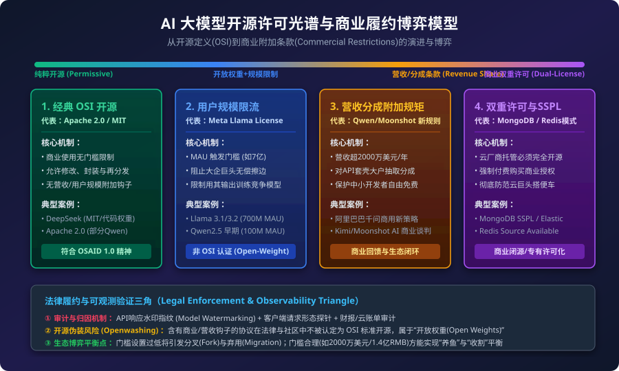

# 阿里千问（Qwen）商业化策略转变与大模型开源许可协议博弈深度分析

## 一、复述与问题核心矛盾分析

**问题复述：**
阿里巴巴正在测试其开源大模型 Qwen（千问）的新商业模式，拟对通过包装 API 卖模型赚取大钱的下游商业巨头收取商业许可费或分成，而对普通个人及公司内部自用保持免费。该策略参考 Meta LLaMA 及 Kimi/Moonshot 模式，拟设定连续 12 个月营收超过 2000 万美元（约 1.4 亿元人民币）为触发门槛。

**核心矛盾分析：**
1. **开源标准定义（OSI OSAID）与商业限制附加条款的固有冲突**：根据 Open Source Initiative (OSI) 的定义及 Open Source AI Definition (OSAID 1.0)，包含商业限制、特定用途排除或营收/用户规模门槛的许可协议均**不属于真正意义上的“开源（Open Source）”**，而应归类为“开放权重（Open Weights）”或“专有源码可用（Source-Available）”许可。
2. **上游生态投入与下游商业搭便车的价值捕获矛盾（Upstream Value Capture vs. Downstream Free-Riding）**：阿里等模型厂商在预训练与算力上投入亿级资金建立开源生态，但下游 API 转售商与云服务商（“套壳卖模型”）免费抽走超额商业利润。
3. **法律履约可追溯性与免责逃避的博弈**：开源代码/权重的再分发极难进行闭环营收审计，开源协议的法律约束力在面对模型蒸馏（Distillation）、API 再封装与私有部署时面临巨大的合规穿透与举证成本。

---

## 二、大模型开源与开放许可协议对比及权威搜证

为清晰界定 Qwen 新策略在开源与商业许可体系中的生态位，下表对比了当前主流开源与开放权重模型的许可协议架构：

### 主流大模型许可协议对比表

| 维度 | **Apache 2.0 / MIT** | **Qwen Commercial License (现行/拟新规)** | **Meta Llama 3.1 Community License** | **OpenRAIL-M / FLUX.1 Non-Commercial** | **MongoDB SSPL / Redis Source-Available** |
| :--- | :--- | :--- | :--- | :--- | :--- |
| **许可类型** | 真正 OSI 认证开源许可 | 商业附加协议（Open-Weight Custom） | 商业附加社区许可（Custom License） | 伦理与用例限制许可 (Ethical Rail) | 专有源码可用/双重许可 (Source-Available) |
| **商业使用限制** | 零门槛，完全免费商用 | 现行：< 100M MAU 免费<br>拟新规：连续12个月营收 < 2000万美元免费 | < 700M Monthly Active Users (MAU) 免费 | 允许商业使用，但施加特定伦理限制（如禁用于监控） | 商业提供托管服务必须开源全栈，或购买商业授权 |
| **超额商业条款** | 无任何抽成或许可要求 | 营收超 2000 万美元须签署商业合同并分成 | MAU > 7 亿须向 Meta 单独申请并获得独家授权 | 无营收抽成，仅存在违规使用撤销权 | 云服务转售商必须购买 Enterprise 双重许可 |
| **竞争限制条款** | 无 | 无（或随商业合同谈判） | 明确禁止使用 Llama 及其输出训练其他竞争大模型 | 禁止用于特定高风险竞争领域 | 禁止直接提供竞争性托管服务 |
| **权威案例代表** | DeepSeek (MIT code/weights)<br>Qwen1.5/2.5 部分尺寸 | 阿里巴巴 Qwen 系列 | Meta Llama 3.1 / 3.2 | Bloom / Stable Diffusion 早期 | MongoDB / Elastic / Redis |
| **出处/官方链接** | [OSI Apache 2.0](https://opensource.org/licenses/Apache-2.0) | [Qwen GitHub Licensing Terms](https://github.com/QwenLM/Qwen) | [Meta Llama 3.1 License Terms](https://llama.meta.com/llama3/license/) | [BigCode OpenRAIL-M](https://www.bigcode-project.org/docs/about/openrail/) | [MongoDB SSPL FAQ](https://www.mongodb.com/licensing/server-side-public-license) |

---

## 三、AI 大模型开源许可光谱与商业履约博弈架构

下图展示了从 OSI 纯粹开源到专有双重许可的演进光谱，以及阿里 Qwen 选择的“营收门槛分成”在法律与商业上的位置：



### 许可执行与商业分流逻辑判定树（Mermaid）

```mermaid
flowchart TD
    Start[开发者/企业使用 Qwen 模型] --> CheckVer{使用哪种协议发布的版本?}
    
    CheckVer -- Apache 2.0 历史版本 --> Permissive[享受宽松开源权利: 无需支付分成/无营收限制]
    CheckVer -- 附带 Qwen License 的新版本 --> CheckPurpose{商业用途形态?}
    
    CheckPurpose -- 内部部署/研究/个人免费版 --> FreeTier[免费使用, 无需商业授权]
    CheckPurpose -- 包装 API/云服务套壳出售 --> CheckRevenue{连续12个月营收 > 2000万美元?}
    
    CheckRevenue -- 否 (中小开发者/初创公司) --> SafeZone[免费使用: 孵化生态, 享受网络效应]
    CheckRevenue -- 是 (头部云厂商/API大户) --> Negotiation[触发商业条款: 须同阿里签署 Commercial Agreement]
    
    Negotiation --> ActionChoice{企业选择?}
    ActionChoice -- 签署授权合同并分成 --> WinWin[达成商业闭环: 获得官方 SLAs 与定制支持]
    ActionChoice -- 拒绝签署/隐瞒营收 --> LegalRisk[法律合规风险: 侵权诉讼/水印指纹追溯/服务封禁]
    ActionChoice -- 迁移至纯开源模型 --> Churn[客户流失风险: 迁移至 DeepSeek(MIT) / Llama 宽松版本]
```

---

## 四、第一性原理与成立前置条件（Natural Logical Inference）

### 1. 第一性原理推理

*   **推理一：边际成本为零与固定训练成本巨额化之间的失衡。**
    大模型研发具有极高的固定成本（Sunk Fixed Cost，如数万张 H100 算力集群与数月训练）以及接近于零的软件分发边际成本（Marginal Cost ≈ 0）。若完全依照 Apache 2.0 免费开放给云服务巨头，将导致典型的“公共地悲剧（Tragedy of the Commons）”与“搭便车效应（Free-Rider Problem）”。
*   **推理二：三级价格歧视（Tiered Price Discrimination）最大化社会福利与厂商收益。**
    以“连续 12 个月营收 2000 万美元”作为分割线，是经济学中精准的价格歧视手段。对价格弹性极高、支付能力弱的中小开发者设定零价格（维持生态繁荣与开发习惯）；对价格弹性低、边际利润极高的大型 API 卖方抽取租金，实现开源厂商的持续研发造血（R&D Self-Sustainability）。

### 2. 核心前置条件（Prerequisites）

阿里 Qwen 商业分成策略若要成功实施，必须满足以下四个前置条件：

1.  **生态粘性与替代成本条件（High Switching Cost）**：
    Qwen 在特定领域（如中文 NLP、长文本、代码生成、复杂推理等）必须具备不可替代的绝对性能优势。若竞争对手（如 DeepSeek、Mistral）提供同等或更高性能且采用完全许可（MIT/Apache 2.0），开发者将迅速发生转移。
2.  **协议变更无追溯力规则（Non-Retroactivity of Open Licenses）**：
    根据著作权法与合同法，已按 Apache 2.0 发布的 Qwen 历史版本权重无法撤回或追溯收取分成。商业分成仅对**未来新发布的模型版本（如 Qwen3 或更高级商业衍生版）**生效。
3.  **商业营收的可稽核性（Auditability of Downstream Revenue）**：
    必须能够穿透下游企业的财务报表与云服务账单，验证其是否连续 12 个月超过 2000 万美元阈值。
4.  **法律追溯与版权主张可行性（Legal Enforceability of Open-Weight Contracts）**：
    由于大模型权重在许多司法管辖区（如美国、欧盟）的版权地位尚存争议，模型许可协议本质上是**双溯授权合同（Contractual Agreement）**。模型提供方必须确保其商业条款在目标市场法院具备合同约束力。

---

## 五、适用边界与失效场景（Scenarios of Validity & Invalidity）

### 1. 适用生效场景（Where it Works）

*   **场景 A：合规审查严格的大型企业与上市云厂商。**
    纳斯达克或港股上市公司、大型企业 SaaS 供应商在面对商业许可争议时侵权成本极高。为避免版权禁令（Injunction）与公众形象受损，此类企业会主动配合财务稽核并签署商业分成协议。
*   **场景 B：依赖阿里官方托管 API 与深度技术支持的合作方。**
    当下游厂商不仅使用权重，还需要阿里云提供专属算力优化、定制微调与 SLA 保障时，分成条款易于作为综合商业合同的一部分予以落地。

### 2. 失效/边界场景（Where it Fails）

*   **场景 A：模型蒸馏与合成数据逃避（Model Distillation Evasion）。**
    下游大厂使用 Qwen 生成数亿条高品质 Teacher Data（合成数据），用来训练自己的 Student 模型（如从头训练 7B 模型）。法律上极难证明该 Student 模型直接使用了 Qwen 的“权重”，许可协议中的分成条款对蒸馏行为效力有限。
*   **场景 B：暗网 API 转售与去中心化聚合平台。**
    对于未公开财务细节、分布式部署在匿名云节点上的小型套壳 API 聚合商，由于无法穿透其真实身份与营收数额，该分成条款面临“看得见、收不到”的尴尬局限。
*   **场景 C：开源社区的分叉与“开源伪装”反噬（Openwashing Backlash）。**
    若商业门槛设定过低或规则过度苛刻，可能引发 OSI 及开源社区的联合声讨，品牌受到“Fake Open Source”的质疑，导致开源社区开发者流失至 DeepSeek、Llama 等竞争阵营。

---

## 六、可观测的证明/证伪手段（Observable Metrics for Verification & Falsification）

评估阿里 Qwen 这一策略是否成功的量化与可观测指标如下：

### 1. 证明指标（验证商业化成功）

1.  **商业许可直接收入增长率（Enterprise Licensing Revenue Growth）**：
    阿里云大模型业务中，通过 Signed Commercial Contracts 带来的非 Cloud API 订阅收入是否显著增加。
2.  **头部 API 托管平台的合规报备率（Compliance Rate of Tier-1 API Aggregators）**：
    OpenRouter、SiliconFlow 等大型 API 聚合平台中，达到营收门槛的企业主动报备并完成授权签署的比例 > 80%。
3.  **开发者生态留存率（Developer Retention & HuggingFace Downloads）**：
    Qwen 在 Hugging Face / GitHub 上的月度下载量与 Star 增长率未因商业新规发布而发生 > 20% 的断崖式下跌。

### 2. 证伪指标（验证策略失效或带来副作用）

1.  **开源替代品迁移率（Migration Rate to Fully Permissive Models）**：
    GitHub 热门开源项目中，将默认底层模型由 Qwen 切换为 DeepSeek (MIT) 或 Apache 2.0 模型的项目占比超过 30%。
2.  **蒸馏与权重脱敏技术增长（Rise of Synthetic Data Distillation Repos）**：
    ArXiv 及 GitHub 上基于 Qwen 进行“模型蒸馏与脱敏”的相关技术论文与开源工具包数量剧增，表明行业正在加速逃避直接使用 Qwen 权重。
3.  **法律诉讼履约成本比（Litigation Cost-to-Revenue Ratio）**：
    为了向拒不支付分成的 API 大厂追讨许可费所付出的维权成本（律师费、取证费、司法鉴定费）超过收回分成金额的 50%。

---

## 七、专家结论与生态展望

阿里巴巴 Qwen 拟推行的“2000 万美元营收分成门槛”代表了大模型行业从**“盲目开源跑马圈地”**走向**“精细化商业造血与生态保护平衡”**的必然趋势。

从法律与协议角度看：
1. **明确界定商业性质**：该条款标志着 Qwen 从“纯粹开源软件协议”转向“商业附加的开放权重协议（Open-Weight with Commercial Revenue Share）”。
2. **防范搭便车行为**：通过设定 2000 万美元的高额门槛，巧妙隔离了 99% 以上的中小开发者与学术界，集中力量对 1% 依靠“套壳 API”获得暴利的巨头精准抽税。
3. **关键在于履约与生态平衡**：其最终成功取决于**是否有足够的性能壁垒**防止下游迁移，以及**是否有高效的水印/法律追溯手段**穿透暗处 API 的违规转售。开源生态不再是单向的“无偿做慈善”，而是通过分级商业化实现“以商养开源”的良性可持续循环。
