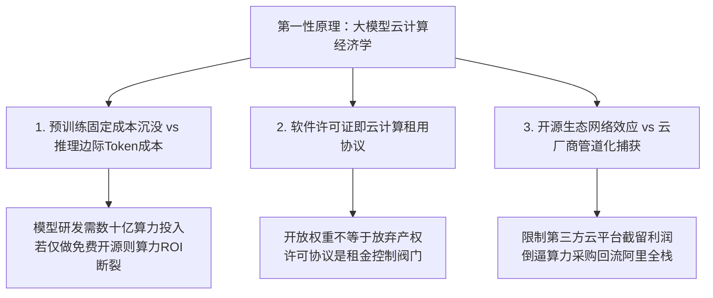
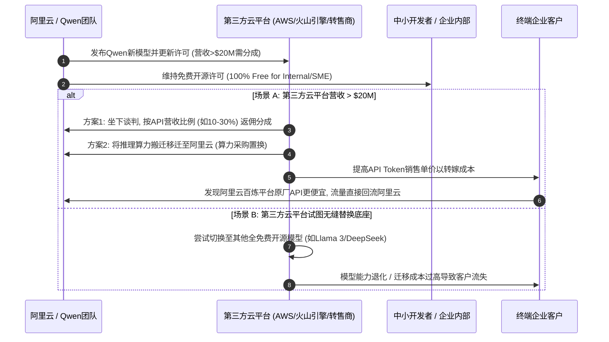
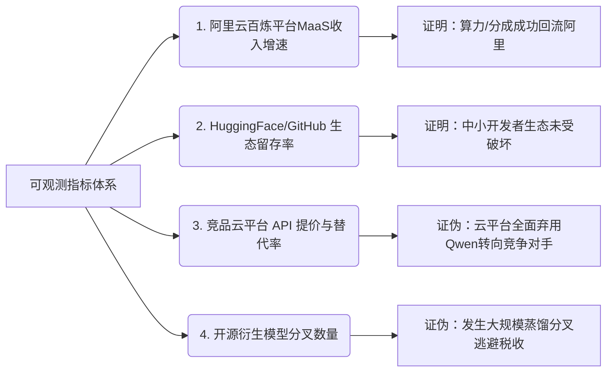

# 阿里Qwen开源许可商业化演变与云计算竞争格局深度剖析

## 1. 问题复述与核心视角剖析

在生成式AI时代的云计算基础设施竞争中，阿里巴巴拟对Qwen（通义千问）开源模型实施“针对高收入套壳/托管API商用大户收分成”（以Trailing 12 Months营收超过2000万美元为门槛）的商业许可新规。这一策略从本质上揭示了**模型提供商与云基础设施运营商之间的“管道化”（Pipelining）防守与算力绑定博弈**：
- **云厂商算力绑定与Token计费**：云计算的计费单元正从传统IaaS的“vCPU/小时”加速演进为MaaS（Model-as-a-Service）的“元/百万Token”。开源模型作为算力消纳的核心载体，模型拥有者旨在通过模型领先性锁定云计算推理算力。
- **下游云平台管道化风险**：AWS Bedrock、字节火山引擎、腾讯云等第三方云平台通过直接托管Qwen开放权重对外售卖API Token，获取高额云算力毛利与客户关系，导致阿里承担了数十亿级别的底层R&D沉没成本，却面临“模型在左、利润在右”的被管道化威胁。
- **开源许可门槛博弈**：阿里借鉴Meta Llama（7亿月活门槛）及Moonshot Kimi K3（2000万美元营收门槛）策略，通过在许可协议中设置高收入商业化门槛，强制规模化API转售商从“免费搭便车”转向“坐下谈判分成或算力协同”，以实现开源生态的自我造血闭环。

---

## 2. 第一性原理与博弈前置条件

大模型开源与云计算商业化的博弈，遵循以下三大第一性原理：



### 1) 算力沉没成本与Token边际收益分离（Pre-training Cost Sunk & Inference Marginal Revenue）
大模型研发具有极高的前置固定成本（Capital Expenditure, CapEx），包括数万卡集群的预训练算力、电力及顶尖人才成本；而推理端则是线性扩张的边际Token运维成本（Operational Expenditure, OpEx）。在传统开源许可（如Apache 2.0）下，模型研发者的CapEx无法转化为自身的OpEx收益，反而被拥有终端客户流量的第三方云平台（如AWS、火山引擎）通过提供托管API转化为其自身云算力的OpEx收入。

### 2) 许可协议是云计算生态的“关卡税阀”（License as Cloud Tariff Valve）
开放权重（Open Weights）绝不等于绝对自由软件。在AI时代，“软件许可协议”已从传统的代码版权法律文本，演变为**云计算算力导流与利润再分配的监管阀门**。当开源模型达到SOTA水平并形成行业事实标准时，版权所有方拥有调整许可协议条款的定价权。

### 3) 成立的前置条件（Prerequisites）
此商业逻辑成立必须同时满足以下四个前置条件：
1. **模型具备绝对的不可替代性（Substitutability Resistance）**：Qwen在开源基准测试（如MMLU-Pro, MATH-500, HumanEval）及实际复杂推理场景中必须显著优于Llama等竞争对手，使下游API转售商无法轻易无缝替换底座。
2. **监管与法律执行力（Jurisdictional Enforcement）**：在主要云计算消费国（中国、北美、欧洲），模型许可协议变更具备清晰的版权保护法律依据，能对未授权商用的规模化厂商提起侵权诉讼。
3. **精准区隔开发生态与商业收割（Precision Segmentation）**：中小开发者、科研机构及企业内部私有部署必须维持100%免费，确保开源生态活跃度（GitHub Stars、HuggingFace Downloads）不衰减。
4. **阿里云全栈推理成本优势（Full-Stack Cost Leadership）**：阿里云百炼平台凭借自研AI芯片、CUBE 5.0架构数据中心与推理加速引擎，在Token单价上必须保持行业极高性价比，使第三方云平台即便缴纳分成后也难以价格战倾销。

---

## 3. 权威数据与竞争态势搜证

根据行业公开数据及市场搜证，云计算与大模型商业化的协同效应呈现出以下关键数据指标：

| 维度 / 厂商 | 核心数据 / 许可政策 | 数据出处与竞争态势 |
| :--- | :--- | :--- |
| **阿里云 AI 算力收入** | AI相关产品收入占阿里云外部商业化收入比例突破 **30%**，AI算力与Token推理成为取代传统ECS的主引擎。 | 阿里云财报与季度战略发布会（2024-2026） |
| **Qwen 开源生态影响力** | 累计下载量超 **1亿+**，GitHub 标星超 **2.5万+**，衍生微调模型数以万计，在HuggingFace开源排行榜长期位居前三。 | GitHub / HuggingFace 官方统计（2026） |
| **Meta Llama 3 商业门槛** | 规定 Trailing 700M Monthly Active Users（7亿月活用户）必须获得Meta单独商业授权。 | Meta Llama 3 Community License Agreement |
| **Moonshot Kimi K3 门槛** | 规定连续12个月商业服务营收超过 **2000万美元** 需另行签署商业付费分成协议。 | Moonshot AI Official Licensing Terms |
| **第三方云平台托管现况** | AWS Bedrock, 字节火山引擎, 腾讯云TI平台, 百度智能云千帆 均提供Qwen系列模型的托管与API服务。 | 各云厂商控制台与API产品文档 |

```
【数据解读与市场实况】：
在未调整商业许可前，下游聚合API平台（如部分三方转售商）基于Qwen模型搭建API转售服务，单月API营收达数百万元人民币，但未向阿里云支付任何模型授权费用，且其算力部署在异构云基础设施上。阿里云单方面承担了Qwen3/Qwen3.5系列的训练算力支出（估计单代模型消耗数千万美元算力成本），商业失衡极其严重。
```

---

## 4. Qwen商业许可新规的动态博弈模型与传导机制

### 4.1 竞争格局与博弈架构图

下图展示了阿里巴巴通过设置2000万美元营收门槛后，在上游模型厂商、下游云平台、SME开发者及终端客户之间的价值流动与博弈关系：


### 4.2 商业模式传导逻辑（Mermaid 业务逻辑链）



### 4.3 云计算毛利重构与反管道化计算公式

假设某第三方云平台通过托管Qwen API实现年度收入 $R_{api} = \$5,000 \text{万}$：
1. **原模式（免费搭便车）**：
   - 云算力成本 $C_{compute} = \$3,000 \text{万}$
   - 云平台净毛利 $\Pi_{old} = R_{api} - C_{compute} = \$2,000 \text{万}$
   - 阿里所得 $V_{ali} = \$0$

2. **新许可模式（分成比例 $\alpha = 15\%$ 或算力绑定）**：
   - 商业分成 $Lic_{fee} = R_{api} \times 15\% = \$750 \text{万}$
   - 若云平台选择全额缴纳：其净毛利降至 $\Pi_{new} = \$1,250 \text{万}$
   - 若云平台选择与阿里云签订**混合云/异构算力采购协议**：将其 $50\%$ 的推理算力订单转包给阿里云计算节点，阿里云实现由“模型开源”向“算力销售”的顺畅转化。

---

## 5. 适用边界与失效场景分析

针对“对大户收品牌/API转售分成”这一策略，在实际市场执行中存在清晰的边界。以下总结其适用场景与可能失效的破坏性场景：

### 5.1 策略成立与生效场景（Valid Regimes）
1. **聚合API服务商与托管云平台（API Aggregators & Cloud Brokers）**：直接包装 `Qwen-API` 按Token计费出售给第三方，且缺乏自有核心算法微调，仅靠转售赚取差价的企业。此类企业法律合规风险极高，极易被直接审计并强迫分成。
2. **Headroom极为明显的SOTA模型发布节点**：例如当Qwen发布具有断代领先优势的旗舰版本（如Qwen3.8-Max）时，下游客户指定要求使用Qwen，转售商无法用替代模型满足需求。
3. **大型 SaaS 企业的垂直AI功能模块**：当大型SaaS公司营收超过2000万美元，且其核心AI功能依赖Qwen原生API时，倾向于与阿里签订战略合作以获得保障性SLA与优惠分成。

### 5.2 策略失效与破坏性反噬场景（Invalidation & Risks）
1. **极端蒸馏与权重衍生分叉（Distillation & Hard Fork Risk）**：
   - *机制*：大型云厂商（如AWS或字节）利用Qwen顶级模型输出的合成数据（Synthetic Data）去蒸馏自研的小模型（如8B/14B），或在Qwen权重上做深度持续预训练（Continued Pre-training）后更名为新模型。
   - *后果*：从法律上较难判定衍生权重是否继续适用原许可的分成条款，导致商业归属权模糊。
2. **生态竞争割裂与开发者转移（Developer Flight to Pure Open-Source）**：
   - *机制*：若2000万美元门槛在执行中出现界定模糊（例如是否包含使用Qwen的企业整体SaaS营收），可能引发开源社区恐慌。
   - *后果*：开发者生态可能向完全采用无限制开源协议（如Apache 2.0 / MIT）的模型（如DeepSeek或Meta Llama部分衍生版本）倾斜。
3. **“分布式违规”与监管穿透成本高昂（Audit & Enforcement Friction）**：
   - *机制*：大量中东、东南亚或去中心化API转售商通过匿名节点部署Qwen开源权重并转售。
   - *后果*：阿里跨国追责与财务审计成本高于潜在的分成收益，造成“合规巨头被抽税、灰色小平台偷漏税”的劣币驱逐良币效应。

---

## 6. 可观测的证明与证伪手段

为评估该商业许可新规策略的实际成效，可通过以下可观测的量化指标体系进行验证或证伪：



### 定量监测指标表（Verification Matrix）

| 观测维度 | 证明信号（Strategy Valid） | 证伪信号（Strategy Failed） | 测量方法与数据源 |
| :--- | :--- | :--- | :--- |
| **1. 算力与分成回流** | 阿里云AI相关收入增速保持年化 **>40%**，来自第三方云平台的合作分成/异构算力订单显著增加。 | 阿里MaaS收入增速下滑，商业合作未带来实质增量收入。 | 阿里巴巴集团季度财报及 Cloud Infrastructure Services 统计 |
| **2. 开发者生态健康度** | Qwen在GitHub上的Star数、HuggingFace月度下载量无明显下滑，保持开源榜前二。 | 下载量与社区讨论度出现断崖式下跌，开发者大幅转向完全自由开源模型。 | OpenXLab / HuggingFace API 监控 / GitHub Trends |
| **3. 下游转售商行为** | 营收>2000万美元的Top5聚合API厂商主动与阿里云百炼签订商业协议或迁移算力。 | 巨头云厂商通过法律诉讼抗辩，或直接下架Qwen模型托管服务。 | AWS Bedrock / 火山引擎产品更新公告与API列表 |
| **4. 模型分叉与蒸馏率** | 基于Qwen官方架构的微调模型仍占主流（>60%）。 | 市场上出现大量去Qwen化的重命名蒸馏模型，以此规避2000万美元营收审计。 | HuggingFace Model Hub 衍生模型 Metadata 深度分析 |

---

## 7. 结论与云计算竞争终局

阿里巴巴拟对Qwen开源模型设置“2000万美元商业分成门槛”，标志着**大模型开源战略从“单向免费输血的跑马圈地时代”，正式跨入“云智协同与闭环造血的商业成熟期”**：

1. **反管道化是云厂商的必然选择**：大模型预训练是极其昂贵的资本投入。阿里绝不会甘于沦为仅提供开源软件的“打工人”，通过许可协议将开源影响力转化为阿里云的算力消纳与商业分成，是大模型云计算经济学的必然逻辑。
2. **分层收税实现生态双赢平衡**：通过对99%的中小开发者与企业内部部署维持彻底免费，确保生态网络效应不减；仅对1%依靠模型包装销售获利超1.4亿元人民币的商业大户提成，能够在捍卫生态繁荣的同时建立商业可持续性。
3. **云计算竞争走向“全栈性价比”终局**：未来的胜负手不仅取决于许可协议的约束力，更取决于阿里云自身能否凭自研芯片、CUBE 5.0数据中心与百炼推理引擎，提供全球最低单Token成本。唯有极致的全栈算力性价比，才能让下游厂商即使在商业新规下，依然选择深度绑定阿里云。

---
*稿件完成时间：2026年8月10日*  
*保存路径：`/Users/digoal/new/tmp/tmp1/markdown/experts/3-云计算与大模型竞争格局.md`*  
*相关图表：``*
