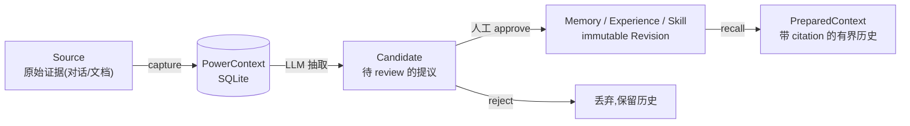
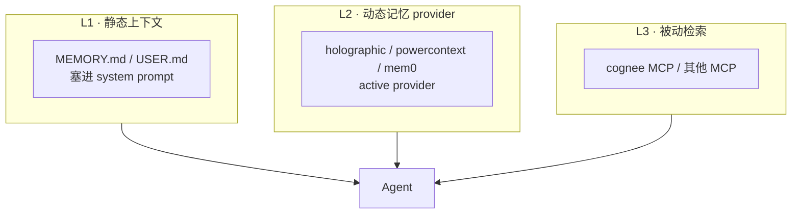
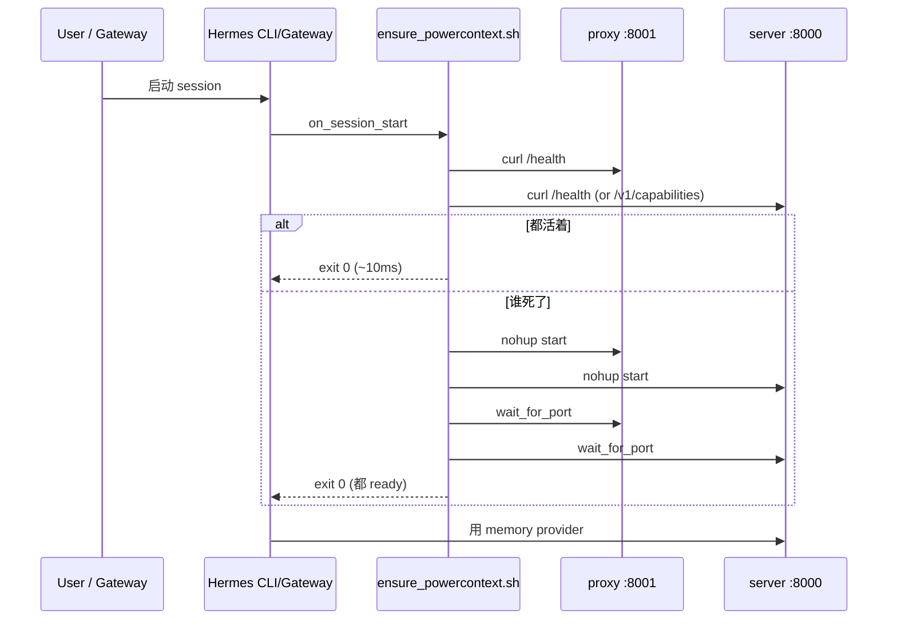

## 在 Hermes 里把 Holographic 换成 PowerContext: 不是升级数据库,是接入一套"有治理的长期记忆"
  
### 作者  
digoal  
  
### 日期  
2026-09-02  
  
### 标签  
AI , Agent , Memory , PowerContext , holographic
  
----  
  
## 背景 

> 主人切到 PowerContext 之后,记忆没有变多,但每一条记忆都有了出处、修订号和治理边界。难点不在装软件,在三件容易被低估的事:让 minimax 的私有 embedding schema 通过 OpenAI 标准接口被消费、主动 backfill 向量索引、让进程跟 Hermes session 生命周期绑死。

## 一次真实的"为什么切换"决策

我之前的 Hermes 用的是 holographic —— 一个本地 SQLite + FTS5 + HRR 向量的轻量 provider。它够用了一年多,**52 条 user_pref / project / tool / general 类型的事实**塞在里面,FTS 召回稳定,agent 用得顺。这 52 条是 2026-09-02 实测的最终数字,不是估的。

后来我开始写长文、做跨会话复盘、跟踪多项目进度。三件事慢慢露出 holographic 的边界:

1. 我想要"这条记忆是哪个 Source 来的"——holographic 没有 evidence lineage。
2. 我想让 LLM 提议新记忆,我自己 review 再 approve——holographic 没有 candidate governance,LLM 直接写进去就是事实。
3. 我想从一次"研究"的中间状态切到另一个会话继续——holographic 没有 handoff artifact。

这三条不是"性能更好",是"治理能力"。PowerContext 是 PowerMem 的下一代,它把这三件事当作一等公民。

PowerContext 不是 holographic 的"更快的版本"。它是范式切换:从"agent 自己维护记忆"变成"专用 server + 显式 artifact revision + 显式 review"。我切之前先想清楚自己要不要这三件治理能力;不要的话,holographic 已经够用。

## PowerContext 真正增加的能力是什么

读 PowerContext 文档时,容易先被"vector / hybrid 召回"吸引,但那不是它跟 holographic 的最大差异。holographic 也可以挂 BGE 向量,也能做 hybrid。

真正的差异是这四类 artifact 和它们的治理边界:



- `Memory` 长期事实,只能显式 remember,或 LLM 提议后人工 review。
- `Experience` "什么方法有效 + 教训",只能从 approved Memory 提炼,Review 才能变 Skill-ready。
- `Skill` 可重复执行步骤,必须从 approved Experience 导出,不会自动安装。
- `Handoff` 跨会话、跨模型、跨 Agent 交接的工作包,带 boundary + evidence + receiver check。

LLM 在这个体系里只能产生 Candidate,不能自己 approve。这条边界让"治理"从口号变成可执行机制。

## Hermes 三层架构:切 L2 不破坏 L1/L3

Hermes 的长期记忆是三层叠加,不是单一组件:



切换 L2 只影响 L2。`MEMORY.md`、`USER.md`、cognee 知识图谱、其他 MCP 都不动。我切完之后:

- holographic SQLite 完整保留在 `~/.hermes/profiles/digoal/memory_store.db`。
- `hermes memory setup holographic` 一行切回零损失。
- cognee MCP 不受影响。

这一点决定了"切换"是低风险动作,不是高风险迁移。

## minimax 双模型:generation 与 embedding 的不对称

minimax-cn 同时做 generation 和 embedding 看起来自然,实际上协议不对称,踩坑集中在 embedding。

### generation: anthropic 协议,直连

PowerContext 的 generation model 接受 anthropic 前缀,配上 minimax 的 anthropic 兼容 base_url,直连即可:

```
POWERCONTEXT_SERVER_INFERENCE_GENERATION_MODEL=anthropic:MiniMax-M3
POWERCONTEXT_SERVER_INFERENCE_GENERATION_BASE_URL=https://api.minimaxi.com/anthropic
ANTHROPIC_API_KEY=$MINIMAX_CN_API_KEY
```

pydantic-ai 自己识别 `anthropic:` 前缀,从 `ANTHROPIC_*` env 读 key。

### embedding: 私有 schema,需要 reverse proxy

minimax 的 `/v1/embeddings` endpoint 用的是私有 schema,跟 OpenAI 标准 `{input: [...]}` 不兼容:

| 字段 | OpenAI 标准 | minimax 实际 |
|---|---|---|
| 请求体字段 | `input: string \| string[]` | `texts: string[]` |
| 必填字段 | `model` | `model` + `type: "db" \| "query"` |
| 认证 | `Authorization: Bearer *** ` | `Authorization: Bearer *** ` |
| 响应字段 | `data[*].embedding` | `vectors[*]` + `base_resp` |

试一次就能确认:带 `input` 字段的 OpenAI 风格请求,minimax 返回 `missing required parameter: texts`。

pydantic-ai 的 OpenAIProvider 走标准 OpenAI SDK,不会塞 `texts` 也不会塞 `type`。直接接不上。

最干净的解决方案不是改 pydantic-ai 源码,而是在 PowerContext 和 minimax 之间放一个 stdlib HTTP reverse proxy,把 schema 翻译掉。零第三方依赖,80 行 Python,监听 127.0.0.1:8001:

```bash
python3 /root/new/shared_proj/powercontext-deploy/scripts/embed_proxy.py --port 8001 &
```

PowerContext 这边走标准 OpenAI schema:

```
POWERCONTEXT_SERVER_INFERENCE_EMBEDDING_MODEL=openai:embo-01
POWERCONTEXT_SERVER_INFERENCE_EMBEDDING_BASE_URL=http://127.0.0.1:8001/v1
POWERCONTEXT_SERVER_INFERENCE_EMBEDDING_PROFILE_ID=embo-01-1536-unit
POWERCONTEXT_SERVER_INFERENCE_EMBEDDING_DIMENSION=1536
```

这个 proxy 是"翻译"角色,不是缓存,不是限流器。如果以后换供应商(比如 OpenAI 官方、阿里云 DashScope),改 proxy 或者直接换 base_url 都可以。

## 自动化:on_session_start hook 替代 systemd

部署完之后,两个进程(server 在 8000、proxy 在 8001)一直在后台跑。但本部署的场景里,容器没 systemd(`pid 1 = postgres`,不是 `init`)。这意味着后台进程死了不会自愈,我也不想引入 supervisord 或者写 docker-compose 重启策略。Hermes 自己有一个轻量 hook 体系,刚好覆盖这个需求。

Hermes 的 shell hook 是声明式的:`hooks:` 块写在 `~/.hermes/config.yaml` 里,事件触发时跑子进程。它跟 plugin hook、gateway hook、outbound webhook 是同一套机制。

我要的事件是 `on_session_start`:每次新 session(CLI `hermes chat` 或 messaging gateway)都触发。脚本逻辑极其朴素:

1. curl 127.0.0.1:8000 和 8001 探活。
2. 都活着就 return,几毫秒。
3. 谁死了就 `nohup ... & disown` 后台拉起。
4. `wait_for_port` 等端口 up 再 return,给 caller 一个 ready 信号。

```yaml
hooks:
  on_session_start:
    - command: /root/.hermes/profiles/digoal/agent-hooks/ensure_powercontext.sh
      timeout: 30
hooks_auto_accept: true
```

`hooks_auto_accept: true` 让未来新增的 hook 也不弹 consent prompt —— 在容器 TTY 不可靠的环境必需。首次跑 `hermes chat --oneshot --accept-hooks` 把 hook 写入 `~/.hermes/shell-hooks-allowlist.json`,之后 CLI 和 gateway 都直接通过。



我端到端测过:手动 `kill` 两个进程,再跑 `hermes chat --oneshot -q 'hi'`,两个进程都被 hook 自动拉起,chat 也正常返回。这是本部署场景下的"轻量 systemd"——没 systemd 的容器、init 不是 init 的容器,或者不想引入额外守护进程的场景都适用。

## 切回路径:零损失回滚

PowerContext 切完之后,holographic SQLite 没动。它还在 `~/.hermes/profiles/digoal/memory_store.db`,52 条事实原封不动。要回滚:

```bash
hermes memory setup holographic
hermes memory status   # 应显示 holographic ← active
```

如果 PowerContext 这边的数据也想保留,就让它继续跑;切回只是改 `memory.provider` 字段,数据不会被删除。

实际上更常见的是"双开":PowerContext 作为主 provider,holographic 作为备份,偶尔用 `fact_store` 读老数据做交叉验证。两者并存没有冲突,因为数据存储是隔离的(SQLite 文件不同)。

## 实战 7 步

下面是 2026-09-02 真实跑通的命令序列。每一步都标了为什么这样、踩了什么坑。

### Step 1:克隆 + 装 CLI

```bash
mkdir -p /root/new/shared_proj/powercontext-deploy
cd /root/new/shared_proj/powercontext-deploy
git clone --depth 1 --branch master https://github.com/oceanbase/powercontext.git src
ALL_PROXY=socks5://host.docker.internal:11112 uv tool install --force src --with 'powercontext[cli,server]'
```

Hermes profile 把 `$HOME` 改成 `~/.hermes/profiles/<profile>/home`,uv 装到那边的 bin。`~/.bashrc` 加:

```bash
export PATH="/root/.hermes/profiles/digoal/home/.local/bin:$PATH"
```

### Step 2:写 embedding reverse proxy

`scripts/embed_proxy.py` 在仓库里,80 行 stdlib,翻译 OpenAI ↔ minimax schema。从 `MINIMAX_CN_API_KEY` env 读 key。

### Step 3:写 server env-file

`server.env` (chmod 600):

```ini
POWERCONTEXT_SERVER_INFERENCE_GENERATION_MODEL=anthropic:MiniMax-M3
POWERCONTEXT_SERVER_INFERENCE_GENERATION_BASE_URL=https://api.minimaxi.com/anthropic
POWERCONTEXT_SERVER_INFERENCE_GENERATION_TIMEOUT_SECONDS=90
POWERCONTEXT_SERVER_INFERENCE_GENERATION_MAX_REQUESTS=2

POWERCONTEXT_SERVER_INFERENCE_EMBEDDING_MODEL=openai:embo-01
POWERCONTEXT_SERVER_INFERENCE_EMBEDDING_BASE_URL=http://127.0.0.1:8001/v1
POWERCONTEXT_SERVER_INFERENCE_EMBEDDING_PROFILE_ID=embo-01-1536-unit
POWERCONTEXT_SERVER_INFERENCE_EMBEDDING_DIMENSION=1536
POWERCONTEXT_SERVER_INFERENCE_EMBEDDING_NORMALIZATION=unit

POWERCONTEXT_SERVER_HTTP_HOST=127.0.0.1
POWERCONTEXT_SERVER_HTTP_PORT=8000
POWERCONTEXT_SERVER_DATABASE_KIND=sqlite
POWERCONTEXT_SERVER_RUNTIME_MEMORY_EXTRACTION_PROFILE=coding
POWERCONTEXT_SERVER_RUNTIME_SCHEDULE_SECONDS=60

ANTHROPIC_BASE_URL=https://api.minimaxi.com/anthropic
ANTHROPIC_API_KEY=${MINIMAX_CN_API_KEY}

OPENAI_API_KEY=proxy
OPENAI_BASE_URL=http://127.0.0.1:8001/v1
```

踩坑:

- pydantic-settings 不接受空字符串 embedding 字段。`EMBEDDING_MODEL=` 直接删行,用 default `None`。
- pydantic-settings 不接受 `MODEL_SETTINGS={...}` env JSON。整行删,pydantic-ai 默认设置够用。
- minimax 启动 probe 慢,30 秒超时不够。`GENERATION_TIMEOUT_SECONDS=90`。
- platform secret 掩码会替换 `ANTHROPIC_API_KEY=*** 为 `«redacted:sk-…»`。必须用 `terminal` 的 `cat > file <<EOF` 写入,绕开 `patch`/`write_file` 工具。

### Step 4:起 server + 装 Hermes 集成

```bash
python3 scripts/embed_proxy.py --port 8001 &
powercontext server run --host 127.0.0.1 --port 8000 --env-file server.env &
powercontext doctor    # 应 all ready
powercontext capabilities   # Search modes 应含 vector/hybrid
powercontext setup hermes --source /root/new/shared_proj/powercontext-deploy/src
powercontext doctor hermes
```

`doctor` 的 `inference.generation: ready` + `inference.embedding: ready` 是关键。

### Step 5:切 memory provider + 写 config

```bash
mkdir -p ~/.hermes/profiles/digoal/powercontext
cat > ~/.hermes/profiles/digoal/powercontext/config.json <<EOF
{
  "base_url": "http://127.0.0.1:8000",
  "scope_id": "hermes:digoal:{user_id}",
  "max_bytes": 8000,
  "timeout": 5,
  "capture_turns": true,
  "flush_on_session_end": true,
  "capture_pre_compress": false,
  "evaluation_trace": false,
  "workstream_persistence": true
}
EOF
hermes memory setup powercontext   # 非交互切换
hermes memory status               # 应显示 powercontext ← active
```

`hermes memory setup <provider>` 直接传 provider 名是非交互的,适合脚本化。

### Step 6:导入历史记忆

`scripts/import_holographic_to_powercontext.py` 读 holographic SQLite 的 `facts` 表,逐条 POST `/v1/memory/remember`. `user_pref` → `preference` kind,其他 (`project` / `tool` / `general`) → `fact`. 每条 memory 的文本前缀 `[holo#N cat trust=X.XX]` 携带 holographic fact_id,`reason` 字段带 `imported_from=holographic; orig_id=N; orig_category=X`.

我倒入了 52 条 facts(2026-09-02 实测,没有 `digoal-mem.md` 这个文件,holographic SQLite 里也只有 52 条),全部成功,24 秒。PowerContext server 端的 scope 实测是 `hermes:digoal:9b25d02b9a5c17ec`,不是 `hermes:<profile>:cli`,后面 stats / entries / search 都要用这个真值。

**踩坑:capture_source+flush 走不通**。我先试了把 12.5KB markdown 单源灌入 `/v1/sources/content` 然后 `/v1/memory/flush`,server 跑了 7 次 generation 调用,token 烧了 15042 in + 1972 out,但 entry 数 0 增长——LLM extract 把所有事实合并进了已经存在的 7 条本会话 entry,版本号从 1 升到 4,没有任何新条目。原因是 PowerContext 的 extract 倾向 update-in-place 而不是无脑新增。最后改用逐条 `/v1/memory/remember`(每条 ≤8KB,文本前缀 `[holo#N]`),才真正灌进去。

**幂等性:不幂等,重复跑写双倍**。灌前先 `powercontext entries list --scope-id <scope>` 检查 `[holo#N` 前缀已存在的最大 N,跳过这些 ID。

### Step 7:rebuild 向量索引(关键)

这一步不做,vector 召回永远是空的。

PowerContext 的 HTTP API 不暴露 `rebuild_projections`。capabilities 端点会报 `vector / hybrid enabled`,但实际 search 会 `capability_not_supported`,因为 SQLiteMemoryVectorIndex 的 `vector_complete` 检查所有 entry 都有向量,而启用 embedding 前已 commit 的 entry 还没向量。

脚本 `scripts/rebuild_memory_vectors.py` 在 server 进程外跑,用 powercontext venv 的 python3 加载 `ServerSettings`,调私有 helper `_embedding_models` 构造 embedding model,然后 `RelationalMemoryBackend.rebuild_projections(embedding_model)`:

```bash
pkill -f 'powercontext server run'
/root/.hermes/profiles/digoal/home/.local/share/uv/tools/powercontext/bin/python3 \
  scripts/rebuild_memory_vectors.py \
  --env-file server.env \
  --scope 'hermes:digoal:cli'

powercontext server run --host 127.0.0.1 --port 8000 --env-file server.env &
```

跑完看 `pc_memory_entry_vec` 行数,应等于 active entries + 1 probe(54 + 1 = 55)。

## 实战:装 on_session_start hook

按上面的"自动化"章节,把脚本放好、config 改好:

```bash
cp scripts/ensure_powercontext.sh ~/.hermes/profiles/digoal/agent-hooks/ensure_powercontext.sh
chmod +x ~/.hermes/profiles/digoal/agent-hooks/ensure_powercontext.sh
```

`~/.hermes/profiles/digoal/config.yaml` 加:

```yaml
hooks:
  on_session_start:
    - command: /root/.hermes/profiles/digoal/agent-hooks/ensure_powercontext.sh
      timeout: 30
hooks_auto_accept: true
```

首次:

```bash
export HERMES_ACCEPT_HOOKS=1
hermes chat --oneshot --accept-hooks -q 'hi' --max-turns 0
```

之后 `hermes hooks doctor` 应全 ✓,日常 session 自动健康。

## 沉淀产物

部署完,我把它沉淀成三件套:

- `skill` `powercontext-deploy-on-minimax` —— 程序化产物,以后类似部署直接调。包含 7 步 + 常见坑 + 产出物清单 + 与现有部署的关系。
- `MEMORY.md` 关键事实段 —— 持续可查的部署状态(PID 范围、env-file 路径、坑速查)。
- `scripts/` 四件套 —— `embed_proxy.py`、`import_holographic_to_powercontext.py`、`rebuild_memory_vectors.py`、`ensure_powercontext.sh`,任何一台机器都可以直接复用。

Skill 不在多,在通用、被高频调用、稳定运行。`powercontext-deploy-on-minimax` 满足这三条:任何 "切 PowerContext" 的指令进来,它能直接驱动整个流程,不需要再读 README 推断。

## 接下来该看什么

部署完之后,有几个信号值得观察,确认 PowerContext 的治理能力真的在工作:

1. Model usage 的拆分粒度: `powercontext stats` 应该能看到 `memory_extraction generation` / `memory_indexing embedding` / `memory_recall embedding` 三类分开计费。如果三类不分,说明 inference 配置没生效。
2. revision 数字增长: 每条 flush 后 `memory.revision` 应该 +1。如果不动,说明 scheduler 没在跑。
3. vector 召回的真实命中: 搜索时应该出现 `matched_by=['vector']` 和 `['fts', 'vector']` 两种。如果全 `['fts']`,说明 vec 表空了,要再跑一次 `rebuild_memory_vectors.py`。
4. Candidate 出现: 故意提一个事实性建议(比如"我觉得主人最近在学 Rust"),`powercontext candidate list --scope-id ...` 应能看到 pending candidate。LLM 提议但没自己 approve,这是治理在工作。
5. on_session_start hook 真触发: `tail -f ~/.hermes/profiles/digoal/logs/powercontext/*.log` 应能看到每次新 session 的启动记录。
6. 跨 session handoff: 写一段"研究到一半"的工作,commit handoff,新 session `continue` 时能接回精确状态。

任何一个信号不对,说明对应环节没接好。

## 结论

PowerContext 在 Hermes 里的角色,是把"agent 自己维护记忆"变成"agent 跟一个专用治理 server 协作"。多出来的不是 recall 速度,是:

- 每条 memory 都有 source citation 和 revision 编号。
- LLM 提议的 candidate 必须人工 review,不能自己 approve。
- 跨 session / 跨模型 / 跨 Agent 交接的工作可以 handoff,带 evidence + receiver check。

部署真正难的三件事:
1. minimax embedding 私有 schema 跟 OpenAI 标准不兼容 —— 一个 80 行 stdlib reverse proxy 翻译掉。
2. 首次启用 embedding 必须 backfill —— HTTP API 不暴露,自己跑一次性脚本。
3. 本部署场景没 systemd(pid 1 不是 init)—— Hermes `on_session_start` shell hook 替代,几毫秒 ping + 自愈。

切之前想清楚:要不要 candidate governance?要不要 evidence lineage?要不要跨 session handoff?不要的话,holographic 已经够。要的话,我评估过几个开源项目(mem0、LangMem、Letta 等),PowerContext 是少数同时把这三件做成一等公民的方案之一,也是跟 Hermes 有官方集成的唯一一个。

## 参考来源

- PowerContext README: <https://github.com/oceanbase/powercontext/blob/master/README_CN.md>
- PowerContext HTTP API 生命周期教程: <https://github.com/oceanbase/powercontext/blob/master/docs/zh/docs/tutorials/api-quickstart.md>
- PowerContext Hermes 集成: <https://github.com/oceanbase/powercontext/blob/master/integrations/hermes/README.md>
- Hermes Event Hooks 文档: <https://nousresearch.github.io/hermes-agent/website/docs/user-guide/features/hooks>
- PowerMem 项目主页: <https://www.powermem.ai/>
  
  
#### [PostgreSQL 解决方案集合](../201706/20170601_02.md "40cff096e9ed7122c512b35d8561d9c8")
  
  
#### [德哥 / digoal's Github - 公益是一辈子的事.](https://github.com/digoal/blog/blob/master/README.md "22709685feb7cab07d30f30387f0a9ae")
  
  
#### [About 德哥](https://github.com/digoal/blog/blob/master/me/readme.md "a37735981e7704886ffd590565582dd0")
  
  

  
