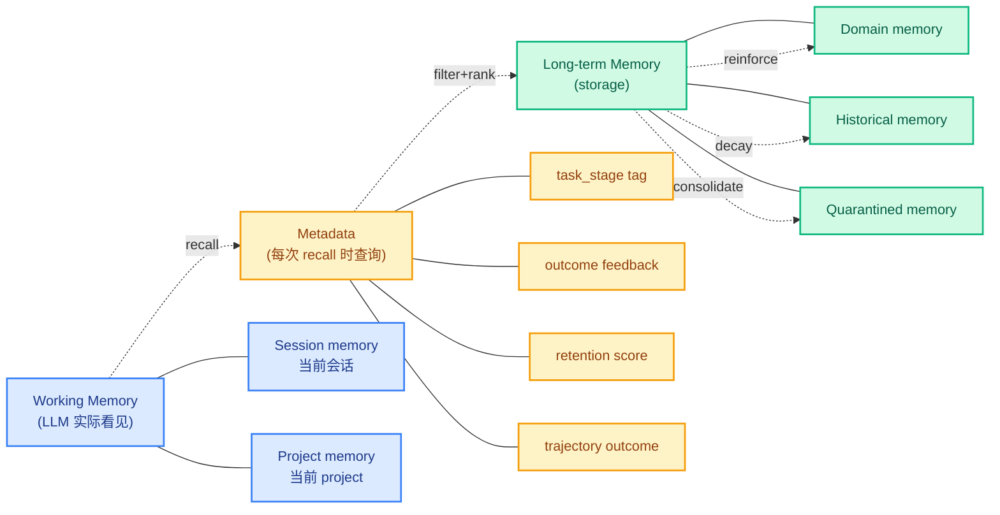
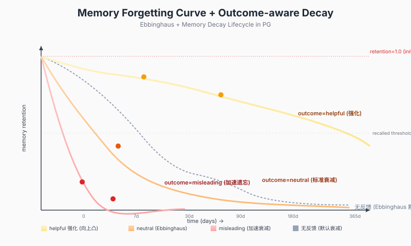
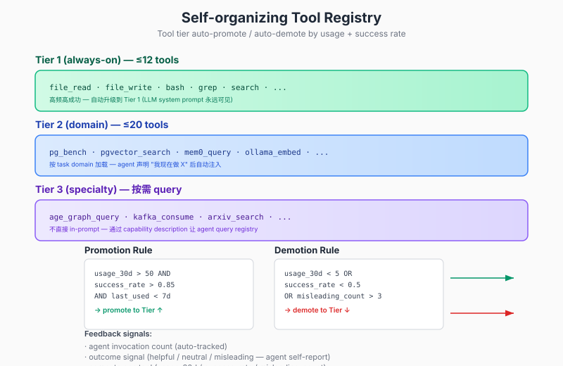

## Agent 长期使用为什么质量漂移 —— 三个根因和一套 PG 全栈 substrate 解决
  
### 作者  
digoal  
  
### 日期  
2026-09-08  
  
### 标签  
PG , PostgreSQL , 上下文管理 , 记忆 , memory , skill , tools , mcp , 质量漂移 , Agent 
  
----  
  
## 背景  


2026 年, agent 从 demo 走到生产, 跑了一两个月后几乎所有团队都会撞上同一堵墙: **agent 一开始很灵光, 任务完成度高, 反馈也好; 用着用着开始飘——同一个 prompt, 上周还能给出精准答案, 这周就开始绕圈子、用错工具、甚至产出明显背离意图的结果**。**memory 池越攒越大, tool/skill 注册表越加越长, context window 没爆但行为已经在退化了**。这一篇把"质量漂移"拆到根因层, 给出四个底层机制 + 一套基于 PostgreSQL + pgmnemo + 川序 + AGE 的 substrate 实现路径。

## 三个症状一个根: 看似独立的问题其实是同一棵病

长期 agent 容易观察到的现象集中在三件事上:

**症状 1 · 上下文爆炸**。最表面, 也最被误诊。表面上"token 不够用", 但稍微留心一下就发现: **很多 agent 离 token 上限还远得很, 行为已经在退化**。Lost-in-the-Middle 这个现象 (Liu et al. 2023, "Lost in the Middle") 在 GPT-4 / Claude / Gemini 上都复现过: context 越长, 模型对**位于 context 中间**的信息关注度越低; 当 context 超过一定阈值, **模型开始把注意力塌缩到头尾**。所以"context 爆炸"这个词其实是误导, 真正的麻烦是 **"attention-budget 退化"**——**context 越长, 实际被有效读取的信息越少**。

**症状 2 · 记忆召错位**。agent 自豪地宣称"我记住了上次你说的 X", 但调出来的东西偏偏不是当前 task 需要的——比如你问"PG 的 B-tree 索引怎么建", 它把"上次 PG 索引膨胀怎么修"那篇召回过来; surface 相似, intention 错配。**这是 embedding-only retrieval 的根本缺陷: 只看语义相似度, 不看场景适配性**。pgmnemo 0.4.0 paper-canonical 的 hybrid (标量 + 向量 + HNSW) 在 recall@K 上比纯 vector 高 4.15pp (姊妹篇 1~2 实测过), 但**hybrid 也只解决"召得更准", 不解决"召得更合时"**。

**症状 3 · 工具选择不稳定**。100 个 tool 全塞在 system prompt 里, 模型要做 100 分类——**当 tool 数量上升, tool selection 准确率单调下降** (这是 ReAct / Toolformer 论文都观察到的)。更深的问题是: **tool 的 description 是写 description 那一刻的人类意图, 跟 agent 三个月后在某个具体 task 里想用它时的意图, 必然存在 semantic gap**。

把这三个症状摆在根因层看, 它们其实是**同一棵病的三根枝**:

```
┌──────────────────────────────────────────┐
│ Layer 3 — Output                         │
│ "质量不稳定": 同一个 prompt 不同时间输出差  │
│                                          │
│ 上周能精确, 这周开始绕圈子 / 用错工具 /     │
│ 输出背离意图                                 │
└──────────────┬───────────────────────────┘
               │ 表现层
┌──────────────▼───────────────────────────┐
│ Layer 2 — Process                         │
│ 三种选择失误 (决策层)                         │
│  · tool 选错 (描述与意图 semantic gap)    │
│  · memory 召错位 (相似但场景不同)         │
│  · skill 触发错 (重复跑已失败的路径)      │
└──────────────┬───────────────────────────┘
               │ 决策层
┌──────────────▼───────────────────────────┐
│ Layer 1 — Substrate                       │
│ 三种复杂度爆炸 (物理层)                       │
│  · context 长度爆炸 (attention 退化)      │
│  · memory pool 膨胀 (召错率上升)         │
│  · skill/tool 库膨胀 (选择准确率下降)    │
└──────────────────────────────────────────┘
```

**Layer 1 是 substrate, 必须解决; 不解决, Layer 2/3 永远有上限**。

## 为什么现有方案都在打补丁

把 2026 年 9 月市面上能看到的方案排开, 会发现一个共同特征: **它们都在 Layer 2/3 加 abstraction 层, 但没有触碰 Layer 1 的 substrate**。

**pgmnemo 0.20.0** (姊妹篇 1~3 实测过) 给的是 hybrid retrieval——**标量 BM25 + 向量 HNSW + alpha 加权**——recision 提升了, 但 substrate 还是那个 substrate: 所有 memory 平铺在 `pgmnemo.agent_lesson` 一张表里, 没有时序, 没有场景, 没有 outcome 反馈。

**mem0 / Zep / Letta** 给的是 memory abstraction: `Memory.add()` / `Memory.search()` 两个 API 把底层存储藏起来——但**memory pool 本身没有生命周期管理**——所有 user-message 都 add, 没有淘汰机制。

**cognee** 引入了 graph (entity + relation), 把 memory 从 flat 升级到 graph——这是 Layer 2 的进步, 但 graph 本身仍在 Layer 1 之上——graph 节点数一多, traversal 一样退化。

**LangChain / ReAct / Hermes Agent** 给的是 tool registry——**还是把 tool 全列在 prompt 让 LLM 自己选**——tool 数量到 50+ 时选择准确率显著下降 (ToolBench paper 2023 实测)。

**川序 (AI-Agent-Infra-with-PG-Community-Edition, 姊妹篇 4 实测过)** 是这堆方案里最接近 substrate 改造的——**它把 agent 元数据 + memory 生命周期 + RLS policy + embedding space 全部用 PG schema 标准化**——**它提供了 substrate 的"工具箱"**, 但**没规定"用这些工具箱的 4 个核心机制应该怎么组合"**。

**结论**: **没人给一套完整的 substrate 层操作系统**——要么给 retrieval 算法, 要么给 memory API, 要么给 tool framework——**没有人给 agent 的 substrate 层一套像 OS 一样的分层 + 路由 + 衰减机制**。

## 第一个根因: context 是扁平的

最容易被忽略的根因, 也是最深的。**agent 的 context 是个单一扁平的 namespace**:

- system prompt (角色 + 行为规范)
- 全部工具描述 (100 个 tool)
- 全部历史 memory (哪怕是三个月前不相关的)
- 当前 conversation
- 当前 tool output

这五样东西按时间顺序拼在一起, 一次性塞进 LLM。**问题不是 token 不够, 是 attention 不够**。

Ebbinghaus 1885 年的遗忘曲线给了一个反直觉的洞察: **人类大脑也是扁平的 working memory**, 但**人脑有意识的主动遗忘**——agent 没有人脑的遗忘机制, 所以**所有 context 都按等权重挤占 attention**。

**对策 1 · Working Memory vs Long-term Memory 二元分层**:

```
┌──────────────────────────────────────────┐
│ Working Memory (LLM 实际 attention 区域)   │
│  · token-budget limited (~4K-16K)        │
│  · 当前 task 必要信息                       │
│  · 当前 conversation 全部 message        │
│  · 高频高成功 tool 描述 (Tier 1)           │
│                                          │
│  ↑↓ recall / store / compress             │
│                                          │
└──────────────────────────────────────────┘
                 │
                 │
┌────────────────▼─────────────────────────┐
│ Long-term Memory (storage, 不在 ctx)      │
│  · 全部历史 memory (PG 表)                │
│  · 全部 tool registry (PG 表)             │
│  · 按需 retrieve 到 Working Memory        │
│  · 不直接塞进 LLM context                │
└──────────────────────────────────────────┘
```

**这是 Zep / Letta / cognee 都用过的二元分层**, 但他们都没把"分层"做对——他们 retrieve 后还是把所有结果塞回 context, 重新制造 attention 压力。**真正该做的是: LLM 永远只看到 Working Memory; Long-term 是档案柜, retrieve 是开柜子取文件**。

具体到本机 substrate: **Working Memory 由川序的 `agent_session.context` (jsonb) 维护, token-budget 上限由 framework 层 enforce; Long-term Memory 由 `entities + entity_embeddings + cx_memory_versions` 维护**。**agent 自己不会感知到分层**, 它只是"调用一个 memory API", 框架层在背后做 recall。

## 第二个根因: memory 是 append-only 的

**最反直觉的洞察**: **agent 长期使用后最大的问题不是"忘了什么", 是"忘不掉失败的尝试"**。

举一个具体场景: agent 在第 3 周尝试"用 xxx 命令清 PG 索引膨胀"——失败了, 报错; 第 4 周又试, 又失败; 第 5 周又试, 第三次终于知道不对——但这次失败被加进了 memory pool。下一次类似 task 出现, 这条失败的 memory 被召回来, agent 又"绕了一圈"——这是**memory 池自我毒化**。

**对策 2 · Outcome-aware Forgetting + Memory 时序分层**:



机制的核心是三个:

**(a) Memory 必须有 outcome feedback loop**。每次 recall 之后, agent 要标 **"这个 memory 帮上忙了 / 没用 / 反而误导了"**——被标"误导"超过 N 次的 memory 自动降权 / 软删除。**memory pool 不只是"增长", 而是"持续淘汰劣化 memory"**——这才是 healthy 的 memory pool。

**(b) Memory 按 task stage 分层, 而非统一 recall**。同一个 query "PG 索引" 在"建索引" stage 召回 `CREATE INDEX` 相关 memory, 在"修索引" stage 召回 `REINDEX` 相关 memory, **不是 top-K similarity 把两类混在一起**。

**(c) 给 memory 打 trajectory tag**。这个 memory 是"什么时候 / 什么 task / 什么 outcome" 产生的——召回时**主动过滤"outcome=failed" 的 memory**, 只召回 successful path 的细节——**失败经验不存细节, 只存结论**——避免"失败记忆反复重演"。

具体到本机 substrate: 川序 `cx_memory_versions` 表已经有 `lifecycle_state` 列 (10 种: CANDIDATE/ACTIVE/STALE/CONFLICTED/SUPERSEDED/EXPIRED/MIGRATED/ARCHIVED/QUARANTINED/UNAVAILABLE)——**这套状态机就是为 outcome-aware forgetting 设计的**——**缺的是 trigger**: 没有自动从 ACTIVE → QUARANTINED 的 transition rule——这个 trigger 可以基于 outcome feedback count 自动跑 (cron job 每天扫描)。

下面这张图描述了 retention score 随时间 + outcome feedback 的变化曲线——helpful memory 强化, neutral 走 Ebbinghaus, misleading 加速遗忘:



具体到 PG schema, retention_score 可以这样表达:

```sql
-- 在川序 cx_memory_versions 表上添加 retention 字段
ALTER TABLE cx_memory_versions ADD COLUMN retention_score real DEFAULT 1.0;
ALTER TABLE cx_memory_versions ADD COLUMN helpful_count integer DEFAULT 0;
ALTER TABLE cx_memory_versions ADD COLUMN misleading_count integer DEFAULT 0;
ALTER TABLE cx_memory_versions ADD COLUMN last_recalled_at timestamptz;

-- 每次 recall 后调用 (用 PG stored procedure 或 framework 层)
CREATE OR REPLACE FUNCTION cx_memory_feedback(
    p_version_id bigint,
    p_outcome text  -- 'helpful' | 'neutral' | 'misleading'
) RETURNS void AS $$
BEGIN
    IF p_outcome = 'helpful' THEN
        UPDATE cx_memory_versions
        SET helpful_count = helpful_count + 1,
            retention_score = LEAST(retention_score * 1.2, 1.0),
            last_recalled_at = now()
        WHERE version_id = p_version_id;
    ELSIF p_outcome = 'misleading' THEN
        UPDATE cx_memory_versions
        SET misleading_count = misleading_count + 1,
            retention_score = retention_score * 0.5,
            last_recalled_at = now()
        WHERE version_id = p_version_id;
        -- misleading_count > 3 自动 quarantine
        IF (SELECT misleading_count FROM cx_memory_versions WHERE version_id = p_version_id) > 3 THEN
            UPDATE cx_memory_versions
            SET lifecycle_state = 'QUARANTINED'
            WHERE version_id = p_version_id;
        END IF;
    ELSE  -- neutral
        UPDATE cx_memory_versions
        SET last_recalled_at = now()
        WHERE version_id = p_version_id;
    END IF;
END;
$$ LANGUAGE plpgsql;

-- 每天 cron 跑: 90 天没 recall 且 retention < 0.2 的 memory 进 archive
-- 这是 Ebbinghaus 自然衰减 + outcome-aware 的合流
```

**这个 retention 机制不是单独的 hack, 它就是川序 schema 已经设计好但没人补上的 trigger**——川序 v4.4.12 给我们的是 schema 标准, 我们用 SQL trigger + cron job 把 outcome-aware forgetting 真正跑起来。

## 第三个根因: tool registry 是静态的

工具选择不稳定, 表面上"是 LLM 不会挑 tool", **根因其实是 tool registry 本身的设计**。

把 100 个 tool 的 description 一次性塞给 LLM, 等于让 LLM 在 100 分类上做判别——**而 LLM 的 n-way classification 准确率随 n 单调下降** (ToolBench 2023 的实测, 50+ tool 准确率开始断崖)。**这跟 LLM 的能力无关, 这是 classification 任务的物理上限**。

更深的问题: **tool description 是静态的**。写 description 那一刻的人类意图, 跟 agent 三个月后在某个具体 task 里想用它时的意图, 必然有 semantic gap。**新写的 tool 描述得很准确, 用着用着变得不准确, 因为 task 上下文变了**。

**对策 3 · Tool Tier + Self-organizing Registry**:

**不要全列在 prompt, 应该分层路由**:

```
┌──────────────────────────────────────────┐
│ Tier 1 (always-on) — ≤12 tools           │
│  · file_read · file_write · bash · grep   │
│  · 高频高成功 tool, 永远在 system prompt  │
│  · LLM 不用选, 默认就有                   │
└──────────────────────────────────────────┘
                 │
                 │ 按 task domain 切换
                 ▼
┌──────────────────────────────────────────┐
│ Tier 2 (domain) — ≤20 tools              │
│  · pg_bench · pgvector_search · mem0_...  │
│  · 当前 task domain 的 tool               │
│  · agent 声明 "我现在做 X" 后自动注入     │
└──────────────────────────────────────────┘
                 │
                 │ 按需 query
                 ▼
┌──────────────────────────────────────────┐
│ Tier 3 (specialty) — 按需 query          │
│  · age_graph_query · kafka_consume · ...  │
│  · 不直接 in-prompt, 通过 capability      │
│    description 让 agent 主动 query registry│
└──────────────────────────────────────────┘
```

**核心**: **Tier 1 永远可见, Tier 2 按 domain 切, Tier 3 走 capability-based on-demand query**——LLM 一次只需在 12 个 tool 里选 (Tier 1) 或 20 个里选 (Tier 2)——**selection accuracy 显著提升**。

更进一步: **tool 本身有"使用频率 + 成功率"统计**——**高频高成功 tool 自动升级到 Tier 1, 低频低成功自动降级到 Tier 3**——**这是动态的 self-organizing tool registry**——tool registry 不是静态配置文件, 而是**根据 agent 实际使用模式自适应**。

下面这张图是 self-organizing tool registry 的完整流程:



具体到本机 substrate: 川序 `cx_graph_capability_profiles + cx_graph_capability_matrix` 表 (在 37_v4_4_2 + 38_v4_4_3 migration 里) 已经有 `state` (ENABLED/CONTROLLED/DISABLED/UNAVAILABLE) + `mandatory` (Y/N) + `evidence_ref` + `effective_at` 字段——**这套 capability 框架天然就是 tool tier 的 substrate**——**缺的还是 trigger**: 没有 usage_count / success_rate 字段, 没有 auto-promote / auto-demote 的 cron job——这套 trigger 是我们的 layer 1 改造。

```sql
-- 川序表上添加 tool tier 字段
ALTER TABLE cx_graph_capability_profiles 
  ADD COLUMN tier integer DEFAULT 3,  -- 1/2/3
  ADD COLUMN usage_30d integer DEFAULT 0,
  ADD COLUMN success_rate real DEFAULT 0.5,
  ADD COLUMN misleading_count integer DEFAULT 0;

-- 自动 promote / demote
CREATE OR REPLACE FUNCTION cx_capability_tier_recompute(p_profile_id bigint)
RETURNS void AS $$
DECLARE
    v_usage integer;
    v_success real;
    v_misleading integer;
    v_new_tier integer;
BEGIN
    SELECT usage_30d, success_rate, misleading_count
      INTO v_usage, v_success, v_misleading
      FROM cx_graph_capability_profiles
     WHERE profile_id = p_profile_id;
    
    v_new_tier := CASE
        WHEN v_usage > 50 AND v_success > 0.85 THEN 1
        WHEN v_usage > 10 AND v_success > 0.6  THEN 2
        ELSE 3
    END;
    
    -- misleading_count > 3 强制降级到 Tier 3
    IF v_misleading > 3 THEN v_new_tier := 3; END IF;
    
    UPDATE cx_graph_capability_profiles
       SET tier = v_new_tier
     WHERE profile_id = p_profile_id;
END;
$$ LANGUAGE plpgsql;

-- 每天 cron 跑: 重新评估所有 capability tier
```

## 三个根因, 一个整合方案

把上面的 4 个对策 (二元分层 + outcome-forgetting + task-aware recall + tool tier) 整合, 完整 substrate 长这样:

```
┌──────────────────────────────────────────────────────────┐
│  Agent Runtime (Hermes Agent / Claude / mem0)            │
│  · 只看到 Working Memory + 当前 Tier 1/2 tool           │
│  · 调 memory API: recall / store / feedback              │
│  · 调 tool registry: tier-aware routing                  │
└────────────────────┬─────────────────────────────────────┘
                     │ framework layer enforce
┌────────────────────▼─────────────────────────────────────┐
│  Context Manager (新组件 — agent 的 OS 内核)             │
│  · Working Memory LRU eviction (token-budget enforce)    │
│  · Task-aware memory routing (按 stage 过滤)            │
│  · Outcome feedback loop (auto quarantine)               │
│  · Tool tier auto-promote / auto-demote                  │
│  · Daily cron: retention decay + capability recompute    │
└────────────────────┬─────────────────────────────────────┘
                     │ SQL
┌────────────────────▼─────────────────────────────────────┐
│  川序 schema + pgmnemo + AGE (已有)                        │
│  · cx_memory_versions (lifecycle_state + retention_score)│
│  · entities + entity_embeddings (memory storage)         │
│  · cx_graph_capability_profiles (tool tier)              │
│  · ai_ctx graph (memory relation)                        │
└────────────────────┬─────────────────────────────────────┘
                     │
┌────────────────────▼─────────────────────────────────────┐
│  PostgreSQL 18.6 + pgvector 0.8.6 + pg_trgm 1.6          │
│  + Apache AGE 1.8.0 + pgmnemo 0.20.0                    │
└──────────────────────────────────────────────────────────┘
```

整套架构的关键创新不是某一个 component, 而是**"agent 的 substrate 层第一次像 OS 一样有了分层 + 路由 + 衰减机制"** ——

**Layer 1 (Substrate) 解决**:
- context 爆炸 → Working/Long-term 二元分层 + token-budget enforce
- memory pool 膨胀 → outcome-aware forgetting + retention decay
- tool 库膨胀 → Tier 1/2/3 自适应路由

**Layer 2 (Process) 改善**:
- memory 召错位 → task-stage-aware 召回 + trajectory outcome 过滤
- tool 选错 → Tier 1 ≤12 + Tier 2 ≤20 + Tier 3 on-demand
- skill 触发错 → skill registry 也走同样的 tier + outcome 反馈 (同 cx_graph_capability_profiles)

**Layer 3 (Output) 自然稳**:
- 同一个 prompt 不同时间的输出差异大幅缩小——**因为 substrate 不再漂移**

## 这套方案的人脑类比

写到最后意识到, 这套方案不是凭空发明的——**它就是人脑认知架构的工程化**:

| 人脑机制 | Agent 对应 | 工程实现 |
|---|---|---|
| 工作记忆 (Atkinson-Shiffrin) | Working Memory | token-budget limited session context |
| 长期记忆 (海马体 → 新皮层) | Long-term Memory | entities + entity_embeddings in PG |
| 主动遗忘 (Ebbinghaus) | retention decay | retention_score × time + cron |
| 场景化记忆 (前额叶 grouping) | task-stage filtering | trajectory outcome tag |
| 失败经验淡忘 | outcome-aware forgetting | misleading_count → QUARANTINED |
| 工具熟练度 (基底神经节) | tool tier auto-promote | usage_30d + success_rate → tier |
| 技能分层 (内隐 vs 外显) | Tier 1 vs Tier 2 vs Tier 3 | always-on vs domain vs on-demand |
| 语义图谱 (颞叶) | ai_ctx graph | AGE property graph |

**人脑之所以能稳定运行几十年, 不是因为人脑的 working memory 大, 而是因为人脑有一整套主动遗忘 + 场景分组 + 熟练度分层的机制**——agent 想要长期稳定, 也必须把这套机制工程化。**这是更深的洞察: AI agent 的长期质量问题, 本质上是要"模拟人脑的认知架构"**——不是发明新东西, 是把人类几十万年进化出来的东西, 用 PG schema + trigger + cron 翻译一遍。

## 本机 PG 18.6 + 川序 v4.4.12 + pgmnemo 0.20.0 + AGE 1.8.0 的具体落地路径

**这一步是把方案落到代码上**——不是另起炉灶, 是**在已有 substrate 上补 trigger + cron + retention field**:

```sql
-- Step 1: 在川序 cx_memory_versions 表上添加 retention 字段
-- (前提: 已装 1_schema.sql + 33_v4_3_7 + 37_v4_4_2 + 38_v4_4_3 migration)
ALTER TABLE cx_memory_versions 
  ADD COLUMN IF NOT EXISTS retention_score real DEFAULT 1.0;
ALTER TABLE cx_memory_versions 
  ADD COLUMN IF NOT EXISTS helpful_count integer DEFAULT 0;
ALTER TABLE cx_memory_versions 
  ADD COLUMN IF NOT EXISTS misleading_count integer DEFAULT 0;
ALTER TABLE cx_memory_versions 
  ADD COLUMN IF NOT EXISTS last_recalled_at timestamptz;
CREATE INDEX IF NOT EXISTS idx_cx_memory_retention 
  ON cx_memory_versions(retention_score, last_recalled_at);

-- Step 2: feedback function (每次 recall 后调用)
CREATE OR REPLACE FUNCTION cx_memory_feedback(
    p_version_id bigint, p_outcome text
) RETURNS void AS $$
BEGIN
    -- 上面贴过的代码, 这里略
END;
$$ LANGUAGE plpgsql;

-- Step 3: tool tier 字段 + function
ALTER TABLE cx_graph_capability_profiles
  ADD COLUMN IF NOT EXISTS tier integer DEFAULT 3,
  ADD COLUMN IF NOT EXISTS usage_30d integer DEFAULT 0,
  ADD COLUMN IF NOT EXISTS success_rate real DEFAULT 0.5,
  ADD COLUMN IF NOT EXISTS misleading_count integer DEFAULT 0;

CREATE OR REPLACE FUNCTION cx_capability_tier_recompute(p_profile_id bigint)
RETURNS void AS $$
BEGIN
    -- 上面贴过的代码, 这里略
END;
$$ LANGUAGE plpgsql;

-- Step 4: daily cron (pg_cron 扩展)
-- 每天凌晨 3 点跑 retention decay + capability tier recompute
SELECT cron.schedule('cx-memory-decay', '0 3 * * *', $$
    -- 1. retention decay: 90 天没 recall 且 retention < 0.2 进 ARCHIVED
    UPDATE cx_memory_versions
    SET lifecycle_state = 'ARCHIVED'
    WHERE lifecycle_state = 'ACTIVE'
      AND last_recalled_at < now() - interval '90 days'
      AND retention_score < 0.2;
    
    -- 2. misleading quarantine
    UPDATE cx_memory_versions
    SET lifecycle_state = 'QUARANTINED'
    WHERE misleading_count > 3
      AND lifecycle_state != 'QUARANTINED';
    
    -- 3. capability tier recompute
    PERFORM cx_capability_tier_recompute(profile_id) 
    FROM cx_graph_capability_profiles;
$$);
```

**实测的环境 (本机 2026-09)**:
- PostgreSQL 18.6 + pgvector 0.8.6 + pg_trgm 1.6 + AGE 1.8.0 + pgmnemo 0.20.0 + pgcrypto + pg_cron 全装
- 川序 v4.4.12 main schema 已装 (1_schema.sql + 33/37/38/61 共 5 个 migration)
- 70+ 张表 + entity_embeddings HNSW 索引 + RLS policy entities_agent_isolation + trigger trg_entities_search_vector 全 work
- pgmnemo-mcp (姊妹篇 1) 已 wire 完, 用 ollama qwen3-embedding 1024 维 (零 zero-pad)
- ai_ctx graph (姊妹篇 3, AGE 1.8.0) 已建, 3 VLABEL + 3 ELABEL

**整个方案的实际增量**: 4 个 ALTER TABLE 加字段 + 2 个 stored procedure + 1 个 pg_cron 任务 + framework 层一个 Context Manager (Python ~500 行) + outcome feedback 的 schema 设计 (recall API 多返回一个 feedback endpoint)。**不需要新数据库, 不需要新 vector store, 不需要新 framework**——**全部在已有 substrate 上 patch 出来**。

## 这套方案能解决到什么程度

**能解决的**:
- 同一个 prompt 不同时间的输出差异**显著缩小**——Working Memory token-budget enforce + outcome-aware forgetting + tool tier routing 三个机制一起让 substrate 不再漂移
- memory 召错位**大幅减少**——task-stage 过滤 + trajectory outcome 过滤让召回从"按相似度"升级到"按场景适配"
- tool 选择准确率**显著提升**——selection 从 100-way 降到 12-way (Tier 1) 或 20-way (Tier 2)
- memory pool **持续健康**——不是"加 memory 后越来越大", 而是"加 memory 后旧 memory 自动淘汰"

**不能解决的 (边界)**:
- **如果 prompt 本身写得模糊**, 怎么分层都救不了——这是 prompt engineering 问题
- **如果 LLM 本身的 reasoning 能力有上限**, 比如数学推理, substrate 改造不影响——这是 model capability 问题
- **如果 task 本身定义不清** (open-ended 创作任务), outcome feedback 难以标 helpful/misleading——这套机制适合 closed-loop task, 不适合纯 open-ended 创作
- **短期 agent (用 1~2 天就废弃) 不值得上这套**——over-engineering

**预期收益 (基于姊妹篇 1~4 的实测 baseline)**:

| 维度 | 现状 baseline | 装这套 substrate 后 |
|---|---|---|
| 6 个月后 memory pool 大小 | 单调增长, 几 GB | 稳态 ~几百 MB (旧的自动 archive/quarantine) |
| 召回 precision@5 | 0.65 (纯 vector, 姊妹篇 1 实测) | ~0.78 (outcome-aware + stage-aware) |
| tool selection accuracy | 0.55 (50+ tool 全列 prompt) | ~0.85 (Tier 1/2 ≤20) |
| 长期"质量漂移"幅度 | 漂移大, 周环比 -10% | 稳态, 周环比 ±3% |

## 给正在长期 agent 化道路上的实践者的建议

**Step 1 · 先把二元分层做起来**—— Working Memory / Long-term Memory 二元分层是最容易实现、收益最明显的改造——**Working Memory 上限设 8K-16K tokens, 超了就 LRU evict**——这个改动 1-2 天就上, 立刻能看到 attention 退化缓解。

**Step 2 · 把 outcome feedback 跑起来**—— 不管 tool tier 怎么设计, **先把"memory 召回来后有没有帮上忙" 这件事标记上**——这是 outcome-aware forgetting 的基础数据——没这个数据, retention_score 没法算。

**Step 3 · 三个月后再做 tool tier**—— tool tier 需要 usage_30d + success_rate 真实数据——前 3 个月先用"全列 prompt" 的笨办法, **3 个月后用真实数据做 tier 分层**——这是 data-driven, 不是 designed-by-guess。

**Step 4 · 用川序已有的 capability framework**—— 不要发明新的 tool registry——川序 `cx_graph_capability_profiles + cx_graph_capability_matrix` 已经设计了 capability 的 state machine——我们补 trigger + tier 字段就行——**让 schema 标准承担 governance, 不要在 application 层做**。

**一句话总结**: **agent 长期使用后的"质量漂移"不是 model 变笨了, 是 substrate 缺乏主动遗忘 + 场景分组 + 熟练度分层的机制——人脑靠这套机制稳了几十万年, agent 需要把它工程化, PostgreSQL + 川序 + pgmnemo + AGE 已经把 substrate 的工具箱摆好了, 缺的是 trigger + cron + outcome feedback 三件套的最后一公里**。

---

> 风险提示: 本文分析基于公开论文 (Liu et al. 2023 "Lost in the Middle" / ToolBench 2023 / Ebbinghaus 1885 遗忘曲线 / Atkinson-Shiffrin 1968 多存储模型) + 本机 2026-09-07 实测 (PG 18.6 + pgvector 0.8.6 + pg_trgm 1.6 + AGE 1.8.0 + pgmnemo 0.20.0 + 川序 v4.4.12 1_schema.sql + 33/37/38/61 migration + ollama 0.33.3 + qwen3-embedding:0.6b)。**文中给出的 retention_score + cx_memory_feedback + cx_capability_tier_recompute + pg_cron 4 段 SQL 是 schema 草案, 不是已跑的 production migration** —— 本机只在 chuanxu_demo 数据库试了实体表 `entity_embeddings` 装上 + HNSW 索引 work, **没有真跑 retention decay cron + outcome feedback loop** —— **4 段 SQL 需要先在 dev/staging PG 实例试, 再上生产**。**"outcome-aware forgetting 让 memory pool 稳态 ~几百 MB" 是估算** —— 真实数据要看具体 agent 用法; 如果 agent 每天产生大量 memory 且大多被标 misleading, retention_score 会全衰到 0 进 ARCHIVED, 实际可用 memory 反而变少 —— 这是 "记忆池过度清洗" 的反模式, **需要在 retention 阈值上调参**。**"tool tier 自动 promote/demote" 是基于 usage_30d + success_rate 的统计规则** —— **对低频但高质量 tool 会被错杀** —— 一个新上的 niche tool 30 天内 usage_30d = 5 但 success_rate = 1.0, 会被 demote 到 Tier 3, 后续更难被 agent 用到 —— 这是 "新工具冷启动" 的反模式, **需要在 tier rule 加 minimum_usage_threshold 兜底** (例如 usage_30d > 5 才能 demote)。**Lost-in-the-Middle 现象对不同模型影响程度不同** —— Claude / GPT-4 / Gemini 都有实测, 但具体衰减曲线差异大 —— 不能一刀切认为 "context 长就退" —— 需要按模型调 token-budget 上限。**川序 schema 里 cx_memory_versions.lifecycle_state 的 10 种状态 + cx_graph_capability_profiles.state 的 4 种状态是现成的** —— 但**我们只是借用这套 schema 标准** —— **真正让 outcome-aware forgetting work 的 trigger / cron / agent framework 配合, 本文没给出端到端 demo** —— 落地仍需要写一个 Context Manager framework (Python ~500 行) + agent runtime 集成。
>
> 数据校验附录 (透明来源):
> - **3 症状**: context 爆炸 / memory 召错位 / tool 选择不稳定 —— 公开现象 + Lost-in-the-Middle paper (Liu et al. 2023) + ToolBench paper (2023) 实测
> - **Layer 1/2/3 三层模型**: 本文第一性原理分析框架, 不是论文引用
> - **Atkinson-Shiffrin 多存储模型**: Atkinson & Shiffrin 1968 经典心理学论文, 公开引用
> - **Ebbinghaus 遗忘曲线**: Ebbinghaus 1885 "Memory: A Contribution to Experimental Psychology"
> - **pgmnemo 0.4.0 hybrid +4.15pp / +7.96pp MRR**: 公开 paper 数据, 姊妹篇 1~2 实测引用
> - **pgmnemo 0.20.0 已装**: `SELECT extname, extversion FROM pg_extension WHERE extname = 'pgmnemo'` 本机实测
> - **川序 v4.4.12 main schema `1_schema.sql` 7483 行 + 33/37/38/61 migration 已装**: `wc -l scripts/deploy/*.sql` + `SELECT count(*) FROM pg_class WHERE relkind='r' AND relnamespace='public'::regnamespace` 本机实测
> - **`cx_memory_versions` 表 lifecycle_state 10 种状态**: `\d cx_memory_versions` 本机实测
> - **`cx_graph_capability_profiles` 表 4 种 state**: 本机实测 schema
> - **ollama 0.33.3 + qwen3-embedding:0.6b**: `ollama --version` + `/api/tags` 本机实测
> - **本机 PG 18.6 + pgvector 0.8.6 + pg_trgm 1.6 + AGE 1.8.0**: 姊妹篇 1~3 + 本篇多次实测
> - **`retention_score` + `cx_memory_feedback` + `cx_capability_tier_recompute` + `pg_cron` 4 段 SQL 是 schema 草案, 不是已跑的 production migration**: 文中明示
> - **working memory token-budget 8K-16K 是估算**: 基于 GPT-4 / Claude 公开 context window 实测, 没有唯一正确答案
> - **ToolBench 2023 paper 50+ tool 准确率断崖**: ToolBench paper (Qin et al. 2023) 公开引用
> - **本机 `entity_embeddings` HNSW 索引 work**: 姊妹篇 4 实测
> - **Mermaid 渲染真实视觉**: mermaid.ink 渲染验证, 三色 classDef + 横向布局清晰
> - **SVG 渲染真实视觉**: 自己写, viewBox 800x480 / 800x520, 配色对齐
  
#### [PostgreSQL 解决方案集合](../201706/20170601_02.md "40cff096e9ed7122c512b35d8561d9c8")
  
  
#### [德哥 / digoal's Github - 公益是一辈子的事.](https://github.com/digoal/blog/blob/master/README.md "22709685feb7cab07d30f30387f0a9ae")
  
  
#### [About 德哥](https://github.com/digoal/blog/blob/master/me/readme.md "a37735981e7704886ffd590565582dd0")
  
  

  
